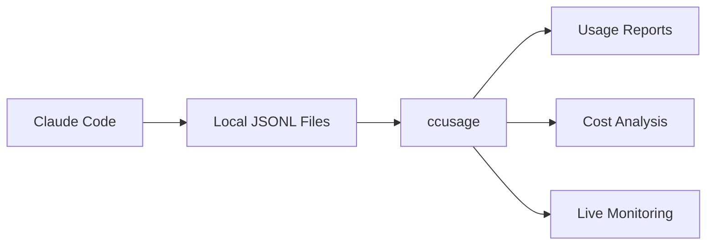

Directory structure:
└── ryoppippi-ccusage/
    ├── README.md
    ├── CLAUDE.md
    ├── eslint.config.js
    ├── LICENSE
    ├── package.json
    ├── tsconfig.json
    ├── tsdown.config.ts
    ├── typos.toml
    ├── vitest.config.ts
    ├── .mcp.json
    ├── .npmrc
    ├── docs/
    │   ├── index.md
    │   ├── index.ts
    │   ├── package.json
    │   ├── tsconfig.json
    │   ├── typedoc.config.mjs
    │   ├── update-api-index.ts
    │   ├── wrangler.jsonc
    │   ├── guide/
    │   │   ├── blocks-reports.md
    │   │   ├── configuration.md
    │   │   ├── cost-modes.md
    │   │   ├── custom-paths.md
    │   │   ├── daily-reports.md
    │   │   ├── getting-started.md
    │   │   ├── index.md
    │   │   ├── installation.md
    │   │   ├── json-output.md
    │   │   ├── library-usage.md
    │   │   ├── live-monitoring.md
    │   │   ├── mcp-server.md
    │   │   ├── monthly-reports.md
    │   │   ├── related-projects.md
    │   │   ├── session-reports.md
    │   │   └── sponsors.md
    │   ├── public/
    │   │   └── mcp-claude-desktop.avif
    │   └── .vitepress/
    │       └── config.ts
    ├── src/
    │   ├── _consts.ts
    │   ├── _live-monitor.ts
    │   ├── _live-rendering.ts
    │   ├── _macro.ts
    │   ├── _session-blocks.ts
    │   ├── _shared-args.ts
    │   ├── _terminal-utils.ts
    │   ├── _token-utils.ts
    │   ├── _types.ts
    │   ├── _utils.ts
    │   ├── calculate-cost.ts
    │   ├── data-loader.ts
    │   ├── debug.ts
    │   ├── index.ts
    │   ├── logger.ts
    │   ├── mcp.ts
    │   ├── pricing-fetcher.ts
    │   └── commands/
    │       ├── _blocks.live.ts
    │       ├── blocks.ts
    │       ├── daily.ts
    │       ├── index.ts
    │       ├── mcp.ts
    │       ├── monthly.ts
    │       └── session.ts
    └── .github/
        ├── FUNDING.yaml
        ├── renovate.json
        └── workflows/
            ├── ci.yaml
            └── release.yaml

================================================
FILE: README.md
================================================
<div align="center">
    
    <h1>ccusage</h1>
</div>

<p align="center">
    <a href="https://npmjs.com/package/ccusage"></a>
    <a href="https://tanstack.com/stats/npm?packageGroups=%5B%7B%22packages%22:%5B%7B%22name%22:%22ccusage%22%7D%5D%7D%5D&range=30-days&transform=none&binType=daily&showDataMode=all&height=400"></a>
    <a href="https://packagephobia.com/result?p=ccusage"></a>
    <a href="https://deepwiki.com/ryoppippi/ccusage"></a>
    <!-- DeepWiki badge generated by https://deepwiki.ryoppippi.com/ -->
    <a href="https://github.com/hesreallyhim/awesome-claude-code"></a>
</p>

<div align="center">
    
</div>

> Analyze your Claude Code token usage and costs from local JSONL files — incredibly fast and informative!

## Installation

### Quick Start (Recommended)

Thanks to ccusage's incredibly small bundle size ([](https://packagephobia.com/result?p=ccusage)), you can run it directly without installation:

```bash
# Using bunx (recommended for speed)
bunx ccusage

# Using npx
npx ccusage@latest

# Using deno (with security flags)
deno run -E -R=$HOME/.claude/projects/ -S=homedir -N='raw.githubusercontent.com:443' npm:ccusage@latest
```

> 💡 **Tip**: We recommend using `bunx` instead of `npx` for a massive speed improvement!

### Local Installation (Optional)

Since ccusage has such a small bundle size, installation is entirely optional:

```bash
npm install -g ccusage
```

## Usage

```bash
# Basic usage
ccusage          # Show daily report (default)
ccusage daily    # Daily token usage and costs
ccusage monthly  # Monthly aggregated report
ccusage session  # Usage by conversation session
ccusage blocks   # 5-hour billing windows

# Live monitoring
ccusage blocks --live  # Real-time usage dashboard

# Filters and options
ccusage daily --since 20250525 --until 20250530
ccusage daily --json  # JSON output
ccusage daily --breakdown  # Per-model cost breakdown
```

## Features

- 📊 **Daily Report**: View token usage and costs aggregated by date
- 📅 **Monthly Report**: View token usage and costs aggregated by month
- 💬 **Session Report**: View usage grouped by conversation sessions
- ⏰ **5-Hour Blocks Report**: Track usage within Claude's billing windows with active block monitoring
- 📈 **Live Monitoring**: Real-time dashboard showing active session progress, token burn rate, and cost projections with `blocks --live`
- 🤖 **Model Tracking**: See which Claude models you're using (Opus, Sonnet, etc.)
- 📊 **Model Breakdown**: View per-model cost breakdown with `--breakdown` flag
- 📅 **Date Filtering**: Filter reports by date range using `--since` and `--until`
- 📁 **Custom Path**: Support for custom Claude data directory locations
- 🎨 **Beautiful Output**: Colorful table-formatted display with automatic responsive layout
- 📱 **Smart Tables**: Automatic compact mode for narrow terminals (< 100 characters) with essential columns
- 📋 **Enhanced Model Display**: Model names shown as bulleted lists for better readability
- 📄 **JSON Output**: Export data in structured JSON format with `--json`
- 💰 **Cost Tracking**: Shows costs in USD for each day/month/session
- 🔄 **Cache Token Support**: Tracks and displays cache creation and cache read tokens separately
- 🌐 **Offline Mode**: Use pre-cached pricing data without network connectivity with `--offline` (Claude models only)
- 🔌 **MCP Integration**: Built-in Model Context Protocol server for integration with other tools
- 🚀 **Ultra-Small Bundle**: Unlike other CLI tools, we pay extreme attention to bundle size - incredibly small even without minification!

## Documentation

Full documentation is available at **[ccusage.com](https://ccusage.com/)**

## Sponsors

### Featured Sponsor

Check out these [47 Claude Code ProTips from Greg Baugues.](https://www.youtube.com/watch?v=TiNpzxoBPz0&lc=UgyVgQyOhfJJlheVMcB4AaABAg)

<p align="center">
    <a href="https://www.youtube.com/watch?v=TiNpzxoBPz0&lc=UgyVgQyOhfJJlheVMcB4AaABAg">
        
    </a>
</p>

<p align="center">
    <a href="https://github.com/sponsors/ryoppippi">
        
    </a>
</p>

## Star History

<a href="https://www.star-history.com/#ryoppippi/ccusage&Date">
    <picture>
        <source media="(prefers-color-scheme: dark)" srcset="https://api.star-history.com/svg?repos=ryoppippi/ccusage&type=Date&theme=dark" />
        <source media="(prefers-color-scheme: light)" srcset="https://api.star-history.com/svg?repos=ryoppippi/ccusage&type=Date" />
        
    </picture>
</a>

## License

[MIT](LICENSE) © [@ryoppippi](https://github.com/ryoppippi)


================================================
FILE: CLAUDE.md
================================================
# CLAUDE.md

This file provides guidance to Claude Code (claude.ai/code) when working with code in this repository.

## Development Commands

**Testing and Quality:**

- `bun run test` - Run all tests (using vitest via bun)
- Lint code using ESLint MCP server (available via Claude Code tools)
- `bun run format` - Format code with ESLint (writes changes)
- `bun typecheck` - Type check with TypeScript

**Build and Release:**

- `bun run build` - Build distribution files with tsdown
- `bun run release` - Full release workflow (lint + typecheck + test + build + version bump)

**Development Usage:**

- `bun run start daily` - Show daily usage report
- `bun run start monthly` - Show monthly usage report
- `bun run start session` - Show session-based usage report
- `bun run start blocks` - Show 5-hour billing blocks usage report
- `bun run start daily --json` - Show daily usage report in JSON format
- `bun run start monthly --json` - Show monthly usage report in JSON format
- `bun run start session --json` - Show session usage report in JSON format
- `bun run start blocks --json` - Show blocks usage report in JSON format
- `bun run start daily --mode <mode>` - Control cost calculation mode (auto/calculate/display)
- `bun run start monthly --mode <mode>` - Control cost calculation mode (auto/calculate/display)
- `bun run start session --mode <mode>` - Control cost calculation mode (auto/calculate/display)
- `bun run start blocks --mode <mode>` - Control cost calculation mode (auto/calculate/display)
- `bun run start blocks --active` - Show only active block with projections
- `bun run start blocks --recent` - Show blocks from last 3 days (including active)
- `bun run start blocks --token-limit <limit>` - Token limit for quota warnings (number or "max")
- `bun run ./src/index.ts` - Direct execution for development

**MCP Server Usage:**

- `bun run start mcp` - Start MCP server with stdio transport (default)
- `bun run start mcp --type http --port 8080` - Start MCP server with HTTP transport

**Cost Calculation Modes:**

- `auto` (default) - Use pre-calculated costUSD when available, otherwise calculate from tokens
- `calculate` - Always calculate costs from token counts using model pricing, ignore costUSD
- `display` - Always use pre-calculated costUSD values, show 0 for missing costs

**Multiple Claude Data Directories:**

This tool supports multiple Claude data directories to handle different Claude Code installations:

- **Default Behavior**: Automatically searches both `~/.config/claude/projects/` (new default) and `~/.claude/projects/` (old default)
- **Environment Variable**: Set `CLAUDE_CONFIG_DIR` to specify custom path(s)
  - Single path: `export CLAUDE_CONFIG_DIR="/path/to/claude"`
  - Multiple paths: `export CLAUDE_CONFIG_DIR="/path/to/claude1,/path/to/claude2"`
- **Data Aggregation**: Usage data from all valid directories is automatically combined
- **Backward Compatibility**: Existing configurations continue to work without changes

This addresses the breaking change in Claude Code where logs moved from `~/.claude` to `~/.config/claude`.

## Architecture Overview

This is a CLI tool that analyzes Claude Code usage data from local JSONL files stored in Claude data directories (supports both `~/.claude/projects/` and `~/.config/claude/projects/`). The architecture follows a clear separation of concerns:

**Core Data Flow:**

1. **Data Loading** (`data-loader.ts`) - Parses JSONL files from multiple Claude data directories, including pre-calculated costs
2. **Token Aggregation** (`calculate-cost.ts`) - Utility functions for aggregating token counts and costs
3. **Command Execution** (`commands/`) - CLI subcommands that orchestrate data loading and presentation
4. **CLI Entry** (`index.ts`) - Gunshi-based CLI setup with subcommand routing

**Output Formats:**

- Table format (default): Pretty-printed tables with colors for terminal display
- JSON format (`--json`): Structured JSON output for programmatic consumption

**Key Data Structures:**

- Raw usage data is parsed from JSONL with timestamp, token counts, and pre-calculated costs
- Data is aggregated into daily summaries, monthly summaries, session summaries, or 5-hour billing blocks
- Sessions are identified by directory structure: `projects/{project}/{session}/{file}.jsonl`
- 5-hour blocks group usage data by Claude's billing cycles with active block tracking

**External Dependencies:**

- Uses local timezone for date formatting
- CLI built with `gunshi` framework, tables with `cli-table3`
- **LiteLLM Integration**: Cost calculations depend on LiteLLM's pricing database for model pricing data

**MCP Integration:**

- **Built-in MCP Server**: Exposes usage data through MCP protocol with tools:
  - `daily` - Daily usage reports
  - `session` - Session-based usage reports
  - `monthly` - Monthly usage reports
  - `blocks` - 5-hour billing blocks usage reports
- **External MCP Servers Available:**
  - **ESLint MCP**: Lint TypeScript/JavaScript files directly through Claude Code tools
  - **Context7 MCP**: Look up documentation for libraries and frameworks
  - **Gunshi MCP**: Access gunshi.dev documentation and examples

## Code Style Notes

- Uses ESLint for linting and formatting with tab indentation and double quotes
- TypeScript with strict mode and bundler module resolution
- No console.log allowed except where explicitly disabled with eslint-disable
- Error handling: silently skips malformed JSONL lines during parsing
- File paths always use Node.js path utilities for cross-platform compatibility
- **Import conventions**: Use `.ts` extensions for local file imports (e.g., `import { foo } from './utils.ts'`)

**Error Handling:**

- **Prefer @praha/byethrow Result type** over traditional try-catch for functional error handling
- Use `Result.try()` for wrapping operations that may throw (JSON parsing, etc.)
- Use `Result.isFailure()` for checking errors (more readable than `!Result.isSuccess()`)
- Use early return pattern (`if (Result.isFailure(result)) continue;`) instead of ternary operators
- For async operations: create wrapper function with `Result.try()` then call it
- Keep traditional try-catch only for: file I/O with complex error handling, legacy code that's hard to refactor
- Always use `Result.isFailure()` and `Result.isSuccess()` type guards for better code clarity

**Naming Conventions:**

- Variables: start with lowercase (camelCase) - e.g., `usageDataSchema`, `modelBreakdownSchema`
- Types: start with uppercase (PascalCase) - e.g., `UsageData`, `ModelBreakdown`
- Constants: can use UPPER_SNAKE_CASE - e.g., `DEFAULT_CLAUDE_CODE_PATH`
- Internal files: use underscore prefix - e.g., `_types.ts`, `_utils.ts`, `_consts.ts`

**Export Rules:**

- **IMPORTANT**: Only export constants, functions, and types that are actually used by other modules
- Internal/private constants that are only used within the same file should NOT be exported
- Always check if a constant is used elsewhere before making it `export const` vs just `const`
- This follows the principle of minimizing the public API surface area
- Dependencies should always be added as `devDependencies` unless explicitly requested otherwise

**Post-Code Change Workflow:**

After making any code changes, ALWAYS run these commands in parallel:

- `bun run format` - Auto-fix and format code with ESLint (includes linting)
- `bun typecheck` - Type check with TypeScript
- `bun run test` - Run all tests

This ensures code quality and catches issues immediately after changes.

## Documentation Guidelines

**Screenshot Usage:**

- **Placement**: Always place screenshots immediately after the main heading (H1) in documentation pages
- **Purpose**: Provide immediate visual context to users before textual explanations
- **Guides with Screenshots**:
  - `/docs/guide/index.md` (What is ccusage) - Main usage screenshot
  - `/docs/guide/daily-reports.md` - Daily report output screenshot
  - `/docs/guide/live-monitoring.md` - Live monitoring dashboard screenshot
  - `/docs/guide/mcp-server.md` - Claude Desktop integration screenshot
- **Image Path**: Use relative paths like `/screenshot.png` for images stored in `/docs/public/`
- **Alt Text**: Always include descriptive alt text for accessibility

## Claude Models and Testing

**Supported Claude 4 Models (as of 2025):**

- `claude-sonnet-4-20250514` - Latest Claude 4 Sonnet model
- `claude-opus-4-20250514` - Latest Claude 4 Opus model

**Model Naming Convention:**

- Pattern: `claude-{model-type}-{generation}-{date}`
- Example: `claude-sonnet-4-20250514` (NOT `claude-4-sonnet-20250514`)
- The generation number comes AFTER the model type

**Testing Guidelines:**

- **In-Source Testing Pattern**: This project uses in-source testing with `if (import.meta.vitest != null)` blocks
- Tests are written directly in the same files as the source code, not in separate test files
- Vitest globals (`describe`, `it`, `expect`) are available automatically without imports
- Dynamic imports using `await import()` should only be used within test blocks to avoid tree-shaking issues
- Mock data is created using `fs-fixture` with `createFixture()` for Claude data directory simulation
- All test files must use current Claude 4 models, not outdated Claude 3 models
- Test coverage should include both Sonnet and Opus models for comprehensive validation
- Model names in tests must exactly match LiteLLM's pricing database entries
- When adding new model tests, verify the model exists in LiteLLM before implementation
- Tests depend on real pricing data from LiteLLM - failures may indicate model availability issues

**LiteLLM Integration Notes:**

- Cost calculations require exact model name matches with LiteLLM's database
- Test failures often indicate model names don't exist in LiteLLM's pricing data
- Future model updates require checking LiteLLM compatibility first
- The application cannot calculate costs for models not supported by LiteLLM

# Tips for Claude Code

- [gunshi](https://gunshi.dev/llms.txt) - Documentation available via Gunshi MCP server
- Context7 MCP server available for library documentation lookup
- do not use console.log. use logger.ts instead

# important-instruction-reminders

Do what has been asked; nothing more, nothing less.
NEVER create files unless they're absolutely necessary for achieving your goal.
ALWAYS prefer editing an existing file to creating a new one.
NEVER proactively create documentation files (\*.md) or README files. Only create documentation files if explicitly requested by the User.
Dependencies should always be added as devDependencies unless explicitly requested otherwise.


================================================
FILE: eslint.config.js
================================================
import { ryoppippi } from '@ryoppippi/eslint-config';

export default ryoppippi({
	type: 'lib',
	svelte: false,
	typescript: {
		tsconfigPath: './tsconfig.json',
	},
	ignores: [
		'docs/**',
	],
});


================================================
FILE: LICENSE
================================================
MIT License

Copyright (c) 2025 ryoppippi

Permission is hereby granted, free of charge, to any person obtaining a copy
of this software and associated documentation files (the "Software"), to deal
in the Software without restriction, including without limitation the rights
to use, copy, modify, merge, publish, distribute, sublicense, and/or sell
copies of the Software, and to permit persons to whom the Software is
furnished to do so, subject to the following conditions:

The above copyright notice and this permission notice shall be included in all
copies or substantial portions of the Software.

THE SOFTWARE IS PROVIDED "AS IS", WITHOUT WARRANTY OF ANY KIND, EXPRESS OR
IMPLIED, INCLUDING BUT NOT LIMITED TO THE WARRANTIES OF MERCHANTABILITY,
FITNESS FOR A PARTICULAR PURPOSE AND NONINFRINGEMENT. IN NO EVENT SHALL THE
AUTHORS OR COPYRIGHT HOLDERS BE LIABLE FOR ANY CLAIM, DAMAGES OR OTHER
LIABILITY, WHETHER IN AN ACTION OF CONTRACT, TORT OR OTHERWISE, ARISING FROM,
OUT OF OR IN CONNECTION WITH THE SOFTWARE OR THE USE OR OTHER DEALINGS IN THE
SOFTWARE.


================================================
FILE: package.json
================================================
{
	"name": "ccusage",
	"type": "module",
	"version": "15.3.1",
	"description": "Usage analysis tool for Claude Code",
	"author": "ryoppippi",
	"license": "MIT",
	"funding": "https://github.com/ryoppippi/ccusage?sponsor=1",
	"homepage": "https://github.com/ryoppippi/ccusage#readme",
	"repository": {
		"type": "git",
		"url": "git+https://github.com/ryoppippi/ccusage.git"
	},
	"bugs": {
		"url": "https://github.com/ryoppippi/ccusage/issues"
	},
	"exports": {
		".": "./dist/index.js",
		"./calculate-cost": "./dist/calculate-cost.js",
		"./data-loader": "./dist/data-loader.js",
		"./debug": "./dist/debug.js",
		"./logger": "./dist/logger.js",
		"./mcp": "./dist/mcp.js",
		"./pricing-fetcher": "./dist/pricing-fetcher.js",
		"./package.json": "./package.json"
	},
	"main": "./dist/index.js",
	"module": "./dist/index.js",
	"types": "./dist/index.d.ts",
	"bin": "./dist/index.js",
	"files": [
		"dist"
	],
	"workspaces": [
		".",
		"docs"
	],
	"engines": {
		"node": ">=20.19.3"
	},
	"scripts": {
		"build": "tsdown",
		"docs:build": "cd docs && bun run build",
		"docs:deploy": "cd docs && bun run deploy",
		"docs:dev": "cd docs && bun run dev",
		"docs:preview": "cd docs && bun run preview",
		"format": "bun run lint --fix",
		"lint": "eslint --cache .",
		"mcp": "bunx @modelcontextprotocol/inspector bun run start mcp",
		"prepack": "bun run build && clean-pkg-json",
		"prepare": "simple-git-hooks",
		"release": "bun lint && bun typecheck && vitest run && bun run build && bumpp",
		"start": "bun run ./src/index.ts",
		"test": "vitest",
		"typecheck": "tsgo --noEmit"
	},
	"devDependencies": {
		"@antfu/utils": "^9.2.0",
		"@core/errorutil": "npm:@jsr/core__errorutil",
		"@hono/mcp": "^0.1.0",
		"@hono/node-server": "^1.15.0",
		"@jsr/std__async": "1",
		"@modelcontextprotocol/sdk": "^1.15.1",
		"@oxc-project/runtime": "^0.76.0",
		"@praha/byethrow": "^0.6.1",
		"@praha/byethrow-mcp": "^0.0.13",
		"@ryoppippi/eslint-config": "^0.3.7",
		"@types/bun": "^1.2.18",
		"@typescript/native-preview": "^7.0.0-dev.20250710.1",
		"ansi-escapes": "^7.0.0",
		"bumpp": "^10.2.0",
		"clean-pkg-json": "^1.3.0",
		"cli-table3": "^0.6.5",
		"consola": "^3.4.2",
		"es-toolkit": "^1.39.7",
		"eslint": "^9.30.1",
		"eslint-plugin-format": "^1.0.1",
		"fast-sort": "^3.4.1",
		"fs-fixture": "^2.8.1",
		"gunshi": "^0.26.3",
		"hono": "^4.8.4",
		"lint-staged": "^16.1.2",
		"path-type": "^6.0.0",
		"picocolors": "^1.1.1",
		"pretty-ms": "^9.2.0",
		"publint": "^0.3.12",
		"simple-git-hooks": "^2.13.0",
		"sort-package-json": "^3.4.0",
		"string-width": "^7.2.0",
		"tinyglobby": "^0.2.14",
		"tsdown": "^0.12.9",
		"type-fest": "^4.41.0",
		"unplugin-macros": "^0.17.0",
		"unplugin-unused": "^0.5.1",
		"vitest": "^3.2.4",
		"xdg-basedir": "^5.1.0",
		"zod": "^3.25.67"
	},
	"overrides": {
		"vite": "npm:rolldown-vite@latest"
	},
	"simple-git-hooks": {
		"pre-commit": "bun lint-staged"
	},
	"lint-staged": {
		"*": [
			"eslint --cache --fix"
		],
		"package.json": [
			"sort-package-json"
		]
	},
	"trustedDependencies": [
		"simple-git-hooks"
	]
}


================================================
FILE: tsconfig.json
================================================
{
	"compilerOptions": {
		"target": "ESNext",
		"jsx": "react-jsx",
		// Environment setup & latest features
		"lib": [
			"ESNext"
		],
		"moduleDetection": "force",
		"module": "Preserve",
		// Bundler mode
		"moduleResolution": "bundler",
		"resolveJsonModule": true,
		"types": [
			"vitest/globals",
			"vitest/importMeta"
		],
		"allowImportingTsExtensions": true,
		"allowJs": true,
		// Best practices
		"strict": true,
		"noFallthroughCasesInSwitch": true,
		"noImplicitOverride": true,
		"noPropertyAccessFromIndexSignature": false,
		"noUncheckedIndexedAccess": true,
		// Some stricter flags (disabled by default)
		"noUnusedLocals": false,
		"noUnusedParameters": false,
		"noEmit": true,
		"verbatimModuleSyntax": true,
		"skipLibCheck": true
	},
	"exclude": [
		"dist"
	]
}


================================================
FILE: tsdown.config.ts
================================================
import { defineConfig } from 'tsdown';
import Macros from 'unplugin-macros/rolldown';

export default defineConfig({
	entry: [
		'./src/*.ts',
		'!./src/**/*.test.ts', // Exclude test files
		'!./src/_*.ts', // Exclude internal files with underscore prefix
	],
	outDir: 'dist',
	format: 'esm',
	clean: true,
	sourcemap: false,
	minify: 'dce-only',
	treeshake: true,
	dts: {
		tsgo: true,
		resolve: ['type-fest'],
	},
	publint: true,
	unused: true,
	exports: true,
	nodeProtocol: true,
	plugins: [
		Macros({
			include: ['src/index.ts', 'src/pricing-fetcher.ts'],
		}),
	],
	define: {
		'import.meta.vitest': 'undefined',
	},
	onSuccess: 'sort-package-json',
});


================================================
FILE: typos.toml
================================================
[default]
locale = 'en-us'
extend-ignore-re = [
  "(?s)(#|//)\\s*spellchecker:off.*?\\n\\s*(#|//)\\s*spellchecker:on",
  "(?s)<!--\\s*spellchecker:off.*?\\n\\s*spellchecker:on\\s*-->",
  "(?Rm)^.*#\\s*spellchecker:disable-line$",
  "(?m)^.*<!--\\s*spellchecker:disable-line\\s*-->\\n.*$"
]

[default.extend-words]
color = "color"

[files]
extend-exclude = [
  "node_modules",
  "biome.json"
]


================================================
FILE: vitest.config.ts
================================================
import Macros from 'unplugin-macros/vite';
import { defineConfig } from 'vitest/config';

export default defineConfig({
	test: {
		includeSource: ['src/**/*.{js,ts}'],
		globals: true,
	},
	plugins: [
		Macros({
			include: ['src/index.ts', 'src/pricing-fetcher.ts'],
		}),
	],
});


================================================
FILE: .mcp.json
================================================
{
	"mcpServers": {
		"context7": {
			"type": "sse",
			"url": "https://mcp.context7.com/sse"
		},
		"gunshi-doc": {
			"command": "bun",
			"args": [
				"x",
				"sitemcp",
				"https://gunshi.dev/",
				"--concurrency 10",
				"--no-cache"
			]
		},
		"eslint-mcp": {
			"type": "stdio",
			"command": "bun",
			"args": [
				"x",
				"@eslint/mcp@latest"
			],
			"env": {}
		},
		"@praha/byethrow": {
			"type": "stdio",
			"command": "bun",
			"args": [
				"byethrow-mcp"
			],
			"env": {}
		}
	}
}


================================================
FILE: .npmrc
================================================
@jsr:registry=https://npm.jsr.io


================================================
FILE: docs/index.md
================================================
---
layout: home

hero:
  name: ccusage
  text: Claude Code Usage Analysis
  tagline: A powerful CLI tool for analyzing Claude Code usage from local JSONL files
  image:
    src: /logo.svg
    alt: ccusage logo
  actions:
    - theme: brand
      text: Get Started
      link: /guide/
    - theme: alt
      text: View on GitHub
      link: https://github.com/ryoppippi/ccusage

features:
  - icon: 📊
    title: Daily Reports
    details: View token usage and costs aggregated by date with detailed breakdowns
    link: /guide/daily-reports
  - icon: 📅
    title: Monthly Reports
    details: Analyze usage patterns over monthly periods with cost tracking
  - icon: 💬
    title: Session Reports
    details: Group usage by conversation sessions for detailed analysis
  - icon: ⏰
    title: 5-Hour Blocks
    details: Track usage within Claude's billing windows with active monitoring
  - icon: 📈
    title: Live Monitoring
    details: Real-time dashboard with progress bars and cost projections
  - icon: 🤖
    title: Model Tracking
    details: See which Claude models you're using (Opus, Sonnet, etc.)
  - icon: 📋
    title: Enhanced Display
    details: Beautiful tables with responsive layout and smart formatting
  - icon: 📄
    title: JSON Output
    details: Export data in structured JSON format for programmatic use
  - icon: 💰
    title: Cost Analysis
    details: Shows estimated costs in USD for each day/month/session
  - icon: 🔄
    title: Cache Support
    details: Tracks cache creation and cache read tokens separately
  - icon: 🌐
    title: Offline Mode
    details: Use pre-cached pricing data without network connectivity
  - icon: 🔌
    title: MCP Integration
    details: Built-in Model Context Protocol server for tool integration
---

<div style="text-align: center; margin: 2rem 0;">
  <h2 style="margin-bottom: 1rem;">Support ccusage</h2>
  <p style="margin-bottom: 1.5rem;">If you find ccusage helpful, please consider sponsoring the development!</p>
  
  <h3 style="margin-bottom: 1rem;">Featured Sponsor</h3>
  <p style="margin-bottom: 1rem;">Check out these <a href="https://www.youtube.com/watch?v=TiNpzxoBPz0&lc=UgyVgQyOhfJJlheVMcB4AaABAg" target="_blank">47 Claude Code ProTips from Greg Baugues.</a></p>
  <a href="https://www.youtube.com/watch?v=TiNpzxoBPz0&lc=UgyVgQyOhfJJlheVMcB4AaABAg" target="_blank">
    
  </a>
  
  <div style="margin-top: 2rem;">
    <a href="https://github.com/sponsors/ryoppippi" target="_blank">
      
    </a>
  </div>
</div>


================================================
FILE: docs/index.ts
================================================
export default {
	fetch() {
		return new Response('ccusage');
	},
};


================================================
FILE: docs/package.json
================================================
{
  "name": "@ccusage/docs",
  "version": "15.0.0",
  "private": true,
  "description": "Documentation for ccusage",
  "type": "module",
  "scripts": {
    "build": "bun run docs:api && ROLLDOWN_OPTIONS_VALIDATION=loose vitepress build",
    "deploy": "wrangler deploy",
    "dev": "bun run docs:api && ROLLDOWN_OPTIONS_VALIDATION=loose vitepress dev",
    "docs:api": "./update-api-index.ts",
    "preview": "vitepress preview"
  },
  "overrides": {
    "vite": "npm:rolldown-vite@latest"
  },
  "devDependencies": {
    "@ryoppippi/vite-plugin-cloudflare-redirect": "npm:@jsr/ryoppippi__vite-plugin-cloudflare-redirect",
    "@types/bun": "^1.2.18",
    "tinyglobby": "^0.2.14",
    "typedoc": "^0.28.7",
    "typedoc-plugin-markdown": "^4.7.0",
    "typedoc-vitepress-theme": "^1.1.2",
    "vitepress": "^1.6.3",
    "vitepress-plugin-group-icons": "^1.6.1",
    "vitepress-plugin-llms": "^1.7.0",
    "vitepress-plugin-mermaid": "^2.0.17",
    "wrangler": "^4.24.3"
  }
}


================================================
FILE: docs/tsconfig.json
================================================
{
	"extends": "../tsconfig.json",
	"compilerOptions": {
		"allowImportingTsExtensions": false,
		"allowJs": true,
		"noEmit": true,
		"skipLibCheck": true
	},
	"include": [
		".vitepress/**/*",
		"**/*.ts",
		"**/*.md"
	]
}


================================================
FILE: docs/typedoc.config.mjs
================================================
// @ts-check
import { globSync } from 'tinyglobby'

const entryPoints = [
	...globSync([
		'../src/*.ts',
		'!../src/**/*.test.ts', // Exclude test files
		'!../src/_*.ts', // Exclude internal files with underscore prefix
	], {
		absolute: false,
		onlyFiles: true,
	}),
	'../src/_consts.ts', // Include constants for documentation
];

/** @type {import('typedoc').TypeDocOptions & import('typedoc-plugin-markdown').PluginOptions & { docsRoot?: string } } */
export default {
	// typedoc options
	// ref: https://typedoc.org/documents/Options.html
	entryPoints,
	tsconfig: '../tsconfig.json',
	out: 'api',
	plugin: ['typedoc-plugin-markdown', 'typedoc-vitepress-theme'],
	readme: 'none',
	excludeInternal: true,
	groupOrder: ['Variables', 'Functions', 'Class'],
	categoryOrder: ['*', 'Other'],
	sort: ['source-order'],

	// typedoc-plugin-markdown options
	// ref: https://typedoc-plugin-markdown.org/docs/options
	entryFileName: 'index',
	hidePageTitle: false,
	useCodeBlocks: true,
	disableSources: true,
	indexFormat: 'table',
	parametersFormat: 'table',
	interfacePropertiesFormat: 'table',
	classPropertiesFormat: 'table',
	propertyMembersFormat: 'table',
	typeAliasPropertiesFormat: 'table',
	enumMembersFormat: 'table',

	// typedoc-vitepress-theme options
	// ref: https://typedoc-plugin-markdown.org/plugins/vitepress/options
	docsRoot: '.',
};


================================================
FILE: docs/update-api-index.ts
================================================
#!/usr/bin/env -S bun -b

/**
 * Post-processing script to update API index with module descriptions
 */

import { join } from 'node:path';
import process from 'node:process';
import { $ } from 'bun';

const descriptions = {
	'\\_consts': 'Internal constants (not exported in public API)',
	'calculate-cost': 'Cost calculation utilities for usage data analysis',
	'data-loader': 'Data loading utilities for Claude Code usage analysis',
	'debug': 'Debug utilities for cost calculation validation',
	'index': 'Main entry point for ccusage CLI tool',
	'logger': 'Logging utilities for the ccusage application',
	'mcp': 'MCP (Model Context Protocol) server implementation',
	'pricing-fetcher': 'Model pricing data fetcher for cost calculations',
} as const;

async function updateApiIndex() {
	const apiIndexPath = join(process.cwd(), 'api', 'index.md');

	try {
		let content = await Bun.file(apiIndexPath).text();

		// Replace empty descriptions with actual ones
		for (const [module, description] of Object.entries(descriptions)) {
			let linkPath = `${module}/index.md`;
			// Special case for _consts which links to consts/
			if (module === '\\_consts') {
				linkPath = 'consts/index.md';
			}

			const oldPattern = new RegExp(`\\|\\s*\\[${module}\\]\\(${linkPath}\\)\\s*\\|\\s*-\\s*\\|`, 'g');
			content = content.replace(oldPattern, `| [${module}](${linkPath}) | ${description} |`);
		}

		await Bun.write(apiIndexPath, content);
		console.log('✅ Updated API index with module descriptions');
	}
	catch (error) {
		console.error('❌ Failed to update API index:', error);
		process.exit(1);
	}
}

async function updateConstsPage() {
	const constsIndexPath = join(process.cwd(), 'api', 'consts', 'index.md');

	try {
		let content = await Bun.file(constsIndexPath).text();

		// Add note about constants not being exported (only if not already present)
		const noteText = '> **Note**: These constants are internal implementation details and are not exported in the public API. They are documented here for reference purposes only.';

		if (!content.includes(noteText)) {
			const oldHeader = '# \\_consts';
			const newHeader = `# \\_consts

${noteText}`;

			content = content.replace(oldHeader, newHeader);
		}

		await Bun.write(constsIndexPath, content);
		console.log('✅ Updated constants page with disclaimer');
	}
	catch (error) {
		console.error('❌ Failed to update constants page:', error);
		// Don't exit here as this is optional
	}
}

async function main() {
	await $`bun -b typedoc --excludeInternal`
	await updateApiIndex();
	await updateConstsPage();
}

await main();


================================================
FILE: docs/wrangler.jsonc
================================================
{
  "$schema": "../node_modules/wrangler/config-schema.json",
  "name": "ccusage-guide",
  "main": "./index.ts",
  "compatibility_date": "2025-06-21",
  "build": {
    "command": "bun run build"
  },
  "assets": {
    "binding": "ASSETS",
    "directory": ".vitepress/dist/",
    "html_handling": "drop-trailing-slash",
    "run_worker_first": false,
    "not_found_handling": "404-page"
  }
}


================================================
FILE: docs/guide/blocks-reports.md
================================================
[Binary file]


================================================
FILE: docs/guide/configuration.md
================================================
# Configuration

ccusage supports various configuration options to customize its behavior and adapt to different Claude Code installations.

## Environment Variables

### CLAUDE_CONFIG_DIR

The primary configuration option is the `CLAUDE_CONFIG_DIR` environment variable, which specifies where ccusage should look for Claude Code data.

#### Single Directory

```bash
# Set a single custom Claude data directory
export CLAUDE_CONFIG_DIR="/path/to/your/claude/data"
ccusage daily
```

#### Multiple Directories

```bash
# Set multiple directories (comma-separated)
export CLAUDE_CONFIG_DIR="/path/to/claude1,/path/to/claude2"
ccusage daily
```

When multiple directories are specified, ccusage automatically aggregates usage data from all valid locations.

## Default Directory Detection

### Automatic Detection

ccusage automatically searches for Claude Code data in these locations:

- **`~/.config/claude/projects/`** - New default location (Claude Code v1.0.30+)
- **`~/.claude/projects/`** - Legacy location (pre-v1.0.30)

::: info Directory Change
The directory change from `~/.claude` to `~/.config/claude` in Claude Code v1.0.30 was an undocumented breaking change. ccusage handles both locations automatically for compatibility.
:::

### Search Priority

When `CLAUDE_CONFIG_DIR` is not set, ccusage searches in this order:

1. `~/.config/claude/projects/` (preferred)
2. `~/.claude/projects/` (fallback)

Data from all valid directories is automatically combined.

## Command-Line Options

### Global Options

All ccusage commands support these configuration options:

```bash
# Date filtering
ccusage daily --since 20250101 --until 20250630

# Output format
ccusage daily --json                    # JSON output
ccusage daily --breakdown              # Per-model breakdown

# Cost calculation modes
ccusage daily --mode auto              # Use costUSD when available (default)
ccusage daily --mode calculate         # Always calculate from tokens
ccusage daily --mode display           # Always use pre-calculated costUSD

# Sort order
ccusage daily --order desc             # Newest first (default)
ccusage daily --order asc              # Oldest first

# Offline mode
ccusage daily --offline                # Use cached pricing data
ccusage daily -O                       # Short alias
```

### Debug Options

```bash
# Debug pricing mismatches
ccusage daily --debug

# Show sample discrepancies
ccusage daily --debug --debug-samples 10
```

## Cost Calculation Modes

ccusage supports three different cost calculation modes:

### auto (Default)

Uses pre-calculated `costUSD` values when available, falls back to calculating costs from token counts:

```bash
ccusage daily --mode auto
```

- ✅ Most accurate when Claude provides cost data
- ✅ Falls back gracefully for older data
- ✅ Best for general use

### calculate

Always calculates costs from token counts using model pricing, ignores pre-calculated values:

```bash
ccusage daily --mode calculate
```

- ✅ Consistent calculation method
- ✅ Useful for comparing different time periods
- ❌ May differ from actual Claude billing

### display

Always uses pre-calculated `costUSD` values only, shows $0.00 for missing costs:

```bash
ccusage daily --mode display
```

- ✅ Shows only Claude-provided cost data
- ✅ Most accurate for recent usage
- ❌ Shows $0.00 for older entries without cost data

## Offline Mode

ccusage can operate without network connectivity by using pre-cached pricing data:

```bash
# Use offline mode
ccusage daily --offline
ccusage monthly -O
```

### When to Use Offline Mode

#### ✅ Ideal For

- **Air-gapped systems** - Networks with restricted internet access
- **Corporate environments** - Behind firewalls or proxies
- **Consistent pricing** - Using cached model pricing for consistent reports
- **Fast execution** - Avoiding network delays

#### ❌ Limitations

- **Claude models only** - Only supports Claude models (Opus, Sonnet, etc.)
- **Pricing updates** - Won't get latest pricing information
- **New models** - May not support newly released models

### Updating Cached Data

Cached pricing data is updated automatically when running in online mode. To refresh:

```bash
# Run online to update cache
ccusage daily

# Then use offline mode
ccusage daily --offline
```

## MCP Server Configuration

ccusage includes a built-in MCP (Model Context Protocol) server for integration with other tools.

### Basic Usage

```bash
# Start MCP server with stdio transport (default)
ccusage mcp

# Start with HTTP transport
ccusage mcp --type http --port 8080

# Configure cost calculation mode
ccusage mcp --mode calculate
```

### Claude Desktop Integration

Add to your Claude Desktop configuration file:

**macOS**: `~/Library/Application Support/Claude/claude_desktop_config.json`
**Windows**: `%APPDATA%\Claude\claude_desktop_config.json`

```json
{
	"mcpServers": {
		"ccusage": {
			"command": "npx",
			"args": ["ccusage@latest", "mcp"],
			"env": {
				"CLAUDE_CONFIG_DIR": "/custom/path/to/claude"
			}
		}
	}
}
```

Or with global installation:

```json
{
	"mcpServers": {
		"ccusage": {
			"command": "ccusage",
			"args": ["mcp"],
			"env": {}
		}
	}
}
```

### Available MCP Tools

- **`daily`** - Daily usage reports
- **`monthly`** - Monthly usage reports
- **`session`** - Session-based reports
- **`blocks`** - 5-hour billing blocks reports

Each tool accepts `since`, `until`, and `mode` parameters.

## Terminal Display Configuration

ccusage automatically adapts its display based on terminal width:

### Wide Terminals (≥100 characters)

- Shows all columns with full model names
- Displays cache metrics and total tokens
- Uses bulleted model lists for readability

### Narrow Terminals (<100 characters)

- Automatic compact mode with essential columns only
- Shows Date, Models, Input, Output, Cost (USD)
- Helpful message about expanding terminal width

### Force Display Mode

Currently, display mode is automatic based on terminal width. Future versions may include manual override options.

## Configuration Examples

### Development Environment

```bash
# Set environment variables in your shell profile
export CLAUDE_CONFIG_DIR="$HOME/.config/claude"

# Add aliases for common commands
alias ccu-daily="ccusage daily --breakdown"
alias ccu-live="ccusage blocks --live"
alias ccu-json="ccusage daily --json"
```

### CI/CD Environment

```bash
# Use offline mode in CI
export CCUSAGE_OFFLINE=1
ccusage daily --offline --json > usage-report.json
```

### Multiple Team Members

```bash
# Each team member sets their own Claude directory
export CLAUDE_CONFIG_DIR="/team-shared/claude-data/$USER"
ccusage daily --since 20250101
```

## Troubleshooting Configuration

### Common Issues

#### No Data Found

If ccusage reports no data found:

```bash
# Check if Claude directories exist
ls -la ~/.claude/projects/
ls -la ~/.config/claude/projects/

# Verify environment variable
echo $CLAUDE_CONFIG_DIR

# Test with explicit environment variable
export CLAUDE_CONFIG_DIR="/path/to/claude/projects"
ccusage daily
```

#### Permission Errors

```bash
# Check directory permissions
ls -la ~/.claude/
ls -la ~/.config/claude/

# Fix permissions if needed
chmod -R 755 ~/.claude/
chmod -R 755 ~/.config/claude/
```

#### Network Issues in Offline Mode

```bash
# Run online first to cache pricing data
ccusage daily

# Then use offline mode
ccusage daily --offline
```

## Next Steps

After configuring ccusage:

- Learn about [Custom Paths](/guide/custom-paths) for advanced directory management
- Explore [Cost Modes](/guide/cost-modes) for different calculation approaches
- Try [Live Monitoring](/guide/live-monitoring) for real-time usage tracking


================================================
FILE: docs/guide/cost-modes.md
================================================
# Cost Modes

ccusage supports three different cost calculation modes to handle various scenarios and data sources. Understanding these modes helps you get the most accurate cost estimates for your usage analysis.

## Overview

Claude Code stores usage data in JSONL files with both token counts and pre-calculated cost information. ccusage can handle this data in different ways depending on your needs:

- **`auto`** - Smart mode using the best available data
- **`calculate`** - Always calculate from token counts
- **`display`** - Only show pre-calculated costs

## Mode Details

### auto (Default)

The `auto` mode intelligently chooses the best cost calculation method for each entry:

```bash
ccusage daily --mode auto
# or simply:
ccusage daily
```

#### How it works:

1. **Pre-calculated costs available** → Uses Claude's `costUSD` values
2. **No pre-calculated costs** → Calculates from token counts using model pricing
3. **Mixed data** → Uses the best method for each entry

#### Best for:

- ✅ **General usage** - Works well for most scenarios
- ✅ **Mixed data sets** - Handles old and new data properly
- ✅ **Accuracy** - Uses official costs when available
- ✅ **Completeness** - Shows estimates for all entries

#### Example output:

```
┌──────────────┬─────────────┬────────┬─────────┬────────────┐
│ Date         │ Models      │ Input  │ Output  │ Cost (USD) │
├──────────────┼─────────────┼────────┼─────────┼────────────┤
│ 2025-01-15   │ • opus-4    │  1,245 │  28,756 │    $12.45  │ ← Pre-calculated
│ 2024-12-20   │ • sonnet-4  │    856 │  19,234 │     $8.67  │ ← Calculated
│ 2024-11-10   │ • opus-4    │    634 │  15,678 │     $7.23  │ ← Calculated
└──────────────┴─────────────┴────────┴─────────┴────────────┘
```

### calculate

The `calculate` mode always computes costs from token counts using model pricing:

```bash
ccusage daily --mode calculate
ccusage monthly --mode calculate --breakdown
```

#### How it works:

1. **Ignores `costUSD` values** from Claude Code data
2. **Uses token counts** (input, output, cache) for all entries
3. **Applies current model pricing** from LiteLLM database
4. **Consistent methodology** across all time periods

#### Best for:

- ✅ **Consistent comparisons** - Same calculation method for all data
- ✅ **Token analysis** - Understanding pure token-based costs
- ✅ **Historical analysis** - Comparing costs across different time periods
- ✅ **Pricing research** - Analyzing cost per token trends

#### Example output:

```
┌──────────────┬─────────────┬────────┬─────────┬────────────┐
│ Date         │ Models      │ Input  │ Output  │ Cost (USD) │
├──────────────┼─────────────┼────────┼─────────┼────────────┤
│ 2025-01-15   │ • opus-4    │  1,245 │  28,756 │    $12.38  │ ← Calculated
│ 2024-12-20   │ • sonnet-4  │    856 │  19,234 │     $8.67  │ ← Calculated
│ 2024-11-10   │ • opus-4    │    634 │  15,678 │     $7.23  │ ← Calculated
└──────────────┴─────────────┴────────┴─────────┴────────────┘
```

### display

The `display` mode only shows pre-calculated costs from Claude Code:

```bash
ccusage daily --mode display
ccusage session --mode display --json
```

#### How it works:

1. **Uses only `costUSD` values** from Claude Code data
2. **Shows $0.00** for entries without pre-calculated costs
3. **No token-based calculations** performed
4. **Exact Claude billing data** when available

#### Best for:

- ✅ **Official costs only** - Shows exactly what Claude calculated
- ✅ **Billing verification** - Comparing with actual Claude charges
- ✅ **Recent data** - Most accurate for newer usage entries
- ✅ **Audit purposes** - Verifying pre-calculated costs

#### Example output:

```
┌──────────────┬─────────────┬────────┬─────────┬────────────┐
│ Date         │ Models      │ Input  │ Output  │ Cost (USD) │
├──────────────┼─────────────┼────────┼─────────┼────────────┤
│ 2025-01-15   │ • opus-4    │  1,245 │  28,756 │    $12.45  │ ← Pre-calculated
│ 2024-12-20   │ • sonnet-4  │    856 │  19,234 │     $0.00  │ ← No cost data
│ 2024-11-10   │ • opus-4    │    634 │  15,678 │     $0.00  │ ← No cost data
└──────────────┴─────────────┴────────┴─────────┴────────────┘
```

## Practical Examples

### Scenario 1: Mixed Data Analysis

You have data from different time periods with varying cost information:

```bash
# Auto mode handles mixed data intelligently
ccusage daily --mode auto --since 20241201

# Shows:
# - Pre-calculated costs for recent entries (Jan 2025)
# - Calculated costs for older entries (Dec 2024)
```

### Scenario 2: Consistent Cost Comparison

You want to compare costs across different months using the same methodology:

```bash
# Calculate mode ensures consistent methodology
ccusage monthly --mode calculate --breakdown

# All months use the same token-based calculation
# Useful for trend analysis and cost projections
```

### Scenario 3: Billing Verification

You want to verify Claude's official cost calculations:

```bash
# Display mode shows only official Claude costs
ccusage daily --mode display --since 20250101

# Compare with your Claude billing dashboard
# Entries without costs show $0.00
```

### Scenario 4: Historical Analysis

Analyzing usage patterns over time:

```bash
# Auto mode for complete picture
ccusage daily --mode auto --since 20240101 --until 20241231

# Calculate mode for consistent comparison
ccusage monthly --mode calculate --order asc
```

## Cost Calculation Details

### Token-Based Calculation

When calculating costs from tokens, ccusage uses:

#### Model Pricing Sources

- **LiteLLM database** - Up-to-date model pricing
- **Automatic updates** - Pricing refreshed regularly
- **Multiple models** - Supports Claude Opus, Sonnet, and other models

#### Token Types

```typescript
type TokenCosts = {
	input: number; // Input tokens
	output: number; // Output tokens
	cacheCreate: number; // Cache creation tokens
	cacheRead: number; // Cache read tokens
};
```

#### Calculation Formula

```typescript
totalCost
	= (inputTokens * inputPrice)
		+ (outputTokens * outputPrice)
		+ (cacheCreateTokens * cacheCreatePrice)
		+ (cacheReadTokens * cacheReadPrice);
```

### Pre-calculated Costs

Claude Code provides `costUSD` values in JSONL files:

```json
{
	"timestamp": "2025-01-15T10:30:00Z",
	"model": "claude-opus-4-20250514",
	"usage": {
		"input_tokens": 1245,
		"output_tokens": 28756,
		"cache_creation_input_tokens": 512,
		"cache_read_input_tokens": 256
	},
	"costUSD": 12.45
}
```

## Debug Mode

Use debug mode to understand cost calculation discrepancies:

```bash
ccusage daily --mode auto --debug
```

Shows:

- **Pricing mismatches** between calculated and pre-calculated costs
- **Missing cost data** entries
- **Calculation details** for each entry
- **Sample discrepancies** for investigation

```bash
# Show more sample discrepancies
ccusage daily --debug --debug-samples 10
```

## Mode Selection Guide

### When to use `auto` mode:

- **General usage** - Default for most scenarios
- **Mixed data sets** - Combining old and new usage data
- **Maximum accuracy** - Best available cost information
- **Regular reporting** - Daily/monthly usage tracking

### When to use `calculate` mode:

- **Consistent analysis** - Comparing different time periods
- **Token cost research** - Understanding pure token costs
- **Pricing validation** - Verifying calculated vs actual costs
- **Historical comparison** - Analyzing cost trends over time

### When to use `display` mode:

- **Billing verification** - Comparing with Claude charges
- **Official costs only** - Trusting Claude's calculations
- **Recent data analysis** - Most accurate for new usage
- **Audit purposes** - Verifying pre-calculated costs

## Advanced Usage

### Combining with Other Options

```bash
# Calculate mode with breakdown by model
ccusage daily --mode calculate --breakdown

# Display mode with JSON output for analysis
ccusage session --mode display --json | jq '.[] | select(.totalCost > 0)'

# Auto mode with date filtering
ccusage monthly --mode auto --since 20240101 --order asc
```

### Performance Considerations

- **`display` mode** - Fastest (no calculations)
- **`auto` mode** - Moderate (conditional calculations)
- **`calculate` mode** - Slowest (always calculates)

### Offline Mode Compatibility

```bash
# All modes work with offline pricing data
ccusage daily --mode calculate --offline
ccusage monthly --mode auto --offline
```

## Common Issues and Solutions

### Issue: Costs showing as $0.00

**Cause**: Using `display` mode with data that lacks pre-calculated costs

**Solution**:

```bash
# Switch to auto or calculate mode
ccusage daily --mode auto
ccusage daily --mode calculate
```

### Issue: Inconsistent cost calculations

**Cause**: Mixed use of different modes or pricing changes

**Solution**:

```bash
# Use calculate mode for consistency
ccusage daily --mode calculate --since 20240101
```

### Issue: Large discrepancies in debug mode

**Cause**: Pricing updates or model changes

**Solution**:

```bash
# Check for pricing updates
ccusage daily --mode auto  # Updates pricing cache
ccusage daily --mode calculate --debug  # Compare calculations
```

### Issue: Missing cost data for recent entries

**Cause**: Claude Code hasn't calculated costs yet

**Solution**:

```bash
# Use calculate mode as fallback
ccusage daily --mode calculate
```

## Next Steps

After understanding cost modes:

- Explore [Configuration](/guide/configuration) for environment setup
- Learn about [Custom Paths](/guide/custom-paths) for multiple data sources
- Try [Live Monitoring](/guide/live-monitoring) with different cost modes


================================================
FILE: docs/guide/custom-paths.md
================================================
# Custom Paths

ccusage supports flexible path configuration to handle various Claude Code installation scenarios and custom data locations.

## Overview

By default, ccusage automatically detects Claude Code data in standard locations. However, you can customize these paths for:

- **Multiple Claude installations** - Different versions or profiles
- **Custom data locations** - Non-standard installation directories
- **Shared environments** - Team or organization setups
- **Backup/archive analysis** - Analyzing historical data from different locations

## CLAUDE_CONFIG_DIR Environment Variable

The primary method for specifying custom paths is the `CLAUDE_CONFIG_DIR` environment variable.

### Single Custom Path

Specify one custom directory:

```bash
# Set environment variable
export CLAUDE_CONFIG_DIR="/path/to/your/claude/data"

# Use with any command
ccusage daily
ccusage monthly --breakdown
ccusage blocks --live
```

Example scenarios:

```bash
# Custom installation location
export CLAUDE_CONFIG_DIR="/opt/claude-code/.claude"

# User-specific directory
export CLAUDE_CONFIG_DIR="/home/username/Documents/claude-data"

# Network drive
export CLAUDE_CONFIG_DIR="/mnt/shared/claude-usage"
```

### Multiple Custom Paths

Specify multiple directories separated by commas:

```bash
# Multiple installations
export CLAUDE_CONFIG_DIR="/path/to/claude1,/path/to/claude2"

# Current and archived data
export CLAUDE_CONFIG_DIR="~/.claude,/backup/claude-archive"

# Team member data aggregation
export CLAUDE_CONFIG_DIR="/team/alice/.claude,/team/bob/.claude,/team/charlie/.claude"
```

When multiple paths are specified:

- ✅ **Data aggregation** - Usage from all paths is automatically combined
- ✅ **Automatic filtering** - Invalid or empty directories are silently skipped
- ✅ **Consistent reporting** - All reports show unified data across paths

## Default Path Detection

### Standard Locations

When `CLAUDE_CONFIG_DIR` is not set, ccusage searches these locations automatically:

1. **`~/.config/claude/projects/`** - New default (Claude Code v1.0.30+)
2. **`~/.claude/projects/`** - Legacy location (pre-v1.0.30)

### Version Compatibility

::: info Breaking Change
Claude Code v1.0.30 moved data from `~/.claude` to `~/.config/claude` without documentation. ccusage handles both locations automatically for seamless compatibility.
:::

#### Migration Scenarios

**Scenario 1: Fresh Installation**

```bash
# Claude Code v1.0.30+ - uses new location
ls ~/.config/claude/projects/

# ccusage automatically finds data
ccusage daily
```

**Scenario 2: Upgraded Installation**

```bash
# Old data still exists
ls ~/.claude/projects/

# New data in new location
ls ~/.config/claude/projects/

# ccusage combines both automatically
ccusage daily  # Shows data from both locations
```

**Scenario 3: Manual Migration**

```bash
# If you moved data manually
export CLAUDE_CONFIG_DIR="/custom/location/claude"
ccusage daily
```

## Path Structure Requirements

### Expected Directory Structure

ccusage expects this directory structure:

```
claude-data-directory/
├── projects/
│   ├── project-1/
│   │   ├── session-1/
│   │   │   ├── file1.jsonl
│   │   │   └── file2.jsonl
│   │   └── session-2/
│   │       └── file3.jsonl
│   └── project-2/
│       └── session-3/
│           └── file4.jsonl
```

### Validation

ccusage validates paths by checking:

- **Directory exists** and is readable
- **Contains `projects/` subdirectory**
- **Has JSONL files** in the expected structure

Invalid paths are automatically skipped with debug information available.

## Common Use Cases

### Multiple Claude Profiles

If you use multiple Claude profiles or installations:

```bash
# Work profile
export CLAUDE_CONFIG_DIR="/Users/username/.config/claude-work"

# Personal profile
export CLAUDE_CONFIG_DIR="/Users/username/.config/claude-personal"

# Combined analysis
export CLAUDE_CONFIG_DIR="/Users/username/.config/claude-work,/Users/username/.config/claude-personal"
```

### Team Environments

For team usage analysis:

```bash
# Individual analysis
export CLAUDE_CONFIG_DIR="/shared/claude-data/$USER"
ccusage daily

# Team aggregate
export CLAUDE_CONFIG_DIR="/shared/claude-data/alice,/shared/claude-data/bob"
ccusage monthly --breakdown
```

### Development vs Production

Separate environments:

```bash
# Development environment
export CLAUDE_CONFIG_DIR="/dev/claude-data"
ccusage daily --since 20250101

# Production environment
export CLAUDE_CONFIG_DIR="/prod/claude-data"
ccusage daily --since 20250101
```

### Historical Analysis

Analyzing archived or backup data:

```bash
# Current month
export CLAUDE_CONFIG_DIR="~/.config/claude"
ccusage monthly

# Compare with previous month backup
export CLAUDE_CONFIG_DIR="/backup/claude-2024-12"
ccusage monthly --since 20241201 --until 20241231

# Combined analysis
export CLAUDE_CONFIG_DIR="~/.config/claude,/backup/claude-2024-12"
ccusage monthly --since 20241201
```

## Shell Integration

### Setting Persistent Environment Variables

#### Bash/Zsh

Add to `~/.bashrc`, `~/.zshrc`, or `~/.profile`:

```bash
# Default Claude data directory
export CLAUDE_CONFIG_DIR="$HOME/.config/claude"

# Or multiple directories
export CLAUDE_CONFIG_DIR="$HOME/.config/claude,$HOME/.claude"
```

#### Fish Shell

Add to `~/.config/fish/config.fish`:

```fish
# Default Claude data directory
set -gx CLAUDE_CONFIG_DIR "$HOME/.config/claude"

# Or multiple directories
set -gx CLAUDE_CONFIG_DIR "$HOME/.config/claude,$HOME/.claude"
```

### Temporary Path Override

For one-time analysis without changing environment:

```bash
# Temporary override for single command
CLAUDE_CONFIG_DIR="/tmp/claude-backup" ccusage daily

# Multiple commands with temporary override
(
  export CLAUDE_CONFIG_DIR="/archive/claude-2024"
  ccusage daily --json > 2024-report.json
  ccusage monthly --breakdown > 2024-monthly.txt
)
```

### Aliases and Functions

Create convenient aliases:

```bash
# ~/.bashrc or ~/.zshrc
alias ccu-work="CLAUDE_CONFIG_DIR='/work/claude' ccusage"
alias ccu-personal="CLAUDE_CONFIG_DIR='/personal/claude' ccusage"
alias ccu-archive="CLAUDE_CONFIG_DIR='/archive/claude' ccusage"

# Usage
ccu-work daily
ccu-personal monthly --breakdown
ccu-archive session --since 20240101
```

Or use functions for more complex setups:

```bash
# Function to analyze specific time periods
ccu-period() {
  local period=$1
  local path="/archive/claude-$period"

  if [[ -d "$path" ]]; then
    CLAUDE_CONFIG_DIR="$path" ccusage daily --since "${period}01" --until "${period}31"
  else
    echo "Archive not found: $path"
  fi
}

# Usage
ccu-period 202412  # December 2024
ccu-period 202501  # January 2025
```

## MCP Integration with Custom Paths

When using ccusage as an MCP server with custom paths:

### Claude Desktop Configuration

```json
{
	"mcpServers": {
		"ccusage": {
			"command": "ccusage",
			"args": ["mcp"],
			"env": {
				"CLAUDE_CONFIG_DIR": "/path/to/your/claude/data"
			}
		},
		"ccusage-archive": {
			"command": "ccusage",
			"args": ["mcp"],
			"env": {
				"CLAUDE_CONFIG_DIR": "/archive/claude-2024,/archive/claude-2025"
			}
		}
	}
}
```

This allows you to have multiple MCP servers analyzing different data sets.

## Troubleshooting Custom Paths

### Path Validation

Check if your custom path is valid:

```bash
# Test path manually
ls -la "$CLAUDE_CONFIG_DIR/projects/"

# Run with debug output
ccusage daily --debug
```

### Common Issues

#### Path Not Found

```bash
# Error: Directory doesn't exist
export CLAUDE_CONFIG_DIR="/nonexistent/path"
ccusage daily
# Result: No data found

# Solution: Verify path exists
ls -la /nonexistent/path
```

#### Permission Issues

```bash
# Error: Permission denied
export CLAUDE_CONFIG_DIR="/root/.claude"
ccusage daily  # May fail if no read permission

# Solution: Check permissions
ls -la /root/.claude
```

#### Multiple Paths Syntax

```bash
# Wrong: Using semicolon or space
export CLAUDE_CONFIG_DIR="/path1;/path2"  # ❌
export CLAUDE_CONFIG_DIR="/path1 /path2"  # ❌

# Correct: Using comma
export CLAUDE_CONFIG_DIR="/path1,/path2"  # ✅
```

#### Data Structure Issues

```bash
# Wrong structure
/custom/claude/
├── file1.jsonl  # ❌ Files in wrong location
└── data/
    └── file2.jsonl

# Correct structure
/custom/claude/
└── projects/
    └── project1/
        └── session1/
            └── file1.jsonl
```

### Debug Mode

Use debug mode to troubleshoot path issues:

```bash
ccusage daily --debug

# Shows:
# - Which paths are being searched
# - Which paths are valid/invalid
# - How many files are found in each path
# - Any permission or structure issues
```

## Performance Considerations

### Large Data Sets

When using multiple paths with large data sets:

```bash
# Filter by date to improve performance
ccusage daily --since 20250101 --until 20250131

# Use JSON output for programmatic processing
ccusage daily --json | jq '.[] | select(.totalCost > 10)'
```

### Network Paths

For network-mounted directories:

```bash
# Ensure network path is mounted
mount | grep claude-data

# Consider local caching for frequently accessed data
rsync -av /network/claude-data/ /local/cache/claude-data/
export CLAUDE_CONFIG_DIR="/local/cache/claude-data"
```

## Next Steps

After setting up custom paths:

- Learn about [Configuration](/guide/configuration) for additional options
- Explore [Cost Modes](/guide/cost-modes) for different calculation methods
- Set up [Live Monitoring](/guide/live-monitoring) with your custom data


================================================
FILE: docs/guide/daily-reports.md
================================================
# Daily Reports


Daily reports show token usage and costs aggregated by calendar date, giving you a clear view of your Claude Code usage patterns over time.

## Basic Usage

Show all daily usage:

```bash
ccusage daily
# or simply:
ccusage
```

The daily command is the default, so you can omit it when running ccusage.

## Example Output


## Understanding the Columns

### Basic Columns

- **Date**: Calendar date in YYYY-MM-DD format
- **Models**: Claude models used that day (shown as bulleted list)
- **Input**: Total input tokens sent to Claude
- **Output**: Total output tokens received from Claude
- **Cost (USD)**: Estimated cost for that day

### Cache Columns

- **Cache Create**: Tokens used to create cache entries
- **Cache Read**: Tokens read from cache (typically cheaper)

### Responsive Display

ccusage automatically adapts to your terminal width:

- **Wide terminals (≥100 chars)**: Shows all columns
- **Narrow terminals (<100 chars)**: Compact mode with essential columns only

## Command Options

### Date Filtering

Filter reports by date range:

```bash
# Show usage from December 2024
ccusage daily --since 20241201 --until 20241231

# Show last week
ccusage daily --since 20241215 --until 20241222

# Show usage since a specific date
ccusage daily --since 20241201
```

### Sort Order

Control the order of dates:

```bash
# Newest dates first (default)
ccusage daily --order desc

# Oldest dates first
ccusage daily --order asc
```

### Cost Calculation Modes

Control how costs are calculated:

```bash
# Use pre-calculated costs when available (default)
ccusage daily --mode auto

# Always calculate costs from tokens
ccusage daily --mode calculate

# Only show pre-calculated costs
ccusage daily --mode display
```

### Model Breakdown

See per-model cost breakdown:

```bash
ccusage daily --breakdown
```

This shows costs split by individual models:

```
┌──────────────┬──────────────────┬────────┬─────────┬────────────┐
│ Date         │ Models           │ Input  │ Output  │ Cost (USD) │
├──────────────┼──────────────────┼────────┼─────────┼────────────┤
│ 2025-06-21   │ opus-4, sonnet-4 │    277 │  31,456 │     $17.58 │
├──────────────┼──────────────────┼────────┼─────────┼────────────┤
│   └─ opus-4  │                  │    100 │  15,000 │     $10.25 │
├──────────────┼──────────────────┼────────┼─────────┼────────────┤
│   └─ sonnet-4│                  │    177 │  16,456 │      $7.33 │
└──────────────┴──────────────────┴────────┴─────────┴────────────┘
```

### JSON Output

Export data as JSON for further analysis:

```bash
ccusage daily --json
```

```json
{
	"type": "daily",
	"data": [
		{
			"date": "2025-06-21",
			"models": ["claude-opus-4-20250514", "claude-sonnet-4-20250514"],
			"inputTokens": 277,
			"outputTokens": 31456,
			"cacheCreationTokens": 512,
			"cacheReadTokens": 1024,
			"totalTokens": 33269,
			"costUSD": 17.58
		}
	],
	"summary": {
		"totalInputTokens": 277,
		"totalOutputTokens": 31456,
		"totalCacheCreationTokens": 512,
		"totalCacheReadTokens": 1024,
		"totalTokens": 33269,
		"totalCostUSD": 17.58
	}
}
```

### Offline Mode

Use cached pricing data without network access:

```bash
ccusage daily --offline
# or short form:
ccusage daily -O
```

## Common Use Cases

### Track Monthly Spending

```bash
# See December 2024 usage
ccusage daily --since 20241201 --until 20241231
```

### Find Expensive Days

```bash
# Sort by cost (highest first)
ccusage daily --order desc
```

### Export for Spreadsheet Analysis

```bash
ccusage daily --json > december-usage.json
```

### Compare Model Usage

```bash
# See which models you use most
ccusage daily --breakdown
```

### Check Recent Activity

```bash
# Last 7 days
ccusage daily --since $(date -d '7 days ago' +%Y%m%d)
```

## Tips

1. **Compact Mode**: If your terminal is narrow, expand it to see all columns
2. **Date Format**: Use YYYYMMDD format for date filters (e.g., 20241225)
3. **Regular Monitoring**: Run daily reports regularly to track usage patterns
4. **JSON Export**: Use `--json` for creating charts or additional analysis

## Related Commands

- [Monthly Reports](/guide/monthly-reports) - Aggregate by month
- [Session Reports](/guide/session-reports) - Per-conversation analysis
- [Blocks Reports](/guide/blocks-reports) - 5-hour billing windows
- [Live Monitoring](/guide/live-monitoring) - Real-time tracking


================================================
FILE: docs/guide/getting-started.md
================================================
# Getting Started

Welcome to ccusage! This guide will help you get up and running with analyzing your Claude Code usage data.

## Prerequisites

- Claude Code installed and used (generates JSONL files)
- Node.js 20+ or Bun runtime

## Quick Start

The fastest way to try ccusage is to run it directly without installation:

::: code-group

```bash [npx]
npx ccusage@latest
```

```bash [bunx]
bunx ccusage
```

```bash [pnpm]
pnpm dlx ccusage
```

:::

This will show your daily usage report by default.

## Your First Report

When you run ccusage for the first time, you'll see a table showing your Claude Code usage by date:

```
╭──────────────────────────────────────────╮
│                                          │
│  Claude Code Token Usage Report - Daily  │
│                                          │
╰──────────────────────────────────────────╯

┌──────────────┬──────────────────┬────────┬─────────┬────────────┐
│ Date         │ Models           │  Input │  Output │ Cost (USD) │
├──────────────┼──────────────────┼────────┼─────────┼────────────┤
│ 2025-06-21   │ • sonnet-4       │  1,234 │  15,678 │    $12.34  │
│ 2025-06-20   │ • opus-4         │    890 │  12,345 │    $18.92  │
└──────────────┴──────────────────┴────────┴─────────┴────────────┘
```

## Understanding the Output

### Columns Explained

- **Date**: The date when Claude Code was used
- **Models**: Which Claude models were used (Sonnet, Opus, etc.)
- **Input**: Number of input tokens sent to Claude
- **Output**: Number of output tokens received from Claude
- **Cost (USD)**: Estimated cost based on model pricing

### Cache Tokens

If you have a wide terminal, you'll also see cache token columns:

- **Cache Create**: Tokens used to create cache entries
- **Cache Read**: Tokens read from cache (typically cheaper)

## Next Steps

Now that you have your first report, explore these features:

1. **[Monthly Reports](/guide/monthly-reports)** - See usage aggregated by month
2. **[Session Reports](/guide/session-reports)** - Analyze individual conversations
3. **[Live Monitoring](/guide/live-monitoring)** - Real-time usage tracking
4. **[Configuration](/guide/configuration)** - Customize ccusage behavior

## Common Use Cases

### Monitor Daily Usage

```bash
ccusage daily --since 20241201 --until 20241231
```

### Find Expensive Sessions

```bash
ccusage session --order desc
```

### Export for Analysis

```bash
ccusage monthly --json > usage-data.json
```

### Live Session Monitoring

```bash
ccusage blocks --live
```

## Colors

ccusage automatically colors the output based on the terminal's capabilities. If you want to disable colors, you can use the `--no-color` flag. Or you can use the `--color` flag to force colors on.

## Troubleshooting

### No Data Found

If ccusage shows no data, check:

1. **Claude Code is installed and used** - ccusage reads from Claude Code's data files
2. **Data directory exists** - Default locations:
   - `~/.config/claude/projects/` (new default)
   - `~/.claude/projects/` (legacy)

### Custom Data Directory

If your Claude data is in a custom location:

```bash
export CLAUDE_CONFIG_DIR="/path/to/your/claude/data"
ccusage daily
```

## Getting Help

- Use `ccusage --help` for command options
- Visit our [GitHub repository](https://github.com/ryoppippi/ccusage) for issues
- Check the [API Reference](/api/) for programmatic usage


================================================
FILE: docs/guide/index.md
================================================
# Introduction


**ccusage** (claude-code-usage) is a powerful CLI tool that analyzes your Claude Code usage from local JSONL files to help you understand your token consumption patterns and estimated costs.

## The Problem

Claude Code's Max plan offers unlimited usage, which is fantastic! But many users are curious:

- How much am I actually using Claude Code?
- Which conversations are the most expensive?
- What would I be paying on a pay-per-use plan?
- Am I getting good value from my subscription?

## The Solution

ccusage analyzes the local JSONL files that Claude Code automatically generates and provides:

- **Detailed Usage Reports** - Daily, monthly, and session-based breakdowns
- **Cost Analysis** - Estimated costs based on token usage and model pricing
- **Live Monitoring** - Real-time tracking of active sessions
- **Multiple Formats** - Beautiful tables or JSON for further analysis

## How It Works



1. **Claude Code generates JSONL files** containing usage data
2. **ccusage reads these files** from your local machine
3. **Analyzes and aggregates** the data by date, session, or time blocks
4. **Calculates estimated costs** using model pricing information
5. **Presents results** in beautiful tables or JSON format

## Key Features

### 🚀 Ultra-Small Bundle Size

Unlike other CLI tools, we pay extreme attention to bundle size. ccusage achieves an incredibly small footprint even without minification, which means you can run it directly without installation using `bunx ccusage` for instant access.

### 📊 Multiple Report Types

- **Daily Reports** - Usage aggregated by calendar date
- **Monthly Reports** - Monthly summaries with trends
- **Session Reports** - Per-conversation analysis
- **Blocks Reports** - 5-hour billing window tracking

### 💰 Cost Analysis

- Estimated costs based on token counts and model pricing
- Support for different cost calculation modes
- Model-specific pricing (Opus vs Sonnet vs other models)
- Cache token cost calculation

### 📈 Live Monitoring

- Real-time dashboard for active sessions
- Progress bars and burn rate calculations
- Token limit warnings and projections
- Automatic refresh with configurable intervals

### 🔧 Flexible Configuration

- Multiple Claude data directory support
- Environment variable configuration
- Custom date filtering and sorting
- Offline mode with cached pricing data

## Data Sources

ccusage reads from Claude Code's local data directories:

- **New location**: `~/.config/claude/projects/` (Claude Code v1.0.30+)
- **Legacy location**: `~/.claude/projects/` (pre-v1.0.30)

The tool automatically detects and aggregates data from both locations for compatibility.

## Privacy & Security

- **100% Local** - All analysis happens on your machine
- **No Data Transmission** - Your usage data never leaves your computer
- **Read-Only** - ccusage only reads files, never modifies them
- **Open Source** - Full transparency in how your data is processed

## Limitations

::: warning Important Limitations

- **Local Files Only** - Only analyzes data from your current machine
- **Language Model Tokens** - API calls for tools like Web Search are not included
- **Estimate Accuracy** - Costs are estimates and may not reflect actual billing
  :::

## Acknowledgments

Thanks to [@milliondev](https://note.com/milliondev) for the [original concept and approach](https://note.com/milliondev/n/n1d018da2d769) to Claude Code usage analysis.

## Getting Started

Ready to analyze your Claude Code usage? Check out our [Getting Started Guide](/guide/getting-started) to begin exploring your data!


================================================
FILE: docs/guide/installation.md
================================================
# Installation

ccusage can be installed and used in several ways depending on your preferences and use case.

## Why No Installation Needed?

Thanks to ccusage's incredibly small bundle size, you don't need to install it globally. Unlike other CLI tools, we pay extreme attention to bundle size optimization, achieving an impressively small footprint even without minification. This means:

- ✅ Near-instant startup times
- ✅ Minimal download overhead
- ✅ Always use the latest version
- ✅ No global pollution of your system

## Quick Start (Recommended)

The fastest way to use ccusage is to run it directly:

::: code-group

```bash [bunx (Recommended)]
bunx ccusage
```

```bash [npx]
npx ccusage@latest
```

```bash [pnpm]
pnpm dlx ccusage
```

```bash [deno]
deno run -E -R=$HOME/.claude/projects/ -S=homedir -N='raw.githubusercontent.com:443' npm:ccusage@latest
```

:::

::: tip Speed Recommendation
We strongly recommend using `bunx` instead of `npx` due to the massive speed difference. Bunx caches packages more efficiently, resulting in near-instant startup times after the first run.
:::

::: info Deno Security
Consider using `deno run` if you want additional security controls. Deno allows you to specify exact permissions, making it safer to run tools you haven't audited.
:::

### Performance Comparison

Here's why runtime choice matters:

| Runtime  | First Run | Subsequent Runs | Notes               |
| -------- | --------- | --------------- | ------------------- |
| bunx     | Fast      | **Instant**     | Best overall choice |
| npx      | Slow      | Moderate        | Widely available    |
| pnpm dlx | Fast      | Fast            | Good alternative    |
| deno     | Moderate  | Fast            | Best for security   |

## Global Installation (Optional)

While not necessary due to our small bundle size, you can still install ccusage globally if you prefer:

::: code-group

```bash [npm]
npm install -g ccusage
```

```bash [bun]
bun install -g ccusage
```

```bash [yarn]
yarn global add ccusage
```

```bash [pnpm]
pnpm add -g ccusage
```

:::

After global installation, run commands directly:

```bash
ccusage daily
ccusage monthly --breakdown
ccusage blocks --live
```

## Development Installation

For development or contributing to ccusage:

```bash
# Clone the repository
git clone https://github.com/ryoppippi/ccusage.git
cd ccusage

# Install dependencies
bun install

# Run directly from source
bun run start daily
bun run start monthly --json
```

### Development Scripts

```bash
# Run tests
bun run test

# Type checking
bun typecheck

# Build distribution
bun run build

# Lint and format
bun run format
```

## Runtime Requirements

### Node.js

- **Minimum**: Node.js 20.x
- **Recommended**: Node.js 20.x or later
- **LTS versions** are fully supported

### Bun (Alternative)

- **Minimum**: Bun 1.2+
- **Recommended**: Latest stable release
- Often faster than Node.js for ccusage

### Deno

Deno 2.0+ is fully supported with proper permissions:

```bash
deno run \
  -E \
  -R=$HOME/.claude/projects/ \
  -S=homedir \
  -N='raw.githubusercontent.com:443' \
  npm:ccusage@latest
```

Also you can use `offline` mode to run ccusage without network access:

```bash
deno run \
  -E \
  -R=$HOME/.claude/projects/ \
  -S=homedir \
  npm:ccusage@latest --offline
```

## Verification

After installation, verify ccusage is working:

```bash
# Check version
ccusage --version

# Run help command
ccusage --help

# Test with daily report
ccusage daily
```

## Updating

### Direct Execution (npx/bunx)

Always gets the latest version automatically.

### Global Installation

```bash
# Update with npm
npm update -g ccusage

# Update with bun
bun update -g ccusage
```

### Check Current Version

```bash
ccusage --version
```

## Uninstalling

### Global Installation

::: code-group

```bash [npm]
npm uninstall -g ccusage
```

```bash [bun]
bun remove -g ccusage
```

```bash [yarn]
yarn global remove ccusage
```

```bash [pnpm]
pnpm remove -g ccusage
```

:::

### Development Installation

```bash
# Remove cloned repository
rm -rf ccusage/
```

## Troubleshooting Installation

### Permission Errors

If you get permission errors during global installation:

::: code-group

```bash [npm]
# Use npx instead of global install
npx ccusage@latest

# Or configure npm to use a different directory
npm config set prefix ~/.npm-global
export PATH=~/.npm-global/bin:$PATH
```

```bash [Node Version Managers]
# Use nvm (recommended)
nvm install node
npm install -g ccusage

# Or use fnm
fnm install node
npm install -g ccusage
```

:::

### Network Issues

If installation fails due to network issues:

```bash
# Try with different registry
npm install -g ccusage --registry https://registry.npmjs.org

# Or use bunx for offline-capable runs
bunx ccusage
```

### Version Conflicts

If you have multiple versions installed:

```bash
# Check which version is being used
which ccusage
ccusage --version

# Uninstall and reinstall
npm uninstall -g ccusage
npm install -g ccusage@latest
```

## Next Steps

After installation, check out:

- [Getting Started Guide](/guide/getting-started) - Your first usage report
- [Configuration](/guide/configuration) - Customize ccusage behavior
- [Daily Reports](/guide/daily-reports) - Understand daily usage patterns


================================================
FILE: docs/guide/json-output.md
================================================
# JSON Output

ccusage supports structured JSON output for all report types, making it easy to integrate with other tools, scripts, or applications that need to process usage data programmatically.

## Enabling JSON Output

Add the `--json` (or `-j`) flag to any command:

```bash
# Daily report in JSON format
ccusage daily --json

# Monthly report in JSON format
ccusage monthly --json

# Session report in JSON format
ccusage session --json

# 5-hour blocks report in JSON format
ccusage blocks --json
```

## JSON Structure

### Daily Reports

```json
{
	"type": "daily",
	"data": [
		{
			"date": "2025-05-30",
			"models": ["claude-opus-4-20250514", "claude-sonnet-4-20250514"],
			"inputTokens": 277,
			"outputTokens": 31456,
			"cacheCreationTokens": 512,
			"cacheReadTokens": 1024,
			"totalTokens": 33269,
			"costUSD": 17.58
		}
	],
	"summary": {
		"totalInputTokens": 11174,
		"totalOutputTokens": 720366,
		"totalCacheCreationTokens": 896,
		"totalCacheReadTokens": 2304,
		"totalTokens": 734740,
		"totalCostUSD": 336.47
	}
}
```

### Monthly Reports

```json
{
	"type": "monthly",
	"data": [
		{
			"month": "2025-05",
			"models": ["claude-opus-4-20250514", "claude-sonnet-4-20250514"],
			"inputTokens": 11174,
			"outputTokens": 720366,
			"cacheCreationTokens": 896,
			"cacheReadTokens": 2304,
			"totalTokens": 734740,
			"costUSD": 336.47
		}
	],
	"summary": {
		"totalInputTokens": 11174,
		"totalOutputTokens": 720366,
		"totalCacheCreationTokens": 896,
		"totalCacheReadTokens": 2304,
		"totalTokens": 734740,
		"totalCostUSD": 336.47
	}
}
```

### Session Reports

```json
{
	"type": "session",
	"data": [
		{
			"session": "session-1",
			"models": ["claude-opus-4-20250514", "claude-sonnet-4-20250514"],
			"inputTokens": 4512,
			"outputTokens": 350846,
			"cacheCreationTokens": 512,
			"cacheReadTokens": 1024,
			"totalTokens": 356894,
			"costUSD": 156.40,
			"lastActivity": "2025-05-24"
		}
	],
	"summary": {
		"totalInputTokens": 11174,
		"totalOutputTokens": 720445,
		"totalCacheCreationTokens": 768,
		"totalCacheReadTokens": 1792,
		"totalTokens": 734179,
		"totalCostUSD": 336.68
	}
}
```

### Blocks Reports

```json
{
	"type": "blocks",
	"data": [
		{
			"blockStart": "2025-05-30T10:00:00.000Z",
			"blockEnd": "2025-05-30T15:00:00.000Z",
			"isActive": true,
			"timeRemaining": "2h 15m",
			"models": ["claude-sonnet-4-20250514"],
			"inputTokens": 1250,
			"outputTokens": 15000,
			"cacheCreationTokens": 256,
			"cacheReadTokens": 512,
			"totalTokens": 17018,
			"costUSD": 8.75,
			"burnRate": 2400,
			"projectedTotal": 25000,
			"projectedCost": 12.50
		}
	],
	"summary": {
		"totalInputTokens": 11174,
		"totalOutputTokens": 720366,
		"totalCacheCreationTokens": 896,
		"totalCacheReadTokens": 2304,
		"totalTokens": 734740,
		"totalCostUSD": 336.47
	}
}
```

## Field Descriptions

### Common Fields

- `models`: Array of Claude model names used
- `inputTokens`: Number of input tokens consumed
- `outputTokens`: Number of output tokens generated
- `cacheCreationTokens`: Tokens used for cache creation
- `cacheReadTokens`: Tokens read from cache
- `totalTokens`: Sum of all token types
- `costUSD`: Estimated cost in US dollars

### Report-Specific Fields

#### Daily Reports

- `date`: Date in YYYY-MM-DD format

#### Monthly Reports

- `month`: Month in YYYY-MM format

#### Session Reports

- `session`: Session identifier
- `lastActivity`: Date of last activity in the session

#### Blocks Reports

- `blockStart`: ISO timestamp of block start
- `blockEnd`: ISO timestamp of block end
- `isActive`: Whether the block is currently active
- `timeRemaining`: Human-readable time remaining (active blocks only)
- `burnRate`: Tokens per hour rate (active blocks only)
- `projectedTotal`: Projected total tokens for the block
- `projectedCost`: Projected total cost for the block

## Filtering with JSON Output

All filtering options work with JSON output:

```bash
# Filter by date range
ccusage daily --json --since 20250525 --until 20250530

# Different cost calculation modes
ccusage monthly --json --mode calculate
ccusage session --json --mode display

# Sort order
ccusage daily --json --order asc

# With model breakdown
ccusage daily --json --breakdown
```

### Model Breakdown JSON

When using `--breakdown`, the JSON includes per-model details:

```json
{
	"type": "daily",
	"data": [
		{
			"date": "2025-05-30",
			"models": ["claude-opus-4-20250514", "claude-sonnet-4-20250514"],
			"inputTokens": 277,
			"outputTokens": 31456,
			"totalTokens": 33269,
			"costUSD": 17.58,
			"breakdown": {
				"claude-opus-4-20250514": {
					"inputTokens": 100,
					"outputTokens": 15000,
					"cacheCreationTokens": 256,
					"cacheReadTokens": 512,
					"totalTokens": 15868,
					"costUSD": 10.25
				},
				"claude-sonnet-4-20250514": {
					"inputTokens": 177,
					"outputTokens": 16456,
					"cacheCreationTokens": 256,
					"cacheReadTokens": 512,
					"totalTokens": 17401,
					"costUSD": 7.33
				}
			}
		}
	]
}
```

## Integration Examples

### Using with jq

Process JSON output with jq for advanced filtering and formatting:

```bash
# Get total cost for the last 7 days
ccusage daily --json --since $(date -d '7 days ago' +%Y%m%d) | jq '.summary.totalCostUSD'

# List all unique models used
ccusage session --json | jq -r '.data[].models[]' | sort -u

# Find the most expensive session
ccusage session --json | jq -r '.data | sort_by(.costUSD) | reverse | .[0].session'

# Get daily costs as CSV
ccusage daily --json | jq -r '.data[] | [.date, .costUSD] | @csv'
```

### Using with Python

```python
import json
import subprocess

# Get daily usage data
result = subprocess.run(['ccusage', 'daily', '--json'], capture_output=True, text=True)
data = json.loads(result.stdout)

# Process the data
for day in data['data']:
    print(f"Date: {day['date']}, Cost: ${day['costUSD']:.2f}")

total_cost = data['summary']['totalCostUSD']
print(f"Total cost: ${total_cost:.2f}")
```

### Using with Node.js

```javascript
import { execSync } from 'node:child_process';

// Get session usage data
const output = execSync('ccusage session --json', { encoding: 'utf-8' });
const data = JSON.parse(output);

// Find sessions over $10
const expensiveSessions = data.data.filter(session => session.costUSD > 10);
console.log(`Found ${expensiveSessions.length} expensive sessions`);

expensiveSessions.forEach((session) => {
	console.log(`${session.session}: $${session.costUSD.toFixed(2)}`);
});
```

## Programmatic Usage

JSON output is designed for programmatic consumption:

- **Consistent structure**: All fields are always present (with 0 or empty values when not applicable)
- **Standard types**: Numbers for metrics, strings for identifiers, arrays for lists
- **ISO timestamps**: Standardized date/time formats for reliable parsing
- **Stable schema**: Field names and structures remain consistent across versions


================================================
FILE: docs/guide/library-usage.md
================================================
# Library Usage

While **ccusage** is primarily known as a CLI tool, it can also be used as a library in your JavaScript/TypeScript projects. This allows you to integrate Claude Code usage analysis directly into your applications.

## Installation

```bash
npm install ccusage
# or
yarn add ccusage
# or
pnpm add ccusage
# or
bun add ccusage
```

## Basic Usage

The library provides functions to load and analyze Claude Code usage data:

```typescript
import { loadDailyUsageData, loadMonthlyUsageData, loadSessionData } from 'ccusage/data-loader';

// Load daily usage data
const dailyData = await loadDailyUsageData();
console.log(dailyData);

// Load monthly usage data
const monthlyData = await loadMonthlyUsageData();
console.log(monthlyData);

// Load session data
const sessionData = await loadSessionData();
console.log(sessionData);
```

## Cost Calculation

Use the cost calculation utilities to work with token costs:

```typescript
import { calculateTotals, getTotalTokens } from 'ccusage/calculate-cost';

// Assume 'usageEntries' is an array of usage data objects
const totals = calculateTotals(usageEntries);

// Get total tokens from the same entries
const totalTokens = getTotalTokens(usageEntries);
```

## Advanced Configuration

You can customize the data loading behavior:

```typescript
import { loadDailyUsageData } from 'ccusage/data-loader';

// Load data with custom options
const data = await loadDailyUsageData({
	mode: 'calculate', // Force cost calculation
	claudePaths: ['/custom/path/to/claude'], // Custom Claude data paths
});
```

## TypeScript Support

The library is fully typed with TypeScript definitions:

```typescript
import type { DailyUsage, ModelBreakdown, MonthlyUsage, SessionUsage, UsageData } from 'ccusage/data-loader';

// Use the types in your application
function processUsageData(data: UsageData[]): void {
	// Your processing logic here
}
```

## MCP Server Integration

You can also create your own MCP server using the library:

```typescript
import { createMcpServer } from 'ccusage/mcp';

// Create an MCP server instance
const server = createMcpServer();

// Start the server
server.start();
```

## API Reference

For detailed information about all available functions, types, and options, see the [API Reference](/api/) section.

## Examples

Here are some common use cases:

### Building a Web Dashboard

```typescript
import { loadDailyUsageData } from 'ccusage/data-loader';

export async function GET() {
	const data = await loadDailyUsageData();
	return Response.json(data);
}
```

### Creating Custom Reports

```typescript
import { calculateTotals, loadSessionData } from 'ccusage';

async function generateCustomReport() {
	const sessions = await loadSessionData();

	const report = sessions.map(session => ({
		project: session.project,
		session: session.session,
		totalCost: calculateTotals(session.usage).costUSD,
	}));

	return report;
}
```

### Monitoring Usage Programmatically

```typescript
import { loadDailyUsageData } from 'ccusage/data-loader';

async function checkUsageAlert() {
	const dailyData = await loadDailyUsageData();
	const today = dailyData[0]; // Most recent day

	if (today.totalCostUSD > 10) {
		console.warn(`High usage detected: $${today.totalCostUSD}`);
	}
}
```

## Next Steps

- Explore the [API Reference](/api/) for complete documentation
- Check out the [MCP Server guide](/guide/mcp-server) for integration examples
- See [JSON Output](/guide/json-output) for data format details


================================================
FILE: docs/guide/live-monitoring.md
================================================
# Live Monitoring


Live monitoring provides a real-time dashboard that updates as you use Claude Code, showing progress bars, burn rates, and cost projections for your active session.

## Quick Start

```bash
ccusage blocks --live
```

This starts live monitoring with automatic token limit detection based on your usage history.

## Features

### Real-time Updates

The dashboard refreshes every second, showing:

- **Current session progress** with visual progress bar
- **Token burn rate** (tokens per minute)
- **Time remaining** in current 5-hour block
- **Cost projections** based on current usage patterns
- **Quota warnings** with color-coded alerts

### Visual Example


## Command Options

### Token Limits

Set custom token limits for quota warnings:

```bash
# Use specific token limit
ccusage blocks --live -t 500000

# Use highest previous session as limit (default)
ccusage blocks --live -t max

# Explicitly set max (same as default)
ccusage blocks --live -t max
```

### Refresh Interval

Control update frequency:

```bash
# Update every 5 seconds
ccusage blocks --live --refresh-interval 5

# Update every 10 seconds (lighter on CPU)
ccusage blocks --live --refresh-interval 10

# Fast updates (every 0.5 seconds)
ccusage blocks --live --refresh-interval 0.5
```

::: tip Refresh Rate

- **1 second (default)**: Good balance of responsiveness and performance
- **0.5-2 seconds**: For active monitoring during heavy usage
- **5-10 seconds**: For casual monitoring or slower systems
  :::

### Combined Options

```bash
# Custom limit with slower refresh
ccusage blocks --live -t 750000 --refresh-interval 3

# Maximum responsiveness
ccusage blocks --live -t max --refresh-interval 0.5
```

## Understanding the Display

### Progress Bar

The progress bar shows token usage within the current 5-hour block:

- **Green**: Normal usage (0-60% of limit)
- **Yellow**: Moderate usage (60-80% of limit)
- **Red**: High usage (80-100% of limit)

### Metrics Explained

#### Current Session

- **Tokens used** in the current 5-hour block
- **Percentage** of token limit consumed

#### Time Remaining

- **Hours and minutes** left in current block
- Resets every 5 hours from first message

#### Burn Rate

- **Tokens per minute** based on recent activity
- Calculated from last 10 minutes of usage
- Used for projections

#### Cost Tracking

- **Current Cost**: Actual cost so far in this block
- **Projected Cost**: Estimated total cost if current rate continues

### Warning System

ccusage shows color-coded warnings based on usage:

- 🟢 **< 60%**: Normal usage
- 🟡 **60-80%**: Moderate usage warning
- 🔴 **80-100%**: High usage warning
- ⚠️ **> 100%**: Over limit warning

## Use Cases

### Active Development

Monitor usage during intensive coding sessions:

```bash
# Monitor with reasonable limit
ccusage blocks --live -t 500000
```

Perfect for:

- Large refactoring projects
- Documentation generation
- Code review sessions

### Team Collaboration

Track usage during pair programming:

```bash
# Higher limit for team sessions
ccusage blocks --live -t 1000000
```

### Budget Management

Set strict limits for cost control:

```bash
# Conservative monitoring
ccusage blocks --live -t 200000
```

### Learning Sessions

Monitor while learning new technologies:

```bash
# Moderate limit with frequent updates
ccusage blocks --live -t 300000 --refresh-interval 2
```

## Tips for Effective Monitoring

### 1. Set Appropriate Limits

Choose token limits based on your needs:

- **Conservative (100k-300k)**: Light usage, cost-conscious
- **Moderate (300k-700k)**: Regular development work
- **High (700k-1M+)**: Intensive projects, team sessions

### 2. Monitor Burn Rate

Watch for sudden increases in burn rate:

- **Steady rate**: Normal conversation flow
- **Spikes**: Complex queries or large code generation
- **High sustained rate**: Consider taking breaks

### 3. Use Projections Wisely

Projections help estimate session costs:

- **Early session**: Projections may be inaccurate
- **Mid-session**: More reliable estimates
- **Late session**: Highly accurate projections

### 4. Plan Around Blocks

Remember that 5-hour blocks reset:

- **Block boundary**: Good time for breaks
- **New block**: Fresh token allowance
- **Block overlap**: Previous usage doesn't carry over

## Keyboard Controls

While live monitoring is active:

- **Ctrl+C**: Exit monitoring gracefully
- **Terminal resize**: Automatically adjusts display

## Performance Notes

### CPU Usage

Live monitoring uses minimal resources:

- **1-second refresh**: ~0.1% CPU usage
- **0.5-second refresh**: ~0.2% CPU usage
- **File watching**: Efficient incremental updates

### Network Usage

- **Offline mode**: Zero network usage
- **Online mode**: Minimal API calls for pricing
- **Local analysis**: All processing happens locally

## Troubleshooting

### No Active Session

If no active session is detected:

```
No active session found. Start using Claude Code to begin monitoring.
```

**Solutions**:

1. Send a message in Claude Code
2. Wait a few seconds for data to be written
3. Check that Claude Code is running

### Incorrect Token Limits

If automatic limit detection fails:

```bash
# Manually set a reasonable limit
ccusage blocks --live -t 500000
```

### Performance Issues

If monitoring feels slow:

```bash
# Reduce refresh frequency
ccusage blocks --live --refresh-interval 5
```

## Related Commands

- [Blocks Reports](/guide/blocks-reports) - Static 5-hour block analysis
- [Session Reports](/guide/session-reports) - Historical session data
- [Daily Reports](/guide/daily-reports) - Day-by-day usage patterns

## Advanced Usage

Combine live monitoring with other tools:

```bash
# Monitor in background, export data periodically
ccusage blocks --live &
ccusage session --json > session-backup.json
```


================================================
FILE: docs/guide/mcp-server.md
================================================
# MCP Server

ccusage includes a built-in Model Context Protocol (MCP) server that exposes usage data through standardized tools. This allows integration with other applications that support MCP.

## Starting the MCP Server

### stdio transport (default)

```bash
ccusage mcp
# or explicitly (--type stdio is optional):
ccusage mcp --type stdio
```

The stdio transport is ideal for local integration where the client directly spawns the process.

### HTTP Stream Transport

```bash
ccusage mcp --type http --port 8080
```

The HTTP stream transport is best for remote access when you need to call the server from another machine or network location.

### Cost Calculation Mode

You can control how costs are calculated:

```bash
# Use pre-calculated costs when available, calculate from tokens otherwise (default)
ccusage mcp --mode auto

# Always calculate costs from tokens using model pricing
ccusage mcp --mode calculate

# Always use pre-calculated costUSD values only
ccusage mcp --mode display
```

## Available MCP Tools

The MCP server provides four main tools for analyzing Claude Code usage:

### daily

Returns daily usage reports with aggregated token usage and costs by date.

**Parameters:**

- `since` (optional): Filter from date (YYYYMMDD format)
- `until` (optional): Filter until date (YYYYMMDD format)
- `mode` (optional): Cost calculation mode (`auto`, `calculate`, or `display`)

### monthly

Returns monthly usage reports with aggregated token usage and costs by month.

**Parameters:**

- `since` (optional): Filter from date (YYYYMMDD format)
- `until` (optional): Filter until date (YYYYMMDD format)
- `mode` (optional): Cost calculation mode (`auto`, `calculate`, or `display`)

### session

Returns session-based usage reports grouped by conversation sessions.

**Parameters:**

- `since` (optional): Filter from date (YYYYMMDD format)
- `until` (optional): Filter until date (YYYYMMDD format)
- `mode` (optional): Cost calculation mode (`auto`, `calculate`, or `display`)

### blocks

Returns 5-hour billing blocks usage reports showing usage within Claude's billing windows.

**Parameters:**

- `since` (optional): Filter from date (YYYYMMDD format)
- `until` (optional): Filter until date (YYYYMMDD format)
- `mode` (optional): Cost calculation mode (`auto`, `calculate`, or `display`)

## Testing the MCP Server

### Interactive Testing with MCP Inspector

You can test the MCP server using the MCP Inspector for interactive debugging:

```bash
# Test with web UI (if you have the dev environment set up)
bun run mcp

# Test with the official MCP Inspector
bunx @modelcontextprotocol/inspector bunx ccusage mcp
```

The MCP Inspector provides a web-based interface to:

- Test individual MCP tools (daily, monthly, session, blocks)
- Inspect tool schemas and parameters
- Debug server responses
- Export server configurations

### Manual Testing

You can also manually test the server by running it and sending JSON-RPC messages:

```bash
# Start the server
ccusage mcp

# The server will wait for JSON-RPC messages on stdin
# Example: List available tools
{"jsonrpc": "2.0", "id": 1, "method": "tools/list"}
```

## Integration Examples

### With Claude Desktop


To use ccusage MCP with Claude Desktop, add this to your Claude Desktop configuration file:

**macOS**: `~/Library/Application Support/Claude/claude_desktop_config.json`
**Windows**: `%APPDATA%\Claude\claude_desktop_config.json`

#### Using npx (Recommended)

```json
{
	"mcpServers": {
		"ccusage": {
			"command": "npx",
			"args": ["ccusage@latest", "mcp"],
			"env": {}
		}
	}
}
```

#### Using Global Installation

If you have ccusage installed globally:

```json
{
	"mcpServers": {
		"ccusage": {
			"command": "ccusage",
			"args": ["mcp"],
			"env": {}
		}
	}
}
```

#### Custom Configuration

You can specify custom Claude data directories and cost calculation modes:

```json
{
	"mcpServers": {
		"ccusage": {
			"command": "npx",
			"args": ["ccusage@latest", "mcp", "--mode", "calculate"],
			"env": {
				"CLAUDE_CONFIG_DIR": "/path/to/your/claude/data"
			}
		}
	}
}
```

After adding this configuration, restart Claude Desktop. You'll then be able to use the ccusage tools within Claude to analyze your usage data.

#### Available Commands in Claude Desktop

Once configured, you can ask Claude to:

- "Show me my Claude Code usage for today"
- "Generate a monthly usage report"
- "Which sessions used the most tokens?"
- "Show me my current billing block usage"
- "Analyze my 5-hour block patterns"

#### Troubleshooting Claude Desktop Integration

**Configuration Not Working:**

1. Verify the config file is in the correct location for your OS
2. Check JSON syntax with a validator
3. Restart Claude Desktop completely
4. Ensure ccusage is installed and accessible

**Common Issues:**

- "Command not found": Install ccusage globally or use the npx configuration
- "No usage data found": Verify your Claude Code data directory exists
- Performance issues: Consider using `--mode display` or `--offline` flag

### With Other MCP Clients

Any application that supports the Model Context Protocol can integrate with ccusage's MCP server. The server follows the MCP specification for tool discovery and execution.

## Environment Variables

The MCP server respects the same environment variables as the CLI:

- `CLAUDE_CONFIG_DIR`: Specify custom Claude data directory paths
  ```bash
  export CLAUDE_CONFIG_DIR="/path/to/claude"
  ccusage mcp
  ```

## Error Handling

The MCP server handles errors gracefully:

- Invalid date formats in parameters return descriptive error messages
- Missing Claude data directories are handled with appropriate warnings
- Malformed JSONL files are skipped during data loading
- Network errors (when fetching pricing data) fall back to cached data when using `auto` mode


================================================
FILE: docs/guide/monthly-reports.md
================================================
# Monthly Reports

Monthly reports aggregate your Claude Code usage by calendar month, providing a high-level view of your usage patterns and costs over longer time periods.

## Basic Usage

```bash
ccusage monthly
```

## Example Output

```
╭─────────────────────────────────────────────╮
│                                             │
│  Claude Code Token Usage Report - Monthly  │
│                                             │
╰─────────────────────────────────────────────╯

┌─────────┬──────────────────┬─────────┬──────────┬──────────────┬────────────┬──────────────┬────────────┐
│ Month   │ Models           │ Input   │ Output   │ Cache Create │ Cache Read │ Total Tokens │ Cost (USD) │
├─────────┼──────────────────┼─────────┼──────────┼──────────────┼────────────┼──────────────┼────────────┤
│ 2025-06 │ • opus-4         │  45,231 │  892,456 │        2,048 │      4,096 │      943,831 │   $1,247.92│
│         │ • sonnet-4       │         │          │              │            │              │            │
│ 2025-05 │ • sonnet-4       │  38,917 │  756,234 │        1,536 │      3,072 │      799,759 │     $892.15│
│ 2025-04 │ • opus-4         │  22,458 │  534,789 │        1,024 │      2,048 │      560,319 │     $678.43│
├─────────┼──────────────────┼─────────┼──────────┼──────────────┼────────────┼──────────────┼────────────┤
│ Total   │                  │ 106,606 │2,183,479 │        4,608 │      9,216 │    2,303,909 │   $2,818.50│
└─────────┴──────────────────┴─────────┴──────────┴──────────────┴────────────┴──────────────┴────────────┘
```

## Understanding Monthly Data

### Month Format

Months are displayed in YYYY-MM format:

- `2025-06` = June 2025
- `2025-05` = May 2025

### Aggregation Logic

All usage within a calendar month is aggregated:

- Input/output tokens summed across all days
- Costs calculated from total token usage
- Models listed if used at any point in the month

## Command Options

### Date Filtering

Filter by month range:

```bash
# Show specific months
ccusage monthly --since 20250101 --until 20250630

# Show usage from 2024
ccusage monthly --since 20240101 --until 20241231

# Show last 6 months
ccusage monthly --since $(date -d '6 months ago' +%Y%m%d)
```

::: tip Date Filtering
Even though you specify full dates (YYYYMMDD), monthly reports group by month. The filters determine which months to include.
:::

### Sort Order

```bash
# Newest months first (default)
ccusage monthly --order desc

# Oldest months first
ccusage monthly --order asc
```

### Cost Calculation Modes

```bash
# Use pre-calculated costs when available (default)
ccusage monthly --mode auto

# Always calculate costs from tokens
ccusage monthly --mode calculate

# Only show pre-calculated costs
ccusage monthly --mode display
```

### Model Breakdown

See costs broken down by model:

```bash
ccusage monthly --breakdown
```

Example with breakdown:

```
┌─────────┬──────────────────┬─────────┬──────────┬────────────┐
│ Month   │ Models           │ Input   │ Output   │ Cost (USD) │
├─────────┼──────────────────┼─────────┼──────────┼────────────┤
│ 2025-06 │ opus-4, sonnet-4 │  45,231 │  892,456 │  $1,247.92 │
├─────────┼──────────────────┼─────────┼──────────┼────────────┤
│  └─ opus-4                 │  20,000 │  400,000 │    $750.50 │
├─────────┼──────────────────┼─────────┼──────────┼────────────┤
│  └─ sonnet-4               │  25,231 │  492,456 │    $497.42 │
└─────────┴──────────────────┴─────────┴──────────┴────────────┘
```

### JSON Output

```bash
ccusage monthly --json
```

```json
[
	{
		"month": "2025-06",
		"models": ["opus-4", "sonnet-4"],
		"inputTokens": 45231,
		"outputTokens": 892456,
		"cacheCreationTokens": 2048,
		"cacheReadTokens": 4096,
		"totalTokens": 943831,
		"totalCost": 1247.92
	}
]
```

### Offline Mode

```bash
ccusage monthly --offline
```

## Analysis Use Cases

### Budget Planning

Monthly reports help with subscription planning:

```bash
# Check last year's usage
ccusage monthly --since 20240101 --until 20241231
```

Look at the total cost to understand what you'd pay on usage-based pricing.

### Usage Trends

Track how your usage changes over time:

```bash
# Compare year over year
ccusage monthly --since 20230101 --until 20231231  # 2023
ccusage monthly --since 20240101 --until 20241231  # 2024
```

### Model Migration Analysis

See how your model usage evolves:

```bash
ccusage monthly --breakdown
```

This helps track transitions between Opus, Sonnet, and other models.

### Seasonal Patterns

Identify busy/slow periods:

```bash
# Academic year analysis
ccusage monthly --since 20240901 --until 20250630
```

### Export for Business Analysis

```bash
# Create quarterly reports
ccusage monthly --since 20241001 --until 20241231 --json > q4-2024.json
```

## Tips for Monthly Analysis

### 1. Cost Context

Monthly totals show:

- **Subscription Value**: How much you'd pay with usage-based billing
- **Usage Intensity**: Months with heavy Claude usage
- **Model Preferences**: Which models you favor over time

### 2. Trend Analysis

Look for patterns:

- Increasing usage over time
- Seasonal variations
- Model adoption curves

### 3. Business Planning

Use monthly data for:

- Team budget planning
- Usage forecasting
- Subscription optimization

### 4. Comparative Analysis

Compare monthly reports with:

- Team productivity metrics
- Project timelines
- Business outcomes

## Related Commands

- [Daily Reports](/guide/daily-reports) - Day-by-day breakdown
- [Session Reports](/guide/session-reports) - Individual conversations
- [Blocks Reports](/guide/blocks-reports) - 5-hour billing periods

## Next Steps

After analyzing monthly trends, consider:

1. [Session Reports](/guide/session-reports) to identify high-cost conversations
2. [Live Monitoring](/guide/live-monitoring) to track real-time usage
3. [Library Usage](/guide/library-usage) for programmatic analysis


================================================
FILE: docs/guide/related-projects.md
================================================
# Related Projects

Projects that use ccusage internally or extend its functionality:

## Desktop Applications

- [claude-usage-tracker-for-mac](https://github.com/penicillin0/claude-usage-tracker-for-mac) - macOS menu bar app for tracking Claude usage
- [ClaudeCode_Dashboard](https://github.com/m-sigepon/ClaudeCode_Dashboard) - Web dashboard with charts and visualizations
- [Ccusage App](https://github.com/EthanBarlo/ccusage-app) - Native application to display ccusage data in graphs and visualizations
- [CCOwl](https://github.com/sivchari/ccowl) - A cross-platform status bar application that monitors Claude Code usage in real-time.

## Extensions & Integrations

- [ccusage Raycast Extension](https://www.raycast.com/nyatinte/ccusage) - Raycast integration for quick usage checks

## Contributing

If you've built something that uses ccusage, please feel free to open a pull request to add it to this list!


================================================
FILE: docs/guide/session-reports.md
================================================
# Session Reports

Session reports show your Claude Code usage grouped by individual conversation sessions, making it easy to identify which conversations consumed the most tokens and cost the most.

## Basic Usage

```bash
ccusage session
```

## Example Output

```
╭───────────────────────────────────────────────╮
│                                               │
│  Claude Code Token Usage Report - By Session  │
│                                               │
╰───────────────────────────────────────────────╯

┌────────────┬──────────────────┬────────┬─────────┬──────────────┬────────────┬──────────────┬────────────┬───────────────┐
│ Session    │ Models           │ Input  │ Output  │ Cache Create │ Cache Read │ Total Tokens │ Cost (USD) │ Last Activity │
├────────────┼──────────────────┼────────┼─────────┼──────────────┼────────────┼──────────────┼────────────┼───────────────┤
│ abc123-def │ • opus-4         │  4,512 │ 350,846 │          512 │      1,024 │      356,894 │    $156.40 │ 2025-06-21    │
│            │ • sonnet-4       │        │         │              │            │              │            │               │
│ ghi456-jkl │ • sonnet-4       │  2,775 │ 186,645 │          256 │        768 │      190,444 │     $98.45 │ 2025-06-20    │
│ mno789-pqr │ • opus-4         │  1,887 │ 183,055 │          128 │        512 │      185,582 │     $81.73 │ 2025-06-19    │
├────────────┼──────────────────┼────────┼─────────┼──────────────┼────────────┼──────────────┼────────────┼───────────────┤
│ Total      │                  │  9,174 │ 720,546 │          896 │      2,304 │      732,920 │    $336.58 │               │
└────────────┴──────────────────┴────────┴─────────┴──────────────┴────────────┴──────────────┴────────────┴───────────────┘
```

## Understanding Session Data

### Session Identification

Sessions are displayed using the last two segments of their full identifier:

- Full session ID: `project-20250621-session-abc123-def456`
- Displayed as: `abc123-def`

### Session Metrics

- **Input/Output Tokens**: Total tokens exchanged in the conversation
- **Cache Tokens**: Cache creation and read tokens for context efficiency
- **Cost**: Estimated USD cost for the entire conversation
- **Last Activity**: Date of the most recent message in the session

### Sorting

Sessions are sorted by cost (highest first) by default, making it easy to identify your most expensive conversations.

## Command Options

### Date Filtering

Filter sessions by their last activity date:

```bash
# Show sessions active since May 25th
ccusage session --since 20250525

# Show sessions active in a specific date range
ccusage session --since 20250520 --until 20250530

# Show only recent sessions (last week)
ccusage session --since $(date -d '7 days ago' +%Y%m%d)
```

### Sort Order

```bash
# Show most expensive sessions first (default)
ccusage session --order desc

# Show least expensive sessions first
ccusage session --order asc
```

### Cost Calculation Modes

```bash
# Use pre-calculated costs when available (default)
ccusage session --mode auto

# Always calculate costs from tokens
ccusage session --mode calculate

# Only show pre-calculated costs
ccusage session --mode display
```

### Model Breakdown

See per-model cost breakdown within each session:

```bash
ccusage session --breakdown
```

Example with breakdown:

```
┌────────────┬──────────────────┬────────┬─────────┬────────────┬───────────────┐
│ Session    │ Models           │ Input  │ Output  │ Cost (USD) │ Last Activity │
├────────────┼──────────────────┼────────┼─────────┼────────────┼───────────────┤
│ abc123-def │ opus-4, sonnet-4 │  4,512 │ 350,846 │    $156.40 │ 2025-06-21    │
├────────────┼──────────────────┼────────┼─────────┼────────────┼───────────────┤
│   └─ opus-4│                  │  2,000 │ 200,000 │     $95.50 │               │
├────────────┼──────────────────┼────────┼─────────┼────────────┼───────────────┤
│   └─ sonnet-4                 │  2,512 │ 150,846 │     $60.90 │               │
└────────────┴──────────────────┴────────┴─────────┴────────────┴───────────────┘
```

### JSON Output

Export session data as JSON for further analysis:

```bash
ccusage session --json
```

```json
{
	"sessions": [
		{
			"sessionId": "abc123-def",
			"inputTokens": 4512,
			"outputTokens": 350846,
			"cacheCreationTokens": 512,
			"cacheReadTokens": 1024,
			"totalTokens": 356894,
			"totalCost": 156.40,
			"lastActivity": "2025-06-21",
			"modelsUsed": ["opus-4", "sonnet-4"],
			"modelBreakdowns": [
				{
					"model": "opus-4",
					"inputTokens": 2000,
					"outputTokens": 200000,
					"totalCost": 95.50
				}
			]
		}
	],
	"totals": {
		"inputTokens": 9174,
		"outputTokens": 720546,
		"totalCost": 336.58
	}
}
```

### Offline Mode

Use cached pricing data without network access:

```bash
ccusage session --offline
# or short form:
ccusage session -O
```

## Analysis Use Cases

### Identify Expensive Conversations

Session reports help you understand which conversations are most costly:

```bash
# Find your most expensive sessions
ccusage session --order desc
```

Look at the top sessions to understand:

- Which types of conversations cost the most
- Whether long coding sessions or research tasks are more expensive
- How model choice (Opus vs Sonnet) affects costs

### Track Conversation Patterns

```bash
# See recent conversation activity
ccusage session --since 20250615

# Compare different time periods
ccusage session --since 20250601 --until 20250615  # First half of month
ccusage session --since 20250616 --until 20250630  # Second half of month
```

### Model Usage Analysis

```bash
# See which models you use in different conversations
ccusage session --breakdown
```

This helps understand:

- Whether you prefer Opus for complex tasks
- If Sonnet is sufficient for routine work
- How model mixing affects total costs

### Budget Optimization

```bash
# Export data for spreadsheet analysis
ccusage session --json > sessions.json

# Find sessions above a certain cost threshold
ccusage session --json | jq '.sessions[] | select(.totalCost > 50)'
```

## Tips for Session Analysis

### 1. Cost Context Understanding

Session costs help you understand:

- **Conversation Value**: High-cost sessions should provide proportional value
- **Efficiency Patterns**: Some conversation styles may be more token-efficient
- **Model Selection**: Whether your model choices align with task complexity

### 2. Usage Optimization

Use session data to:

- **Identify expensive patterns**: What makes some conversations cost more?
- **Optimize conversation flow**: Break long sessions into smaller focused chats
- **Choose appropriate models**: Use Sonnet for simpler tasks, Opus for complex ones

### 3. Budget Planning

Session analysis helps with:

- **Conversation budgeting**: Understanding typical session costs
- **Usage forecasting**: Predicting monthly costs based on session patterns
- **Value assessment**: Ensuring expensive sessions provide good value

### 4. Comparative Analysis

Compare sessions to understand:

- **Task types**: Coding vs writing vs research costs
- **Model effectiveness**: Whether Opus provides value over Sonnet
- **Time patterns**: Whether longer sessions are more or less efficient

## Responsive Display

Session reports adapt to your terminal width:

- **Wide terminals (≥100 chars)**: Shows all columns including cache metrics
- **Narrow terminals (<100 chars)**: Compact mode with essential columns (Session, Models, Input, Output, Cost, Last Activity)

When in compact mode, ccusage displays a message explaining how to see the full data.

## Related Commands

- [Daily Reports](/guide/daily-reports) - Usage aggregated by date
- [Monthly Reports](/guide/monthly-reports) - Monthly summaries
- [Blocks Reports](/guide/blocks-reports) - 5-hour billing windows
- [Live Monitoring](/guide/live-monitoring) - Real-time session tracking

## Next Steps

After analyzing session patterns, consider:

1. [Blocks Reports](/guide/blocks-reports) to understand timing within 5-hour windows
2. [Live Monitoring](/guide/live-monitoring) to track active conversations in real-time
3. [Daily Reports](/guide/daily-reports) to see how session patterns vary by day


================================================
FILE: docs/guide/sponsors.md
================================================
# Sponsors

Support ccusage development by becoming a sponsor! Your contribution helps maintain and improve this tool.

## Featured Sponsor

Check out these [47 Claude Code ProTips from Greg Baugues.](https://www.youtube.com/watch?v=TiNpzxoBPz0&lc=UgyVgQyOhfJJlheVMcB4AaABAg)

<p align="center">
    <a href="https://www.youtube.com/watch?v=TiNpzxoBPz0&lc=UgyVgQyOhfJJlheVMcB4AaABAg">
        
    </a>
</p>

<p align="center">
    <a href="https://github.com/sponsors/ryoppippi">
        
    </a>
</p>

## How to Sponsor

Visit [GitHub Sponsors - @ryoppippi](https://github.com/sponsors/ryoppippi) to support the development of ccusage and other open source projects.

## Star History

<a href="https://www.star-history.com/#ryoppippi/ccusage&Date">
    <picture>
        <source media="(prefers-color-scheme: dark)" srcset="https://api.star-history.com/svg?repos=ryoppippi/ccusage&type=Date&theme=dark" />
        <source media="(prefers-color-scheme: light)" srcset="https://api.star-history.com/svg?repos=ryoppippi/ccusage&type=Date" />
        
    </picture>
</a>


================================================
FILE: docs/public/mcp-claude-desktop.avif
================================================
[Binary file]


================================================
FILE: docs/.vitepress/config.ts
================================================
import { defineConfig } from 'vitepress';
import * as path from 'node:path';
import { groupIconMdPlugin, groupIconVitePlugin } from 'vitepress-plugin-group-icons';
import llmstxt from 'vitepress-plugin-llms';
import { withMermaid } from 'vitepress-plugin-mermaid';
import typedocSidebar from '../api/typedoc-sidebar.json';
import { cloudflareRedirect } from '@ryoppippi/vite-plugin-cloudflare-redirect'

export default withMermaid(defineConfig({
	title: 'ccusage',
	description: 'Usage analysis tool for Claude Code',
	base: '/',
	cleanUrls: true,
	ignoreDeadLinks: true,

	head: [
		['link', { rel: 'icon', href: '/favicon.svg' }],
		['meta', { name: 'theme-color', content: '#646cff' }],
		['meta', { property: 'og:type', content: 'website' }],
		['meta', { property: 'og:locale', content: 'en' }],
		['meta', { property: 'og:title', content: 'ccusage | Claude Code Usage Analysis' }],
		['meta', { property: 'og:site_name', content: 'ccusage' }],
		['meta', { property: 'og:image', content: 'https://cdn.jsdelivr.net/gh/ryoppippi/ccusage@main/docs/public/logo.png' }],
		['meta', { property: 'og:url', content: 'https://github.com/ryoppippi/ccusage' }],
	],

	themeConfig: {
		logo: '/logo.svg',

		nav: [
			{ text: 'Guide', link: '/guide/' },
			{ text: 'API Reference', link: '/api/' },
			{
				text: 'Links',
				items: [
					{ text: 'GitHub', link: 'https://github.com/ryoppippi/ccusage' },
					{ text: 'npm', link: 'https://www.npmjs.com/package/ccusage' },
					{ text: 'Changelog', link: 'https://github.com/ryoppippi/ccusage/releases' },
					{ text: 'DeepWiki', link: 'https://deepwiki.com/ryoppippi/ccusage' },
					{ text: 'Package Stats', link: 'https://tanstack.com/ccusage?npmPackage=ccusage' },
				],
			},
		],

		sidebar: {
			'/guide/': [
				{
					text: 'Introduction',
					items: [
						{ text: 'Introduction', link: '/guide/' },
						{ text: 'Getting Started', link: '/guide/getting-started' },
						{ text: 'Installation', link: '/guide/installation' },
					],
				},
				{
					text: 'Usage',
					items: [
						{ text: 'Daily Reports', link: '/guide/daily-reports' },
						{ text: 'Monthly Reports', link: '/guide/monthly-reports' },
						{ text: 'Session Reports', link: '/guide/session-reports' },
						{ text: 'Blocks Reports', link: '/guide/blocks-reports' },
						{ text: 'Live Monitoring', link: '/guide/live-monitoring' },
					],
				},
				{
					text: 'Configuration',
					items: [
						{ text: 'Environment Variables', link: '/guide/configuration' },
						{ text: 'Custom Paths', link: '/guide/custom-paths' },
						{ text: 'Cost Calculation Modes', link: '/guide/cost-modes' },
					],
				},
				{
					text: 'Integration',
					items: [
						{ text: 'Library Usage', link: '/guide/library-usage' },
						{ text: 'MCP Server', link: '/guide/mcp-server' },
						{ text: 'JSON Output', link: '/guide/json-output' },
					],
				},
				{
					text: 'Community',
					items: [
						{ text: 'Related Projects', link: '/guide/related-projects' },
						{ text: 'Sponsors', link: '/guide/sponsors' },
					],
				},
			],
			'/api/': [
				{
					text: 'API Reference',
					items: [
						{ text: 'Overview', link: '/api/' },
						...typedocSidebar,
					],
				},
			],
		},

		socialLinks: [
			{ icon: 'github', link: 'https://github.com/ryoppippi/ccusage' },
			{ icon: 'npm', link: 'https://www.npmjs.com/package/ccusage' },
		],

		footer: {
			message: 'Released under the MIT License.',
			copyright: 'Copyright © 2024 ryoppippi',
		},

		search: {
			provider: 'local',
		},

		editLink: {
			pattern: 'https://github.com/ryoppippi/ccusage/edit/main/docs/:path',
			text: 'Edit this page on GitHub',
		},

		lastUpdated: {
			text: 'Updated at',
			formatOptions: {
				year: 'numeric',
				month: '2-digit',
				day: '2-digit',
				hour: '2-digit',
				minute: '2-digit',
				hour12: false,
				timeZone: 'UTC',
			},
		},
	},

	vite: {
		plugins: [
			cloudflareRedirect({
            mode: "generate",
            entries: [
                { from: '/raycast', to: 'https://www.raycast.com/nyatinte/ccusage', status: 302 },
                { from: '/gh', to: 'https://github.com/ryoppippi/ccusage', status: 302 },
                { from: '/npm', to: 'https://www.npmjs.com/package/ccusage', status: 302 },
                { from: '/deepwiki', to: 'https://deepwiki.com/ryoppippi/ccusage', status: 302 },
            ]
        }),
			groupIconVitePlugin(),
			...llmstxt(),
		],
	},

	markdown: {
		config(md) {
			md.use(groupIconMdPlugin);
		},
	},
	mermaid: {
		// Optional mermaid configuration
	},
}));


================================================
FILE: src/_consts.ts
================================================
import { homedir } from 'node:os';
import { xdgConfig } from 'xdg-basedir';

/**
 * URL for LiteLLM's model pricing and context window data
 */
export const LITELLM_PRICING_URL
	= 'https://raw.githubusercontent.com/BerriAI/litellm/main/model_prices_and_context_window.json';

/**
 * Default number of recent days to include when filtering blocks
 * Used in both session blocks and commands for consistent behavior
 */
export const DEFAULT_RECENT_DAYS = 3;

/**
 * Threshold percentage for showing usage warnings in blocks command (80%)
 * When usage exceeds this percentage of limits, warnings are displayed
 */
export const BLOCKS_WARNING_THRESHOLD = 0.8;

/**
 * Terminal width threshold for switching to compact display mode in blocks command
 * Below this width, tables use more compact formatting
 */
export const BLOCKS_COMPACT_WIDTH_THRESHOLD = 120;

/**
 * Default terminal width when stdout.columns is not available in blocks command
 * Used as fallback for responsive table formatting
 */
export const BLOCKS_DEFAULT_TERMINAL_WIDTH = 120;

/**
 * Threshold percentage for considering costs as matching (0.1% tolerance)
 * Used in debug cost validation to allow for minor calculation differences
 */
export const DEBUG_MATCH_THRESHOLD_PERCENT = 0.1;

/**
 * User's home directory path
 * Centralized access to OS home directory for consistent path building
 */
export const USER_HOME_DIR: string = homedir();

/**
 * XDG config directory path
 * Uses XDG_CONFIG_HOME if set, otherwise falls back to ~/.config
 */
const XDG_CONFIG_DIR: string = xdgConfig ?? `${USER_HOME_DIR}/.config`;

/**
 * Default Claude data directory path (~/.claude)
 * Used as base path for loading usage data from JSONL files
 */
export const DEFAULT_CLAUDE_CODE_PATH = '.claude';

/**
 * Default Claude data directory path using XDG config directory
 * Uses XDG_CONFIG_HOME if set, otherwise falls back to ~/.config/claude
 */
export const DEFAULT_CLAUDE_CONFIG_PATH = `${XDG_CONFIG_DIR}/claude`;

/**
 * Environment variable for specifying multiple Claude data directories
 * Supports comma-separated paths for multiple locations
 */
export const CLAUDE_CONFIG_DIR_ENV = 'CLAUDE_CONFIG_DIR';

/**
 * Claude projects directory name within the data directory
 * Contains subdirectories for each project with usage data
 */
export const CLAUDE_PROJECTS_DIR_NAME = 'projects';

/**
 * JSONL file glob pattern for finding usage data files
 * Used to recursively find all JSONL files in project directories
 */
export const USAGE_DATA_GLOB_PATTERN = '**/*.jsonl';

/**
 * Default port for MCP server HTTP transport
 * Used when no port is specified for MCP server communication
 */
export const MCP_DEFAULT_PORT = 8080;

/**
 * Default refresh interval in seconds for live monitoring mode
 * Used in blocks command for real-time updates
 */
export const DEFAULT_REFRESH_INTERVAL_SECONDS = 1;

/**
 * Minimum refresh interval in seconds for live monitoring mode
 * Prevents too-frequent updates that could impact performance
 */
export const MIN_REFRESH_INTERVAL_SECONDS = 1;

/**
 * Maximum refresh interval in seconds for live monitoring mode
 * Prevents too-slow updates that reduce monitoring effectiveness
 */
export const MAX_REFRESH_INTERVAL_SECONDS = 60;

/**
 * Frame rate limit for live monitoring (16ms = ~60fps)
 * Prevents terminal flickering and excessive CPU usage during rapid updates
 */
export const MIN_RENDER_INTERVAL_MS = 16;

/**
 * Burn rate thresholds for indicator display (tokens per minute)
 */
export const BURN_RATE_THRESHOLDS = {
	HIGH: 1000,
	MODERATE: 500,
} as const;


================================================
FILE: src/_live-monitor.ts
================================================
/**
 * @fileoverview Live monitoring implementation for Claude usage data
 *
 * This module provides efficient incremental data loading for the live monitoring feature
 * in the blocks command. It tracks file modifications and only reads changed data,
 * maintaining a cache of processed entries to minimize file I/O during live updates.
 *
 * Used exclusively by blocks-live.ts for the --live flag functionality.
 */

import type { LoadedUsageEntry, SessionBlock } from './_session-blocks.ts';
import type { CostMode, SortOrder } from './_types.ts';
import { readFile } from 'node:fs/promises';
import path from 'node:path';
import { glob } from 'tinyglobby';
import { CLAUDE_PROJECTS_DIR_NAME, USAGE_DATA_GLOB_PATTERN } from './_consts.ts';
import { identifySessionBlocks } from './_session-blocks.ts';
import {
	calculateCostForEntry,
	createUniqueHash,
	getEarliestTimestamp,
	getUsageLimitResetTime,
	sortFilesByTimestamp,
	usageDataSchema,
} from './data-loader.ts';
import { PricingFetcher } from './pricing-fetcher.ts';

/**
 * Configuration for live monitoring
 */
export type LiveMonitorConfig = {
	claudePath: string;
	sessionDurationHours: number;
	mode: CostMode;
	order: SortOrder;
};

/**
 * Manages live monitoring of Claude usage with efficient data reloading
 */
export class LiveMonitor implements Disposable {
	private config: LiveMonitorConfig;
	private fetcher: PricingFetcher | null = null;
	private lastFileTimestamps = new Map<string, number>();
	private processedHashes = new Set<string>();
	private allEntries: LoadedUsageEntry[] = [];

	constructor(config: LiveMonitorConfig) {
		this.config = config;
		// Initialize pricing fetcher once if needed
		if (config.mode !== 'display') {
			this.fetcher = new PricingFetcher();
		}
	}

	/**
	 * Implements Disposable interface
	 */
	[Symbol.dispose](): void {
		this.fetcher?.[Symbol.dispose]();
	}

	/**
	 * Gets the current active session block with minimal file reading
	 * Only reads new or modified files since last check
	 */
	async getActiveBlock(): Promise<SessionBlock | null> {
		const claudeDir = path.join(this.config.claudePath, CLAUDE_PROJECTS_DIR_NAME);
		const files = await glob([USAGE_DATA_GLOB_PATTERN], {
			cwd: claudeDir,
			absolute: true,
		});

		if (files.length === 0) {
			return null;
		}

		// Check for new or modified files
		const filesToRead: string[] = [];
		for (const file of files) {
			const timestamp = await getEarliestTimestamp(file);
			const lastTimestamp = this.lastFileTimestamps.get(file);

			if (timestamp != null && (lastTimestamp == null || timestamp.getTime() > lastTimestamp)) {
				filesToRead.push(file);
				this.lastFileTimestamps.set(file, timestamp.getTime());
			}
		}

		// Read only new/modified files
		if (filesToRead.length > 0) {
			const sortedFiles = await sortFilesByTimestamp(filesToRead);

			for (const file of sortedFiles) {
				const content = await readFile(file, 'utf-8')
					.catch(() => {
						// Skip files that can't be read
						return '';
					});

				const lines = content
					.trim()
					.split('\n')
					.filter(line => line.length > 0);

				for (const line of lines) {
					try {
						const parsed = JSON.parse(line) as unknown;
						const result = usageDataSchema.safeParse(parsed);
						if (!result.success) {
							continue;
						}
						const data = result.data;

						// Check for duplicates
						const uniqueHash = createUniqueHash(data);
						if (uniqueHash != null && this.processedHashes.has(uniqueHash)) {
							continue;
						}
						if (uniqueHash != null) {
							this.processedHashes.add(uniqueHash);
						}

						// Calculate cost if needed
						const costUSD: number = await (this.config.mode === 'display'
							? Promise.resolve(data.costUSD ?? 0)
							: calculateCostForEntry(
									data,
									this.config.mode,
									this.fetcher!,
								));

						const usageLimitResetTime = getUsageLimitResetTime(data);

						// Add entry
						this.allEntries.push({
							timestamp: new Date(data.timestamp),
							usage: {
								inputTokens: data.message.usage.input_tokens ?? 0,
								outputTokens: data.message.usage.output_tokens ?? 0,
								cacheCreationInputTokens: data.message.usage.cache_creation_input_tokens ?? 0,
								cacheReadInputTokens: data.message.usage.cache_read_input_tokens ?? 0,
							},
							costUSD,
							model: data.message.model ?? '<synthetic>',
							version: data.version,
							usageLimitResetTime: usageLimitResetTime ?? undefined,
						});
					}
					catch {
						// Skip malformed lines
					}
				}
			}
		}

		// Generate blocks and find active one
		const blocks = identifySessionBlocks(
			this.allEntries,
			this.config.sessionDurationHours,
		);

		// Sort blocks
		const sortedBlocks = this.config.order === 'asc'
			? blocks
			: blocks.reverse();

		// Find active block
		return sortedBlocks.find(block => block.isActive) ?? null;
	}

	/**
	 * Clears all cached data to force a full reload
	 */
	clearCache(): void {
		this.lastFileTimestamps.clear();
		this.processedHashes.clear();
		this.allEntries = [];
	}
}

if (import.meta.vitest != null) {
	describe('LiveMonitor', () => {
		let tempDir: string;
		let monitor: LiveMonitor;

		beforeEach(async () => {
			const { createFixture } = await import('fs-fixture');
			const now = new Date();
			const recentTimestamp = new Date(now.getTime() - 60 * 60 * 1000); // 1 hour ago

			const fixture = await createFixture({
				'projects/test-project/session1/usage.jsonl': `${JSON.stringify({
					timestamp: recentTimestamp.toISOString(),
					message: {
						model: 'claude-sonnet-4-20250514',
						usage: {
							input_tokens: 100,
							output_tokens: 50,
							cache_creation_input_tokens: 0,
							cache_read_input_tokens: 0,
						},
					},
					costUSD: 0.01,
					version: '1.0.0',
				})}\n`,
			});
			tempDir = fixture.path;

			monitor = new LiveMonitor({
				claudePath: tempDir,
				sessionDurationHours: 5,
				mode: 'display',
				order: 'desc',
			});
		});

		afterEach(() => {
			monitor[Symbol.dispose]();
		});

		it('should initialize and handle clearing cache', async () => {
			// Test initial state by calling getActiveBlock which should work
			const initialBlock = await monitor.getActiveBlock();
			expect(initialBlock).not.toBeNull();

			// Clear cache and test again
			monitor.clearCache();
			const afterClearBlock = await monitor.getActiveBlock();
			expect(afterClearBlock).not.toBeNull();
		});

		it('should load and process usage data', async () => {
			const activeBlock = await monitor.getActiveBlock();

			expect(activeBlock).not.toBeNull();
			if (activeBlock != null) {
				expect(activeBlock.tokenCounts.inputTokens).toBe(100);
				expect(activeBlock.tokenCounts.outputTokens).toBe(50);
				expect(activeBlock.costUSD).toBe(0.01);
				expect(activeBlock.models).toContain('claude-sonnet-4-20250514');
			}
		});

		it('should handle empty directories', async () => {
			const { createFixture } = await import('fs-fixture');
			const emptyFixture = await createFixture({});

			const emptyMonitor = new LiveMonitor({
				claudePath: emptyFixture.path,
				sessionDurationHours: 5,
				mode: 'display',
				order: 'desc',
			});

			const activeBlock = await emptyMonitor.getActiveBlock();
			expect(activeBlock).toBeNull();

			emptyMonitor[Symbol.dispose]();
		});
	});
}


================================================
FILE: src/_live-rendering.ts
================================================
/**
 * @fileoverview Live rendering module for Claude usage monitoring
 *
 * This module contains all the rendering logic for live monitoring displays,
 * extracted from the command layer to improve separation of concerns.
 * Provides frame rate limiting, display rendering, and layout functions.
 */

import type { SessionBlock } from './_session-blocks.ts';
import type { TerminalManager } from './_terminal-utils.ts';
import type { CostMode, SortOrder } from './_types.ts';
import { delay } from '@jsr/std__async/delay';
import * as ansiEscapes from 'ansi-escapes';
import pc from 'picocolors';
import prettyMs from 'pretty-ms';
import stringWidth from 'string-width';
import { BURN_RATE_THRESHOLDS } from './_consts.ts';
import { calculateBurnRate, projectBlockUsage } from './_session-blocks.ts';
import { centerText, createProgressBar } from './_terminal-utils.ts';
import { formatCurrency, formatModelsDisplay, formatNumber } from './_utils.ts';

/**
 * Get rate indicator (HIGH/MODERATE/NORMAL) based on burn rate
 */
function getRateIndicator(burnRate: ReturnType<typeof calculateBurnRate>): string {
	if (burnRate == null) {
		return '';
	}

	// eslint-disable-next-line ts/switch-exhaustiveness-check
	switch (true) {
		case burnRate.tokensPerMinuteForIndicator > BURN_RATE_THRESHOLDS.HIGH:
			return pc.red('⚡ HIGH');
		case burnRate.tokensPerMinuteForIndicator > BURN_RATE_THRESHOLDS.MODERATE:
			return pc.yellow('⚡ MODERATE');
		default:
			return pc.green('✓ NORMAL');
	}
}

/**
 * Live monitoring configuration
 */
export type LiveMonitoringConfig = {
	claudePath: string;
	tokenLimit?: number;
	refreshInterval: number;
	sessionDurationHours: number;
	mode: CostMode;
	order: SortOrder;
};

/**
 * Delay with AbortSignal support and graceful error handling
 */
export async function delayWithAbort(ms: number, signal: AbortSignal): Promise<void> {
	await delay(ms, { signal });
}

/**
 * Shows waiting message when no Claude session is active
 * Uses efficient cursor positioning instead of full screen clear
 */
export async function renderWaitingState(terminal: TerminalManager, config: LiveMonitoringConfig, signal: AbortSignal): Promise<void> {
	// Use cursor positioning instead of clearing entire screen for better performance
	terminal.startBuffering();
	terminal.write(ansiEscapes.cursorTo(0, 0)); // Move to top-left
	terminal.write(ansiEscapes.eraseDown); // Clear from cursor down
	terminal.write(pc.yellow('No active session block found. Waiting...\n'));
	terminal.write(ansiEscapes.cursorHide); // Keep cursor hidden
	terminal.flush();

	await delayWithAbort(config.refreshInterval, signal);
}

/**
 * Displays the live monitoring dashboard for active Claude session
 * Uses buffering and sync mode to prevent screen flickering
 */
export function renderActiveBlock(terminal: TerminalManager, activeBlock: SessionBlock, config: LiveMonitoringConfig): void {
	// Use buffering + sync mode for smooth, flicker-free updates
	terminal.startBuffering();
	terminal.write(ansiEscapes.cursorTo(0, 0)); // Move to home position
	terminal.write(ansiEscapes.eraseDown); // Clear screen content
	renderLiveDisplay(terminal, activeBlock, config);
	terminal.write(ansiEscapes.cursorHide); // Ensure cursor stays hidden
	terminal.flush(); // Send all updates atomically
}

/**
 * Format token counts with K suffix for display
 */
function formatTokensShort(num: number): string {
	if (num >= 1000) {
		return `${(num / 1000).toFixed(1)}k`;
	}
	return num.toString();
}

/**
 * Column layout constants for detail rows
 */
const DETAIL_COLUMN_WIDTHS = {
	col1: 46, // First column width (e.g., "Tokens: 12,345 (50 per min ✓ NORMAL)")
	col2: 37, // Second column width (e.g., "Limit: 60,000 tokens")
} as const;

/**
 * Renders the live display for an active session block
 */
export function renderLiveDisplay(terminal: TerminalManager, block: SessionBlock, config: LiveMonitoringConfig): void {
	const width = terminal.width;
	const now = new Date();

	// Calculate key metrics
	const totalTokens = block.tokenCounts.inputTokens + block.tokenCounts.outputTokens;
	const elapsed = (now.getTime() - block.startTime.getTime()) / (1000 * 60);
	const remaining = (block.endTime.getTime() - now.getTime()) / (1000 * 60);

	// Use compact mode for narrow terminals
	if (width < 60) {
		renderCompactLiveDisplay(terminal, block, config, totalTokens, elapsed, remaining);
		return;
	}

	// Calculate box dimensions - use full width with minimal margins
	const boxWidth = Math.min(120, width - 2); // Use almost full width, leaving 1 char margin on each side
	const boxMargin = Math.floor((width - boxWidth) / 2);
	const marginStr = ' '.repeat(boxMargin);

	// Calculate progress bar width - fill most of the box
	const labelWidth = 14; // Width for labels like "SESSION"
	const percentWidth = 7; // Width for percentage display
	const shortLabelWidth = 20; // For (XXX.Xk/XXX.Xk) format
	const barWidth = boxWidth - labelWidth - percentWidth - shortLabelWidth - 4; // spacing

	// Session progress
	const sessionDuration = elapsed + remaining;
	const sessionPercent = (elapsed / sessionDuration) * 100;
	const sessionProgressBar = createProgressBar(
		elapsed,
		sessionDuration,
		barWidth,
		{
			showPercentage: false,
			fillChar: pc.cyan('█'),
			emptyChar: pc.gray('░'),
			leftBracket: '[',
			rightBracket: ']',
		},
	);

	// Format times with AM/PM
	const startTime = block.startTime.toLocaleTimeString(undefined, { hour: '2-digit', minute: '2-digit', second: '2-digit', hour12: true });
	const endTime = block.endTime.toLocaleTimeString(undefined, { hour: '2-digit', minute: '2-digit', second: '2-digit', hour12: true });

	// Draw header
	terminal.write(`${marginStr}┌${'─'.repeat(boxWidth - 2)}┐\n`);
	terminal.write(`${marginStr}│${pc.bold(centerText('CLAUDE CODE - LIVE TOKEN USAGE MONITOR', boxWidth - 2))}│\n`);
	terminal.write(`${marginStr}├${'─'.repeat(boxWidth - 2)}┤\n`);
	terminal.write(`${marginStr}│${' '.repeat(boxWidth - 2)}│\n`);

	// Session section
	const sessionLabel = pc.bold('⏱️ SESSION');
	const sessionLabelWidth = stringWidth(sessionLabel);
	const sessionBarStr = `${sessionLabel}${''.padEnd(Math.max(0, labelWidth - sessionLabelWidth))} ${sessionProgressBar} ${sessionPercent.toFixed(1).padStart(6)}%`;
	const sessionBarPadded = sessionBarStr + ' '.repeat(Math.max(0, boxWidth - 3 - stringWidth(sessionBarStr)));
	terminal.write(`${marginStr}│ ${sessionBarPadded}│\n`);

	// Session details (indented)
	const col1 = `${pc.gray('Started:')} ${startTime}`;
	const col2 = `${pc.gray('Elapsed:')} ${prettyMs(elapsed * 60 * 1000, { compact: true })}`;
	const col3 = `${pc.gray('Remaining:')} ${prettyMs(remaining * 60 * 1000, { compact: true })} (${endTime})`;
	// Calculate actual visible lengths without ANSI codes
	const col1Visible = stringWidth(col1);
	const col2Visible = stringWidth(col2);
	// Fixed column positions - aligned with proper spacing
	const pad1 = ' '.repeat(Math.max(0, DETAIL_COLUMN_WIDTHS.col1 - col1Visible));
	const pad2 = ' '.repeat(Math.max(0, DETAIL_COLUMN_WIDTHS.col2 - col2Visible));
	const sessionDetails = `   ${col1}${pad1}${pad2}${col3}`;
	const sessionDetailsPadded = sessionDetails + ' '.repeat(Math.max(0, boxWidth - 3 - stringWidth(sessionDetails)));
	// Claude usage limit message
	let usageLimitResetTimePadded: string | null = null;
	if (block.usageLimitResetTime !== undefined && now < block.usageLimitResetTime) {
		const resetTime = block.usageLimitResetTime?.toLocaleTimeString(undefined, { hour: '2-digit', minute: '2-digit', hour12: true }) ?? null;
		const usageLimitResetTime = resetTime !== null ? pc.red(`❌ USAGE LIMIT. RESET AT ${resetTime}`) : '';
		usageLimitResetTimePadded = resetTime !== null ? usageLimitResetTime + ' '.repeat(Math.max(0, boxWidth - 3 - stringWidth(usageLimitResetTime))) : null;
	}
	terminal.write(`${marginStr}│ ${sessionDetailsPadded}│\n`);
	if (usageLimitResetTimePadded !== null) {
		terminal.write(`${marginStr}│ ${usageLimitResetTimePadded}│\n`);
	}
	terminal.write(`${marginStr}│${' '.repeat(boxWidth - 2)}│\n`);
	terminal.write(`${marginStr}├${'─'.repeat(boxWidth - 2)}┤\n`);
	terminal.write(`${marginStr}│${' '.repeat(boxWidth - 2)}│\n`);

	// Usage section (always show)
	const tokenPercent = config.tokenLimit != null && config.tokenLimit > 0
		? (totalTokens / config.tokenLimit) * 100
		: 0;

	// Determine bar color based on percentage
	let barColor = pc.green;
	if (tokenPercent > 100) {
		barColor = pc.red;
	}
	else if (tokenPercent > 80) {
		barColor = pc.yellow;
	}

	// Create colored progress bar
	const usageBar = config.tokenLimit != null && config.tokenLimit > 0
		? createProgressBar(
				totalTokens,
				config.tokenLimit,
				barWidth,
				{
					showPercentage: false,
					fillChar: barColor('█'),
					emptyChar: pc.gray('░'),
					leftBracket: '[',
					rightBracket: ']',
				},
			)
		: `[${pc.green('█'.repeat(Math.floor(barWidth * 0.1)))}${pc.gray('░'.repeat(barWidth - Math.floor(barWidth * 0.1)))}]`;

	// Burn rate with better formatting
	const burnRate = calculateBurnRate(block);
	const rateIndicator = getRateIndicator(burnRate);
	const rateDisplay = burnRate != null
		? `${pc.bold('Burn Rate:')} ${Math.round(burnRate.tokensPerMinute)} token/min ${rateIndicator}`
		: `${pc.bold('Burn Rate:')} N/A`;

	// Usage section
	const usageLabel = pc.bold('🔥 USAGE');
	const usageLabelWidth = stringWidth(usageLabel);

	// Prepare usage bar string and details based on token limit availability
	// Using const destructuring pattern instead of let/reassignment to avoid side effects
	// This creates immutable values based on the condition, improving code clarity
	const { usageBarStr, usageCol1, usageCol2, usageCol3 } = config.tokenLimit != null && config.tokenLimit > 0
		? {
				usageBarStr: `${usageLabel}${''.padEnd(Math.max(0, labelWidth - usageLabelWidth))} ${usageBar} ${tokenPercent.toFixed(1).padStart(6)}% (${formatTokensShort(totalTokens)}/${formatTokensShort(config.tokenLimit)})`,
				usageCol1: `${pc.gray('Tokens:')} ${formatNumber(totalTokens)} (${rateDisplay})`,
				usageCol2: `${pc.gray('Limit:')} ${formatNumber(config.tokenLimit)} tokens`,
				usageCol3: `${pc.gray('Cost:')} ${formatCurrency(block.costUSD)}`,
			}
		: {
				usageBarStr: `${usageLabel}${''.padEnd(Math.max(0, labelWidth - usageLabelWidth))} ${usageBar} (${formatTokensShort(totalTokens)} tokens)`,
				usageCol1: `${pc.gray('Tokens:')} ${formatNumber(totalTokens)} (${rateDisplay})`,
				usageCol2: '',
				usageCol3: `${pc.gray('Cost:')} ${formatCurrency(block.costUSD)}`,
			};

	// Render usage bar
	const usageBarPadded = usageBarStr + ' '.repeat(Math.max(0, boxWidth - 3 - stringWidth(usageBarStr)));
	terminal.write(`${marginStr}│ ${usageBarPadded}│\n`);

	// Render usage details (indented and aligned)
	const usageCol1Visible = stringWidth(usageCol1);
	const usageCol2Visible = stringWidth(usageCol2);
	const usagePad1 = ' '.repeat(Math.max(0, DETAIL_COLUMN_WIDTHS.col1 - usageCol1Visible));
	const usagePad2 = usageCol2.length > 0 ? ' '.repeat(Math.max(0, DETAIL_COLUMN_WIDTHS.col2 - usageCol2Visible)) : ' '.repeat(DETAIL_COLUMN_WIDTHS.col2);
	const usageDetails = `   ${usageCol1}${usagePad1}${usageCol2}${usagePad2}${usageCol3}`;
	const usageDetailsPadded = usageDetails + ' '.repeat(Math.max(0, boxWidth - 3 - stringWidth(usageDetails)));
	terminal.write(`${marginStr}│ ${usageDetailsPadded}│\n`);

	terminal.write(`${marginStr}│${' '.repeat(boxWidth - 2)}│\n`);
	terminal.write(`${marginStr}├${'─'.repeat(boxWidth - 2)}┤\n`);
	terminal.write(`${marginStr}│${' '.repeat(boxWidth - 2)}│\n`);

	// Projections section
	const projection = projectBlockUsage(block);
	if (projection != null) {
		const projectedPercent = config.tokenLimit != null && config.tokenLimit > 0
			? (projection.totalTokens / config.tokenLimit) * 100
			: 0;

		// Determine projection bar color
		let projBarColor = pc.green;
		if (projectedPercent > 100) {
			projBarColor = pc.red;
		}
		else if (projectedPercent > 80) {
			projBarColor = pc.yellow;
		}

		// Create projection bar
		const projectionBar = config.tokenLimit != null && config.tokenLimit > 0
			? createProgressBar(
					projection.totalTokens,
					config.tokenLimit,
					barWidth,
					{
						showPercentage: false,
						fillChar: projBarColor('█'),
						emptyChar: pc.gray('░'),
						leftBracket: '[',
						rightBracket: ']',
					},
				)
			: `[${pc.green('█'.repeat(Math.floor(barWidth * 0.15)))}${pc.gray('░'.repeat(barWidth - Math.floor(barWidth * 0.15)))}]`;

		const limitStatus = config.tokenLimit != null && config.tokenLimit > 0
			? (projectedPercent > 100
					? pc.red('❌ WILL EXCEED LIMIT')
					: projectedPercent > 80
						? pc.yellow('⚠️  APPROACHING LIMIT')
						: pc.green('✓ WITHIN LIMIT'))
			: pc.green('✓ ON TRACK');

		// Projection section
		const projLabel = pc.bold('📈 PROJECTION');
		const projLabelWidth = stringWidth(projLabel);
		if (config.tokenLimit != null && config.tokenLimit > 0) {
			const projBarStr = `${projLabel}${''.padEnd(Math.max(0, labelWidth - projLabelWidth))} ${projectionBar} ${projectedPercent.toFixed(1).padStart(6)}% (${formatTokensShort(projection.totalTokens)}/${formatTokensShort(config.tokenLimit)})`;
			const projBarPadded = projBarStr + ' '.repeat(Math.max(0, boxWidth - 3 - stringWidth(projBarStr)));
			terminal.write(`${marginStr}│ ${projBarPadded}│\n`);

			// Projection details (indented and aligned)
			const col1 = `${pc.gray('Status:')} ${limitStatus}`;
			const col2 = `${pc.gray('Tokens:')} ${formatNumber(projection.totalTokens)}`;
			const col3 = `${pc.gray('Cost:')} ${formatCurrency(projection.totalCost)}`;
			// Calculate visible lengths (without ANSI codes)
			const col1Visible = stringWidth(col1);
			const col2Visible = stringWidth(col2);
			// Fixed column positions - match session alignment
			const pad1 = ' '.repeat(Math.max(0, DETAIL_COLUMN_WIDTHS.col1 - col1Visible));
			const pad2 = ' '.repeat(Math.max(0, DETAIL_COLUMN_WIDTHS.col2 - col2Visible));
			const projDetails = `   ${col1}${pad1}${col2}${pad2}${col3}`;
			const projDetailsPadded = projDetails + ' '.repeat(Math.max(0, boxWidth - 3 - stringWidth(projDetails)));
			terminal.write(`${marginStr}│ ${projDetailsPadded}│\n`);
		}
		else {
			const projBarStr = `${projLabel}${''.padEnd(Math.max(0, labelWidth - projLabelWidth))} ${projectionBar} (${formatTokensShort(projection.totalTokens)} tokens)`;
			const projBarPadded = projBarStr + ' '.repeat(Math.max(0, boxWidth - 3 - stringWidth(projBarStr)));
			terminal.write(`${marginStr}│ ${projBarPadded}│\n`);

			// Projection details (indented)
			const col1 = `${pc.gray('Status:')} ${limitStatus}`;
			const col2 = `${pc.gray('Tokens:')} ${formatNumber(projection.totalTokens)}`;
			const col3 = `${pc.gray('Cost:')} ${formatCurrency(projection.totalCost)}`;
			// Calculate visible lengths
			const col1Visible = stringWidth(col1);
			const col2Visible = stringWidth(col2);
			// Fixed column positions - match session alignment
			const pad1 = ' '.repeat(Math.max(0, DETAIL_COLUMN_WIDTHS.col1 - col1Visible));
			const pad2 = ' '.repeat(Math.max(0, DETAIL_COLUMN_WIDTHS.col2 - col2Visible));
			const projDetails = `   ${col1}${pad1}${col2}${pad2}${col3}`;
			const projDetailsPadded = projDetails + ' '.repeat(Math.max(0, boxWidth - 3 - stringWidth(projDetails)));
			terminal.write(`${marginStr}│ ${projDetailsPadded}│\n`);
		}

		terminal.write(`${marginStr}│${' '.repeat(boxWidth - 2)}│\n`);
	}

	// Models section
	if (block.models.length > 0) {
		terminal.write(`${marginStr}├${'─'.repeat(boxWidth - 2)}┤\n`);
		const modelsLine = `⚙️  Models: ${formatModelsDisplay(block.models)}`;
		const modelsLinePadded = modelsLine + ' '.repeat(Math.max(0, boxWidth - 3 - stringWidth(modelsLine)));
		terminal.write(`${marginStr}│ ${modelsLinePadded}│\n`);
	}

	// Footer
	terminal.write(`${marginStr}├${'─'.repeat(boxWidth - 2)}┤\n`);
	const refreshText = `↻ Refreshing every ${config.refreshInterval / 1000}s  •  Press Ctrl+C to stop`;
	terminal.write(`${marginStr}│${pc.gray(centerText(refreshText, boxWidth - 2))}│\n`);
	terminal.write(`${marginStr}└${'─'.repeat(boxWidth - 2)}┘\n`);
}

/**
 * Renders a compact live display for narrow terminals
 */
export function renderCompactLiveDisplay(
	terminal: TerminalManager,
	block: SessionBlock,
	config: LiveMonitoringConfig,
	totalTokens: number,
	elapsed: number,
	remaining: number,
): void {
	const width = terminal.width;

	// Header
	terminal.write(`${pc.bold(centerText('LIVE MONITOR', width))}\n`);
	terminal.write(`${'─'.repeat(width)}\n`);

	// Session info
	const sessionPercent = (elapsed / (elapsed + remaining)) * 100;
	terminal.write(`Session: ${sessionPercent.toFixed(1)}% (${Math.floor(elapsed / 60)}h ${Math.floor(elapsed % 60)}m)\n`);

	// Token usage
	if (config.tokenLimit != null && config.tokenLimit > 0) {
		const tokenPercent = (totalTokens / config.tokenLimit) * 100;
		const status = tokenPercent > 100 ? pc.red('OVER') : tokenPercent > 80 ? pc.yellow('WARN') : pc.green('OK');
		terminal.write(`Tokens: ${formatNumber(totalTokens)}/${formatNumber(config.tokenLimit)} ${status}\n`);
	}
	else {
		terminal.write(`Tokens: ${formatNumber(totalTokens)}\n`);
	}

	// Cost
	terminal.write(`Cost: ${formatCurrency(block.costUSD)}\n`);

	// Burn rate
	const burnRate = calculateBurnRate(block);
	if (burnRate != null) {
		terminal.write(`Rate: ${formatNumber(burnRate.tokensPerMinute)}/min\n`);
	}

	// Footer
	terminal.write(`${'─'.repeat(width)}\n`);
	terminal.write(pc.gray(`Refresh: ${config.refreshInterval / 1000}s | Ctrl+C: stop\n`));
}

// In-source testing
if (import.meta.vitest != null) {
	describe('formatTokensShort', () => {
		it('should format numbers under 1000 as-is', () => {
			expect(formatTokensShort(999)).toBe('999');
			expect(formatTokensShort(0)).toBe('0');
		});

		it('should format numbers 1000+ with k suffix', () => {
			expect(formatTokensShort(1000)).toBe('1.0k');
			expect(formatTokensShort(1234)).toBe('1.2k');
			expect(formatTokensShort(15678)).toBe('15.7k');
		});
	});

	describe('getRateIndicator', () => {
		it('returns empty string for null burn rate', () => {
			const result = getRateIndicator(null);
			expect(result).toBe('');
		});

		it('returns HIGH for rates above 1000', () => {
			const burnRate = {
				tokensPerMinute: 2000,
				tokensPerMinuteForIndicator: 1500,
				costPerHour: 10,
			};
			const result = getRateIndicator(burnRate);
			expect(result).toContain('HIGH');
		});

		it('returns MODERATE for rates between 500 and 1000', () => {
			const burnRate = {
				tokensPerMinute: 1000,
				tokensPerMinuteForIndicator: 750,
				costPerHour: 5,
			};
			const result = getRateIndicator(burnRate);
			expect(result).toContain('MODERATE');
		});

		it('returns NORMAL for rates 500 and below', () => {
			const burnRate = {
				tokensPerMinute: 800,
				tokensPerMinuteForIndicator: 400,
				costPerHour: 2,
			};
			const result = getRateIndicator(burnRate);
			expect(result).toContain('NORMAL');
		});

		it('returns NORMAL for exactly 500 tokens per minute', () => {
			const burnRate = {
				tokensPerMinute: 1000,
				tokensPerMinuteForIndicator: 500,
				costPerHour: 3,
			};
			const result = getRateIndicator(burnRate);
			expect(result).toContain('NORMAL');
		});

		it('returns MODERATE for exactly 1000 tokens per minute (boundary)', () => {
			const burnRate = {
				tokensPerMinute: 2000,
				tokensPerMinuteForIndicator: 1000,
				costPerHour: 5,
			};
			const result = getRateIndicator(burnRate);
			expect(result).toContain('MODERATE'); // 1000 is not greater than 1000, but is greater than 500
		});

		it('returns HIGH for just above 1000 tokens per minute', () => {
			const burnRate = {
				tokensPerMinute: 2000,
				tokensPerMinuteForIndicator: 1001,
				costPerHour: 5,
			};
			const result = getRateIndicator(burnRate);
			expect(result).toContain('HIGH');
		});

		it('returns NORMAL for just below 500 tokens per minute', () => {
			const burnRate = {
				tokensPerMinute: 800,
				tokensPerMinuteForIndicator: 499,
				costPerHour: 2,
			};
			const result = getRateIndicator(burnRate);
			expect(result).toContain('NORMAL');
		});

		it('returns MODERATE for just above 500 tokens per minute', () => {
			const burnRate = {
				tokensPerMinute: 1000,
				tokensPerMinuteForIndicator: 501,
				costPerHour: 3,
			};
			const result = getRateIndicator(burnRate);
			expect(result).toContain('MODERATE');
		});
	});

	describe('delayWithAbort', () => {
		it('should complete normally without abort', async () => {
			const controller = new AbortController();
			const start = Date.now();
			await delayWithAbort(10, controller.signal);
			const elapsed = Date.now() - start;
			expect(elapsed).toBeGreaterThanOrEqual(9);
		});

		it('should throw AbortError when signal is aborted', async () => {
			const controller = new AbortController();
			setTimeout(() => controller.abort(), 5);

			await expect(delayWithAbort(50, controller.signal))
				.rejects
				.toThrow('This operation was aborted');
		});
	});
}


================================================
FILE: src/_macro.ts
================================================
/**
 * Prefetch claude data for the current user.
 */

import type { ModelPricing } from './_types.ts';
import { LITELLM_PRICING_URL } from './_consts.ts';
import { modelPricingSchema } from './_types.ts';

/**
 * Prefetches the pricing data for Claude models from the LiteLLM API.
 * This function fetches the pricing data and filters out models that start with 'claude-'.
 * It returns a record of model names to their pricing information.
 *
 * @returns A promise that resolves to a record of model names and their pricing information.
 * @throws Will throw an error if the fetch operation fails.
 */
export async function prefetchClaudePricing(): Promise<Record<string, ModelPricing>> {
	const response = await fetch(LITELLM_PRICING_URL);
	if (!response.ok) {
		throw new Error(`Failed to fetch pricing data: ${response.statusText}`);
	}

	const data = await response.json() as Record<string, unknown>;

	const prefetchClaudeData: Record<string, ModelPricing> = {};

	// Cache all models that start with 'claude-'
	for (const [modelName, modelData] of Object.entries(data)) {
		if (modelName.startsWith('claude-') && modelData != null && typeof modelData === 'object') {
			const parsed = modelPricingSchema.safeParse(modelData);
			if (parsed.success) {
				prefetchClaudeData[modelName] = parsed.data;
			}
		}
	}

	return prefetchClaudeData;
}


================================================
FILE: src/_session-blocks.ts
================================================
import { uniq } from 'es-toolkit';
import { DEFAULT_RECENT_DAYS } from './_consts.ts';
import { getTotalTokens } from './_token-utils.ts';

/**
 * Default session duration in hours (Claude's billing block duration)
 */
export const DEFAULT_SESSION_DURATION_HOURS = 5;

/**
 * Floors a timestamp to the beginning of the hour in UTC
 * @param timestamp - The timestamp to floor
 * @returns New Date object floored to the UTC hour
 */
function floorToHour(timestamp: Date): Date {
	const floored = new Date(timestamp);
	floored.setUTCMinutes(0, 0, 0);
	return floored;
}

/**
 * Represents a single usage data entry loaded from JSONL files
 */
export type LoadedUsageEntry = {
	timestamp: Date;
	usage: {
		inputTokens: number;
		outputTokens: number;
		cacheCreationInputTokens: number;
		cacheReadInputTokens: number;
	};
	costUSD: number | null;
	model: string;
	version?: string;
	usageLimitResetTime?: Date; // Claude API usage limit reset time
};

/**
 * Aggregated token counts for different token types
 */
type TokenCounts = {
	inputTokens: number;
	outputTokens: number;
	cacheCreationInputTokens: number;
	cacheReadInputTokens: number;
};

/**
 * Represents a session block (typically 5-hour billing period) with usage data
 */
export type SessionBlock = {
	id: string; // ISO string of block start time
	startTime: Date;
	endTime: Date; // startTime + 5 hours (for normal blocks) or gap end time (for gap blocks)
	actualEndTime?: Date; // Last activity in block
	isActive: boolean;
	isGap?: boolean; // True if this is a gap block
	entries: LoadedUsageEntry[];
	tokenCounts: TokenCounts;
	costUSD: number;
	models: string[];
	usageLimitResetTime?: Date; // Claude API usage limit reset time
};

/**
 * Represents usage burn rate calculations
 */
type BurnRate = {
	tokensPerMinute: number;
	tokensPerMinuteForIndicator: number;
	costPerHour: number;
};

/**
 * Represents projected usage for remaining time in a session block
 */
type ProjectedUsage = {
	totalTokens: number;
	totalCost: number;
	remainingMinutes: number;
};

/**
 * Identifies and creates session blocks from usage entries
 * Groups entries into time-based blocks (typically 5-hour periods) with gap detection
 * @param entries - Array of usage entries to process
 * @param sessionDurationHours - Duration of each session block in hours
 * @returns Array of session blocks with aggregated usage data
 */
export function identifySessionBlocks(
	entries: LoadedUsageEntry[],
	sessionDurationHours = DEFAULT_SESSION_DURATION_HOURS,
): SessionBlock[] {
	if (entries.length === 0) {
		return [];
	}

	const sessionDurationMs = sessionDurationHours * 60 * 60 * 1000;
	const blocks: SessionBlock[] = [];
	const sortedEntries = [...entries].sort((a, b) => a.timestamp.getTime() - b.timestamp.getTime());

	let currentBlockStart: Date | null = null;
	let currentBlockEntries: LoadedUsageEntry[] = [];
	const now = new Date();

	for (const entry of sortedEntries) {
		const entryTime = entry.timestamp;

		if (currentBlockStart == null) {
			// First entry - start a new block (floored to the hour)
			currentBlockStart = floorToHour(entryTime);
			currentBlockEntries = [entry];
		}
		else {
			const timeSinceBlockStart = entryTime.getTime() - currentBlockStart.getTime();
			const lastEntry = currentBlockEntries.at(-1);
			if (lastEntry == null) {
				continue;
			}
			const lastEntryTime = lastEntry.timestamp;
			const timeSinceLastEntry = entryTime.getTime() - lastEntryTime.getTime();

			if (timeSinceBlockStart > sessionDurationMs || timeSinceLastEntry > sessionDurationMs) {
				// Close current block
				const block = createBlock(currentBlockStart, currentBlockEntries, now, sessionDurationMs);
				blocks.push(block);

				// Add gap block if there's a significant gap
				if (timeSinceLastEntry > sessionDurationMs) {
					const gapBlock = createGapBlock(lastEntryTime, entryTime, sessionDurationMs);
					if (gapBlock != null) {
						blocks.push(gapBlock);
					}
				}

				// Start new block (floored to the hour)
				currentBlockStart = floorToHour(entryTime);
				currentBlockEntries = [entry];
			}
			else {
				// Add to current block
				currentBlockEntries.push(entry);
			}
		}
	}

	// Close the last block
	if (currentBlockStart != null && currentBlockEntries.length > 0) {
		const block = createBlock(currentBlockStart, currentBlockEntries, now, sessionDurationMs);
		blocks.push(block);
	}

	return blocks;
}

/**
 * Creates a session block from a start time and usage entries
 * @param startTime - When the block started
 * @param entries - Usage entries in this block
 * @param now - Current time for active block detection
 * @param sessionDurationMs - Session duration in milliseconds
 * @returns Session block with aggregated data
 */
function createBlock(startTime: Date, entries: LoadedUsageEntry[], now: Date, sessionDurationMs: number): SessionBlock {
	const endTime = new Date(startTime.getTime() + sessionDurationMs);
	const lastEntry = entries[entries.length - 1];
	const actualEndTime = lastEntry != null ? lastEntry.timestamp : startTime;
	const isActive = now.getTime() - actualEndTime.getTime() < sessionDurationMs && now < endTime;

	// Aggregate token counts
	const tokenCounts: TokenCounts = {
		inputTokens: 0,
		outputTokens: 0,
		cacheCreationInputTokens: 0,
		cacheReadInputTokens: 0,
	};

	let costUSD = 0;
	const models: string[] = [];
	let usageLimitResetTime: Date | undefined;

	for (const entry of entries) {
		tokenCounts.inputTokens += entry.usage.inputTokens;
		tokenCounts.outputTokens += entry.usage.outputTokens;
		tokenCounts.cacheCreationInputTokens += entry.usage.cacheCreationInputTokens;
		tokenCounts.cacheReadInputTokens += entry.usage.cacheReadInputTokens;
		costUSD += entry.costUSD ?? 0;
		usageLimitResetTime = entry.usageLimitResetTime ?? usageLimitResetTime;
		models.push(entry.model);
	}

	return {
		id: startTime.toISOString(),
		startTime,
		endTime,
		actualEndTime,
		isActive,
		entries,
		tokenCounts,
		costUSD,
		models: uniq(models),
		usageLimitResetTime,
	};
}

/**
 * Creates a gap block representing periods with no activity
 * @param lastActivityTime - Time of last activity before gap
 * @param nextActivityTime - Time of next activity after gap
 * @param sessionDurationMs - Session duration in milliseconds
 * @returns Gap block or null if gap is too short
 */
function createGapBlock(lastActivityTime: Date, nextActivityTime: Date, sessionDurationMs: number): SessionBlock | null {
	// Only create gap blocks for gaps longer than the session duration
	const gapDuration = nextActivityTime.getTime() - lastActivityTime.getTime();
	if (gapDuration <= sessionDurationMs) {
		return null;
	}

	const gapStart = new Date(lastActivityTime.getTime() + sessionDurationMs);
	const gapEnd = nextActivityTime;

	return {
		id: `gap-${gapStart.toISOString()}`,
		startTime: gapStart,
		endTime: gapEnd,
		isActive: false,
		isGap: true,
		entries: [],
		tokenCounts: {
			inputTokens: 0,
			outputTokens: 0,
			cacheCreationInputTokens: 0,
			cacheReadInputTokens: 0,
		},
		costUSD: 0,
		models: [],
	};
}

/**
 * Calculates the burn rate (tokens/minute and cost/hour) for a session block
 * @param block - Session block to analyze
 * @returns Burn rate calculations or null if block has no activity
 */
export function calculateBurnRate(block: SessionBlock): BurnRate | null {
	if (block.entries.length === 0 || (block.isGap ?? false)) {
		return null;
	}

	const firstEntryData = block.entries[0];
	const lastEntryData = block.entries[block.entries.length - 1];
	if (firstEntryData == null || lastEntryData == null) {
		return null;
	}

	const firstEntry = firstEntryData.timestamp;
	const lastEntry = lastEntryData.timestamp;
	const durationMinutes = (lastEntry.getTime() - firstEntry.getTime()) / (1000 * 60);

	if (durationMinutes <= 0) {
		return null;
	}

	const totalTokens = getTotalTokens(block.tokenCounts);
	const tokensPerMinute = totalTokens / durationMinutes;

	// For burn rate indicator (HIGH/MODERATE/NORMAL), use only input and output tokens
	// to maintain consistent thresholds with pre-cache behavior
	const nonCacheTokens = (block.tokenCounts.inputTokens ?? 0) + (block.tokenCounts.outputTokens ?? 0);
	const tokensPerMinuteForIndicator = nonCacheTokens / durationMinutes;

	const costPerHour = (block.costUSD / durationMinutes) * 60;

	return {
		tokensPerMinute,
		tokensPerMinuteForIndicator,
		costPerHour,
	};
}

/**
 * Projects total usage for an active session block based on current burn rate
 * @param block - Active session block to project
 * @returns Projected usage totals or null if block is inactive or has no burn rate
 */
export function projectBlockUsage(block: SessionBlock): ProjectedUsage | null {
	if (!block.isActive || (block.isGap ?? false)) {
		return null;
	}

	const burnRate = calculateBurnRate(block);
	if (burnRate == null) {
		return null;
	}

	const now = new Date();
	const remainingTime = block.endTime.getTime() - now.getTime();
	const remainingMinutes = Math.max(0, remainingTime / (1000 * 60));

	const currentTokens = getTotalTokens(block.tokenCounts);
	const projectedAdditionalTokens = burnRate.tokensPerMinute * remainingMinutes;
	const totalTokens = currentTokens + projectedAdditionalTokens;

	const projectedAdditionalCost = (burnRate.costPerHour / 60) * remainingMinutes;
	const totalCost = block.costUSD + projectedAdditionalCost;

	return {
		totalTokens: Math.round(totalTokens),
		totalCost: Math.round(totalCost * 100) / 100,
		remainingMinutes: Math.round(remainingMinutes),
	};
}

/**
 * Filters session blocks to include only recent ones and active blocks
 * @param blocks - Array of session blocks to filter
 * @param days - Number of recent days to include (default: 3)
 * @returns Filtered array of recent or active blocks
 */
export function filterRecentBlocks(blocks: SessionBlock[], days: number = DEFAULT_RECENT_DAYS): SessionBlock[] {
	const now = new Date();
	const cutoffTime = new Date(now.getTime() - days * 24 * 60 * 60 * 1000);

	return blocks.filter((block) => {
		// Include block if it started after cutoff or if it's still active
		return block.startTime >= cutoffTime || block.isActive;
	});
}

if (import.meta.vitest != null) {
	const SESSION_DURATION_MS = 5 * 60 * 60 * 1000;

	function createMockEntry(
		timestamp: Date,
		inputTokens = 1000,
		outputTokens = 500,
		model = 'claude-sonnet-4-20250514',
		costUSD = 0.01,
	): LoadedUsageEntry {
		return {
			timestamp,
			usage: {
				inputTokens,
				outputTokens,
				cacheCreationInputTokens: 0,
				cacheReadInputTokens: 0,
			},
			costUSD,
			model,
		};
	}

	describe('identifySessionBlocks', () => {
		it('returns empty array for empty entries', () => {
			const result = identifySessionBlocks([]);
			expect(result).toEqual([]);
		});

		it('creates single block for entries within 5 hours', () => {
			const baseTime = new Date('2024-01-01T10:00:00Z');
			const entries: LoadedUsageEntry[] = [
				createMockEntry(baseTime),
				createMockEntry(new Date(baseTime.getTime() + 60 * 60 * 1000)), // 1 hour later
				createMockEntry(new Date(baseTime.getTime() + 2 * 60 * 60 * 1000)), // 2 hours later
			];

			const blocks = identifySessionBlocks(entries);
			expect(blocks).toHaveLength(1);
			expect(blocks[0]?.startTime).toEqual(baseTime);
			expect(blocks[0]?.entries).toHaveLength(3);
			expect(blocks[0]?.tokenCounts.inputTokens).toBe(3000);
			expect(blocks[0]?.tokenCounts.outputTokens).toBe(1500);
			expect(blocks[0]?.costUSD).toBe(0.03);
		});

		it('creates multiple blocks when entries span more than 5 hours', () => {
			const baseTime = new Date('2024-01-01T10:00:00Z');
			const entries: LoadedUsageEntry[] = [
				createMockEntry(baseTime),
				createMockEntry(new Date(baseTime.getTime() + 6 * 60 * 60 * 1000)), // 6 hours later
			];

			const blocks = identifySessionBlocks(entries);
			expect(blocks).toHaveLength(3); // first block, gap block, second block
			expect(blocks[0]?.entries).toHaveLength(1);
			expect(blocks[1]?.isGap).toBe(true); // gap block
			expect(blocks[2]?.entries).toHaveLength(1);
		});

		it('creates gap block when there is a gap longer than 5 hours', () => {
			const baseTime = new Date('2024-01-01T10:00:00Z');
			const entries: LoadedUsageEntry[] = [
				createMockEntry(baseTime),
				createMockEntry(new Date(baseTime.getTime() + 2 * 60 * 60 * 1000)), // 2 hours later
				createMockEntry(new Date(baseTime.getTime() + 8 * 60 * 60 * 1000)), // 8 hours later
			];

			const blocks = identifySessionBlocks(entries);
			expect(blocks).toHaveLength(3); // first block, gap block, second block
			expect(blocks[0]?.entries).toHaveLength(2);
			expect(blocks[1]?.isGap).toBe(true);
			expect(blocks[1]?.entries).toHaveLength(0);
			expect(blocks[2]?.entries).toHaveLength(1);
		});

		it('sorts entries by timestamp before processing', () => {
			const baseTime = new Date('2024-01-01T10:00:00Z');
			const entries: LoadedUsageEntry[] = [
				createMockEntry(new Date(baseTime.getTime() + 2 * 60 * 60 * 1000)), // 2 hours later
				createMockEntry(baseTime), // earlier
				createMockEntry(new Date(baseTime.getTime() + 1 * 60 * 60 * 1000)), // 1 hour later
			];

			const blocks = identifySessionBlocks(entries);
			expect(blocks).toHaveLength(1);
			expect(blocks[0]?.entries[0]?.timestamp).toEqual(baseTime);
			expect(blocks[0]?.entries[1]?.timestamp).toEqual(new Date(baseTime.getTime() + 1 * 60 * 60 * 1000));
			expect(blocks[0]?.entries[2]?.timestamp).toEqual(new Date(baseTime.getTime() + 2 * 60 * 60 * 1000));
		});

		it('aggregates different models correctly', () => {
			const baseTime = new Date('2024-01-01T10:00:00Z');
			const entries: LoadedUsageEntry[] = [
				createMockEntry(baseTime, 1000, 500, 'claude-sonnet-4-20250514'),
				createMockEntry(new Date(baseTime.getTime() + 60 * 60 * 1000), 2000, 1000, 'claude-opus-4-20250514'),
			];

			const blocks = identifySessionBlocks(entries);
			expect(blocks).toHaveLength(1);
			expect(blocks[0]?.models).toEqual(['claude-sonnet-4-20250514', 'claude-opus-4-20250514']);
		});

		it('handles null costUSD correctly', () => {
			const baseTime = new Date('2024-01-01T10:00:00Z');
			const entries: LoadedUsageEntry[] = [
				createMockEntry(baseTime, 1000, 500, 'claude-sonnet-4-20250514', 0.01),
				{ ...createMockEntry(new Date(baseTime.getTime() + 60 * 60 * 1000)), costUSD: null },
			];

			const blocks = identifySessionBlocks(entries);
			expect(blocks).toHaveLength(1);
			expect(blocks[0]?.costUSD).toBe(0.01); // Only the first entry's cost
		});

		it('sets correct block ID as ISO string', () => {
			const baseTime = new Date('2024-01-01T10:00:00Z');
			const entries: LoadedUsageEntry[] = [createMockEntry(baseTime)];

			const blocks = identifySessionBlocks(entries);
			expect(blocks[0]?.id).toBe(baseTime.toISOString());
		});

		it('sets correct endTime as startTime + 5 hours', () => {
			const baseTime = new Date('2024-01-01T10:00:00Z');
			const entries: LoadedUsageEntry[] = [createMockEntry(baseTime)];

			const blocks = identifySessionBlocks(entries);
			expect(blocks[0]?.endTime).toEqual(new Date(baseTime.getTime() + SESSION_DURATION_MS));
		});

		it('handles cache tokens correctly', () => {
			const baseTime = new Date('2024-01-01T10:00:00Z');
			const entry: LoadedUsageEntry = {
				timestamp: baseTime,
				usage: {
					inputTokens: 1000,
					outputTokens: 500,
					cacheCreationInputTokens: 100,
					cacheReadInputTokens: 200,
				},
				costUSD: 0.01,
				model: 'claude-sonnet-4-20250514',
			};

			const blocks = identifySessionBlocks([entry]);
			expect(blocks[0]?.tokenCounts.cacheCreationInputTokens).toBe(100);
			expect(blocks[0]?.tokenCounts.cacheReadInputTokens).toBe(200);
		});

		it('floors block start time to nearest hour', () => {
			const entryTime = new Date('2024-01-01T10:55:30Z'); // 10:55:30 AM
			const expectedStartTime = new Date('2024-01-01T10:00:00Z'); // Should floor to 10:00:00 AM
			const entries: LoadedUsageEntry[] = [createMockEntry(entryTime)];

			const blocks = identifySessionBlocks(entries);
			expect(blocks).toHaveLength(1);
			expect(blocks[0]?.startTime).toEqual(expectedStartTime);
			expect(blocks[0]?.id).toBe(expectedStartTime.toISOString());
		});
	});

	describe('calculateBurnRate', () => {
		it('returns null for empty entries', () => {
			const block: SessionBlock = {
				id: '2024-01-01T10:00:00.000Z',
				startTime: new Date('2024-01-01T10:00:00Z'),
				endTime: new Date('2024-01-01T15:00:00Z'),
				isActive: true,
				entries: [],
				tokenCounts: {
					inputTokens: 0,
					outputTokens: 0,
					cacheCreationInputTokens: 0,
					cacheReadInputTokens: 0,
				},
				costUSD: 0,
				models: [],
			};

			const result = calculateBurnRate(block);
			expect(result).toBeNull();
		});

		it('returns null for gap blocks', () => {
			const block: SessionBlock = {
				id: 'gap-2024-01-01T10:00:00.000Z',
				startTime: new Date('2024-01-01T10:00:00Z'),
				endTime: new Date('2024-01-01T15:00:00Z'),
				isActive: false,
				isGap: true,
				entries: [],
				tokenCounts: {
					inputTokens: 0,
					outputTokens: 0,
					cacheCreationInputTokens: 0,
					cacheReadInputTokens: 0,
				},
				costUSD: 0,
				models: [],
			};

			const result = calculateBurnRate(block);
			expect(result).toBeNull();
		});

		it('returns null when duration is zero or negative', () => {
			const baseTime = new Date('2024-01-01T10:00:00Z');
			const block: SessionBlock = {
				id: baseTime.toISOString(),
				startTime: baseTime,
				endTime: new Date(baseTime.getTime() + SESSION_DURATION_MS),
				isActive: true,
				entries: [
					createMockEntry(baseTime),
					createMockEntry(baseTime), // Same timestamp
				],
				tokenCounts: {
					inputTokens: 2000,
					outputTokens: 1000,
					cacheCreationInputTokens: 0,
					cacheReadInputTokens: 0,
				},
				costUSD: 0.02,
				models: ['claude-sonnet-4-20250514'],
			};

			const result = calculateBurnRate(block);
			expect(result).toBeNull();
		});

		it('calculates burn rate correctly', () => {
			const baseTime = new Date('2024-01-01T10:00:00Z');
			const laterTime = new Date(baseTime.getTime() + 60 * 1000); // 1 minute later
			const block: SessionBlock = {
				id: baseTime.toISOString(),
				startTime: baseTime,
				endTime: new Date(baseTime.getTime() + SESSION_DURATION_MS),
				isActive: true,
				entries: [
					createMockEntry(baseTime, 1000, 500, 'claude-sonnet-4-20250514', 0.01),
					createMockEntry(laterTime, 2000, 1000, 'claude-sonnet-4-20250514', 0.02),
				],
				tokenCounts: {
					inputTokens: 3000,
					outputTokens: 1500,
					cacheCreationInputTokens: 0,
					cacheReadInputTokens: 0,
				},
				costUSD: 0.03,
				models: ['claude-sonnet-4-20250514'],
			};

			const result = calculateBurnRate(block);
			expect(result).not.toBeNull();
			expect(result?.tokensPerMinute).toBe(4500); // 4500 tokens / 1 minute (includes all tokens)
			expect(result?.tokensPerMinuteForIndicator).toBe(4500); // 4500 tokens / 1 minute (non-cache only)
			expect(result?.costPerHour).toBeCloseTo(1.8, 2); // 0.03 / 1 minute * 60 minutes
		});

		it('correctly separates cache and non-cache tokens in burn rate calculation', () => {
			const baseTime = new Date('2024-01-01T10:00:00Z');
			const block: SessionBlock = {
				id: baseTime.toISOString(),
				startTime: baseTime,
				endTime: new Date(baseTime.getTime() + SESSION_DURATION_MS),
				isActive: true,
				entries: [
					{
						timestamp: baseTime,
						usage: { inputTokens: 1000, outputTokens: 500, cacheCreationInputTokens: 0, cacheReadInputTokens: 0 },
						costUSD: 0.01,
						model: 'claude-sonnet-4-20250514',
					},
					{
						timestamp: new Date(baseTime.getTime() + 60 * 1000),
						usage: { inputTokens: 500, outputTokens: 200, cacheCreationInputTokens: 2000, cacheReadInputTokens: 8000 },
						costUSD: 0.02,
						model: 'claude-sonnet-4-20250514',
					},
				],
				tokenCounts: {
					inputTokens: 1500,
					outputTokens: 700,
					cacheCreationInputTokens: 2000,
					cacheReadInputTokens: 8000,
				},
				costUSD: 0.03,
				models: ['claude-sonnet-4-20250514'],
			};

			const result = calculateBurnRate(block);
			expect(result).not.toBeNull();
			expect(result?.tokensPerMinute).toBe(12200); // 1500 + 700 + 2000 + 8000 = 12200 tokens / 1 minute
			expect(result?.tokensPerMinuteForIndicator).toBe(2200); // 1500 + 700 = 2200 tokens / 1 minute (non-cache only)
			expect(result?.costPerHour).toBeCloseTo(1.8, 2); // 0.03 / 1 minute * 60 minutes
		});
	});

	describe('projectBlockUsage', () => {
		it('returns null for inactive blocks', () => {
			const block: SessionBlock = {
				id: '2024-01-01T10:00:00.000Z',
				startTime: new Date('2024-01-01T10:00:00Z'),
				endTime: new Date('2024-01-01T15:00:00Z'),
				isActive: false,
				entries: [],
				tokenCounts: {
					inputTokens: 1000,
					outputTokens: 500,
					cacheCreationInputTokens: 0,
					cacheReadInputTokens: 0,
				},
				costUSD: 0.01,
				models: [],
			};

			const result = projectBlockUsage(block);
			expect(result).toBeNull();
		});

		it('returns null for gap blocks', () => {
			const block: SessionBlock = {
				id: 'gap-2024-01-01T10:00:00.000Z',
				startTime: new Date('2024-01-01T10:00:00Z'),
				endTime: new Date('2024-01-01T15:00:00Z'),
				isActive: true,
				isGap: true,
				entries: [],
				tokenCounts: {
					inputTokens: 0,
					outputTokens: 0,
					cacheCreationInputTokens: 0,
					cacheReadInputTokens: 0,
				},
				costUSD: 0,
				models: [],
			};

			const result = projectBlockUsage(block);
			expect(result).toBeNull();
		});

		it('returns null when burn rate cannot be calculated', () => {
			const block: SessionBlock = {
				id: '2024-01-01T10:00:00.000Z',
				startTime: new Date('2024-01-01T10:00:00Z'),
				endTime: new Date('2024-01-01T15:00:00Z'),
				isActive: true,
				entries: [], // Empty entries
				tokenCounts: {
					inputTokens: 1000,
					outputTokens: 500,
					cacheCreationInputTokens: 0,
					cacheReadInputTokens: 0,
				},
				costUSD: 0.01,
				models: [],
			};

			const result = projectBlockUsage(block);
			expect(result).toBeNull();
		});

		it('projects usage correctly for active block', () => {
			const now = new Date();
			const startTime = new Date(now.getTime() - 60 * 60 * 1000); // 1 hour ago
			const endTime = new Date(startTime.getTime() + SESSION_DURATION_MS);
			const pastTime = new Date(startTime.getTime() + 30 * 60 * 1000); // 30 minutes after start

			const block: SessionBlock = {
				id: startTime.toISOString(),
				startTime,
				endTime,
				isActive: true,
				entries: [
					createMockEntry(startTime, 1000, 500, 'claude-sonnet-4-20250514', 0.01),
					createMockEntry(pastTime, 2000, 1000, 'claude-sonnet-4-20250514', 0.02),
				],
				tokenCounts: {
					inputTokens: 3000,
					outputTokens: 1500,
					cacheCreationInputTokens: 0,
					cacheReadInputTokens: 0,
				},
				costUSD: 0.03,
				models: ['claude-sonnet-4-20250514'],
			};

			const result = projectBlockUsage(block);
			expect(result).not.toBeNull();
			expect(result?.totalTokens).toBeGreaterThan(4500); // Current tokens + projected
			expect(result?.totalCost).toBeGreaterThan(0.03); // Current cost + projected
			expect(result?.remainingMinutes).toBeGreaterThan(0);
		});
	});

	describe('filterRecentBlocks', () => {
		it('filters blocks correctly with default 3 days', () => {
			const now = new Date();
			const recentTime = new Date(now.getTime() - 2 * 24 * 60 * 60 * 1000); // 2 days ago
			const oldTime = new Date(now.getTime() - 5 * 24 * 60 * 60 * 1000); // 5 days ago

			const blocks: SessionBlock[] = [
				{
					id: recentTime.toISOString(),
					startTime: recentTime,
					endTime: new Date(recentTime.getTime() + SESSION_DURATION_MS),
					isActive: false,
					entries: [],
					tokenCounts: {
						inputTokens: 1000,
						outputTokens: 500,
						cacheCreationInputTokens: 0,
						cacheReadInputTokens: 0,
					},
					costUSD: 0.01,
					models: [],
				},
				{
					id: oldTime.toISOString(),
					startTime: oldTime,
					endTime: new Date(oldTime.getTime() + SESSION_DURATION_MS),
					isActive: false,
					entries: [],
					tokenCounts: {
						inputTokens: 2000,
						outputTokens: 1000,
						cacheCreationInputTokens: 0,
						cacheReadInputTokens: 0,
					},
					costUSD: 0.02,
					models: [],
				},
			];

			const result = filterRecentBlocks(blocks);
			expect(result).toHaveLength(1);
			expect(result[0]?.startTime).toEqual(recentTime);
		});

		it('includes active blocks regardless of age', () => {
			const now = new Date();
			const oldTime = new Date(now.getTime() - 10 * 24 * 60 * 60 * 1000); // 10 days ago

			const blocks: SessionBlock[] = [
				{
					id: oldTime.toISOString(),
					startTime: oldTime,
					endTime: new Date(oldTime.getTime() + SESSION_DURATION_MS),
					isActive: true, // Active block
					entries: [],
					tokenCounts: {
						inputTokens: 1000,
						outputTokens: 500,
						cacheCreationInputTokens: 0,
						cacheReadInputTokens: 0,
					},
					costUSD: 0.01,
					models: [],
				},
			];

			const result = filterRecentBlocks(blocks);
			expect(result).toHaveLength(1);
			expect(result[0]?.isActive).toBe(true);
		});

		it('supports custom days parameter', () => {
			const now = new Date();
			const withinCustomRange = new Date(now.getTime() - 4 * 24 * 60 * 60 * 1000); // 4 days ago
			const outsideCustomRange = new Date(now.getTime() - 8 * 24 * 60 * 60 * 1000); // 8 days ago

			const blocks: SessionBlock[] = [
				{
					id: withinCustomRange.toISOString(),
					startTime: withinCustomRange,
					endTime: new Date(withinCustomRange.getTime() + SESSION_DURATION_MS),
					isActive: false,
					entries: [],
					tokenCounts: {
						inputTokens: 1000,
						outputTokens: 500,
						cacheCreationInputTokens: 0,
						cacheReadInputTokens: 0,
					},
					costUSD: 0.01,
					models: [],
				},
				{
					id: outsideCustomRange.toISOString(),
					startTime: outsideCustomRange,
					endTime: new Date(outsideCustomRange.getTime() + SESSION_DURATION_MS),
					isActive: false,
					entries: [],
					tokenCounts: {
						inputTokens: 2000,
						outputTokens: 1000,
						cacheCreationInputTokens: 0,
						cacheReadInputTokens: 0,
					},
					costUSD: 0.02,
					models: [],
				},
			];

			const result = filterRecentBlocks(blocks, 7); // 7 days
			expect(result).toHaveLength(1);
			expect(result[0]?.startTime).toEqual(withinCustomRange);
		});

		it('returns empty array when no blocks match criteria', () => {
			const now = new Date();
			const oldTime = new Date(now.getTime() - 10 * 24 * 60 * 60 * 1000); // 10 days ago

			const blocks: SessionBlock[] = [
				{
					id: oldTime.toISOString(),
					startTime: oldTime,
					endTime: new Date(oldTime.getTime() + SESSION_DURATION_MS),
					isActive: false,
					entries: [],
					tokenCounts: {
						inputTokens: 1000,
						outputTokens: 500,
						cacheCreationInputTokens: 0,
						cacheReadInputTokens: 0,
					},
					costUSD: 0.01,
					models: [],
				},
			];

			const result = filterRecentBlocks(blocks, 3);
			expect(result).toHaveLength(0);
		});
	});

	describe('identifySessionBlocks with configurable duration', () => {
		it('creates single block for entries within custom 3-hour duration', () => {
			const baseTime = new Date('2024-01-01T10:00:00Z');
			const entries: LoadedUsageEntry[] = [
				createMockEntry(baseTime),
				createMockEntry(new Date(baseTime.getTime() + 60 * 60 * 1000)), // 1 hour later
				createMockEntry(new Date(baseTime.getTime() + 2 * 60 * 60 * 1000)), // 2 hours later
			];

			const blocks = identifySessionBlocks(entries, 3);
			expect(blocks).toHaveLength(1);
			expect(blocks[0]?.startTime).toEqual(baseTime);
			expect(blocks[0]?.entries).toHaveLength(3);
			expect(blocks[0]?.endTime).toEqual(new Date(baseTime.getTime() + 3 * 60 * 60 * 1000));
		});

		it('creates multiple blocks with custom 2-hour duration', () => {
			const baseTime = new Date('2024-01-01T10:00:00Z');
			const entries: LoadedUsageEntry[] = [
				createMockEntry(baseTime),
				createMockEntry(new Date(baseTime.getTime() + 3 * 60 * 60 * 1000)), // 3 hours later (beyond 2h limit)
			];

			const blocks = identifySessionBlocks(entries, 2);
			expect(blocks).toHaveLength(3); // first block, gap block, second block
			expect(blocks[0]?.entries).toHaveLength(1);
			expect(blocks[0]?.endTime).toEqual(new Date(baseTime.getTime() + 2 * 60 * 60 * 1000));
			expect(blocks[1]?.isGap).toBe(true); // gap block
			expect(blocks[2]?.entries).toHaveLength(1);
		});

		it('creates gap block with custom 1-hour duration', () => {
			const baseTime = new Date('2024-01-01T10:00:00Z');
			const entries: LoadedUsageEntry[] = [
				createMockEntry(baseTime),
				createMockEntry(new Date(baseTime.getTime() + 30 * 60 * 1000)), // 30 minutes later (within 1h)
				createMockEntry(new Date(baseTime.getTime() + 2 * 60 * 60 * 1000)), // 2 hours later (beyond 1h)
			];

			const blocks = identifySessionBlocks(entries, 1);
			expect(blocks).toHaveLength(3); // first block, gap block, second block
			expect(blocks[0]?.entries).toHaveLength(2);
			expect(blocks[1]?.isGap).toBe(true);
			expect(blocks[2]?.entries).toHaveLength(1);
		});

		it('works with fractional hours (2.5 hours)', () => {
			const baseTime = new Date('2024-01-01T10:00:00Z');
			const entries: LoadedUsageEntry[] = [
				createMockEntry(baseTime),
				createMockEntry(new Date(baseTime.getTime() + 2 * 60 * 60 * 1000)), // 2 hours later (within 2.5h)
				createMockEntry(new Date(baseTime.getTime() + 6 * 60 * 60 * 1000)), // 6 hours later (4 hours from last entry, beyond 2.5h)
			];

			const blocks = identifySessionBlocks(entries, 2.5);
			expect(blocks).toHaveLength(3); // first block, gap block, second block
			expect(blocks[0]?.entries).toHaveLength(2);
			expect(blocks[0]?.endTime).toEqual(new Date(baseTime.getTime() + 2.5 * 60 * 60 * 1000));
			expect(blocks[1]?.isGap).toBe(true);
			expect(blocks[2]?.entries).toHaveLength(1);
		});

		it('works with very short duration (0.5 hours)', () => {
			const baseTime = new Date('2024-01-01T10:00:00Z');
			const entries: LoadedUsageEntry[] = [
				createMockEntry(baseTime),
				createMockEntry(new Date(baseTime.getTime() + 20 * 60 * 1000)), // 20 minutes later (within 0.5h)
				createMockEntry(new Date(baseTime.getTime() + 80 * 60 * 1000)), // 80 minutes later (60 minutes from last entry, beyond 0.5h)
			];

			const blocks = identifySessionBlocks(entries, 0.5);
			expect(blocks).toHaveLength(3); // first block, gap block, second block
			expect(blocks[0]?.entries).toHaveLength(2);
			expect(blocks[0]?.endTime).toEqual(new Date(baseTime.getTime() + 0.5 * 60 * 60 * 1000));
			expect(blocks[1]?.isGap).toBe(true);
			expect(blocks[2]?.entries).toHaveLength(1);
		});

		it('works with very long duration (24 hours)', () => {
			const baseTime = new Date('2024-01-01T10:00:00Z');
			const entries: LoadedUsageEntry[] = [
				createMockEntry(baseTime),
				createMockEntry(new Date(baseTime.getTime() + 12 * 60 * 60 * 1000)), // 12 hours later (within 24h)
				createMockEntry(new Date(baseTime.getTime() + 20 * 60 * 60 * 1000)), // 20 hours later (within 24h)
			];

			const blocks = identifySessionBlocks(entries, 24);
			expect(blocks).toHaveLength(1); // single block
			expect(blocks[0]?.entries).toHaveLength(3);
			expect(blocks[0]?.endTime).toEqual(new Date(baseTime.getTime() + 24 * 60 * 60 * 1000));
		});

		it('gap detection respects custom duration', () => {
			const baseTime = new Date('2024-01-01T10:00:00Z');
			const entries: LoadedUsageEntry[] = [
				createMockEntry(baseTime),
				createMockEntry(new Date(baseTime.getTime() + 1 * 60 * 60 * 1000)), // 1 hour later
				createMockEntry(new Date(baseTime.getTime() + 5 * 60 * 60 * 1000)), // 5 hours later (4h from last entry, beyond 3h)
			];

			const blocks = identifySessionBlocks(entries, 3);
			expect(blocks).toHaveLength(3); // first block, gap block, second block

			// Gap block should start 3 hours after last activity in first block
			const gapBlock = blocks[1];
			expect(gapBlock?.isGap).toBe(true);
			expect(gapBlock?.startTime).toEqual(new Date(baseTime.getTime() + 1 * 60 * 60 * 1000 + 3 * 60 * 60 * 1000)); // 1h + 3h
			expect(gapBlock?.endTime).toEqual(new Date(baseTime.getTime() + 5 * 60 * 60 * 1000)); // 5h
		});

		it('no gap created when gap is exactly equal to session duration', () => {
			const baseTime = new Date('2024-01-01T10:00:00Z');
			const entries: LoadedUsageEntry[] = [
				createMockEntry(baseTime),
				createMockEntry(new Date(baseTime.getTime() + 2 * 60 * 60 * 1000)), // exactly 2 hours later (equal to session duration)
			];

			const blocks = identifySessionBlocks(entries, 2);
			expect(blocks).toHaveLength(1); // single block (entries are exactly at session boundary)
			expect(blocks[0]?.entries).toHaveLength(2);
		});

		it('defaults to 5 hours when no duration specified', () => {
			const baseTime = new Date('2024-01-01T10:00:00Z');
			const entries: LoadedUsageEntry[] = [
				createMockEntry(baseTime),
			];

			const blocksDefault = identifySessionBlocks(entries);
			const blocksExplicit = identifySessionBlocks(entries, 5);

			expect(blocksDefault).toHaveLength(1);
			expect(blocksExplicit).toHaveLength(1);
			expect(blocksDefault[0]!.endTime).toEqual(blocksExplicit[0]!.endTime);
			expect(blocksDefault[0]!.endTime).toEqual(new Date(baseTime.getTime() + 5 * 60 * 60 * 1000));
		});
	});
}


================================================
FILE: src/_shared-args.ts
================================================
import type { Args } from 'gunshi';
import type { CostMode, SortOrder } from './_types.ts';
import { CostModes, filterDateSchema, SortOrders } from './_types.ts';

/**
 * Parses and validates a date argument in YYYYMMDD format
 * @param value - Date string to parse
 * @returns Validated date string
 * @throws TypeError if date format is invalid
 */
function parseDateArg(value: string): string {
	const result = filterDateSchema.safeParse(value);
	if (!result.success) {
		throw new TypeError(result.error.issues[0]?.message ?? 'Invalid date format');
	}
	return result.data;
}

/**
 * Shared command line arguments used across multiple CLI commands
 */
export const sharedArgs = {
	since: {
		type: 'custom',
		short: 's',
		description: 'Filter from date (YYYYMMDD format)',
		parse: parseDateArg,
	},
	until: {
		type: 'custom',
		short: 'u',
		description: 'Filter until date (YYYYMMDD format)',
		parse: parseDateArg,
	},
	json: {
		type: 'boolean',
		short: 'j',
		description: 'Output in JSON format',
		default: false,
	},
	mode: {
		type: 'enum',
		short: 'm',
		description:
			'Cost calculation mode: auto (use costUSD if exists, otherwise calculate), calculate (always calculate), display (always use costUSD)',
		default: 'auto' as const satisfies CostMode,
		choices: CostModes,
	},
	debug: {
		type: 'boolean',
		short: 'd',
		description: 'Show pricing mismatch information for debugging',
		default: false,
	},
	debugSamples: {
		type: 'number',
		description:
			'Number of sample discrepancies to show in debug output (default: 5)',
		default: 5,
	},
	order: {
		type: 'enum',
		short: 'o',
		description: 'Sort order: desc (newest first) or asc (oldest first)',
		default: 'asc' as const satisfies SortOrder,
		choices: SortOrders,
	},
	breakdown: {
		type: 'boolean',
		short: 'b',
		description: 'Show per-model cost breakdown',
		default: false,
	},
	offline: {
		type: 'boolean',
		negatable: true,
		short: 'O',
		description: 'Use cached pricing data for Claude models instead of fetching from API',
		default: false,
	},
	color: { // --color and FORCE_COLOR=1 is handled by picocolors
		type: 'boolean',
		description: 'Enable colored output (default: auto). FORCE_COLOR=1 has the same effect.',
	},
	noColor: { // --no-color and NO_COLOR=1 is handled by picocolors
		type: 'boolean',
		description: 'Disable colored output (default: auto). NO_COLOR=1 has the same effect.',
	},
} as const satisfies Args;

/**
 * Shared command configuration for Gunshi CLI commands
 */
export const sharedCommandConfig = {
	args: sharedArgs,
	toKebab: true,
} as const;


================================================
FILE: src/_terminal-utils.ts
================================================
import type { WriteStream } from 'node:tty';
import process from 'node:process';
import * as ansiEscapes from 'ansi-escapes';
import stringWidth from 'string-width';

// DEC synchronized output mode - prevents screen flickering by buffering all terminal writes
// until flush() is called. Think of it like double-buffering in graphics programming.
// Reference: https://gist.github.com/christianparpart/d8a62cc1ab659194337d73e399004036
const SYNC_START = '\x1B[?2026h'; // Start sync mode
const SYNC_END = '\x1B[?2026l'; // End sync mode

// Line wrap control sequences
const DISABLE_LINE_WRAP = '\x1B[?7l'; // Disable automatic line wrapping
const ENABLE_LINE_WRAP = '\x1B[?7h'; // Enable automatic line wrapping

// ANSI reset sequence
const ANSI_RESET = '\u001B[0m'; // Reset all formatting and colors

/**
 * Manages terminal state for live updates
 * Provides a clean interface for terminal operations with automatic TTY checking
 * and cursor state management for live monitoring displays
 */
export class TerminalManager {
	private stream: WriteStream;
	private cursorHidden = false;
	private buffer: string[] = [];
	private useBuffering = false;
	private alternateScreenActive = false;
	private syncMode = false;

	constructor(stream: WriteStream = process.stdout) {
		this.stream = stream;
	}

	/**
	 * Hides the terminal cursor for cleaner live updates
	 * Only works in TTY environments (real terminals)
	 */
	hideCursor(): void {
		if (!this.cursorHidden && this.stream.isTTY) {
			// Only hide cursor in TTY environments to prevent issues with non-interactive streams
			this.stream.write(ansiEscapes.cursorHide);
			this.cursorHidden = true;
		}
	}

	/**
	 * Shows the terminal cursor
	 * Should be called during cleanup to restore normal terminal behavior
	 */
	showCursor(): void {
		if (this.cursorHidden && this.stream.isTTY) {
			this.stream.write(ansiEscapes.cursorShow);
			this.cursorHidden = false;
		}
	}

	/**
	 * Clears the entire screen and moves cursor to top-left corner
	 * Essential for live monitoring displays that need to refresh completely
	 */
	clearScreen(): void {
		if (this.stream.isTTY) {
			// Only clear screen in TTY environments to prevent issues with non-interactive streams
			this.stream.write(ansiEscapes.clearScreen);
			this.stream.write(ansiEscapes.cursorTo(0, 0));
		}
	}

	/**
	 * Writes text to the terminal stream
	 * Supports buffering mode for performance optimization
	 */
	write(text: string): void {
		if (this.useBuffering) {
			this.buffer.push(text);
		}
		else {
			this.stream.write(text);
		}
	}

	/**
	 * Enables buffering mode - collects all writes in memory instead of sending immediately
	 * This prevents flickering when doing many rapid updates
	 */
	startBuffering(): void {
		this.useBuffering = true;
		this.buffer = [];
	}

	/**
	 * Sends all buffered content to terminal at once
	 * This creates smooth, atomic updates without flickering
	 */
	flush(): void {
		if (this.useBuffering && this.buffer.length > 0) {
			// Wrap output in sync mode for truly atomic screen updates
			if (this.syncMode && this.stream.isTTY) {
				this.stream.write(SYNC_START + this.buffer.join('') + SYNC_END);
			}
			else {
				this.stream.write(this.buffer.join(''));
			}
			this.buffer = [];
		}
		this.useBuffering = false;
	}

	/**
	 * Switches to alternate screen buffer (like vim/less does)
	 * This preserves what was on screen before and allows full-screen apps
	 */
	enterAlternateScreen(): void {
		if (!this.alternateScreenActive && this.stream.isTTY) {
			this.stream.write(ansiEscapes.enterAlternativeScreen);
			// Turn off line wrapping to prevent text from breaking badly
			this.stream.write(DISABLE_LINE_WRAP);
			this.alternateScreenActive = true;
		}
	}

	/**
	 * Returns to normal screen, restoring what was there before
	 */
	exitAlternateScreen(): void {
		if (this.alternateScreenActive && this.stream.isTTY) {
			// Re-enable line wrap
			this.stream.write(ENABLE_LINE_WRAP);
			this.stream.write(ansiEscapes.exitAlternativeScreen);
			this.alternateScreenActive = false;
		}
	}

	/**
	 * Enables sync mode - terminal will wait for END signal before showing updates
	 * Prevents the user from seeing partial/torn screen updates
	 */
	enableSyncMode(): void {
		this.syncMode = true;
	}

	/**
	 * Disables synchronized output mode
	 */
	disableSyncMode(): void {
		this.syncMode = false;
	}

	/**
	 * Gets terminal width in columns
	 * Falls back to 80 columns if detection fails
	 */
	get width(): number {
		return this.stream.columns || 80;
	}

	/**
	 * Gets terminal height in rows
	 * Falls back to 24 rows if detection fails
	 */
	get height(): number {
		return this.stream.rows || 24;
	}

	/**
	 * Returns true if output goes to a real terminal (not a file or pipe)
	 * We only send fancy ANSI codes to real terminals
	 */
	get isTTY(): boolean {
		return this.stream.isTTY ?? false;
	}

	/**
	 * Restores terminal to normal state - MUST call before program exits
	 * Otherwise user's terminal might be left in a broken state
	 */
	cleanup(): void {
		this.showCursor();
		this.exitAlternateScreen();
		this.disableSyncMode();
	}
}

/**
 * Creates a progress bar string with customizable appearance
 *
 * Example: createProgressBar(75, 100, 20) -> "[████████████████░░░░] 75.0%"
 *
 * @param value - Current progress value
 * @param max - Maximum value (100% point)
 * @param width - Character width of the progress bar (excluding brackets and text)
 * @param options - Customization options for appearance and display
 * @param options.showPercentage - Whether to show percentage after the bar
 * @param options.showValues - Whether to show current/max values
 * @param options.fillChar - Character for filled portion (default: '█')
 * @param options.emptyChar - Character for empty portion (default: '░')
 * @param options.leftBracket - Left bracket character (default: '[')
 * @param options.rightBracket - Right bracket character (default: ']')
 * @param options.colors - Color configuration for different thresholds
 * @param options.colors.low - Color for low percentage values
 * @param options.colors.medium - Color for medium percentage values
 * @param options.colors.high - Color for high percentage values
 * @param options.colors.critical - Color for critical percentage values
 * @returns Formatted progress bar string with optional percentage/values
 */
export function createProgressBar(
	value: number,
	max: number,
	width: number,
	options: {
		showPercentage?: boolean;
		showValues?: boolean;
		fillChar?: string;
		emptyChar?: string;
		leftBracket?: string;
		rightBracket?: string;
		colors?: {
			low?: string;
			medium?: string;
			high?: string;
			critical?: string;
		};
	} = {},
): string {
	const {
		showPercentage = true,
		showValues = false,
		fillChar = '█',
		emptyChar = '░',
		leftBracket = '[',
		rightBracket = ']',
		colors = {},
	} = options;

	const percentage = max > 0 ? Math.min(100, (value / max) * 100) : 0;
	const fillWidth = Math.round((percentage / 100) * width);
	const emptyWidth = width - fillWidth;

	// Determine color based on percentage
	let color = '';
	if (colors.critical != null && percentage >= 90) {
		color = colors.critical;
	}
	else if (colors.high != null && percentage >= 80) {
		color = colors.high;
	}
	else if (colors.medium != null && percentage >= 50) {
		color = colors.medium;
	}
	else if (colors.low != null) {
		color = colors.low;
	}

	// Build progress bar
	let bar = leftBracket;
	if (color !== '') {
		bar += color;
	}
	bar += fillChar.repeat(fillWidth);
	bar += emptyChar.repeat(emptyWidth);
	if (color !== '') {
		bar += ANSI_RESET; // Reset color
	}
	bar += rightBracket;

	// Add percentage or values
	if (showPercentage) {
		bar += ` ${percentage.toFixed(1)}%`;
	}
	if (showValues) {
		bar += ` (${value}/${max})`;
	}

	return bar;
}

/**
 * Centers text within a specified width using spaces for padding
 *
 * Uses string-width to handle Unicode characters and ANSI escape codes properly.
 * If text is longer than width, returns original text without truncation.
 *
 * Example: centerText("Hello", 10) -> "  Hello   "
 *
 * @param text - Text to center (may contain ANSI color codes)
 * @param width - Total character width including padding
 * @returns Text with spaces added for centering
 */
export function centerText(text: string, width: number): string {
	const textLength = stringWidth(text);
	if (textLength >= width) {
		return text;
	}

	const leftPadding = Math.floor((width - textLength) / 2);
	const rightPadding = width - textLength - leftPadding;

	return ' '.repeat(leftPadding) + text + ' '.repeat(rightPadding);
}


================================================
FILE: src/_token-utils.ts
================================================
/**
 * @fileoverview Token calculation utilities
 *
 * This module provides shared utilities for calculating token totals
 * across different token types. Used throughout the application to
 * ensure consistent token counting logic.
 */

/**
 * Token counts structure for raw usage data (uses InputTokens suffix)
 */
export type TokenCounts = {
	inputTokens: number;
	outputTokens: number;
	cacheCreationInputTokens: number;
	cacheReadInputTokens: number;
};

/**
 * Token counts structure for aggregated data (uses shorter names)
 */
export type AggregatedTokenCounts = {
	inputTokens: number;
	outputTokens: number;
	cacheCreationTokens: number;
	cacheReadTokens: number;
};

/**
 * Union type that supports both token count formats
 */
export type AnyTokenCounts = TokenCounts | AggregatedTokenCounts;

/**
 * Calculates the total number of tokens across all token types
 * Supports both raw usage data format and aggregated data format
 * @param tokenCounts - Object containing counts for each token type
 * @returns Total number of tokens
 */
export function getTotalTokens(tokenCounts: AnyTokenCounts): number {
	// Support both property naming conventions
	const cacheCreation = 'cacheCreationInputTokens' in tokenCounts
		? tokenCounts.cacheCreationInputTokens
		: (tokenCounts).cacheCreationTokens;

	const cacheRead = 'cacheReadInputTokens' in tokenCounts
		? tokenCounts.cacheReadInputTokens
		: (tokenCounts).cacheReadTokens;

	return (
		tokenCounts.inputTokens
		+ tokenCounts.outputTokens
		+ cacheCreation
		+ cacheRead
	);
}

// In-source testing
if (import.meta.vitest != null) {
	describe('getTotalTokens', () => {
		it('should sum all token types correctly (raw format)', () => {
			const tokens: TokenCounts = {
				inputTokens: 1000,
				outputTokens: 500,
				cacheCreationInputTokens: 2000,
				cacheReadInputTokens: 300,
			};
			expect(getTotalTokens(tokens)).toBe(3800);
		});

		it('should sum all token types correctly (aggregated format)', () => {
			const tokens: AggregatedTokenCounts = {
				inputTokens: 1000,
				outputTokens: 500,
				cacheCreationTokens: 2000,
				cacheReadTokens: 300,
			};
			expect(getTotalTokens(tokens)).toBe(3800);
		});

		it('should handle zero values (raw format)', () => {
			const tokens: TokenCounts = {
				inputTokens: 0,
				outputTokens: 0,
				cacheCreationInputTokens: 0,
				cacheReadInputTokens: 0,
			};
			expect(getTotalTokens(tokens)).toBe(0);
		});

		it('should handle zero values (aggregated format)', () => {
			const tokens: AggregatedTokenCounts = {
				inputTokens: 0,
				outputTokens: 0,
				cacheCreationTokens: 0,
				cacheReadTokens: 0,
			};
			expect(getTotalTokens(tokens)).toBe(0);
		});

		it('should handle missing cache tokens (raw format)', () => {
			const tokens: TokenCounts = {
				inputTokens: 1000,
				outputTokens: 500,
				cacheCreationInputTokens: 0,
				cacheReadInputTokens: 0,
			};
			expect(getTotalTokens(tokens)).toBe(1500);
		});

		it('should handle missing cache tokens (aggregated format)', () => {
			const tokens: AggregatedTokenCounts = {
				inputTokens: 1000,
				outputTokens: 500,
				cacheCreationTokens: 0,
				cacheReadTokens: 0,
			};
			expect(getTotalTokens(tokens)).toBe(1500);
		});
	});
}


================================================
FILE: src/_types.ts
================================================
import type { TupleToUnion } from 'type-fest';
import { z } from 'zod';

/**
 * Branded Zod schemas for type safety using Zod's built-in brand functionality
 */

// Core identifier schemas
export const modelNameSchema = z.string()
	.min(1, 'Model name cannot be empty')
	.brand<'ModelName'>();

export const sessionIdSchema = z.string()
	.min(1, 'Session ID cannot be empty')
	.brand<'SessionId'>();

export const requestIdSchema = z.string()
	.min(1, 'Request ID cannot be empty')
	.brand<'RequestId'>();

export const messageIdSchema = z.string()
	.min(1, 'Message ID cannot be empty')
	.brand<'MessageId'>();

// Date and timestamp schemas
export const isoTimestampSchema = z.string()
	.regex(/^\d{4}-\d{2}-\d{2}T\d{2}:\d{2}:\d{2}(?:\.\d{3})?Z$/, 'Invalid ISO timestamp')
	.brand<'ISOTimestamp'>();

export const dailyDateSchema = z.string()
	.regex(/^\d{4}-\d{2}-\d{2}$/, 'Date must be in YYYY-MM-DD format')
	.brand<'DailyDate'>();

export const activityDateSchema = z.string()
	.regex(/^\d{4}-\d{2}-\d{2}$/, 'Date must be in YYYY-MM-DD format')
	.brand<'ActivityDate'>();

export const monthlyDateSchema = z.string()
	.regex(/^\d{4}-\d{2}$/, 'Date must be in YYYY-MM format')
	.brand<'MonthlyDate'>();

export const filterDateSchema = z.string()
	.regex(/^\d{8}$/, 'Date must be in YYYYMMDD format')
	.brand<'FilterDate'>();

// Other domain-specific schemas
export const projectPathSchema = z.string()
	.min(1, 'Project path cannot be empty')
	.brand<'ProjectPath'>();

export const versionSchema = z.string()
	.regex(/^\d+\.\d+\.\d+/, 'Invalid version format')
	.brand<'Version'>();

/**
 * Inferred branded types from schemas
 */
export type ModelName = z.infer<typeof modelNameSchema>;
export type SessionId = z.infer<typeof sessionIdSchema>;
export type RequestId = z.infer<typeof requestIdSchema>;
export type MessageId = z.infer<typeof messageIdSchema>;
export type ISOTimestamp = z.infer<typeof isoTimestampSchema>;
export type DailyDate = z.infer<typeof dailyDateSchema>;
export type ActivityDate = z.infer<typeof activityDateSchema>;
export type MonthlyDate = z.infer<typeof monthlyDateSchema>;
export type FilterDate = z.infer<typeof filterDateSchema>;
export type ProjectPath = z.infer<typeof projectPathSchema>;
export type Version = z.infer<typeof versionSchema>;

/**
 * Helper functions to create branded values by parsing and validating input strings
 * These functions should be used when converting plain strings to branded types
 */
export const createModelName = (value: string): ModelName => modelNameSchema.parse(value);
export const createSessionId = (value: string): SessionId => sessionIdSchema.parse(value);
export const createRequestId = (value: string): RequestId => requestIdSchema.parse(value);
export const createMessageId = (value: string): MessageId => messageIdSchema.parse(value);
export const createISOTimestamp = (value: string): ISOTimestamp => isoTimestampSchema.parse(value);
export const createDailyDate = (value: string): DailyDate => dailyDateSchema.parse(value);
export const createActivityDate = (value: string): ActivityDate => activityDateSchema.parse(value);
export const createMonthlyDate = (value: string): MonthlyDate => monthlyDateSchema.parse(value);
export const createFilterDate = (value: string): FilterDate => filterDateSchema.parse(value);
export const createProjectPath = (value: string): ProjectPath => projectPathSchema.parse(value);
export const createVersion = (value: string): Version => versionSchema.parse(value);

/**
 * Available cost calculation modes
 * - auto: Use pre-calculated costs when available, otherwise calculate from tokens
 * - calculate: Always calculate costs from token counts using model pricing
 * - display: Always use pre-calculated costs, show 0 for missing costs
 */
export const CostModes = ['auto', 'calculate', 'display'] as const;

/**
 * Union type for cost calculation modes
 */
export type CostMode = TupleToUnion<typeof CostModes>;

/**
 * Available sort orders for data presentation
 */
export const SortOrders = ['desc', 'asc'] as const;

/**
 * Union type for sort order options
 */
export type SortOrder = TupleToUnion<typeof SortOrders>;

/**
 * Zod schema for model pricing information from LiteLLM
 */
export const modelPricingSchema = z.object({
	input_cost_per_token: z.number().optional(),
	output_cost_per_token: z.number().optional(),
	cache_creation_input_token_cost: z.number().optional(),
	cache_read_input_token_cost: z.number().optional(),
});

/**
 * Type definition for model pricing information
 */
export type ModelPricing = z.infer<typeof modelPricingSchema>;


================================================
FILE: src/_utils.ts
================================================
import process from 'node:process';
import Table from 'cli-table3';
import { uniq } from 'es-toolkit';
import pc from 'picocolors';
import stringWidth from 'string-width';

/**
 * Table row data type supporting strings, numbers, and formatted cell objects
 */
type TableRow = (string | number | { content: string; hAlign?: 'left' | 'right' | 'center' })[];
/**
 * Configuration options for creating responsive tables
 */
type TableOptions = {
	head: string[];
	colAligns?: ('left' | 'right' | 'center')[];
	style?: {
		head?: string[];
	};
	dateFormatter?: (dateStr: string) => string;
	compactHead?: string[];
	compactColAligns?: ('left' | 'right' | 'center')[];
	compactThreshold?: number;
};

/**
 * Responsive table class that adapts column widths based on terminal size
 * Automatically adjusts formatting and layout for different screen sizes
 */
export class ResponsiveTable {
	private head: string[];
	private rows: TableRow[] = [];
	private colAligns: ('left' | 'right' | 'center')[];
	private style?: { head?: string[] };
	private dateFormatter?: (dateStr: string) => string;
	private compactHead?: string[];
	private compactColAligns?: ('left' | 'right' | 'center')[];
	private compactThreshold: number;
	private compactMode = false;

	/**
	 * Creates a new responsive table instance
	 * @param options - Table configuration options
	 */
	constructor(options: TableOptions) {
		this.head = options.head;
		this.colAligns = options.colAligns ?? Array.from({ length: this.head.length }, () => 'left');
		this.style = options.style;
		this.dateFormatter = options.dateFormatter;
		this.compactHead = options.compactHead;
		this.compactColAligns = options.compactColAligns;
		this.compactThreshold = options.compactThreshold ?? 100;
	}

	/**
	 * Adds a row to the table
	 * @param row - Row data to add
	 */
	push(row: TableRow): void {
		this.rows.push(row);
	}

	/**
	 * Filters a row to compact mode columns
	 * @param row - Row to filter
	 * @param compactIndices - Indices of columns to keep in compact mode
	 * @returns Filtered row
	 */
	private filterRowToCompact(row: TableRow, compactIndices: number[]): TableRow {
		return compactIndices.map(index => row[index] ?? '');
	}

	/**
	 * Gets the current table head and col aligns based on compact mode
	 * @returns Current head and colAligns arrays
	 */
	private getCurrentTableConfig(): { head: string[]; colAligns: ('left' | 'right' | 'center')[] } {
		if (this.compactMode && this.compactHead != null && this.compactColAligns != null) {
			return { head: this.compactHead, colAligns: this.compactColAligns };
		}
		return { head: this.head, colAligns: this.colAligns };
	}

	/**
	 * Gets indices mapping from full table to compact table
	 * @returns Array of column indices to keep in compact mode
	 */
	private getCompactIndices(): number[] {
		if (this.compactHead == null || !this.compactMode) {
			return Array.from({ length: this.head.length }, (_, i) => i);
		}

		// Map compact headers to original indices
		return this.compactHead.map((compactHeader) => {
			const index = this.head.indexOf(compactHeader);
			if (index < 0) {
				// Log warning for debugging configuration issues
				console.warn(`Warning: Compact header "${compactHeader}" not found in table headers [${this.head.join(', ')}]. Using first column as fallback.`);
				return 0; // fallback to first column if not found
			}
			return index;
		});
	}

	/**
	 * Returns whether the table is currently in compact mode
	 * @returns True if compact mode is active
	 */
	isCompactMode(): boolean {
		return this.compactMode;
	}

	/**
	 * Renders the table as a formatted string
	 * Automatically adjusts layout based on terminal width
	 * @returns Formatted table string
	 */
	toString(): string {
		// Check environment variable first, then process.stdout.columns, then default
		const terminalWidth = Number.parseInt(process.env.COLUMNS ?? '', 10) || process.stdout.columns || 120;

		// Determine if we should use compact mode
		this.compactMode = terminalWidth < this.compactThreshold && this.compactHead != null;

		// Get current table configuration
		const { head, colAligns } = this.getCurrentTableConfig();
		const compactIndices = this.getCompactIndices();

		// Calculate actual content widths first (excluding separator rows)
		const dataRows = this.rows.filter(row => !this.isSeparatorRow(row));

		// Filter rows to compact mode if needed
		const processedDataRows = this.compactMode
			? dataRows.map(row => this.filterRowToCompact(row, compactIndices))
			: dataRows;

		const allRows = [head.map(String), ...processedDataRows.map(row => row.map((cell) => {
			if (typeof cell === 'object' && cell != null && 'content' in cell) {
				return String(cell.content);
			}
			return String(cell ?? '');
		}))];

		const contentWidths = head.map((_, colIndex) => {
			const maxLength = Math.max(
				...allRows.map(row => stringWidth(String(row[colIndex] ?? ''))),
			);
			return maxLength;
		});

		// Calculate table overhead
		const numColumns = head.length;
		const tableOverhead = 3 * numColumns + 1; // borders and separators
		const availableWidth = terminalWidth - tableOverhead;

		// Always use content-based widths with generous padding for numeric columns
		const columnWidths = contentWidths.map((width, index) => {
			const align = colAligns[index];
			// For numeric columns, ensure generous width to prevent truncation
			if (align === 'right') {
				return Math.max(width + 3, 11); // At least 11 chars for numbers, +3 padding
			}
			else if (index === 1) {
				// Models column - can be longer
				return Math.max(width + 2, 15);
			}
			return Math.max(width + 2, 10); // Other columns
		});

		// Check if this fits in the terminal
		const totalRequiredWidth = columnWidths.reduce((sum, width) => sum + width, 0) + tableOverhead;

		if (totalRequiredWidth > terminalWidth) {
			// Apply responsive resizing and use compact date format if available
			const scaleFactor = availableWidth / columnWidths.reduce((sum, width) => sum + width, 0);
			const adjustedWidths = columnWidths.map((width, index) => {
				const align = colAligns[index];
				let adjustedWidth = Math.floor(width * scaleFactor);

				// Apply minimum widths based on column type
				if (align === 'right') {
					adjustedWidth = Math.max(adjustedWidth, 10);
				}
				else if (index === 0) {
					adjustedWidth = Math.max(adjustedWidth, 10);
				}
				else if (index === 1) {
					adjustedWidth = Math.max(adjustedWidth, 12);
				}
				else {
					adjustedWidth = Math.max(adjustedWidth, 8);
				}

				return adjustedWidth;
			});

			const table = new Table({
				head,
				style: this.style,
				colAligns,
				colWidths: adjustedWidths,
				wordWrap: true,
				wrapOnWordBoundary: true,
			});

			// Add rows with special handling for separators and date formatting
			for (const row of this.rows) {
				if (this.isSeparatorRow(row)) {
					// Skip separator rows - cli-table3 will handle borders automatically
					continue;
				}
				else {
					// Use compact date format for first column if dateFormatter available
					let processedRow = row.map((cell, index) => {
						if (index === 0 && this.dateFormatter != null && typeof cell === 'string' && this.isDateString(cell)) {
							return this.dateFormatter(cell);
						}
						return cell;
					});

					// Filter to compact columns if in compact mode
					if (this.compactMode) {
						processedRow = this.filterRowToCompact(processedRow, compactIndices);
					}

					table.push(processedRow);
				}
			}

			return table.toString();
		}
		else {
			// Use generous column widths with normal date format
			const table = new Table({
				head,
				style: this.style,
				colAligns,
				colWidths: columnWidths,
				wordWrap: true,
				wrapOnWordBoundary: true,
			});

			// Add rows with special handling for separators
			for (const row of this.rows) {
				if (this.isSeparatorRow(row)) {
					// Skip separator rows - cli-table3 will handle borders automatically
					continue;
				}
				else {
					// Filter to compact columns if in compact mode
					const processedRow = this.compactMode
						? this.filterRowToCompact(row, compactIndices)
						: row;
					table.push(processedRow);
				}
			}

			return table.toString();
		}
	}

	/**
	 * Checks if a row is a separator row (contains only empty cells or dashes)
	 * @param row - Row to check
	 * @returns True if the row is a separator
	 */
	private isSeparatorRow(row: TableRow): boolean {
		// Check for both old-style separator rows (─) and new-style empty rows
		return row.every((cell) => {
			if (typeof cell === 'object' && cell != null && 'content' in cell) {
				return cell.content === '' || /^─+$/.test(cell.content);
			}
			return typeof cell === 'string' && (cell === '' || /^─+$/.test(cell));
		});
	}

	/**
	 * Checks if a string matches the YYYY-MM-DD date format
	 * @param text - String to check
	 * @returns True if the string is a valid date format
	 */
	private isDateString(text: string): boolean {
		// Check if string matches date format YYYY-MM-DD
		return /^\d{4}-\d{2}-\d{2}$/.test(text);
	}
}

/**
 * Formats a number with locale-specific thousand separators
 * @param num - The number to format
 * @returns Formatted number string with commas as thousand separators
 */
export function formatNumber(num: number): string {
	return num.toLocaleString('en-US');
}

/**
 * Formats a number as USD currency with dollar sign and 2 decimal places
 * @param amount - The amount to format
 * @returns Formatted currency string (e.g., "$12.34")
 */
export function formatCurrency(amount: number): string {
	return `$${amount.toFixed(2)}`;
}

/**
 * Formats Claude model names into a shorter, more readable format
 * Extracts model type and generation from full model name
 * @param modelName - Full model name (e.g., "claude-sonnet-4-20250514")
 * @returns Shortened model name (e.g., "sonnet-4") or original if pattern doesn't match
 */
function formatModelName(modelName: string): string {
	// Extract model type from full model name
	// e.g., "claude-sonnet-4-20250514" -> "sonnet-4"
	// e.g., "claude-opus-4-20250514" -> "opus-4"
	const match = modelName.match(/claude-(\w+)-(\d+)-\d+/);
	if (match != null) {
		return `${match[1]}-${match[2]}`;
	}
	// Return original if pattern doesn't match
	return modelName;
}

/**
 * Formats an array of model names for display as a comma-separated string
 * Removes duplicates and sorts alphabetically
 * @param models - Array of model names
 * @returns Formatted string with unique, sorted model names separated by commas
 */
export function formatModelsDisplay(models: string[]): string {
	// Format array of models for display
	const uniqueModels = uniq(models.map(formatModelName));
	return uniqueModels.sort().join(', ');
}

/**
 * Formats an array of model names for display with each model on a new line
 * Removes duplicates and sorts alphabetically
 * @param models - Array of model names
 * @returns Formatted string with unique, sorted model names as a bulleted list
 */
export function formatModelsDisplayMultiline(models: string[]): string {
	// Format array of models for display with newlines and bullet points
	const uniqueModels = uniq(models.map(formatModelName));
	return uniqueModels.sort().map(model => `- ${model}`).join('\n');
}

/**
 * Pushes model breakdown rows to a table
 * @param table - The table to push rows to
 * @param table.push - Method to add rows to the table
 * @param breakdowns - Array of model breakdowns
 * @param extraColumns - Number of extra empty columns before the data (default: 1 for models column)
 * @param trailingColumns - Number of extra empty columns after the data (default: 0)
 */
export function pushBreakdownRows(
	table: { push: (row: (string | number)[]) => void },
	breakdowns: Array<{
		modelName: string;
		inputTokens: number;
		outputTokens: number;
		cacheCreationTokens: number;
		cacheReadTokens: number;
		cost: number;
	}>,
	extraColumns = 1,
	trailingColumns = 0,
): void {
	for (const breakdown of breakdowns) {
		const row: (string | number)[] = [`  └─ ${formatModelName(breakdown.modelName)}`];

		// Add extra empty columns before data
		for (let i = 0; i < extraColumns; i++) {
			row.push('');
		}

		// Add data columns with gray styling
		const totalTokens = breakdown.inputTokens + breakdown.outputTokens
			+ breakdown.cacheCreationTokens + breakdown.cacheReadTokens;

		row.push(
			pc.gray(formatNumber(breakdown.inputTokens)),
			pc.gray(formatNumber(breakdown.outputTokens)),
			pc.gray(formatNumber(breakdown.cacheCreationTokens)),
			pc.gray(formatNumber(breakdown.cacheReadTokens)),
			pc.gray(formatNumber(totalTokens)),
			pc.gray(formatCurrency(breakdown.cost)),
		);

		// Add trailing empty columns
		for (let i = 0; i < trailingColumns; i++) {
			row.push('');
		}

		table.push(row);
	}
}

if (import.meta.vitest != null) {
	describe('ResponsiveTable', () => {
		describe('compact mode behavior', () => {
			it('should activate compact mode when terminal width is below threshold', () => {
				const table = new ResponsiveTable({
					head: ['Date', 'Model', 'Input', 'Output', 'Cost'],
					compactHead: ['Date', 'Model', 'Cost'],
					compactThreshold: 100,
				});

				// Mock process.env.COLUMNS to simulate narrow terminal
				const originalColumns = process.env.COLUMNS;
				process.env.COLUMNS = '80';

				table.push(['2024-01-01', 'sonnet-4', '1000', '500', '$1.50']);
				table.toString(); // This triggers compact mode calculation

				expect(table.isCompactMode()).toBe(true);

				// Restore original value
				process.env.COLUMNS = originalColumns;
			});

			it('should not activate compact mode when terminal width is above threshold', () => {
				const table = new ResponsiveTable({
					head: ['Date', 'Model', 'Input', 'Output', 'Cost'],
					compactHead: ['Date', 'Model', 'Cost'],
					compactThreshold: 100,
				});

				// Mock process.env.COLUMNS to simulate wide terminal
				const originalColumns = process.env.COLUMNS;
				process.env.COLUMNS = '120';

				table.push(['2024-01-01', 'sonnet-4', '1000', '500', '$1.50']);
				table.toString(); // This triggers compact mode calculation

				expect(table.isCompactMode()).toBe(false);

				// Restore original value
				process.env.COLUMNS = originalColumns;
			});

			it('should not activate compact mode when compactHead is not provided', () => {
				const table = new ResponsiveTable({
					head: ['Date', 'Model', 'Input', 'Output', 'Cost'],
					compactThreshold: 100,
				});

				// Mock process.env.COLUMNS to simulate narrow terminal
				const originalColumns = process.env.COLUMNS;
				process.env.COLUMNS = '80';

				table.push(['2024-01-01', 'sonnet-4', '1000', '500', '$1.50']);
				table.toString(); // This triggers compact mode calculation

				expect(table.isCompactMode()).toBe(false);

				// Restore original value
				process.env.COLUMNS = originalColumns;
			});
		});

		describe('getCurrentTableConfig', () => {
			it('should return compact config when in compact mode', () => {
				const table = new ResponsiveTable({
					head: ['Date', 'Model', 'Input', 'Output', 'Cost'],
					colAligns: ['left', 'left', 'right', 'right', 'right'],
					compactHead: ['Date', 'Model', 'Cost'],
					compactColAligns: ['left', 'left', 'right'],
					compactThreshold: 100,
				});

				// Mock process.env.COLUMNS to simulate narrow terminal
				const originalColumns = process.env.COLUMNS;
				process.env.COLUMNS = '80';

				table.push(['2024-01-01', 'sonnet-4', '1000', '500', '$1.50']);
				table.toString(); // This triggers compact mode calculation

				// Access private method for testing
				// eslint-disable-next-line ts/no-unsafe-assignment, ts/no-unsafe-call, ts/no-unsafe-member-access
				const config = (table as any).getCurrentTableConfig();
				// eslint-disable-next-line ts/no-unsafe-member-access
				expect(config.head).toEqual(['Date', 'Model', 'Cost']);
				// eslint-disable-next-line ts/no-unsafe-member-access
				expect(config.colAligns).toEqual(['left', 'left', 'right']);

				// Restore original value
				process.env.COLUMNS = originalColumns;
			});

			it('should return normal config when not in compact mode', () => {
				const table = new ResponsiveTable({
					head: ['Date', 'Model', 'Input', 'Output', 'Cost'],
					colAligns: ['left', 'left', 'right', 'right', 'right'],
					compactHead: ['Date', 'Model', 'Cost'],
					compactColAligns: ['left', 'left', 'right'],
					compactThreshold: 100,
				});

				// Mock process.env.COLUMNS to simulate wide terminal
				const originalColumns = process.env.COLUMNS;
				process.env.COLUMNS = '120';

				table.push(['2024-01-01', 'sonnet-4', '1000', '500', '$1.50']);
				table.toString(); // This triggers compact mode calculation

				// Access private method for testing
				// eslint-disable-next-line ts/no-unsafe-assignment, ts/no-unsafe-call, ts/no-unsafe-member-access
				const config = (table as any).getCurrentTableConfig();
				// eslint-disable-next-line ts/no-unsafe-member-access
				expect(config.head).toEqual(['Date', 'Model', 'Input', 'Output', 'Cost']);
				// eslint-disable-next-line ts/no-unsafe-member-access
				expect(config.colAligns).toEqual(['left', 'left', 'right', 'right', 'right']);

				// Restore original value
				process.env.COLUMNS = originalColumns;
			});
		});

		describe('getCompactIndices', () => {
			it('should return correct indices for existing compact headers', () => {
				const table = new ResponsiveTable({
					head: ['Date', 'Model', 'Input', 'Output', 'Cost'],
					compactHead: ['Date', 'Model', 'Cost'],
					compactThreshold: 100,
				});

				// Mock process.env.COLUMNS to simulate narrow terminal
				const originalColumns = process.env.COLUMNS;
				process.env.COLUMNS = '80';

				table.push(['2024-01-01', 'sonnet-4', '1000', '500', '$1.50']);
				table.toString(); // This triggers compact mode calculation

				// Access private method for testing
				// eslint-disable-next-line ts/no-unsafe-assignment, ts/no-unsafe-call, ts/no-unsafe-member-access
				const indices = (table as any).getCompactIndices();
				expect(indices).toEqual([0, 1, 4]); // Date (0), Model (1), Cost (4)

				// Restore original value
				process.env.COLUMNS = originalColumns;
			});

			it('should fallback to first column for non-existent headers and log warning', () => {
				const table = new ResponsiveTable({
					head: ['Date', 'Model', 'Input', 'Output', 'Cost'],
					compactHead: ['Date', 'NonExistent', 'Cost'],
					compactThreshold: 100,
				});

				// Mock console.warn to capture warning
				const originalWarn = console.warn;
				const mockWarn = vi.fn();
				console.warn = mockWarn;

				// Mock process.env.COLUMNS to simulate narrow terminal
				const originalColumns = process.env.COLUMNS;
				process.env.COLUMNS = '80';

				table.push(['2024-01-01', 'sonnet-4', '1000', '500', '$1.50']);
				table.toString(); // This triggers compact mode calculation

				// Access private method for testing
				// eslint-disable-next-line ts/no-unsafe-assignment, ts/no-unsafe-call, ts/no-unsafe-member-access
				const indices = (table as any).getCompactIndices();
				expect(indices).toEqual([0, 0, 4]); // Date (0), fallback to first (0), Cost (4)

				// Verify warning was logged
				expect(mockWarn).toHaveBeenCalledWith(
					'Warning: Compact header "NonExistent" not found in table headers [Date, Model, Input, Output, Cost]. Using first column as fallback.',
				);

				// Restore original values
				console.warn = originalWarn;
				process.env.COLUMNS = originalColumns;
			});

			it('should return all indices when not in compact mode', () => {
				const table = new ResponsiveTable({
					head: ['Date', 'Model', 'Input', 'Output', 'Cost'],
					compactHead: ['Date', 'Model', 'Cost'],
					compactThreshold: 100,
				});

				// Mock process.env.COLUMNS to simulate wide terminal
				const originalColumns = process.env.COLUMNS;
				process.env.COLUMNS = '120';

				table.push(['2024-01-01', 'sonnet-4', '1000', '500', '$1.50']);
				table.toString(); // This triggers compact mode calculation

				// Access private method for testing
				// eslint-disable-next-line ts/no-unsafe-assignment, ts/no-unsafe-call, ts/no-unsafe-member-access
				const indices = (table as any).getCompactIndices();
				expect(indices).toEqual([0, 1, 2, 3, 4]); // All columns

				// Restore original value
				process.env.COLUMNS = originalColumns;
			});

			it('should return all indices when compactHead is null', () => {
				const table = new ResponsiveTable({
					head: ['Date', 'Model', 'Input', 'Output', 'Cost'],
					compactThreshold: 100,
				});

				// Access private method for testing
				// eslint-disable-next-line ts/no-unsafe-assignment, ts/no-unsafe-call, ts/no-unsafe-member-access
				const indices = (table as any).getCompactIndices();
				expect(indices).toEqual([0, 1, 2, 3, 4]); // All columns
			});
		});

		describe('toString with mocked terminal widths', () => {
			it('should filter columns in compact mode', () => {
				const table = new ResponsiveTable({
					head: ['Date', 'Model', 'Input', 'Output', 'Cost'],
					compactHead: ['Date', 'Cost'],
					compactThreshold: 100,
				});

				// Mock process.env.COLUMNS to simulate narrow terminal
				const originalColumns = process.env.COLUMNS;
				process.env.COLUMNS = '80';

				table.push(['2024-01-01', 'sonnet-4', '1000', '500', '$1.50']);
				const output = table.toString();

				// Should be in compact mode
				expect(table.isCompactMode()).toBe(true);
				// Should contain compact headers
				expect(output).toContain('Date');
				expect(output).toContain('Cost');

				// Restore original value
				process.env.COLUMNS = originalColumns;
			});

			it('should show all columns in normal mode', () => {
				const table = new ResponsiveTable({
					head: ['Date', 'Model', 'Input', 'Output', 'Cost'],
					compactHead: ['Date', 'Cost'],
					compactThreshold: 100,
				});

				// Mock process.env.COLUMNS to simulate wide terminal
				const originalColumns = process.env.COLUMNS;
				process.env.COLUMNS = '150';

				table.push(['2024-01-01', 'sonnet-4', '1000', '500', '$1.50']);
				const output = table.toString();

				// Should contain all headers
				expect(output).toContain('Date');
				expect(output).toContain('Model');
				expect(output).toContain('Input');
				expect(output).toContain('Output');
				expect(output).toContain('Cost');

				// Restore original value
				process.env.COLUMNS = originalColumns;
			});

			it('should handle process.stdout.columns fallback when COLUMNS env var is not set', () => {
				const table = new ResponsiveTable({
					head: ['Date', 'Model', 'Input', 'Output', 'Cost'],
					compactHead: ['Date', 'Cost'],
					compactThreshold: 100,
				});

				// Mock process.env.COLUMNS and process.stdout.columns
				const originalColumns = process.env.COLUMNS;
				const originalStdoutColumns = process.stdout.columns;

				process.env.COLUMNS = undefined;
				// eslint-disable-next-line ts/no-unsafe-member-access
				(process.stdout as any).columns = 80;

				table.push(['2024-01-01', 'sonnet-4', '1000', '500', '$1.50']);
				table.toString();

				expect(table.isCompactMode()).toBe(true);

				// Restore original values
				process.env.COLUMNS = originalColumns;
				process.stdout.columns = originalStdoutColumns;
			});

			it('should use default width when both COLUMNS and process.stdout.columns are unavailable', () => {
				const table = new ResponsiveTable({
					head: ['Date', 'Model', 'Input', 'Output', 'Cost'],
					compactHead: ['Date', 'Cost'],
					compactThreshold: 100,
				});

				// Mock process.env.COLUMNS and process.stdout.columns
				const originalColumns = process.env.COLUMNS;
				const originalStdoutColumns = process.stdout.columns;

				process.env.COLUMNS = undefined;
				// eslint-disable-next-line ts/no-unsafe-member-access
				(process.stdout as any).columns = undefined;

				table.push(['2024-01-01', 'sonnet-4', '1000', '500', '$1.50']);
				table.toString();

				// Default width is 120, which is above threshold of 100
				expect(table.isCompactMode()).toBe(false);

				// Restore original values
				process.env.COLUMNS = originalColumns;
				process.stdout.columns = originalStdoutColumns;
			});
		});
	});

	describe('formatNumber', () => {
		it('formats positive numbers with comma separators', () => {
			expect(formatNumber(1000)).toBe('1,000');
			expect(formatNumber(1000000)).toBe('1,000,000');
			expect(formatNumber(1234567.89)).toBe('1,234,567.89');
		});

		it('formats small numbers without separators', () => {
			expect(formatNumber(0)).toBe('0');
			expect(formatNumber(1)).toBe('1');
			expect(formatNumber(999)).toBe('999');
		});

		it('formats negative numbers', () => {
			expect(formatNumber(-1000)).toBe('-1,000');
			expect(formatNumber(-1234567.89)).toBe('-1,234,567.89');
		});

		it('formats decimal numbers', () => {
			expect(formatNumber(1234.56)).toBe('1,234.56');
			expect(formatNumber(0.123)).toBe('0.123');
		});

		it('handles edge cases', () => {
			expect(formatNumber(Number.MAX_SAFE_INTEGER)).toBe('9,007,199,254,740,991');
			expect(formatNumber(Number.MIN_SAFE_INTEGER)).toBe(
				'-9,007,199,254,740,991',
			);
		});
	});

	describe('formatCurrency', () => {
		it('formats positive amounts', () => {
			expect(formatCurrency(10)).toBe('$10.00');
			expect(formatCurrency(100.5)).toBe('$100.50');
			expect(formatCurrency(1234.56)).toBe('$1234.56');
		});

		it('formats zero', () => {
			expect(formatCurrency(0)).toBe('$0.00');
		});

		it('formats negative amounts', () => {
			expect(formatCurrency(-10)).toBe('$-10.00');
			expect(formatCurrency(-100.5)).toBe('$-100.50');
		});

		it('rounds to two decimal places', () => {
			expect(formatCurrency(10.999)).toBe('$11.00');
			expect(formatCurrency(10.994)).toBe('$10.99');
			expect(formatCurrency(10.995)).toBe('$10.99'); // JavaScript's toFixed uses banker's rounding
		});

		it('handles small decimal values', () => {
			expect(formatCurrency(0.01)).toBe('$0.01');
			expect(formatCurrency(0.001)).toBe('$0.00');
			expect(formatCurrency(0.009)).toBe('$0.01');
		});

		it('handles large numbers', () => {
			expect(formatCurrency(1000000)).toBe('$1000000.00');
			expect(formatCurrency(9999999.99)).toBe('$9999999.99');
		});
	});

	describe('formatModelsDisplayMultiline', () => {
		it('formats single model with bullet point', () => {
			expect(formatModelsDisplayMultiline(['claude-sonnet-4-20250514'])).toBe('- sonnet-4');
		});

		it('formats multiple models with newlines and bullet points', () => {
			const models = ['claude-sonnet-4-20250514', 'claude-opus-4-20250514'];
			expect(formatModelsDisplayMultiline(models)).toBe('- opus-4\n- sonnet-4');
		});

		it('removes duplicates and sorts with bullet points', () => {
			const models = ['claude-sonnet-4-20250514', 'claude-opus-4-20250514', 'claude-sonnet-4-20250514'];
			expect(formatModelsDisplayMultiline(models)).toBe('- opus-4\n- sonnet-4');
		});

		it('handles empty array', () => {
			expect(formatModelsDisplayMultiline([])).toBe('');
		});

		it('handles models that do not match pattern with bullet points', () => {
			const models = ['custom-model', 'claude-sonnet-4-20250514'];
			expect(formatModelsDisplayMultiline(models)).toBe('- custom-model\n- sonnet-4');
		});
	});
}


================================================
FILE: src/calculate-cost.ts
================================================
/**
 * @fileoverview Cost calculation utilities for usage data analysis
 *
 * This module provides functions for calculating costs and aggregating token usage
 * across different time periods and models. It handles both pre-calculated costs
 * and dynamic cost calculations based on model pricing.
 *
 * @module calculate-cost
 */

import type { AggregatedTokenCounts } from './_token-utils.ts';
import type { DailyUsage, MonthlyUsage, SessionUsage } from './data-loader.ts';
import { getTotalTokens } from './_token-utils.ts';
import {
	createActivityDate,
	createDailyDate,
	createModelName,
	createProjectPath,
	createSessionId,
	createVersion,
} from './_types.ts';

/**
 * Alias for AggregatedTokenCounts from shared utilities
 * @deprecated Use AggregatedTokenCounts from _token-utils.ts instead
 */
type TokenData = AggregatedTokenCounts;

/**
 * Token totals including cost information
 */
type TokenTotals = TokenData & {
	totalCost: number;
};

/**
 * Complete totals object with token counts, cost, and total token sum
 */
type TotalsObject = TokenTotals & {
	totalTokens: number;
};

/**
 * Calculates total token usage and cost across multiple usage data entries
 * @param data - Array of daily, monthly, or session usage data
 * @returns Aggregated token totals and cost
 */
export function calculateTotals(
	data: Array<DailyUsage | MonthlyUsage | SessionUsage>,
): TokenTotals {
	return data.reduce(
		(acc, item) => ({
			inputTokens: acc.inputTokens + item.inputTokens,
			outputTokens: acc.outputTokens + item.outputTokens,
			cacheCreationTokens: acc.cacheCreationTokens + item.cacheCreationTokens,
			cacheReadTokens: acc.cacheReadTokens + item.cacheReadTokens,
			totalCost: acc.totalCost + item.totalCost,
		}),
		{
			inputTokens: 0,
			outputTokens: 0,
			cacheCreationTokens: 0,
			cacheReadTokens: 0,
			totalCost: 0,
		},
	);
}

// Re-export getTotalTokens from shared utilities for backward compatibility
export { getTotalTokens };

/**
 * Creates a complete totals object by adding total token count to existing totals
 * @param totals - Token totals with cost information
 * @returns Complete totals object including total token sum
 */
export function createTotalsObject(totals: TokenTotals): TotalsObject {
	return {
		...totals,
		totalTokens: getTotalTokens(totals),
	};
}

if (import.meta.vitest != null) {
	describe('token aggregation utilities', () => {
		it('calculateTotals should aggregate daily usage data', () => {
			const dailyData: DailyUsage[] = [
				{
					date: createDailyDate('2024-01-01'),
					inputTokens: 100,
					outputTokens: 50,
					cacheCreationTokens: 25,
					cacheReadTokens: 10,
					totalCost: 0.01,
					modelsUsed: [createModelName('claude-sonnet-4-20250514')],
					modelBreakdowns: [],
				},
				{
					date: createDailyDate('2024-01-02'),
					inputTokens: 200,
					outputTokens: 100,
					cacheCreationTokens: 50,
					cacheReadTokens: 20,
					totalCost: 0.02,
					modelsUsed: [createModelName('claude-opus-4-20250514')],
					modelBreakdowns: [],
				},
			];

			const totals = calculateTotals(dailyData);
			expect(totals.inputTokens).toBe(300);
			expect(totals.outputTokens).toBe(150);
			expect(totals.cacheCreationTokens).toBe(75);
			expect(totals.cacheReadTokens).toBe(30);
			expect(totals.totalCost).toBeCloseTo(0.03);
		});

		it('calculateTotals should aggregate session usage data', () => {
			const sessionData: SessionUsage[] = [
				{
					sessionId: createSessionId('session-1'),
					projectPath: createProjectPath('project/path'),
					inputTokens: 100,
					outputTokens: 50,
					cacheCreationTokens: 25,
					cacheReadTokens: 10,
					totalCost: 0.01,
					lastActivity: createActivityDate('2024-01-01'),
					versions: [createVersion('1.0.3')],
					modelsUsed: [createModelName('claude-sonnet-4-20250514')],
					modelBreakdowns: [],
				},
				{
					sessionId: createSessionId('session-2'),
					projectPath: createProjectPath('project/path'),
					inputTokens: 200,
					outputTokens: 100,
					cacheCreationTokens: 50,
					cacheReadTokens: 20,
					totalCost: 0.02,
					lastActivity: createActivityDate('2024-01-02'),
					versions: [createVersion('1.0.3'), createVersion('1.0.4')],
					modelsUsed: [createModelName('claude-opus-4-20250514')],
					modelBreakdowns: [],
				},
			];

			const totals = calculateTotals(sessionData);
			expect(totals.inputTokens).toBe(300);
			expect(totals.outputTokens).toBe(150);
			expect(totals.cacheCreationTokens).toBe(75);
			expect(totals.cacheReadTokens).toBe(30);
			expect(totals.totalCost).toBeCloseTo(0.03);
		});

		it('getTotalTokens should sum all token types', () => {
			const tokens = {
				inputTokens: 100,
				outputTokens: 50,
				cacheCreationTokens: 25,
				cacheReadTokens: 10,
			};

			const total = getTotalTokens(tokens);
			expect(total).toBe(185);
		});

		it('getTotalTokens should handle zero values', () => {
			const tokens = {
				inputTokens: 0,
				outputTokens: 0,
				cacheCreationTokens: 0,
				cacheReadTokens: 0,
			};

			const total = getTotalTokens(tokens);
			expect(total).toBe(0);
		});

		it('createTotalsObject should create complete totals object', () => {
			const totals = {
				inputTokens: 100,
				outputTokens: 50,
				cacheCreationTokens: 25,
				cacheReadTokens: 10,
				totalCost: 0.01,
			};

			const totalsObject = createTotalsObject(totals);
			expect(totalsObject).toEqual({
				inputTokens: 100,
				outputTokens: 50,
				cacheCreationTokens: 25,
				cacheReadTokens: 10,
				totalTokens: 185,
				totalCost: 0.01,
			});
		});

		it('calculateTotals should handle empty array', () => {
			const totals = calculateTotals([]);
			expect(totals).toEqual({
				inputTokens: 0,
				outputTokens: 0,
				cacheCreationTokens: 0,
				cacheReadTokens: 0,
				totalCost: 0,
			});
		});
	});
}


================================================
FILE: src/data-loader.ts
================================================
/**
 * @fileoverview Data loading utilities for Claude Code usage analysis
 *
 * This module provides functions for loading and parsing Claude Code usage data
 * from JSONL files stored in Claude data directories. It handles data aggregation
 * for daily, monthly, and session-based reporting.
 *
 * @module data-loader
 */

import type { LoadedUsageEntry, SessionBlock } from './_session-blocks.ts';
import type {
	ActivityDate,
	CostMode,
	ModelName,
	SortOrder,
	Version,
} from './_types.ts';
import { readFile } from 'node:fs/promises';
import path from 'node:path';
import process from 'node:process';
import { toArray } from '@antfu/utils';
import { unreachable } from '@core/errorutil';
import { Result } from '@praha/byethrow';
import { groupBy, uniq } from 'es-toolkit'; // TODO: after node20 is deprecated, switch to native Object.groupBy
import { sort } from 'fast-sort';
import { createFixture } from 'fs-fixture';
import { isDirectorySync } from 'path-type';
import { glob } from 'tinyglobby';
import { z } from 'zod';
import { CLAUDE_CONFIG_DIR_ENV, CLAUDE_PROJECTS_DIR_NAME, DEFAULT_CLAUDE_CODE_PATH, DEFAULT_CLAUDE_CONFIG_PATH, USAGE_DATA_GLOB_PATTERN, USER_HOME_DIR } from './_consts.ts';
import {
	identifySessionBlocks,

} from './_session-blocks.ts';
import {
	activityDateSchema,
	createDailyDate,
	createISOTimestamp,
	createMessageId,
	createModelName,
	createMonthlyDate,
	createProjectPath,
	createRequestId,
	createSessionId,
	createVersion,
	dailyDateSchema,
	isoTimestampSchema,
	messageIdSchema,
	modelNameSchema,
	monthlyDateSchema,
	projectPathSchema,
	requestIdSchema,
	sessionIdSchema,
	versionSchema,
} from './_types.ts';
import { logger } from './logger.ts';
import {
	PricingFetcher,
} from './pricing-fetcher.ts';

/**
 * Get all Claude data directories to search for usage data
 * Supports multiple paths: environment variable (comma-separated), new default, and old default
 * @returns Array of valid Claude data directory paths
 */
export function getClaudePaths(): string[] {
	const paths: string[] = [];
	const normalizedPaths = new Set<string>();

	// Check environment variable first (supports comma-separated paths)
	const envPaths = (process.env[CLAUDE_CONFIG_DIR_ENV] ?? '').trim();
	if (envPaths !== '') {
		const envPathList = envPaths.split(',').map(p => p.trim()).filter(p => p !== '');
		for (const envPath of envPathList) {
			const normalizedPath = path.resolve(envPath);
			if (isDirectorySync(normalizedPath)) {
				const projectsPath = path.join(normalizedPath, CLAUDE_PROJECTS_DIR_NAME);
				if (isDirectorySync(projectsPath)) {
					// Avoid duplicates using normalized paths
					if (!normalizedPaths.has(normalizedPath)) {
						normalizedPaths.add(normalizedPath);
						paths.push(normalizedPath);
					}
				}
			}
		}
	}

	// Add default paths if they exist
	const defaultPaths = [
		DEFAULT_CLAUDE_CONFIG_PATH, // New default: XDG config directory
		path.join(USER_HOME_DIR, DEFAULT_CLAUDE_CODE_PATH), // Old default: ~/.claude
	];

	for (const defaultPath of defaultPaths) {
		const normalizedPath = path.resolve(defaultPath);
		if (isDirectorySync(normalizedPath)) {
			const projectsPath = path.join(normalizedPath, CLAUDE_PROJECTS_DIR_NAME);
			if (isDirectorySync(projectsPath)) {
				// Avoid duplicates using normalized paths
				if (!normalizedPaths.has(normalizedPath)) {
					normalizedPaths.add(normalizedPath);
					paths.push(normalizedPath);
				}
			}
		}
	}

	if (paths.length === 0) {
		throw new Error(
			`No valid Claude data directories found. Please ensure at least one of the following exists:
- ${path.join(DEFAULT_CLAUDE_CONFIG_PATH, CLAUDE_PROJECTS_DIR_NAME)}
- ${path.join(USER_HOME_DIR, DEFAULT_CLAUDE_CODE_PATH, CLAUDE_PROJECTS_DIR_NAME)}
- Or set ${CLAUDE_CONFIG_DIR_ENV} environment variable to valid directory path(s) containing a '${CLAUDE_PROJECTS_DIR_NAME}' subdirectory`.trim(),
		);
	}

	return paths;
}

/**
 * Zod schema for validating Claude usage data from JSONL files
 */
export const usageDataSchema = z.object({
	timestamp: isoTimestampSchema,
	version: versionSchema.optional(), // Claude Code version
	message: z.object({
		usage: z.object({
			input_tokens: z.number(),
			output_tokens: z.number(),
			cache_creation_input_tokens: z.number().optional(),
			cache_read_input_tokens: z.number().optional(),
		}),
		model: modelNameSchema.optional(), // Model is inside message object
		id: messageIdSchema.optional(), // Message ID for deduplication
		content: z.array(z.object({
			text: z.string().optional(),
		})).optional(),
	}),
	costUSD: z.number().optional(), // Made optional for new schema
	requestId: requestIdSchema.optional(), // Request ID for deduplication
	isApiErrorMessage: z.boolean().optional(),
});

/**
 * Type definition for Claude usage data entries from JSONL files
 */
export type UsageData = z.infer<typeof usageDataSchema>;

/**
 * Zod schema for model-specific usage breakdown data
 */
export const modelBreakdownSchema = z.object({
	modelName: modelNameSchema,
	inputTokens: z.number(),
	outputTokens: z.number(),
	cacheCreationTokens: z.number(),
	cacheReadTokens: z.number(),
	cost: z.number(),
});

/**
 * Type definition for model-specific usage breakdown
 */
export type ModelBreakdown = z.infer<typeof modelBreakdownSchema>;

/**
 * Zod schema for daily usage aggregation data
 */
export const dailyUsageSchema = z.object({
	date: dailyDateSchema, // YYYY-MM-DD format
	inputTokens: z.number(),
	outputTokens: z.number(),
	cacheCreationTokens: z.number(),
	cacheReadTokens: z.number(),
	totalCost: z.number(),
	modelsUsed: z.array(modelNameSchema),
	modelBreakdowns: z.array(modelBreakdownSchema),
});

/**
 * Type definition for daily usage aggregation
 */
export type DailyUsage = z.infer<typeof dailyUsageSchema>;

/**
 * Zod schema for session-based usage aggregation data
 */
export const sessionUsageSchema = z.object({
	sessionId: sessionIdSchema,
	projectPath: projectPathSchema,
	inputTokens: z.number(),
	outputTokens: z.number(),
	cacheCreationTokens: z.number(),
	cacheReadTokens: z.number(),
	totalCost: z.number(),
	lastActivity: activityDateSchema,
	versions: z.array(versionSchema), // List of unique versions used in this session
	modelsUsed: z.array(modelNameSchema),
	modelBreakdowns: z.array(modelBreakdownSchema),
});

/**
 * Type definition for session-based usage aggregation
 */
export type SessionUsage = z.infer<typeof sessionUsageSchema>;

/**
 * Zod schema for monthly usage aggregation data
 */
export const monthlyUsageSchema = z.object({
	month: monthlyDateSchema, // YYYY-MM format
	inputTokens: z.number(),
	outputTokens: z.number(),
	cacheCreationTokens: z.number(),
	cacheReadTokens: z.number(),
	totalCost: z.number(),
	modelsUsed: z.array(modelNameSchema),
	modelBreakdowns: z.array(modelBreakdownSchema),
});

/**
 * Type definition for monthly usage aggregation
 */
export type MonthlyUsage = z.infer<typeof monthlyUsageSchema>;

/**
 * Internal type for aggregating token statistics and costs
 */
type TokenStats = {
	inputTokens: number;
	outputTokens: number;
	cacheCreationTokens: number;
	cacheReadTokens: number;
	cost: number;
};

/**
 * Aggregates token counts and costs by model name
 */
function aggregateByModel<T>(
	entries: T[],
	getModel: (entry: T) => string | undefined,
	getUsage: (entry: T) => UsageData['message']['usage'],
	getCost: (entry: T) => number,
): Map<string, TokenStats> {
	const modelAggregates = new Map<string, TokenStats>();
	const defaultStats: TokenStats = {
		inputTokens: 0,
		outputTokens: 0,
		cacheCreationTokens: 0,
		cacheReadTokens: 0,
		cost: 0,
	};

	for (const entry of entries) {
		const modelName = getModel(entry) ?? 'unknown';
		// Skip synthetic model
		if (modelName === '<synthetic>') {
			continue;
		}

		const usage = getUsage(entry);
		const cost = getCost(entry);

		const existing = modelAggregates.get(modelName) ?? defaultStats;

		modelAggregates.set(modelName, {
			inputTokens: existing.inputTokens + (usage.input_tokens ?? 0),
			outputTokens: existing.outputTokens + (usage.output_tokens ?? 0),
			cacheCreationTokens: existing.cacheCreationTokens + (usage.cache_creation_input_tokens ?? 0),
			cacheReadTokens: existing.cacheReadTokens + (usage.cache_read_input_tokens ?? 0),
			cost: existing.cost + cost,
		});
	}

	return modelAggregates;
}

/**
 * Aggregates model breakdowns from multiple sources
 */
function aggregateModelBreakdowns(
	breakdowns: ModelBreakdown[],
): Map<string, TokenStats> {
	const modelAggregates = new Map<string, TokenStats>();
	const defaultStats: TokenStats = {
		inputTokens: 0,
		outputTokens: 0,
		cacheCreationTokens: 0,
		cacheReadTokens: 0,
		cost: 0,
	};

	for (const breakdown of breakdowns) {
		// Skip synthetic model
		if (breakdown.modelName === '<synthetic>') {
			continue;
		}

		const existing = modelAggregates.get(breakdown.modelName) ?? defaultStats;

		modelAggregates.set(breakdown.modelName, {
			inputTokens: existing.inputTokens + breakdown.inputTokens,
			outputTokens: existing.outputTokens + breakdown.outputTokens,
			cacheCreationTokens: existing.cacheCreationTokens + breakdown.cacheCreationTokens,
			cacheReadTokens: existing.cacheReadTokens + breakdown.cacheReadTokens,
			cost: existing.cost + breakdown.cost,
		});
	}

	return modelAggregates;
}

/**
 * Converts model aggregates to sorted model breakdowns
 */
function createModelBreakdowns(
	modelAggregates: Map<string, TokenStats>,
): ModelBreakdown[] {
	return Array.from(modelAggregates.entries())
		.map(([modelName, stats]) => ({
			modelName: modelName as ModelName,
			...stats,
		}))
		.sort((a, b) => b.cost - a.cost); // Sort by cost descending
}

/**
 * Calculates total token counts and costs from entries
 */
function calculateTotals<T>(
	entries: T[],
	getUsage: (entry: T) => UsageData['message']['usage'],
	getCost: (entry: T) => number,
): TokenStats & { totalCost: number } {
	return entries.reduce(
		(acc, entry) => {
			const usage = getUsage(entry);
			const cost = getCost(entry);

			return {
				inputTokens: acc.inputTokens + (usage.input_tokens ?? 0),
				outputTokens: acc.outputTokens + (usage.output_tokens ?? 0),
				cacheCreationTokens: acc.cacheCreationTokens + (usage.cache_creation_input_tokens ?? 0),
				cacheReadTokens: acc.cacheReadTokens + (usage.cache_read_input_tokens ?? 0),
				cost: acc.cost + cost,
				totalCost: acc.totalCost + cost,
			};
		},
		{
			inputTokens: 0,
			outputTokens: 0,
			cacheCreationTokens: 0,
			cacheReadTokens: 0,
			cost: 0,
			totalCost: 0,
		},
	);
}

/**
 * Filters items by date range
 */
function filterByDateRange<T>(
	items: T[],
	getDate: (item: T) => string,
	since?: string,
	until?: string,
): T[] {
	if (since == null && until == null) {
		return items;
	}

	return items.filter((item) => {
		const dateStr = getDate(item).substring(0, 10).replace(/-/g, ''); // Convert to YYYYMMDD
		if (since != null && dateStr < since) {
			return false;
		}
		if (until != null && dateStr > until) {
			return false;
		}
		return true;
	});
}

/**
 * Checks if an entry is a duplicate based on hash
 */
function isDuplicateEntry(
	uniqueHash: string | null,
	processedHashes: Set<string>,
): boolean {
	if (uniqueHash == null) {
		return false;
	}
	return processedHashes.has(uniqueHash);
}

/**
 * Marks an entry as processed
 */
function markAsProcessed(
	uniqueHash: string | null,
	processedHashes: Set<string>,
): void {
	if (uniqueHash != null) {
		processedHashes.add(uniqueHash);
	}
}

/**
 * Extracts unique models from entries, excluding synthetic model
 */
function extractUniqueModels<T>(
	entries: T[],
	getModel: (entry: T) => string | undefined,
): string[] {
	return uniq(entries.map(getModel).filter((m): m is string => m != null && m !== '<synthetic>'));
}

/**
 * Formats a date string to YYYY-MM-DD format
 * @param dateStr - Input date string
 * @returns Formatted date string in YYYY-MM-DD format
 */
export function formatDate(dateStr: string): string {
	const date = new Date(dateStr);
	const year = date.getFullYear();
	const month = String(date.getMonth() + 1).padStart(2, '0');
	const day = String(date.getDate()).padStart(2, '0');
	return `${year}-${month}-${day}`;
}

/**
 * Formats a date string to compact format with year on first line and month-day on second
 * @param dateStr - Input date string
 * @returns Formatted date string with newline separator (YYYY\nMM-DD)
 */
export function formatDateCompact(dateStr: string): string {
	const date = new Date(dateStr);
	const year = date.getFullYear();
	const month = String(date.getMonth() + 1).padStart(2, '0');
	const day = String(date.getDate()).padStart(2, '0');
	return `${year}\n${month}-${day}`;
}

/**
 * Generic function to sort items by date based on sort order
 * @param items - Array of items to sort
 * @param getDate - Function to extract date/timestamp from item
 * @param order - Sort order (asc or desc)
 * @returns Sorted array
 */
function sortByDate<T>(
	items: T[],
	getDate: (item: T) => string | Date,
	order: SortOrder = 'desc',
): T[] {
	const sorted = sort(items);
	switch (order) {
		case 'desc':
			return sorted.desc(item => new Date(getDate(item)).getTime());
		case 'asc':
			return sorted.asc(item => new Date(getDate(item)).getTime());
		default:
			unreachable(order);
	}
}

/**
 * Create a unique identifier for deduplication using message ID and request ID
 */
export function createUniqueHash(data: UsageData): string | null {
	const messageId = data.message.id;
	const requestId = data.requestId;

	if (messageId == null || requestId == null) {
		return null;
	}

	// Create a hash using simple concatenation
	return `${messageId}:${requestId}`;
}

/**
 * Extract the earliest timestamp from a JSONL file
 * Scans through the file until it finds a valid timestamp
 */
export async function getEarliestTimestamp(filePath: string): Promise<Date | null> {
	try {
		const content = await readFile(filePath, 'utf-8');
		const lines = content.trim().split('\n');

		let earliestDate: Date | null = null;

		for (const line of lines) {
			if (line.trim() === '') {
				continue;
			}

			try {
				const json = JSON.parse(line) as Record<string, unknown>;
				if (json.timestamp != null && typeof json.timestamp === 'string') {
					const date = new Date(json.timestamp);
					if (!Number.isNaN(date.getTime())) {
						if (earliestDate == null || date < earliestDate) {
							earliestDate = date;
						}
					}
				}
			}
			catch {
				// Skip invalid JSON lines
				continue;
			}
		}

		return earliestDate;
	}
	catch (error) {
		// Log file access errors for diagnostics, but continue processing
		// This ensures files without timestamps or with access issues are sorted to the end
		logger.debug(`Failed to get earliest timestamp for ${filePath}:`, error);
		return null;
	}
}

/**
 * Sort files by their earliest timestamp
 * Files without valid timestamps are placed at the end
 */
export async function sortFilesByTimestamp(files: string[]): Promise<string[]> {
	const filesWithTimestamps = await Promise.all(
		files.map(async file => ({
			file,
			timestamp: await getEarliestTimestamp(file),
		})),
	);

	return filesWithTimestamps
		.sort((a, b) => {
			// Files without timestamps go to the end
			if (a.timestamp == null && b.timestamp == null) {
				return 0;
			}
			if (a.timestamp == null) {
				return 1;
			}
			if (b.timestamp == null) {
				return -1;
			}
			// Sort by timestamp (oldest first)
			return a.timestamp.getTime() - b.timestamp.getTime();
		})
		.map(item => item.file);
}

/**
 * Calculates cost for a single usage data entry based on the specified cost calculation mode
 * @param data - Usage data entry
 * @param mode - Cost calculation mode (auto, calculate, or display)
 * @param fetcher - Pricing fetcher instance for calculating costs from tokens
 * @returns Calculated cost in USD
 */
export async function calculateCostForEntry(
	data: UsageData,
	mode: CostMode,
	fetcher: PricingFetcher,
): Promise<number> {
	if (mode === 'display') {
		// Always use costUSD, even if undefined
		return data.costUSD ?? 0;
	}

	if (mode === 'calculate') {
		// Always calculate from tokens
		if (data.message.model != null) {
			return Result.unwrap(fetcher.calculateCostFromTokens(data.message.usage, data.message.model), 0);
		}
		return 0;
	}

	if (mode === 'auto') {
		// Auto mode: use costUSD if available, otherwise calculate
		if (data.costUSD != null) {
			return data.costUSD;
		}

		if (data.message.model != null) {
			return Result.unwrap(fetcher.calculateCostFromTokens(data.message.usage, data.message.model), 0);
		}

		return 0;
	}

	unreachable(mode);
}

/**
 * Get Claude Code usage limit expiration date
 * @param data - Usage data entry
 * @returns Usage limit expiration date
 */
export function getUsageLimitResetTime(data: UsageData): Date | null {
	let resetTime: Date | null = null;

	if (data.isApiErrorMessage === true) {
		const timestampMatch = data.message?.content?.find(
			c => c.text != null && c.text.includes('Claude AI usage limit reached'),
		)?.text?.match(/\|(\d+)/) ?? null;

		if (timestampMatch?.[1] != null) {
			const resetTimestamp = Number.parseInt(timestampMatch[1]);
			resetTime = resetTimestamp > 0 ? new Date(resetTimestamp * 1000) : null;
		}
	}

	return resetTime;
}

/**
 * Date range filter for limiting usage data by date
 */
export type DateFilter = {
	since?: string; // YYYYMMDD format
	until?: string; // YYYYMMDD format
};

/**
 * Configuration options for loading usage data
 */
export type LoadOptions = {
	claudePath?: string; // Custom path to Claude data directory
	mode?: CostMode; // Cost calculation mode
	order?: SortOrder; // Sort order for dates
	offline?: boolean; // Use offline mode for pricing
	sessionDurationHours?: number; // Session block duration in hours
} & DateFilter;

/**
 * Loads and aggregates Claude usage data by day
 * Processes all JSONL files in the Claude projects directory and groups usage by date
 * @param options - Optional configuration for loading and filtering data
 * @returns Array of daily usage summaries sorted by date
 */
export async function loadDailyUsageData(
	options?: LoadOptions,
): Promise<DailyUsage[]> {
	// Get all Claude paths or use the specific one from options
	const claudePaths = toArray(options?.claudePath ?? getClaudePaths());

	// Collect files from all paths
	const allFiles: string[] = [];
	for (const claudePath of claudePaths) {
		const claudeDir = path.join(claudePath, CLAUDE_PROJECTS_DIR_NAME);
		const files = await glob([USAGE_DATA_GLOB_PATTERN], {
			cwd: claudeDir,
			absolute: true,
		});
		allFiles.push(...files);
	}

	if (allFiles.length === 0) {
		return [];
	}

	// Sort files by timestamp to ensure chronological processing
	const sortedFiles = await sortFilesByTimestamp(allFiles);

	// Fetch pricing data for cost calculation only when needed
	const mode = options?.mode ?? 'auto';

	// Use PricingFetcher with using statement for automatic cleanup
	using fetcher = mode === 'display' ? null : new PricingFetcher(options?.offline);

	// Track processed message+request combinations for deduplication
	const processedHashes = new Set<string>();

	// Collect all valid data entries first
	const allEntries: { data: UsageData; date: string; cost: number; model: string | undefined }[] = [];

	for (const file of sortedFiles) {
		const content = await readFile(file, 'utf-8');
		const lines = content
			.trim()
			.split('\n')
			.filter(line => line.length > 0);

		for (const line of lines) {
			try {
				const parsed = JSON.parse(line) as unknown;
				const result = usageDataSchema.safeParse(parsed);
				if (!result.success) {
					continue;
				}
				const data = result.data;

				// Check for duplicate message + request ID combination
				const uniqueHash = createUniqueHash(data);
				if (isDuplicateEntry(uniqueHash, processedHashes)) {
					// Skip duplicate message
					continue;
				}

				// Mark this combination as processed
				markAsProcessed(uniqueHash, processedHashes);

				const date = formatDate(data.timestamp);
				// If fetcher is available, calculate cost based on mode and tokens
				// If fetcher is null, use pre-calculated costUSD or default to 0
				const cost = fetcher != null
					? await calculateCostForEntry(data, mode, fetcher)
					: data.costUSD ?? 0;

				allEntries.push({ data, date, cost, model: data.message.model });
			}
			catch {
				// Skip invalid JSON lines
			}
		}
	}

	// Group by date using Object.groupBy
	const groupedByDate = groupBy(allEntries, entry => entry.date);

	// Aggregate each group
	const results = Object.entries(groupedByDate)
		.map(([date, entries]) => {
			if (entries == null) {
				return undefined;
			}

			// Aggregate by model first
			const modelAggregates = aggregateByModel(
				entries,
				entry => entry.model,
				entry => entry.data.message.usage,
				entry => entry.cost,
			);

			// Create model breakdowns
			const modelBreakdowns = createModelBreakdowns(modelAggregates);

			// Calculate totals
			const totals = calculateTotals(
				entries,
				entry => entry.data.message.usage,
				entry => entry.cost,
			);

			const modelsUsed = extractUniqueModels(entries, e => e.model);

			return {
				date: createDailyDate(date),
				...totals,
				modelsUsed: modelsUsed as ModelName[],
				modelBreakdowns,
			};
		})
		.filter(item => item != null);

	// Filter by date range if specified
	const filtered = filterByDateRange(results, item => item.date, options?.since, options?.until);

	// Sort by date based on order option (default to descending)
	return sortByDate(filtered, item => item.date, options?.order);
}

/**
 * Loads and aggregates Claude usage data by session
 * Groups usage data by project path and session ID based on file structure
 * @param options - Optional configuration for loading and filtering data
 * @returns Array of session usage summaries sorted by last activity
 */
export async function loadSessionData(
	options?: LoadOptions,
): Promise<SessionUsage[]> {
	// Get all Claude paths or use the specific one from options
	const claudePaths = toArray(options?.claudePath ?? getClaudePaths());

	// Collect files from all paths with their base directories
	const filesWithBase: Array<{ file: string; baseDir: string }> = [];
	for (const claudePath of claudePaths) {
		const claudeDir = path.join(claudePath, CLAUDE_PROJECTS_DIR_NAME);
		const files = await glob([USAGE_DATA_GLOB_PATTERN], {
			cwd: claudeDir,
			absolute: true,
		});
		// Store each file with its base directory for later session extraction
		for (const file of files) {
			filesWithBase.push({ file, baseDir: claudeDir });
		}
	}

	if (filesWithBase.length === 0) {
		return [];
	}

	// Sort files by timestamp to ensure chronological processing
	// Create a map for O(1) lookup instead of O(N) find operations
	const fileToBaseMap = new Map(filesWithBase.map(f => [f.file, f.baseDir]));
	const sortedFilesWithBase = await sortFilesByTimestamp(
		filesWithBase.map(f => f.file),
	).then(sortedFiles =>
		sortedFiles.map(file => ({
			file,
			baseDir: fileToBaseMap.get(file) ?? '',
		})),
	);

	// Fetch pricing data for cost calculation only when needed
	const mode = options?.mode ?? 'auto';

	// Use PricingFetcher with using statement for automatic cleanup
	using fetcher = mode === 'display' ? null : new PricingFetcher(options?.offline);

	// Track processed message+request combinations for deduplication
	const processedHashes = new Set<string>();

	// Collect all valid data entries with session info first
	const allEntries: Array<{
		data: UsageData;
		sessionKey: string;
		sessionId: string;
		projectPath: string;
		cost: number;
		timestamp: string;
		model: string | undefined;
	}> = [];

	for (const { file, baseDir } of sortedFilesWithBase) {
		// Extract session info from file path using its specific base directory
		const relativePath = path.relative(baseDir, file);
		const parts = relativePath.split(path.sep);

		// Session ID is the directory name containing the JSONL file
		const sessionId = parts[parts.length - 2] ?? 'unknown';
		// Project path is everything before the session ID
		const joinedPath = parts.slice(0, -2).join(path.sep);
		const projectPath = joinedPath.length > 0 ? joinedPath : 'Unknown Project';

		const content = await readFile(file, 'utf-8');
		const lines = content
			.trim()
			.split('\n')
			.filter(line => line.length > 0);

		for (const line of lines) {
			try {
				const parsed = JSON.parse(line) as unknown;
				const result = usageDataSchema.safeParse(parsed);
				if (!result.success) {
					continue;
				}
				const data = result.data;

				// Check for duplicate message + request ID combination
				const uniqueHash = createUniqueHash(data);
				if (isDuplicateEntry(uniqueHash, processedHashes)) {
					// Skip duplicate message
					continue;
				}

				// Mark this combination as processed
				markAsProcessed(uniqueHash, processedHashes);

				const sessionKey = `${projectPath}/${sessionId}`;
				const cost = fetcher != null
					? await calculateCostForEntry(data, mode, fetcher)
					: data.costUSD ?? 0;

				allEntries.push({
					data,
					sessionKey,
					sessionId,
					projectPath,
					cost,
					timestamp: data.timestamp,
					model: data.message.model,
				});
			}
			catch {
				// Skip invalid JSON lines
			}
		}
	}

	// Group by session using Object.groupBy
	const groupedBySessions = groupBy(
		allEntries,
		entry => entry.sessionKey,
	);

	// Aggregate each session group
	const results = Object.entries(groupedBySessions)
		.map(([_, entries]) => {
			if (entries == null) {
				return undefined;
			}

			// Find the latest timestamp for lastActivity
			const latestEntry = entries.reduce((latest, current) =>
				current.timestamp > latest.timestamp ? current : latest,
			);

			// Collect all unique versions
			const versions: string[] = [];
			for (const entry of entries) {
				if (entry.data.version != null) {
					versions.push(entry.data.version);
				}
			}

			// Aggregate by model
			const modelAggregates = aggregateByModel(
				entries,
				entry => entry.model,
				entry => entry.data.message.usage,
				entry => entry.cost,
			);

			// Create model breakdowns
			const modelBreakdowns = createModelBreakdowns(modelAggregates);

			// Calculate totals
			const totals = calculateTotals(
				entries,
				entry => entry.data.message.usage,
				entry => entry.cost,
			);

			const modelsUsed = extractUniqueModels(entries, e => e.model);

			return {
				sessionId: createSessionId(latestEntry.sessionId),
				projectPath: createProjectPath(latestEntry.projectPath),
				...totals,
				lastActivity: formatDate(latestEntry.timestamp) as ActivityDate,
				versions: uniq(versions).sort() as Version[],
				modelsUsed: modelsUsed as ModelName[],
				modelBreakdowns,
			};
		})
		.filter(item => item != null);

	// Filter by date range if specified
	const filtered = filterByDateRange(results, item => item.lastActivity, options?.since, options?.until);

	return sortByDate(filtered, item => item.lastActivity, options?.order);
}

/**
 * Loads and aggregates Claude usage data by month
 * Uses daily usage data as the source and groups by month
 * @param options - Optional configuration for loading and filtering data
 * @returns Array of monthly usage summaries sorted by month
 */
export async function loadMonthlyUsageData(
	options?: LoadOptions,
): Promise<MonthlyUsage[]> {
	const dailyData = await loadDailyUsageData(options);

	// Group daily data by month using Object.groupBy
	const groupedByMonth = groupBy(dailyData, data =>
		data.date.substring(0, 7));

	// Aggregate each month group
	const monthlyArray: MonthlyUsage[] = [];
	for (const [month, dailyEntries] of Object.entries(groupedByMonth)) {
		if (dailyEntries == null) {
			continue;
		}

		// Aggregate model breakdowns across all days
		const allBreakdowns = dailyEntries.flatMap(daily => daily.modelBreakdowns);
		const modelAggregates = aggregateModelBreakdowns(allBreakdowns);

		// Create model breakdowns
		const modelBreakdowns = createModelBreakdowns(modelAggregates);

		// Collect unique models
		const models: string[] = [];
		for (const data of dailyEntries) {
			for (const model of data.modelsUsed) {
				// Skip synthetic model
				if (model !== '<synthetic>') {
					models.push(model);
				}
			}
		}

		// Calculate totals from daily entries
		let totalInputTokens = 0;
		let totalOutputTokens = 0;
		let totalCacheCreationTokens = 0;
		let totalCacheReadTokens = 0;
		let totalCost = 0;

		for (const daily of dailyEntries) {
			totalInputTokens += daily.inputTokens;
			totalOutputTokens += daily.outputTokens;
			totalCacheCreationTokens += daily.cacheCreationTokens;
			totalCacheReadTokens += daily.cacheReadTokens;
			totalCost += daily.totalCost;
		}
		const monthlyUsage: MonthlyUsage = {
			month: createMonthlyDate(month),
			inputTokens: totalInputTokens,
			outputTokens: totalOutputTokens,
			cacheCreationTokens: totalCacheCreationTokens,
			cacheReadTokens: totalCacheReadTokens,
			totalCost,
			modelsUsed: uniq(models) as ModelName[],
			modelBreakdowns,
		};

		monthlyArray.push(monthlyUsage);
	}

	// Sort by month based on sortOrder
	return sortByDate(monthlyArray, item => `${item.month}-01`, options?.order);
}

/**
 * Loads usage data and organizes it into session blocks (typically 5-hour billing periods)
 * Processes all usage data and groups it into time-based blocks for billing analysis
 * @param options - Optional configuration including session duration and filtering
 * @returns Array of session blocks with usage and cost information
 */
export async function loadSessionBlockData(
	options?: LoadOptions,
): Promise<SessionBlock[]> {
	// Get all Claude paths or use the specific one from options
	const claudePaths = toArray(options?.claudePath ?? getClaudePaths());

	// Collect files from all paths
	const allFiles: string[] = [];
	for (const claudePath of claudePaths) {
		const claudeDir = path.join(claudePath, CLAUDE_PROJECTS_DIR_NAME);
		const files = await glob([USAGE_DATA_GLOB_PATTERN], {
			cwd: claudeDir,
			absolute: true,
		});
		allFiles.push(...files);
	}

	if (allFiles.length === 0) {
		return [];
	}

	// Sort files by timestamp to ensure chronological processing
	const sortedFiles = await sortFilesByTimestamp(allFiles);

	// Fetch pricing data for cost calculation only when needed
	const mode = options?.mode ?? 'auto';

	// Use PricingFetcher with using statement for automatic cleanup
	using fetcher = mode === 'display' ? null : new PricingFetcher(options?.offline);

	// Track processed message+request combinations for deduplication
	const processedHashes = new Set<string>();

	// Collect all valid data entries first
	const allEntries: LoadedUsageEntry[] = [];

	for (const file of sortedFiles) {
		const content = await readFile(file, 'utf-8');
		const lines = content
			.trim()
			.split('\n')
			.filter(line => line.length > 0);

		for (const line of lines) {
			try {
				const parsed = JSON.parse(line) as unknown;
				const result = usageDataSchema.safeParse(parsed);
				if (!result.success) {
					continue;
				}
				const data = result.data;

				// Check for duplicate message + request ID combination
				const uniqueHash = createUniqueHash(data);
				if (isDuplicateEntry(uniqueHash, processedHashes)) {
					// Skip duplicate message
					continue;
				}

				// Mark this combination as processed
				markAsProcessed(uniqueHash, processedHashes);

				const cost = fetcher != null
					? await calculateCostForEntry(data, mode, fetcher)
					: data.costUSD ?? 0;

				// Get Claude Code usage limit expiration date
				const usageLimitResetTime = getUsageLimitResetTime(data);

				allEntries.push({
					timestamp: new Date(data.timestamp),
					usage: {
						inputTokens: data.message.usage.input_tokens,
						outputTokens: data.message.usage.output_tokens,
						cacheCreationInputTokens: data.message.usage.cache_creation_input_tokens ?? 0,
						cacheReadInputTokens: data.message.usage.cache_read_input_tokens ?? 0,
					},
					costUSD: cost,
					model: data.message.model ?? 'unknown',
					version: data.version,
					usageLimitResetTime: usageLimitResetTime ?? undefined,
				});
			}
			catch (error) {
				// Skip invalid JSON lines but log for debugging purposes
				logger.debug(`Skipping invalid JSON line in 5-hour blocks: ${error instanceof Error ? error.message : String(error)}`);
			}
		}
	}

	// Identify session blocks
	const blocks = identifySessionBlocks(allEntries, options?.sessionDurationHours);

	// Filter by date range if specified
	const filtered = (options?.since != null && options.since !== '') || (options?.until != null && options.until !== '')
		? blocks.filter((block) => {
				const blockDateStr = formatDate(block.startTime.toISOString()).replace(/-/g, '');
				if (options.since != null && options.since !== '' && blockDateStr < options.since) {
					return false;
				}
				if (options.until != null && options.until !== '' && blockDateStr > options.until) {
					return false;
				}
				return true;
			})
		: blocks;

	// Sort by start time based on order option
	return sortByDate(filtered, block => block.startTime, options?.order);
}

if (import.meta.vitest != null) {
	describe('formatDate', () => {
		it('formats UTC timestamp to local date', () => {
		// Test with UTC timestamps - results depend on local timezone
			expect(formatDate('2024-01-01T00:00:00Z')).toBe('2024-01-01');
			expect(formatDate('2024-12-31T23:59:59Z')).toBe('2024-12-31');
		});

		it('handles various date formats', () => {
			expect(formatDate('2024-01-01')).toBe('2024-01-01');
			expect(formatDate('2024-01-01T12:00:00')).toBe('2024-01-01');
			expect(formatDate('2024-01-01T12:00:00.000Z')).toBe('2024-01-01');
		});

		it('pads single digit months and days', () => {
			expect(formatDate('2024-01-05T00:00:00Z')).toBe('2024-01-05');
			expect(formatDate('2024-10-01T00:00:00Z')).toBe('2024-10-01');
		});
	});

	describe('formatDateCompact', () => {
		it('formats UTC timestamp to local date with line break', () => {
			expect(formatDateCompact('2024-01-01T00:00:00Z')).toBe('2024\n01-01');
		});

		it('handles various date formats', () => {
			expect(formatDateCompact('2024-12-31T23:59:59Z')).toBe('2024\n12-31');
			expect(formatDateCompact('2024-01-01')).toBe('2024\n01-01');
			expect(formatDateCompact('2024-01-01T12:00:00')).toBe('2024\n01-01');
			expect(formatDateCompact('2024-01-01T12:00:00.000Z')).toBe('2024\n01-01');
		});

		it('pads single digit months and days', () => {
			expect(formatDateCompact('2024-01-05T00:00:00Z')).toBe('2024\n01-05');
			expect(formatDateCompact('2024-10-01T00:00:00Z')).toBe('2024\n10-01');
		});
	});

	describe('loadDailyUsageData', () => {
		it('returns empty array when no files found', async () => {
			await using fixture = await createFixture({
				projects: {},
			});

			const result = await loadDailyUsageData({ claudePath: fixture.path });
			expect(result).toEqual([]);
		});

		it('aggregates daily usage data correctly', async () => {
			const mockData1: UsageData[] = [
				{
					timestamp: createISOTimestamp('2024-01-01T00:00:00Z'),
					message: { usage: { input_tokens: 100, output_tokens: 50 } },
					costUSD: 0.01,
				},
				{
					timestamp: createISOTimestamp('2024-01-01T12:00:00Z'),
					message: { usage: { input_tokens: 200, output_tokens: 100 } },
					costUSD: 0.02,
				},
			];

			const mockData2: UsageData = {
				timestamp: createISOTimestamp('2024-01-01T18:00:00Z'),
				message: { usage: { input_tokens: 300, output_tokens: 150 } },
				costUSD: 0.03,
			};

			await using fixture = await createFixture({
				projects: {
					project1: {
						session1: {
							'file1.jsonl': mockData1.map(d => JSON.stringify(d)).join('\n'),
						},
						session2: {
							'file2.jsonl': JSON.stringify(mockData2),
						},
					},
				},
			});

			const result = await loadDailyUsageData({ claudePath: fixture.path });

			expect(result).toHaveLength(1);
			expect(result[0]?.date).toBe('2024-01-01');
			expect(result[0]?.inputTokens).toBe(600); // 100 + 200 + 300
			expect(result[0]?.outputTokens).toBe(300); // 50 + 100 + 150
			expect(result[0]?.totalCost).toBe(0.06); // 0.01 + 0.02 + 0.03
		});

		it('handles cache tokens', async () => {
			const mockData: UsageData = {
				timestamp: createISOTimestamp('2024-01-01T00:00:00Z'),
				message: {
					usage: {
						input_tokens: 100,
						output_tokens: 50,
						cache_creation_input_tokens: 25,
						cache_read_input_tokens: 10,
					},
				},
				costUSD: 0.01,
			};

			await using fixture = await createFixture({
				projects: {
					project1: {
						session1: {
							'file.jsonl': JSON.stringify(mockData),
						},
					},
				},
			});

			const result = await loadDailyUsageData({ claudePath: fixture.path });

			expect(result[0]?.cacheCreationTokens).toBe(25);
			expect(result[0]?.cacheReadTokens).toBe(10);
		});

		it('filters by date range', async () => {
			const mockData: UsageData[] = [
				{
					timestamp: createISOTimestamp('2024-01-01T00:00:00Z'),
					message: { usage: { input_tokens: 100, output_tokens: 50 } },
					costUSD: 0.01,
				},
				{
					timestamp: createISOTimestamp('2024-01-15T00:00:00Z'),
					message: { usage: { input_tokens: 200, output_tokens: 100 } },
					costUSD: 0.02,
				},
				{
					timestamp: createISOTimestamp('2024-01-31T00:00:00Z'),
					message: { usage: { input_tokens: 300, output_tokens: 150 } },
					costUSD: 0.03,
				},
			];

			await using fixture = await createFixture({
				projects: {
					project1: {
						session1: {
							'file.jsonl': mockData.map(d => JSON.stringify(d)).join('\n'),
						},
					},
				},
			});

			const result = await loadDailyUsageData({
				claudePath: fixture.path,
				since: '20240110',
				until: '20240125',
			});

			expect(result).toHaveLength(1);
			expect(result[0]?.date).toBe('2024-01-15');
			expect(result[0]?.inputTokens).toBe(200);
		});

		it('sorts by date descending by default', async () => {
			const mockData: UsageData[] = [
				{
					timestamp: createISOTimestamp('2024-01-15T00:00:00Z'),
					message: { usage: { input_tokens: 200, output_tokens: 100 } },
					costUSD: 0.02,
				},
				{
					timestamp: createISOTimestamp('2024-01-01T00:00:00Z'),
					message: { usage: { input_tokens: 100, output_tokens: 50 } },
					costUSD: 0.01,
				},
				{
					timestamp: createISOTimestamp('2024-01-31T00:00:00Z'),
					message: { usage: { input_tokens: 300, output_tokens: 150 } },
					costUSD: 0.03,
				},
			];

			await using fixture = await createFixture({
				projects: {
					project1: {
						session1: {
							'file.jsonl': mockData.map(d => JSON.stringify(d)).join('\n'),
						},
					},
				},
			});

			const result = await loadDailyUsageData({ claudePath: fixture.path });

			expect(result[0]?.date).toBe('2024-01-31');
			expect(result[1]?.date).toBe('2024-01-15');
			expect(result[2]?.date).toBe('2024-01-01');
		});

		it('sorts by date ascending when order is \'asc\'', async () => {
			const mockData: UsageData[] = [
				{
					timestamp: createISOTimestamp('2024-01-15T00:00:00Z'),
					message: { usage: { input_tokens: 200, output_tokens: 100 } },
					costUSD: 0.02,
				},
				{
					timestamp: createISOTimestamp('2024-01-01T00:00:00Z'),
					message: { usage: { input_tokens: 100, output_tokens: 50 } },
					costUSD: 0.01,
				},
				{
					timestamp: createISOTimestamp('2024-01-31T00:00:00Z'),
					message: { usage: { input_tokens: 300, output_tokens: 150 } },
					costUSD: 0.03,
				},
			];

			await using fixture = await createFixture({
				projects: {
					project1: {
						session1: {
							'usage.jsonl': mockData.map(d => JSON.stringify(d)).join('\n'),
						},
					},
				},
			});

			const result = await loadDailyUsageData({
				claudePath: fixture.path,
				order: 'asc',
			});

			expect(result).toHaveLength(3);
			expect(result[0]?.date).toBe('2024-01-01');
			expect(result[1]?.date).toBe('2024-01-15');
			expect(result[2]?.date).toBe('2024-01-31');
		});

		it('sorts by date descending when order is \'desc\'', async () => {
			const mockData: UsageData[] = [
				{
					timestamp: createISOTimestamp('2024-01-15T00:00:00Z'),
					message: { usage: { input_tokens: 200, output_tokens: 100 } },
					costUSD: 0.02,
				},
				{
					timestamp: createISOTimestamp('2024-01-01T00:00:00Z'),
					message: { usage: { input_tokens: 100, output_tokens: 50 } },
					costUSD: 0.01,
				},
				{
					timestamp: createISOTimestamp('2024-01-31T00:00:00Z'),
					message: { usage: { input_tokens: 300, output_tokens: 150 } },
					costUSD: 0.03,
				},
			];

			await using fixture = await createFixture({
				projects: {
					project1: {
						session1: {
							'usage.jsonl': mockData.map(d => JSON.stringify(d)).join('\n'),
						},
					},
				},
			});

			const result = await loadDailyUsageData({
				claudePath: fixture.path,
				order: 'desc',
			});

			expect(result).toHaveLength(3);
			expect(result[0]?.date).toBe('2024-01-31');
			expect(result[1]?.date).toBe('2024-01-15');
			expect(result[2]?.date).toBe('2024-01-01');
		});

		it('handles invalid JSON lines gracefully', async () => {
			const mockData = `
{"timestamp":"2024-01-01T00:00:00Z","message":{"usage":{"input_tokens":100,"output_tokens":50}},"costUSD":0.01}
invalid json line
{"timestamp":"2024-01-01T12:00:00Z","message":{"usage":{"input_tokens":200,"output_tokens":100}},"costUSD":0.02}
{ broken json
{"timestamp":"2024-01-01T18:00:00Z","message":{"usage":{"input_tokens":300,"output_tokens":150}},"costUSD":0.03}
`.trim();

			await using fixture = await createFixture({
				projects: {
					project1: {
						session1: {
							'file.jsonl': mockData,
						},
					},
				},
			});

			const result = await loadDailyUsageData({ claudePath: fixture.path });

			// Should only process valid lines
			expect(result).toHaveLength(1);
			expect(result[0]?.inputTokens).toBe(600); // 100 + 200 + 300
			expect(result[0]?.totalCost).toBe(0.06); // 0.01 + 0.02 + 0.03
		});

		it('skips data without required fields', async () => {
			const mockData = `
{"timestamp":"2024-01-01T00:00:00Z","message":{"usage":{"input_tokens":100,"output_tokens":50}},"costUSD":0.01}
{"timestamp":"2024-01-01T12:00:00Z","message":{"usage":{}}}
{"timestamp":"2024-01-01T18:00:00Z","message":{}}
{"timestamp":"2024-01-01T20:00:00Z"}
{"message":{"usage":{"input_tokens":200,"output_tokens":100}}}
{"timestamp":"2024-01-01T22:00:00Z","message":{"usage":{"input_tokens":300,"output_tokens":150}},"costUSD":0.03}
`.trim();

			await using fixture = await createFixture({
				projects: {
					project1: {
						session1: {
							'file.jsonl': mockData,
						},
					},
				},
			});

			const result = await loadDailyUsageData({ claudePath: fixture.path });

			// Should only include valid entries
			expect(result).toHaveLength(1);
			expect(result[0]?.inputTokens).toBe(400); // 100 + 300
			expect(result[0]?.totalCost).toBe(0.04); // 0.01 + 0.03
		});
	});

	describe('loadMonthlyUsageData', () => {
		it('aggregates daily data by month correctly', async () => {
			const mockData: UsageData[] = [
				{
					timestamp: createISOTimestamp('2024-01-01T00:00:00Z'),
					message: { usage: { input_tokens: 100, output_tokens: 50 } },
					costUSD: 0.01,
				},
				{
					timestamp: createISOTimestamp('2024-01-15T00:00:00Z'),
					message: { usage: { input_tokens: 200, output_tokens: 100 } },
					costUSD: 0.02,
				},
				{
					timestamp: createISOTimestamp('2024-02-01T00:00:00Z'),
					message: { usage: { input_tokens: 150, output_tokens: 75 } },
					costUSD: 0.015,
				},
			];

			await using fixture = await createFixture({
				projects: {
					project1: {
						session1: {
							'file.jsonl': mockData.map(d => JSON.stringify(d)).join('\n'),
						},
					},
				},
			});

			const result = await loadMonthlyUsageData({ claudePath: fixture.path });

			// Should be sorted by month descending (2024-02 first)
			expect(result).toHaveLength(2);
			expect(result[0]).toEqual({
				month: '2024-02',
				inputTokens: 150,
				outputTokens: 75,
				cacheCreationTokens: 0,
				cacheReadTokens: 0,
				totalCost: 0.015,
				modelsUsed: [],
				modelBreakdowns: [{
					modelName: 'unknown',
					inputTokens: 150,
					outputTokens: 75,
					cacheCreationTokens: 0,
					cacheReadTokens: 0,
					cost: 0.015,
				}],
			});
			expect(result[1]).toEqual({
				month: '2024-01',
				inputTokens: 300,
				outputTokens: 150,
				cacheCreationTokens: 0,
				cacheReadTokens: 0,
				totalCost: 0.03,
				modelsUsed: [],
				modelBreakdowns: [{
					modelName: 'unknown',
					inputTokens: 300,
					outputTokens: 150,
					cacheCreationTokens: 0,
					cacheReadTokens: 0,
					cost: 0.03,
				}],
			});
		});

		it('handles empty data', async () => {
			await using fixture = await createFixture({
				projects: {},
			});

			const result = await loadMonthlyUsageData({ claudePath: fixture.path });
			expect(result).toEqual([]);
		});

		it('handles single month data', async () => {
			const mockData: UsageData[] = [
				{
					timestamp: createISOTimestamp('2024-01-01T00:00:00Z'),
					message: { usage: { input_tokens: 100, output_tokens: 50 } },
					costUSD: 0.01,
				},
				{
					timestamp: createISOTimestamp('2024-01-31T00:00:00Z'),
					message: { usage: { input_tokens: 200, output_tokens: 100 } },
					costUSD: 0.02,
				},
			];

			await using fixture = await createFixture({
				projects: {
					project1: {
						session1: {
							'file.jsonl': mockData.map(d => JSON.stringify(d)).join('\n'),
						},
					},
				},
			});

			const result = await loadMonthlyUsageData({ claudePath: fixture.path });

			expect(result).toHaveLength(1);
			expect(result[0]).toEqual({
				month: '2024-01',
				inputTokens: 300,
				outputTokens: 150,
				cacheCreationTokens: 0,
				cacheReadTokens: 0,
				totalCost: 0.03,
				modelsUsed: [],
				modelBreakdowns: [{
					modelName: 'unknown',
					inputTokens: 300,
					outputTokens: 150,
					cacheCreationTokens: 0,
					cacheReadTokens: 0,
					cost: 0.03,
				}],
			});
		});

		it('sorts months in descending order', async () => {
			const mockData: UsageData[] = [
				{
					timestamp: createISOTimestamp('2024-01-01T00:00:00Z'),
					message: { usage: { input_tokens: 100, output_tokens: 50 } },
					costUSD: 0.01,
				},
				{
					timestamp: createISOTimestamp('2024-03-01T00:00:00Z'),
					message: { usage: { input_tokens: 100, output_tokens: 50 } },
					costUSD: 0.01,
				},
				{
					timestamp: createISOTimestamp('2024-02-01T00:00:00Z'),
					message: { usage: { input_tokens: 100, output_tokens: 50 } },
					costUSD: 0.01,
				},
				{
					timestamp: createISOTimestamp('2023-12-01T00:00:00Z'),
					message: { usage: { input_tokens: 100, output_tokens: 50 } },
					costUSD: 0.01,
				},
			];

			await using fixture = await createFixture({
				projects: {
					project1: {
						session1: {
							'file.jsonl': mockData.map(d => JSON.stringify(d)).join('\n'),
						},
					},
				},
			});

			const result = await loadMonthlyUsageData({ claudePath: fixture.path });
			const months = result.map(r => r.month);

			expect(months).toEqual(['2024-03', '2024-02', '2024-01', '2023-12']);
		});

		it('sorts months in ascending order when order is \'asc\'', async () => {
			const mockData: UsageData[] = [
				{
					timestamp: createISOTimestamp('2024-01-01T00:00:00Z'),
					message: { usage: { input_tokens: 100, output_tokens: 50 } },
					costUSD: 0.01,
				},
				{
					timestamp: createISOTimestamp('2024-03-01T00:00:00Z'),
					message: { usage: { input_tokens: 100, output_tokens: 50 } },
					costUSD: 0.01,
				},
				{
					timestamp: createISOTimestamp('2024-02-01T00:00:00Z'),
					message: { usage: { input_tokens: 100, output_tokens: 50 } },
					costUSD: 0.01,
				},
				{
					timestamp: createISOTimestamp('2023-12-01T00:00:00Z'),
					message: { usage: { input_tokens: 100, output_tokens: 50 } },
					costUSD: 0.01,
				},
			];

			await using fixture = await createFixture({
				projects: {
					project1: {
						session1: {
							'file.jsonl': mockData.map(d => JSON.stringify(d)).join('\n'),
						},
					},
				},
			});

			const result = await loadMonthlyUsageData({
				claudePath: fixture.path,
				order: 'asc',
			});
			const months = result.map(r => r.month);

			expect(months).toEqual(['2023-12', '2024-01', '2024-02', '2024-03']);
		});

		it('handles year boundaries correctly in sorting', async () => {
			const mockData: UsageData[] = [
				{
					timestamp: createISOTimestamp('2024-01-01T00:00:00Z'),
					message: { usage: { input_tokens: 100, output_tokens: 50 } },
					costUSD: 0.01,
				},
				{
					timestamp: createISOTimestamp('2023-12-01T00:00:00Z'),
					message: { usage: { input_tokens: 100, output_tokens: 50 } },
					costUSD: 0.01,
				},
				{
					timestamp: createISOTimestamp('2024-02-01T00:00:00Z'),
					message: { usage: { input_tokens: 100, output_tokens: 50 } },
					costUSD: 0.01,
				},
				{
					timestamp: createISOTimestamp('2023-11-01T00:00:00Z'),
					message: { usage: { input_tokens: 100, output_tokens: 50 } },
					costUSD: 0.01,
				},
			];

			await using fixture = await createFixture({
				projects: {
					project1: {
						session1: {
							'file.jsonl': mockData.map(d => JSON.stringify(d)).join('\n'),
						},
					},
				},
			});

			// Descending order (default)
			const descResult = await loadMonthlyUsageData({
				claudePath: fixture.path,
				order: 'desc',
			});
			const descMonths = descResult.map(r => r.month);
			expect(descMonths).toEqual(['2024-02', '2024-01', '2023-12', '2023-11']);

			// Ascending order
			const ascResult = await loadMonthlyUsageData({
				claudePath: fixture.path,
				order: 'asc',
			});
			const ascMonths = ascResult.map(r => r.month);
			expect(ascMonths).toEqual(['2023-11', '2023-12', '2024-01', '2024-02']);
		});

		it('respects date filters', async () => {
			const mockData: UsageData[] = [
				{
					timestamp: createISOTimestamp('2024-01-01T00:00:00Z'),
					message: { usage: { input_tokens: 100, output_tokens: 50 } },
					costUSD: 0.01,
				},
				{
					timestamp: createISOTimestamp('2024-02-15T00:00:00Z'),
					message: { usage: { input_tokens: 200, output_tokens: 100 } },
					costUSD: 0.02,
				},
				{
					timestamp: createISOTimestamp('2024-03-01T00:00:00Z'),
					message: { usage: { input_tokens: 150, output_tokens: 75 } },
					costUSD: 0.015,
				},
			];

			await using fixture = await createFixture({
				projects: {
					project1: {
						session1: {
							'file.jsonl': mockData.map(d => JSON.stringify(d)).join('\n'),
						},
					},
				},
			});

			const result = await loadMonthlyUsageData({
				claudePath: fixture.path,
				since: '20240110',
				until: '20240225',
			});

			// Should only include February data
			expect(result).toHaveLength(1);
			expect(result[0]?.month).toBe('2024-02');
			expect(result[0]?.inputTokens).toBe(200);
		});

		it('handles cache tokens correctly', async () => {
			const mockData: UsageData[] = [
				{
					timestamp: createISOTimestamp('2024-01-01T00:00:00Z'),
					message: {
						usage: {
							input_tokens: 100,
							output_tokens: 50,
							cache_creation_input_tokens: 25,
							cache_read_input_tokens: 10,
						},
					},
					costUSD: 0.01,
				},
				{
					timestamp: createISOTimestamp('2024-01-15T00:00:00Z'),
					message: {
						usage: {
							input_tokens: 200,
							output_tokens: 100,
							cache_creation_input_tokens: 50,
							cache_read_input_tokens: 20,
						},
					},
					costUSD: 0.02,
				},
			];

			await using fixture = await createFixture({
				projects: {
					project1: {
						session1: {
							'file.jsonl': mockData.map(d => JSON.stringify(d)).join('\n'),
						},
					},
				},
			});

			const result = await loadMonthlyUsageData({ claudePath: fixture.path });

			expect(result).toHaveLength(1);
			expect(result[0]?.cacheCreationTokens).toBe(75); // 25 + 50
			expect(result[0]?.cacheReadTokens).toBe(30); // 10 + 20
		});
	});

	describe('loadSessionData', () => {
		it('returns empty array when no files found', async () => {
			await using fixture = await createFixture({
				projects: {},
			});

			const result = await loadSessionData({ claudePath: fixture.path });
			expect(result).toEqual([]);
		});

		it('extracts session info from file paths', async () => {
			const mockData: UsageData = {
				timestamp: createISOTimestamp('2024-01-01T00:00:00Z'),
				message: { usage: { input_tokens: 100, output_tokens: 50 } },
				costUSD: 0.01,
			};

			await using fixture = await createFixture({
				projects: {
					'project1/subfolder': {
						session123: {
							'chat.jsonl': JSON.stringify(mockData),
						},
					},
					'project2': {
						session456: {
							'chat.jsonl': JSON.stringify(mockData),
						},
					},
				},
			});

			const result = await loadSessionData({ claudePath: fixture.path });

			expect(result).toHaveLength(2);
			expect(result.find(s => s.sessionId === 'session123')).toBeTruthy();
			expect(
				result.find(s => s.projectPath === 'project1/subfolder'),
			).toBeTruthy();
			expect(result.find(s => s.sessionId === 'session456')).toBeTruthy();
			expect(result.find(s => s.projectPath === 'project2')).toBeTruthy();
		});

		it('aggregates session usage data', async () => {
			const mockData: UsageData[] = [
				{
					timestamp: createISOTimestamp('2024-01-01T00:00:00Z'),
					message: {
						usage: {
							input_tokens: 100,
							output_tokens: 50,
							cache_creation_input_tokens: 10,
							cache_read_input_tokens: 5,
						},
					},
					costUSD: 0.01,
				},
				{
					timestamp: createISOTimestamp('2024-01-01T12:00:00Z'),
					message: {
						usage: {
							input_tokens: 200,
							output_tokens: 100,
							cache_creation_input_tokens: 20,
							cache_read_input_tokens: 10,
						},
					},
					costUSD: 0.02,
				},
			];

			await using fixture = await createFixture({
				projects: {
					project1: {
						session1: {
							'chat.jsonl': mockData.map(d => JSON.stringify(d)).join('\n'),
						},
					},
				},
			});

			const result = await loadSessionData({ claudePath: fixture.path });

			expect(result).toHaveLength(1);
			const session = result[0];
			expect(session?.sessionId).toBe('session1');
			expect(session?.projectPath).toBe('project1');
			expect(session?.inputTokens).toBe(300); // 100 + 200
			expect(session?.outputTokens).toBe(150); // 50 + 100
			expect(session?.cacheCreationTokens).toBe(30); // 10 + 20
			expect(session?.cacheReadTokens).toBe(15); // 5 + 10
			expect(session?.totalCost).toBe(0.03); // 0.01 + 0.02
			expect(session?.lastActivity).toBe('2024-01-01');
		});

		it('tracks versions', async () => {
			const mockData: UsageData[] = [
				{
					timestamp: createISOTimestamp('2024-01-01T00:00:00Z'),
					message: { usage: { input_tokens: 100, output_tokens: 50 } },
					version: createVersion('1.0.0'),
					costUSD: 0.01,
				},
				{
					timestamp: createISOTimestamp('2024-01-01T12:00:00Z'),
					message: { usage: { input_tokens: 200, output_tokens: 100 } },
					version: createVersion('1.1.0'),
					costUSD: 0.02,
				},
				{
					timestamp: createISOTimestamp('2024-01-01T18:00:00Z'),
					message: { usage: { input_tokens: 300, output_tokens: 150 } },
					version: createVersion('1.0.0'), // Duplicate version
					costUSD: 0.03,
				},
			];

			await using fixture = await createFixture({
				projects: {
					project1: {
						session1: {
							'chat.jsonl': mockData.map(d => JSON.stringify(d)).join('\n'),
						},
					},
				},
			});

			const result = await loadSessionData({ claudePath: fixture.path });

			const session = result[0];
			expect(session?.versions).toEqual(['1.0.0', '1.1.0']); // Sorted and unique
		});

		it('sorts by last activity descending', async () => {
			const sessions = [
				{
					sessionId: 'session1',
					data: {
						timestamp: createISOTimestamp('2024-01-15T00:00:00Z'),
						message: { usage: { input_tokens: 100, output_tokens: 50 } },
						costUSD: 0.01,
					},
				},
				{
					sessionId: 'session2',
					data: {
						timestamp: createISOTimestamp('2024-01-01T00:00:00Z'),
						message: { usage: { input_tokens: 100, output_tokens: 50 } },
						costUSD: 0.01,
					},
				},
				{
					sessionId: 'session3',
					data: {
						timestamp: createISOTimestamp('2024-01-31T00:00:00Z'),
						message: { usage: { input_tokens: 100, output_tokens: 50 } },
						costUSD: 0.01,
					},
				},
			];

			await using fixture = await createFixture({
				projects: {
					project1: Object.fromEntries(
						sessions.map(s => [
							s.sessionId,
							{ 'chat.jsonl': JSON.stringify(s.data) },
						]),
					),
				},
			});

			const result = await loadSessionData({ claudePath: fixture.path });

			expect(result[0]?.sessionId).toBe('session3');
			expect(result[1]?.sessionId).toBe('session1');
			expect(result[2]?.sessionId).toBe('session2');
		});

		it('sorts by last activity ascending when order is \'asc\'', async () => {
			const sessions = [
				{
					sessionId: 'session1',
					data: {
						timestamp: createISOTimestamp('2024-01-15T00:00:00Z'),
						message: { usage: { input_tokens: 100, output_tokens: 50 } },
						costUSD: 0.01,
					},
				},
				{
					sessionId: 'session2',
					data: {
						timestamp: createISOTimestamp('2024-01-01T00:00:00Z'),
						message: { usage: { input_tokens: 100, output_tokens: 50 } },
						costUSD: 0.01,
					},
				},
				{
					sessionId: 'session3',
					data: {
						timestamp: createISOTimestamp('2024-01-31T00:00:00Z'),
						message: { usage: { input_tokens: 100, output_tokens: 50 } },
						costUSD: 0.01,
					},
				},
			];

			await using fixture = await createFixture({
				projects: {
					project1: Object.fromEntries(
						sessions.map(s => [
							s.sessionId,
							{ 'chat.jsonl': JSON.stringify(s.data) },
						]),
					),
				},
			});

			const result = await loadSessionData({
				claudePath: fixture.path,
				order: 'asc',
			});

			expect(result[0]?.sessionId).toBe('session2'); // oldest first
			expect(result[1]?.sessionId).toBe('session1');
			expect(result[2]?.sessionId).toBe('session3'); // newest last
		});

		it('sorts by last activity descending when order is \'desc\'', async () => {
			const sessions = [
				{
					sessionId: 'session1',
					data: {
						timestamp: createISOTimestamp('2024-01-15T00:00:00Z'),
						message: { usage: { input_tokens: 100, output_tokens: 50 } },
						costUSD: 0.01,
					},
				},
				{
					sessionId: 'session2',
					data: {
						timestamp: createISOTimestamp('2024-01-01T00:00:00Z'),
						message: { usage: { input_tokens: 100, output_tokens: 50 } },
						costUSD: 0.01,
					},
				},
				{
					sessionId: 'session3',
					data: {
						timestamp: createISOTimestamp('2024-01-31T00:00:00Z'),
						message: { usage: { input_tokens: 100, output_tokens: 50 } },
						costUSD: 0.01,
					},
				},
			];

			await using fixture = await createFixture({
				projects: {
					project1: Object.fromEntries(
						sessions.map(s => [
							s.sessionId,
							{ 'chat.jsonl': JSON.stringify(s.data) },
						]),
					),
				},
			});

			const result = await loadSessionData({
				claudePath: fixture.path,
				order: 'desc',
			});

			expect(result[0]?.sessionId).toBe('session3'); // newest first (same as default)
			expect(result[1]?.sessionId).toBe('session1');
			expect(result[2]?.sessionId).toBe('session2'); // oldest last
		});

		it('filters by date range based on last activity', async () => {
			const sessions = [
				{
					sessionId: 'session1',
					data: {
						timestamp: createISOTimestamp('2024-01-01T00:00:00Z'),
						message: { usage: { input_tokens: 100, output_tokens: 50 } },
						costUSD: 0.01,
					},
				},
				{
					sessionId: 'session2',
					data: {
						timestamp: createISOTimestamp('2024-01-15T00:00:00Z'),
						message: { usage: { input_tokens: 100, output_tokens: 50 } },
						costUSD: 0.01,
					},
				},
				{
					sessionId: 'session3',
					data: {
						timestamp: createISOTimestamp('2024-01-31T00:00:00Z'),
						message: { usage: { input_tokens: 100, output_tokens: 50 } },
						costUSD: 0.01,
					},
				},
			];

			await using fixture = await createFixture({
				projects: {
					project1: Object.fromEntries(
						sessions.map(s => [
							s.sessionId,
							{ 'chat.jsonl': JSON.stringify(s.data) },
						]),
					),
				},
			});

			const result = await loadSessionData({
				claudePath: fixture.path,
				since: '20240110',
				until: '20240125',
			});

			expect(result).toHaveLength(1);
			expect(result[0]?.lastActivity).toBe('2024-01-15');
		});
	});

	describe('data-loader cost calculation with real pricing', () => {
		describe('loadDailyUsageData with mixed schemas', () => {
			it('should handle old schema with costUSD', async () => {
				const oldData = {
					timestamp: '2024-01-15T10:00:00Z',
					message: {
						usage: {
							input_tokens: 1000,
							output_tokens: 500,
						},
					},
					costUSD: 0.05, // Pre-calculated cost
				};

				await using fixture = await createFixture({
					projects: {
						'test-project-old': {
							'session-old': {
								'usage.jsonl': `${JSON.stringify(oldData)}\n`,
							},
						},
					},
				});

				const results = await loadDailyUsageData({ claudePath: fixture.path });

				expect(results).toHaveLength(1);
				expect(results[0]?.date).toBe('2024-01-15');
				expect(results[0]?.inputTokens).toBe(1000);
				expect(results[0]?.outputTokens).toBe(500);
				expect(results[0]?.totalCost).toBe(0.05);
			});

			it('should calculate cost for new schema with claude-sonnet-4-20250514', async () => {
			// Use a well-known Claude model
				const modelName = createModelName('claude-sonnet-4-20250514');

				const newData = {
					timestamp: '2024-01-16T10:00:00Z',
					message: {
						usage: {
							input_tokens: 1000,
							output_tokens: 500,
							cache_creation_input_tokens: 200,
							cache_read_input_tokens: 300,
						},
						model: modelName,
					},
				};

				await using fixture = await createFixture({
					projects: {
						'test-project-new': {
							'session-new': {
								'usage.jsonl': `${JSON.stringify(newData)}\n`,
							},
						},
					},
				});

				const results = await loadDailyUsageData({ claudePath: fixture.path });

				expect(results).toHaveLength(1);
				expect(results[0]?.date).toBe('2024-01-16');
				expect(results[0]?.inputTokens).toBe(1000);
				expect(results[0]?.outputTokens).toBe(500);
				expect(results[0]?.cacheCreationTokens).toBe(200);
				expect(results[0]?.cacheReadTokens).toBe(300);

				// Should have calculated some cost
				expect(results[0]?.totalCost).toBeGreaterThan(0);
			});

			it('should calculate cost for new schema with claude-opus-4-20250514', async () => {
			// Use Claude 4 Opus model
				const modelName = createModelName('claude-opus-4-20250514');

				const newData = {
					timestamp: '2024-01-16T10:00:00Z',
					message: {
						usage: {
							input_tokens: 1000,
							output_tokens: 500,
							cache_creation_input_tokens: 200,
							cache_read_input_tokens: 300,
						},
						model: modelName,
					},
				};

				await using fixture = await createFixture({
					projects: {
						'test-project-opus': {
							'session-opus': {
								'usage.jsonl': `${JSON.stringify(newData)}\n`,
							},
						},
					},
				});

				const results = await loadDailyUsageData({ claudePath: fixture.path });

				expect(results).toHaveLength(1);
				expect(results[0]?.date).toBe('2024-01-16');
				expect(results[0]?.inputTokens).toBe(1000);
				expect(results[0]?.outputTokens).toBe(500);
				expect(results[0]?.cacheCreationTokens).toBe(200);
				expect(results[0]?.cacheReadTokens).toBe(300);

				// Should have calculated some cost
				expect(results[0]?.totalCost).toBeGreaterThan(0);
			});

			it('should handle mixed data in same file', async () => {
				const data1 = {
					timestamp: '2024-01-17T10:00:00Z',
					message: { usage: { input_tokens: 100, output_tokens: 50 } },
					costUSD: 0.01,
				};

				const data2 = {
					timestamp: '2024-01-17T11:00:00Z',
					message: {
						usage: { input_tokens: 200, output_tokens: 100 },
						model: createModelName('claude-4-sonnet-20250514'),
					},
				};

				const data3 = {
					timestamp: '2024-01-17T12:00:00Z',
					message: { usage: { input_tokens: 300, output_tokens: 150 } },
				// No costUSD and no model - should be 0 cost
				};

				await using fixture = await createFixture({
					projects: {
						'test-project-mixed': {
							'session-mixed': {
								'usage.jsonl': `${JSON.stringify(data1)}\n${JSON.stringify(data2)}\n${JSON.stringify(data3)}\n`,
							},
						},
					},
				});

				const results = await loadDailyUsageData({ claudePath: fixture.path });

				expect(results).toHaveLength(1);
				expect(results[0]?.date).toBe('2024-01-17');
				expect(results[0]?.inputTokens).toBe(600); // 100 + 200 + 300
				expect(results[0]?.outputTokens).toBe(300); // 50 + 100 + 150

				// Total cost should be at least the pre-calculated cost from data1
				expect(results[0]?.totalCost).toBeGreaterThanOrEqual(0.01);
			});

			it('should handle data without model or costUSD', async () => {
				const data = {
					timestamp: '2024-01-18T10:00:00Z',
					message: { usage: { input_tokens: 500, output_tokens: 250 } },
				// No costUSD and no model
				};

				await using fixture = await createFixture({
					projects: {
						'test-project-no-cost': {
							'session-no-cost': {
								'usage.jsonl': `${JSON.stringify(data)}\n`,
							},
						},
					},
				});

				const results = await loadDailyUsageData({ claudePath: fixture.path });

				expect(results).toHaveLength(1);
				expect(results[0]?.inputTokens).toBe(500);
				expect(results[0]?.outputTokens).toBe(250);
				expect(results[0]?.totalCost).toBe(0); // 0 cost when no pricing info available
			});
		});

		describe('loadSessionData with mixed schemas', () => {
			it('should handle mixed cost sources in different sessions', async () => {
				const session1Data = {
					timestamp: '2024-01-15T10:00:00Z',
					message: { usage: { input_tokens: 1000, output_tokens: 500 } },
					costUSD: 0.05,
				};

				const session2Data = {
					timestamp: '2024-01-16T10:00:00Z',
					message: {
						usage: { input_tokens: 2000, output_tokens: 1000 },
						model: createModelName('claude-4-sonnet-20250514'),
					},
				};

				await using fixture = await createFixture({
					projects: {
						'test-project': {
							session1: {
								'usage.jsonl': JSON.stringify(session1Data),
							},
							session2: {
								'usage.jsonl': JSON.stringify(session2Data),
							},
						},
					},
				});

				const results = await loadSessionData({ claudePath: fixture.path });

				expect(results).toHaveLength(2);

				// Check session 1
				const session1 = results.find(s => s.sessionId === 'session1');
				expect(session1).toBeTruthy();
				expect(session1?.totalCost).toBe(0.05);

				// Check session 2
				const session2 = results.find(s => s.sessionId === 'session2');
				expect(session2).toBeTruthy();
				expect(session2?.totalCost).toBeGreaterThan(0);
			});

			it('should handle unknown models gracefully', async () => {
				const data = {
					timestamp: '2024-01-19T10:00:00Z',
					message: {
						usage: { input_tokens: 1000, output_tokens: 500 },
						model: 'unknown-model-xyz',
					},
				};

				await using fixture = await createFixture({
					projects: {
						'test-project-unknown': {
							'session-unknown': {
								'usage.jsonl': `${JSON.stringify(data)}\n`,
							},
						},
					},
				});

				const results = await loadSessionData({ claudePath: fixture.path });

				expect(results).toHaveLength(1);
				expect(results[0]?.inputTokens).toBe(1000);
				expect(results[0]?.outputTokens).toBe(500);
				expect(results[0]?.totalCost).toBe(0); // 0 cost for unknown model
			});
		});

		describe('cached tokens cost calculation', () => {
			it('should correctly calculate costs for all token types with claude-sonnet-4-20250514', async () => {
				const data = {
					timestamp: '2024-01-20T10:00:00Z',
					message: {
						usage: {
							input_tokens: 1000,
							output_tokens: 500,
							cache_creation_input_tokens: 2000,
							cache_read_input_tokens: 1500,
						},
						model: createModelName('claude-4-sonnet-20250514'),
					},
				};

				await using fixture = await createFixture({
					projects: {
						'test-project-cache': {
							'session-cache': {
								'usage.jsonl': `${JSON.stringify(data)}\n`,
							},
						},
					},
				});

				const results = await loadDailyUsageData({ claudePath: fixture.path });

				expect(results).toHaveLength(1);
				expect(results[0]?.date).toBe('2024-01-20');
				expect(results[0]?.inputTokens).toBe(1000);
				expect(results[0]?.outputTokens).toBe(500);
				expect(results[0]?.cacheCreationTokens).toBe(2000);
				expect(results[0]?.cacheReadTokens).toBe(1500);

				// Should have calculated cost including cache tokens
				expect(results[0]?.totalCost).toBeGreaterThan(0);
			});

			it('should correctly calculate costs for all token types with claude-opus-4-20250514', async () => {
				const data = {
					timestamp: '2024-01-20T10:00:00Z',
					message: {
						usage: {
							input_tokens: 1000,
							output_tokens: 500,
							cache_creation_input_tokens: 2000,
							cache_read_input_tokens: 1500,
						},
						model: createModelName('claude-opus-4-20250514'),
					},
				};

				await using fixture = await createFixture({
					projects: {
						'test-project-opus-cache': {
							'session-opus-cache': {
								'usage.jsonl': `${JSON.stringify(data)}\n`,
							},
						},
					},
				});

				const results = await loadDailyUsageData({ claudePath: fixture.path });

				expect(results).toHaveLength(1);
				expect(results[0]?.date).toBe('2024-01-20');
				expect(results[0]?.inputTokens).toBe(1000);
				expect(results[0]?.outputTokens).toBe(500);
				expect(results[0]?.cacheCreationTokens).toBe(2000);
				expect(results[0]?.cacheReadTokens).toBe(1500);

				// Should have calculated cost including cache tokens
				expect(results[0]?.totalCost).toBeGreaterThan(0);
			});
		});

		describe('cost mode functionality', () => {
			it('auto mode: uses costUSD when available, calculates otherwise', async () => {
				const data1 = {
					timestamp: createISOTimestamp('2024-01-01T10:00:00Z'),
					message: { usage: { input_tokens: 1000, output_tokens: 500 } },
					costUSD: 0.05,
				};

				const data2 = {
					timestamp: '2024-01-01T11:00:00Z',
					message: {
						usage: { input_tokens: 2000, output_tokens: 1000 },
						model: createModelName('claude-4-sonnet-20250514'),
					},
				};

				await using fixture = await createFixture({
					projects: {
						'test-project': {
							session: {
								'usage.jsonl': `${JSON.stringify(data1)}\n${JSON.stringify(data2)}\n`,
							},
						},
					},
				});

				const results = await loadDailyUsageData({
					claudePath: fixture.path,
					mode: 'auto',
				});

				expect(results).toHaveLength(1);
				expect(results[0]?.totalCost).toBeGreaterThan(0.05); // Should include both costs
			});

			it('calculate mode: always calculates from tokens, ignores costUSD', async () => {
				const data = {
					timestamp: createISOTimestamp('2024-01-01T10:00:00Z'),
					message: {
						usage: { input_tokens: 1000, output_tokens: 500 },
						model: createModelName('claude-4-sonnet-20250514'),
					},
					costUSD: 99.99, // This should be ignored
				};

				await using fixture = await createFixture({
					projects: {
						'test-project': {
							session: {
								'usage.jsonl': JSON.stringify(data),
							},
						},
					},
				});

				const results = await loadDailyUsageData({
					claudePath: fixture.path,
					mode: 'calculate',
				});

				expect(results).toHaveLength(1);
				expect(results[0]?.totalCost).toBeGreaterThan(0);
				expect(results[0]?.totalCost).toBeLessThan(1); // Much less than 99.99
			});

			it('display mode: always uses costUSD, even if undefined', async () => {
				const data1 = {
					timestamp: createISOTimestamp('2024-01-01T10:00:00Z'),
					message: {
						usage: { input_tokens: 1000, output_tokens: 500 },
						model: createModelName('claude-4-sonnet-20250514'),
					},
					costUSD: 0.05,
				};

				const data2 = {
					timestamp: '2024-01-01T11:00:00Z',
					message: {
						usage: { input_tokens: 2000, output_tokens: 1000 },
						model: createModelName('claude-4-sonnet-20250514'),
					},
				// No costUSD - should result in 0 cost
				};

				await using fixture = await createFixture({
					projects: {
						'test-project': {
							session: {
								'usage.jsonl': `${JSON.stringify(data1)}\n${JSON.stringify(data2)}\n`,
							},
						},
					},
				});

				const results = await loadDailyUsageData({
					claudePath: fixture.path,
					mode: 'display',
				});

				expect(results).toHaveLength(1);
				expect(results[0]?.totalCost).toBe(0.05); // Only the costUSD from data1
			});

			it('mode works with session data', async () => {
				const sessionData = {
					timestamp: createISOTimestamp('2024-01-01T10:00:00Z'),
					message: {
						usage: { input_tokens: 1000, output_tokens: 500 },
						model: createModelName('claude-4-sonnet-20250514'),
					},
					costUSD: 99.99,
				};

				await using fixture = await createFixture({
					projects: {
						'test-project': {
							session1: {
								'usage.jsonl': JSON.stringify(sessionData),
							},
						},
					},
				});

				// Test calculate mode
				const calculateResults = await loadSessionData({
					claudePath: fixture.path,
					mode: 'calculate',
				});
				expect(calculateResults[0]?.totalCost).toBeLessThan(1);

				// Test display mode
				const displayResults = await loadSessionData({
					claudePath: fixture.path,
					mode: 'display',
				});
				expect(displayResults[0]?.totalCost).toBe(99.99);
			});
		});

		describe('pricing data fetching optimization', () => {
			it('should not require model pricing when mode is display', async () => {
				const data = {
					timestamp: createISOTimestamp('2024-01-01T10:00:00Z'),
					message: {
						usage: { input_tokens: 1000, output_tokens: 500 },
						model: createModelName('claude-4-sonnet-20250514'),
					},
					costUSD: 0.05,
				};

				await using fixture = await createFixture({
					projects: {
						'test-project': {
							session: {
								'usage.jsonl': JSON.stringify(data),
							},
						},
					},
				});

				// In display mode, only pre-calculated costUSD should be used
				const results = await loadDailyUsageData({
					claudePath: fixture.path,
					mode: 'display',
				});

				expect(results).toHaveLength(1);
				expect(results[0]?.totalCost).toBe(0.05);
			});

			it('should fetch pricing data when mode is calculate', async () => {
				const data = {
					timestamp: createISOTimestamp('2024-01-01T10:00:00Z'),
					message: {
						usage: { input_tokens: 1000, output_tokens: 500 },
						model: createModelName('claude-4-sonnet-20250514'),
					},
					costUSD: 0.05,
				};

				await using fixture = await createFixture({
					projects: {
						'test-project': {
							session: {
								'usage.jsonl': JSON.stringify(data),
							},
						},
					},
				});

				// This should fetch pricing data (will call real fetch)
				const results = await loadDailyUsageData({
					claudePath: fixture.path,
					mode: 'calculate',
				});

				expect(results).toHaveLength(1);
				expect(results[0]?.totalCost).toBeGreaterThan(0);
				expect(results[0]?.totalCost).not.toBe(0.05); // Should calculate, not use costUSD
			});

			it('should fetch pricing data when mode is auto', async () => {
				const data = {
					timestamp: createISOTimestamp('2024-01-01T10:00:00Z'),
					message: {
						usage: { input_tokens: 1000, output_tokens: 500 },
						model: createModelName('claude-4-sonnet-20250514'),
					},
				// No costUSD, so auto mode will need to calculate
				};

				await using fixture = await createFixture({
					projects: {
						'test-project': {
							session: {
								'usage.jsonl': JSON.stringify(data),
							},
						},
					},
				});

				// This should fetch pricing data (will call real fetch)
				const results = await loadDailyUsageData({
					claudePath: fixture.path,
					mode: 'auto',
				});

				expect(results).toHaveLength(1);
				expect(results[0]?.totalCost).toBeGreaterThan(0);
			});

			it('session data should not require model pricing when mode is display', async () => {
				const data = {
					timestamp: createISOTimestamp('2024-01-01T10:00:00Z'),
					message: {
						usage: { input_tokens: 1000, output_tokens: 500 },
						model: createModelName('claude-4-sonnet-20250514'),
					},
					costUSD: 0.05,
				};

				await using fixture = await createFixture({
					projects: {
						'test-project': {
							session: {
								'usage.jsonl': JSON.stringify(data),
							},
						},
					},
				});

				// In display mode, only pre-calculated costUSD should be used
				const results = await loadSessionData({
					claudePath: fixture.path,
					mode: 'display',
				});

				expect(results).toHaveLength(1);
				expect(results[0]?.totalCost).toBe(0.05);
			});

			it('display mode should work without network access', async () => {
				const data = {
					timestamp: createISOTimestamp('2024-01-01T10:00:00Z'),
					message: {
						usage: { input_tokens: 1000, output_tokens: 500 },
						model: 'some-unknown-model',
					},
					costUSD: 0.05,
				};

				await using fixture = await createFixture({
					projects: {
						'test-project': {
							session: {
								'usage.jsonl': JSON.stringify(data),
							},
						},
					},
				});

				// This test verifies that display mode doesn't try to fetch pricing
				// by using an unknown model that would cause pricing lookup to fail
				// if it were attempted. Since we're in display mode, it should just
				// use the costUSD value.
				const results = await loadDailyUsageData({
					claudePath: fixture.path,
					mode: 'display',
				});

				expect(results).toHaveLength(1);
				expect(results[0]?.totalCost).toBe(0.05);
			});
		});
	});

	describe('calculateCostForEntry', () => {
		const mockUsageData: UsageData = {
			timestamp: createISOTimestamp('2024-01-01T10:00:00Z'),
			message: {
				usage: {
					input_tokens: 1000,
					output_tokens: 500,
					cache_creation_input_tokens: 200,
					cache_read_input_tokens: 100,
				},
				model: createModelName('claude-sonnet-4-20250514'),
			},
			costUSD: 0.05,
		};

		describe('display mode', () => {
			it('should return costUSD when available', async () => {
				using fetcher = new PricingFetcher();
				const result = await calculateCostForEntry(mockUsageData, 'display', fetcher);
				expect(result).toBe(0.05);
			});

			it('should return 0 when costUSD is undefined', async () => {
				const dataWithoutCost = { ...mockUsageData };
				dataWithoutCost.costUSD = undefined;

				using fetcher = new PricingFetcher();
				const result = await calculateCostForEntry(dataWithoutCost, 'display', fetcher);
				expect(result).toBe(0);
			});

			it('should not use model pricing in display mode', async () => {
			// Even with model pricing available, should use costUSD
				using fetcher = new PricingFetcher();
				const result = await calculateCostForEntry(mockUsageData, 'display', fetcher);
				expect(result).toBe(0.05);
			});
		});

		describe('calculate mode', () => {
			it('should calculate cost from tokens when model pricing available', async () => {
			// Use the exact same structure as working integration tests
				const testData: UsageData = {
					timestamp: createISOTimestamp('2024-01-01T10:00:00Z'),
					message: {
						usage: {
							input_tokens: 1000,
							output_tokens: 500,
						},
						model: createModelName('claude-4-sonnet-20250514'),
					},
				};

				using fetcher = new PricingFetcher();
				const result = await calculateCostForEntry(testData, 'calculate', fetcher);

				expect(result).toBeGreaterThan(0);
			});

			it('should ignore costUSD in calculate mode', async () => {
				using fetcher = new PricingFetcher();
				const dataWithHighCost = { ...mockUsageData, costUSD: 99.99 };
				const result = await calculateCostForEntry(
					dataWithHighCost,
					'calculate',
					fetcher,
				);

				expect(result).toBeGreaterThan(0);
				expect(result).toBeLessThan(1); // Much less than 99.99
			});

			it('should return 0 when model not available', async () => {
				const dataWithoutModel = { ...mockUsageData };
				dataWithoutModel.message.model = undefined;

				using fetcher = new PricingFetcher();
				const result = await calculateCostForEntry(dataWithoutModel, 'calculate', fetcher);
				expect(result).toBe(0);
			});

			it('should return 0 when model pricing not found', async () => {
				const dataWithUnknownModel = {
					...mockUsageData,
					message: { ...mockUsageData.message, model: createModelName('unknown-model') },
				};

				using fetcher = new PricingFetcher();
				const result = await calculateCostForEntry(
					dataWithUnknownModel,
					'calculate',
					fetcher,
				);
				expect(result).toBe(0);
			});

			it('should handle missing cache tokens', async () => {
				const dataWithoutCacheTokens: UsageData = {
					timestamp: createISOTimestamp('2024-01-01T10:00:00Z'),
					message: {
						usage: {
							input_tokens: 1000,
							output_tokens: 500,
						},
						model: createModelName('claude-4-sonnet-20250514'),
					},
				};

				using fetcher = new PricingFetcher();
				const result = await calculateCostForEntry(
					dataWithoutCacheTokens,
					'calculate',
					fetcher,
				);

				expect(result).toBeGreaterThan(0);
			});
		});

		describe('auto mode', () => {
			it('should use costUSD when available', async () => {
				using fetcher = new PricingFetcher();
				const result = await calculateCostForEntry(mockUsageData, 'auto', fetcher);
				expect(result).toBe(0.05);
			});

			it('should calculate from tokens when costUSD undefined', async () => {
				const dataWithoutCost: UsageData = {
					timestamp: createISOTimestamp('2024-01-01T10:00:00Z'),
					message: {
						usage: {
							input_tokens: 1000,
							output_tokens: 500,
						},
						model: createModelName('claude-4-sonnet-20250514'),
					},
				};

				using fetcher = new PricingFetcher();
				const result = await calculateCostForEntry(
					dataWithoutCost,
					'auto',
					fetcher,
				);
				expect(result).toBeGreaterThan(0);
			});

			it('should return 0 when no costUSD and no model', async () => {
				const dataWithoutCostOrModel = { ...mockUsageData };
				dataWithoutCostOrModel.costUSD = undefined;
				dataWithoutCostOrModel.message.model = undefined;

				using fetcher = new PricingFetcher();
				const result = await calculateCostForEntry(dataWithoutCostOrModel, 'auto', fetcher);
				expect(result).toBe(0);
			});

			it('should return 0 when no costUSD and model pricing not found', async () => {
				const dataWithoutCost = { ...mockUsageData };
				dataWithoutCost.costUSD = undefined;

				using fetcher = new PricingFetcher();
				const result = await calculateCostForEntry(dataWithoutCost, 'auto', fetcher);
				expect(result).toBe(0);
			});

			it('should prefer costUSD over calculation even when both available', async () => {
			// Both costUSD and model pricing available, should use costUSD
				using fetcher = new PricingFetcher();
				const result = await calculateCostForEntry(mockUsageData, 'auto', fetcher);
				expect(result).toBe(0.05);
			});
		});

		describe('edge cases', () => {
			it('should handle zero token counts', async () => {
				const dataWithZeroTokens = {
					...mockUsageData,
					message: {
						...mockUsageData.message,
						usage: {
							input_tokens: 0,
							output_tokens: 0,
							cache_creation_input_tokens: 0,
							cache_read_input_tokens: 0,
						},
					},
				};
				dataWithZeroTokens.costUSD = undefined;

				using fetcher = new PricingFetcher();
				const result = await calculateCostForEntry(dataWithZeroTokens, 'calculate', fetcher);
				expect(result).toBe(0);
			});

			it('should handle costUSD of 0', async () => {
				const dataWithZeroCost = { ...mockUsageData, costUSD: 0 };
				using fetcher = new PricingFetcher();
				const result = await calculateCostForEntry(dataWithZeroCost, 'display', fetcher);
				expect(result).toBe(0);
			});

			it('should handle negative costUSD', async () => {
				const dataWithNegativeCost = { ...mockUsageData, costUSD: -0.01 };
				using fetcher = new PricingFetcher();
				const result = await calculateCostForEntry(dataWithNegativeCost, 'display', fetcher);
				expect(result).toBe(-0.01);
			});
		});

		describe('offline mode', () => {
			it('should pass offline flag through loadDailyUsageData', async () => {
				await using fixture = await createFixture({ projects: {} });
				// This test verifies that the offline flag is properly passed through
				// We can't easily mock the internal behavior, but we can verify it doesn't throw
				const result = await loadDailyUsageData({
					claudePath: fixture.path,
					offline: true,
					mode: 'calculate',
				});

				// Should return empty array or valid data without throwing
				expect(Array.isArray(result)).toBe(true);
			});
		});
	});

	describe('loadSessionBlockData', () => {
		it('returns empty array when no files found', async () => {
			await using fixture = await createFixture({ projects: {} });
			const result = await loadSessionBlockData({ claudePath: fixture.path });
			expect(result).toEqual([]);
		});

		it('loads and identifies five-hour blocks correctly', async () => {
			const now = new Date('2024-01-01T10:00:00Z');
			const laterTime = new Date(now.getTime() + 1 * 60 * 60 * 1000); // 1 hour later
			const muchLaterTime = new Date(now.getTime() + 6 * 60 * 60 * 1000); // 6 hours later

			await using fixture = await createFixture({
				projects: {
					project1: {
						session1: {
							'conversation1.jsonl': [
								{
									timestamp: now.toISOString(),
									message: {
										id: 'msg1',
										usage: {
											input_tokens: 1000,
											output_tokens: 500,
										},
										model: createModelName('claude-sonnet-4-20250514'),
									},
									requestId: 'req1',
									costUSD: 0.01,
									version: createVersion('1.0.0'),
								},
								{
									timestamp: laterTime.toISOString(),
									message: {
										id: 'msg2',
										usage: {
											input_tokens: 2000,
											output_tokens: 1000,
										},
										model: createModelName('claude-sonnet-4-20250514'),
									},
									requestId: 'req2',
									costUSD: 0.02,
									version: createVersion('1.0.0'),
								},
								{
									timestamp: muchLaterTime.toISOString(),
									message: {
										id: 'msg3',
										usage: {
											input_tokens: 1500,
											output_tokens: 750,
										},
										model: createModelName('claude-sonnet-4-20250514'),
									},
									requestId: 'req3',
									costUSD: 0.015,
									version: createVersion('1.0.0'),
								},
							].map(data => JSON.stringify(data)).join('\n'),
						},
					},
				},
			});

			const result = await loadSessionBlockData({ claudePath: fixture.path });
			expect(result.length).toBeGreaterThan(0); // Should have blocks
			expect(result[0]?.entries).toHaveLength(1); // First block has one entry
			// Total entries across all blocks should be 3
			const totalEntries = result.reduce((sum, block) => sum + block.entries.length, 0);
			expect(totalEntries).toBe(3);
		});

		it('handles cost calculation modes correctly', async () => {
			const now = new Date('2024-01-01T10:00:00Z');

			await using fixture = await createFixture({
				projects: {
					project1: {
						session1: {
							'conversation1.jsonl': JSON.stringify({
								timestamp: now.toISOString(),
								message: {
									id: 'msg1',
									usage: {
										input_tokens: 1000,
										output_tokens: 500,
									},
									model: createModelName('claude-sonnet-4-20250514'),
								},
								request: { id: 'req1' },
								costUSD: 0.01,
								version: createVersion('1.0.0'),
							}),
						},
					},
				},
			});

			// Test display mode
			const displayResult = await loadSessionBlockData({
				claudePath: fixture.path,
				mode: 'display',
			});
			expect(displayResult).toHaveLength(1);
			expect(displayResult[0]?.costUSD).toBe(0.01);

			// Test calculate mode
			const calculateResult = await loadSessionBlockData({
				claudePath: fixture.path,
				mode: 'calculate',
			});
			expect(calculateResult).toHaveLength(1);
			expect(calculateResult[0]?.costUSD).toBeGreaterThan(0);
		});

		it('filters by date range correctly', async () => {
			const date1 = new Date('2024-01-01T10:00:00Z');
			const date2 = new Date('2024-01-02T10:00:00Z');
			const date3 = new Date('2024-01-03T10:00:00Z');

			await using fixture = await createFixture({
				projects: {
					project1: {
						session1: {
							'conversation1.jsonl': [
								{
									timestamp: date1.toISOString(),
									message: {
										id: 'msg1',
										usage: { input_tokens: 1000, output_tokens: 500 },
										model: createModelName('claude-sonnet-4-20250514'),
									},
									requestId: 'req1',
									costUSD: 0.01,
									version: createVersion('1.0.0'),
								},
								{
									timestamp: date2.toISOString(),
									message: {
										id: 'msg2',
										usage: { input_tokens: 2000, output_tokens: 1000 },
										model: createModelName('claude-sonnet-4-20250514'),
									},
									requestId: 'req2',
									costUSD: 0.02,
									version: createVersion('1.0.0'),
								},
								{
									timestamp: date3.toISOString(),
									message: {
										id: 'msg3',
										usage: { input_tokens: 1500, output_tokens: 750 },
										model: createModelName('claude-sonnet-4-20250514'),
									},
									requestId: 'req3',
									costUSD: 0.015,
									version: createVersion('1.0.0'),
								},
							].map(data => JSON.stringify(data)).join('\n'),
						},
					},
				},
			});

			// Test filtering with since parameter
			const sinceResult = await loadSessionBlockData({
				claudePath: fixture.path,
				since: '20240102',
			});
			expect(sinceResult.length).toBeGreaterThan(0);
			expect(sinceResult.every(block => block.startTime >= date2)).toBe(true);

			// Test filtering with until parameter
			const untilResult = await loadSessionBlockData({
				claudePath: fixture.path,
				until: '20240102',
			});
			expect(untilResult.length).toBeGreaterThan(0);
			// The filter uses formatDate which converts to YYYYMMDD format for comparison
			expect(untilResult.every((block) => {
				const blockDateStr = block.startTime.toISOString().slice(0, 10).replace(/-/g, '');
				return blockDateStr <= '20240102';
			})).toBe(true);
		});

		it('sorts blocks by order parameter', async () => {
			const date1 = new Date('2024-01-01T10:00:00Z');
			const date2 = new Date('2024-01-02T10:00:00Z');

			await using fixture = await createFixture({
				projects: {
					project1: {
						session1: {
							'conversation1.jsonl': [
								{
									timestamp: date2.toISOString(),
									message: {
										id: 'msg2',
										usage: { input_tokens: 2000, output_tokens: 1000 },
										model: createModelName('claude-sonnet-4-20250514'),
									},
									requestId: 'req2',
									costUSD: 0.02,
									version: createVersion('1.0.0'),
								},
								{
									timestamp: date1.toISOString(),
									message: {
										id: 'msg1',
										usage: { input_tokens: 1000, output_tokens: 500 },
										model: createModelName('claude-sonnet-4-20250514'),
									},
									requestId: 'req1',
									costUSD: 0.01,
									version: createVersion('1.0.0'),
								},
							].map(data => JSON.stringify(data)).join('\n'),
						},
					},
				},
			});

			// Test ascending order
			const ascResult = await loadSessionBlockData({
				claudePath: fixture.path,
				order: 'asc',
			});
			expect(ascResult[0]?.startTime).toEqual(date1);

			// Test descending order
			const descResult = await loadSessionBlockData({
				claudePath: fixture.path,
				order: 'desc',
			});
			expect(descResult[0]?.startTime).toEqual(date2);
		});

		it('handles deduplication correctly', async () => {
			const now = new Date('2024-01-01T10:00:00Z');

			await using fixture = await createFixture({
				projects: {
					project1: {
						session1: {
							'conversation1.jsonl': [
								{
									timestamp: now.toISOString(),
									message: {
										id: 'msg1',
										usage: { input_tokens: 1000, output_tokens: 500 },
										model: createModelName('claude-sonnet-4-20250514'),
									},
									requestId: 'req1',
									costUSD: 0.01,
									version: createVersion('1.0.0'),
								},
								// Duplicate entry - should be filtered out
								{
									timestamp: now.toISOString(),
									message: {
										id: 'msg1',
										usage: { input_tokens: 1000, output_tokens: 500 },
										model: createModelName('claude-sonnet-4-20250514'),
									},
									requestId: 'req1',
									costUSD: 0.01,
									version: createVersion('1.0.0'),
								},
							].map(data => JSON.stringify(data)).join('\n'),
						},
					},
				},
			});

			const result = await loadSessionBlockData({ claudePath: fixture.path });
			expect(result).toHaveLength(1);
			expect(result[0]?.entries).toHaveLength(1); // Only one entry after deduplication
		});

		it('handles invalid JSON lines gracefully', async () => {
			const now = new Date('2024-01-01T10:00:00Z');

			await using fixture = await createFixture({
				projects: {
					project1: {
						session1: {
							'conversation1.jsonl': [
								'invalid json line',
								JSON.stringify({
									timestamp: now.toISOString(),
									message: {
										id: 'msg1',
										usage: { input_tokens: 1000, output_tokens: 500 },
										model: createModelName('claude-sonnet-4-20250514'),
									},
									requestId: 'req1',
									costUSD: 0.01,
									version: createVersion('1.0.0'),
								}),
								'another invalid line',
							].join('\n'),
						},
					},
				},
			});

			const result = await loadSessionBlockData({ claudePath: fixture.path });
			expect(result).toHaveLength(1);
			expect(result[0]?.entries).toHaveLength(1);
		});
	});
}

// duplication functionality tests
if (import.meta.vitest != null) {
	describe('deduplication functionality', () => {
		describe('createUniqueHash', () => {
			it('should create hash from message id and request id', () => {
				const data = {
					timestamp: createISOTimestamp('2025-01-10T10:00:00Z'),
					message: {
						id: createMessageId('msg_123'),
						usage: {
							input_tokens: 100,
							output_tokens: 50,
						},
					},
					requestId: createRequestId('req_456'),
				};

				const hash = createUniqueHash(data);
				expect(hash).toBe('msg_123:req_456');
			});

			it('should return null when message id is missing', () => {
				const data = {
					timestamp: createISOTimestamp('2025-01-10T10:00:00Z'),
					message: {
						usage: {
							input_tokens: 100,
							output_tokens: 50,
						},
					},
					requestId: createRequestId('req_456'),
				};

				const hash = createUniqueHash(data);
				expect(hash).toBeNull();
			});

			it('should return null when request id is missing', () => {
				const data = {
					timestamp: createISOTimestamp('2025-01-10T10:00:00Z'),
					message: {
						id: createMessageId('msg_123'),
						usage: {
							input_tokens: 100,
							output_tokens: 50,
						},
					},
				};

				const hash = createUniqueHash(data);
				expect(hash).toBeNull();
			});
		});

		describe('getEarliestTimestamp', () => {
			it('should extract earliest timestamp from JSONL file', async () => {
				const content = [
					JSON.stringify({ timestamp: '2025-01-15T12:00:00Z', message: { usage: {} } }),
					JSON.stringify({ timestamp: '2025-01-10T10:00:00Z', message: { usage: {} } }),
					JSON.stringify({ timestamp: '2025-01-12T11:00:00Z', message: { usage: {} } }),
				].join('\n');

				await using fixture = await createFixture({
					'test.jsonl': content,
				});

				const timestamp = await getEarliestTimestamp(fixture.getPath('test.jsonl'));
				expect(timestamp).toEqual(new Date('2025-01-10T10:00:00Z'));
			});

			it('should handle files without timestamps', async () => {
				const content = [
					JSON.stringify({ message: { usage: {} } }),
					JSON.stringify({ data: 'no timestamp' }),
				].join('\n');

				await using fixture = await createFixture({
					'test.jsonl': content,
				});

				const timestamp = await getEarliestTimestamp(fixture.getPath('test.jsonl'));
				expect(timestamp).toBeNull();
			});

			it('should skip invalid JSON lines', async () => {
				const content = [
					'invalid json',
					JSON.stringify({ timestamp: '2025-01-10T10:00:00Z', message: { usage: {} } }),
					'{ broken: json',
				].join('\n');

				await using fixture = await createFixture({
					'test.jsonl': content,
				});

				const timestamp = await getEarliestTimestamp(fixture.getPath('test.jsonl'));
				expect(timestamp).toEqual(new Date('2025-01-10T10:00:00Z'));
			});
		});

		describe('sortFilesByTimestamp', () => {
			it('should sort files by earliest timestamp', async () => {
				await using fixture = await createFixture({
					'file1.jsonl': JSON.stringify({ timestamp: '2025-01-15T10:00:00Z' }),
					'file2.jsonl': JSON.stringify({ timestamp: '2025-01-10T10:00:00Z' }),
					'file3.jsonl': JSON.stringify({ timestamp: '2025-01-12T10:00:00Z' }),
				});

				const file1 = fixture.getPath('file1.jsonl');
				const file2 = fixture.getPath('file2.jsonl');
				const file3 = fixture.getPath('file3.jsonl');

				const sorted = await sortFilesByTimestamp([file1, file2, file3]);

				expect(sorted).toEqual([file2, file3, file1]); // Chronological order
			});

			it('should place files without timestamps at the end', async () => {
				await using fixture = await createFixture({
					'file1.jsonl': JSON.stringify({ timestamp: '2025-01-15T10:00:00Z' }),
					'file2.jsonl': JSON.stringify({ no_timestamp: true }),
					'file3.jsonl': JSON.stringify({ timestamp: '2025-01-10T10:00:00Z' }),
				});

				const file1 = fixture.getPath('file1.jsonl');
				const file2 = fixture.getPath('file2.jsonl');
				const file3 = fixture.getPath('file3.jsonl');

				const sorted = await sortFilesByTimestamp([file1, file2, file3]);

				expect(sorted).toEqual([file3, file1, file2]); // file2 without timestamp goes to end
			});
		});

		describe('loadDailyUsageData with deduplication', () => {
			it('should deduplicate entries with same message and request IDs', async () => {
				await using fixture = await createFixture({
					projects: {
						project1: {
							session1: {
								'file1.jsonl': JSON.stringify({
									timestamp: '2025-01-10T10:00:00Z',
									message: {
										id: 'msg_123',
										usage: {
											input_tokens: 100,
											output_tokens: 50,
										},
									},
									requestId: 'req_456',
									costUSD: 0.001,
								}),
							},
							session2: {
								'file2.jsonl': JSON.stringify({
									timestamp: '2025-01-15T10:00:00Z',
									message: {
										id: 'msg_123',
										usage: {
											input_tokens: 100,
											output_tokens: 50,
										},
									},
									requestId: 'req_456',
									costUSD: 0.001,
								}),
							},
						},
					},
				});

				const data = await loadDailyUsageData({
					claudePath: fixture.path,
					mode: 'display',
				});

				// Should only have one entry for 2025-01-10
				expect(data).toHaveLength(1);
				expect(data[0]?.date).toBe('2025-01-10');
				expect(data[0]?.inputTokens).toBe(100);
				expect(data[0]?.outputTokens).toBe(50);
			});

			it('should process files in chronological order', async () => {
				await using fixture = await createFixture({
					projects: {
						'newer.jsonl': JSON.stringify({
							timestamp: '2025-01-15T10:00:00Z',
							message: {
								id: 'msg_123',
								usage: {
									input_tokens: 200,
									output_tokens: 100,
								},
							},
							requestId: 'req_456',
							costUSD: 0.002,
						}),
						'older.jsonl': JSON.stringify({
							timestamp: '2025-01-10T10:00:00Z',
							message: {
								id: 'msg_123',
								usage: {
									input_tokens: 100,
									output_tokens: 50,
								},
							},
							requestId: 'req_456',
							costUSD: 0.001,
						}),
					},
				});

				const data = await loadDailyUsageData({
					claudePath: fixture.path,
					mode: 'display',
				});

				// Should keep the older entry (100/50 tokens) not the newer one (200/100)
				expect(data).toHaveLength(1);
				expect(data[0]?.date).toBe('2025-01-10');
				expect(data[0]?.inputTokens).toBe(100);
				expect(data[0]?.outputTokens).toBe(50);
			});
		});

		describe('loadSessionData with deduplication', () => {
			it('should deduplicate entries across sessions', async () => {
				await using fixture = await createFixture({
					projects: {
						project1: {
							session1: {
								'file1.jsonl': JSON.stringify({
									timestamp: '2025-01-10T10:00:00Z',
									message: {
										id: 'msg_123',
										usage: {
											input_tokens: 100,
											output_tokens: 50,
										},
									},
									requestId: 'req_456',
									costUSD: 0.001,
								}),
							},
							session2: {
								'file2.jsonl': JSON.stringify({
									timestamp: '2025-01-15T10:00:00Z',
									message: {
										id: 'msg_123',
										usage: {
											input_tokens: 100,
											output_tokens: 50,
										},
									},
									requestId: 'req_456',
									costUSD: 0.001,
								}),
							},
						},
					},
				});

				const sessions = await loadSessionData({
					claudePath: fixture.path,
					mode: 'display',
				});

				// Session 1 should have the entry
				const session1 = sessions.find(s => s.sessionId === 'session1');
				expect(session1).toBeDefined();
				expect(session1?.inputTokens).toBe(100);
				expect(session1?.outputTokens).toBe(50);

				// Session 2 should either not exist or have 0 tokens (duplicate was skipped)
				const session2 = sessions.find(s => s.sessionId === 'session2');
				if (session2 != null) {
					expect(session2.inputTokens).toBe(0);
					expect(session2.outputTokens).toBe(0);
				}
				else {
				// It's also valid for session2 to not be included if it has no entries
					expect(sessions.length).toBe(1);
				}
			});
		});
	});

	describe('getClaudePaths', () => {
		afterEach(() => {
			vi.unstubAllEnvs();
			vi.unstubAllGlobals();
		});

		it('returns paths from environment variable when set', async () => {
			await using fixture1 = await createFixture({
				projects: {},
			});
			await using fixture2 = await createFixture({
				projects: {},
			});

			vi.stubEnv('CLAUDE_CONFIG_DIR', `${fixture1.path},${fixture2.path}`);

			const paths = getClaudePaths();
			const normalizedFixture1 = path.resolve(fixture1.path);
			const normalizedFixture2 = path.resolve(fixture2.path);

			expect(paths).toEqual(expect.arrayContaining([normalizedFixture1, normalizedFixture2]));
			// Environment paths should be prioritized
			expect(paths[0]).toBe(normalizedFixture1);
			expect(paths[1]).toBe(normalizedFixture2);
		});

		it('filters out non-existent paths from environment variable', async () => {
			await using fixture = await createFixture({
				projects: {},
			});

			vi.stubEnv('CLAUDE_CONFIG_DIR', `${fixture.path},/nonexistent/path`);

			const paths = getClaudePaths();
			const normalizedFixture = path.resolve(fixture.path);
			expect(paths).toEqual(expect.arrayContaining([normalizedFixture]));
			expect(paths[0]).toBe(normalizedFixture);
		});

		it('removes duplicates from combined paths', async () => {
			await using fixture = await createFixture({
				projects: {},
			});

			vi.stubEnv('CLAUDE_CONFIG_DIR', `${fixture.path},${fixture.path}`);

			const paths = getClaudePaths();
			const normalizedFixture = path.resolve(fixture.path);
			// Should only contain the fixture path once (but may include defaults)
			const fixtureCount = paths.filter(p => p === normalizedFixture).length;
			expect(fixtureCount).toBe(1);
		});

		it('returns non-empty array with existing default paths', () => {
			// This test will use real filesystem checks for default paths
			vi.stubEnv('CLAUDE_CONFIG_DIR', '');
			const paths = getClaudePaths();

			expect(Array.isArray(paths)).toBe(true);
			// At least one path should exist in our test environment (CI creates both)
			expect(paths.length).toBeGreaterThanOrEqual(1);
		});
	});

	describe('multiple paths integration', () => {
		it('loadDailyUsageData aggregates data from multiple paths', async () => {
			await using fixture1 = await createFixture({
				projects: {
					project1: {
						session1: {
							'usage.jsonl': JSON.stringify({
								timestamp: '2024-01-01T00:00:00Z',
								message: { usage: { input_tokens: 100, output_tokens: 50 } },
								costUSD: 0.01,
							}),
						},
					},
				},
			});

			await using fixture2 = await createFixture({
				projects: {
					project2: {
						session2: {
							'usage.jsonl': JSON.stringify({
								timestamp: '2024-01-01T01:00:00Z',
								message: { usage: { input_tokens: 200, output_tokens: 100 } },
								costUSD: 0.02,
							}),
						},
					},
				},
			});

			vi.stubEnv('CLAUDE_CONFIG_DIR', `${fixture1.path},${fixture2.path}`);

			const result = await loadDailyUsageData();
			// Find the specific date we're testing
			const targetDate = result.find(day => day.date === '2024-01-01');
			expect(targetDate).toBeDefined();
			expect(targetDate?.inputTokens).toBe(300);
			expect(targetDate?.outputTokens).toBe(150);
			expect(targetDate?.totalCost).toBe(0.03);
		});
	});
}


================================================
FILE: src/debug.ts
================================================
/**
 * @fileoverview Debug utilities for cost calculation validation
 *
 * This module provides debugging tools for detecting mismatches between
 * pre-calculated costs and calculated costs based on token usage and model pricing.
 *
 * @module debug
 */

import { readFile } from 'node:fs/promises';
import path from 'node:path';
import { Result } from '@praha/byethrow';
import { createFixture } from 'fs-fixture';
import { glob } from 'tinyglobby';
import { CLAUDE_PROJECTS_DIR_NAME, DEBUG_MATCH_THRESHOLD_PERCENT, USAGE_DATA_GLOB_PATTERN } from './_consts.ts';
import { getClaudePaths, usageDataSchema } from './data-loader.ts';
import { logger } from './logger.ts';
import { PricingFetcher } from './pricing-fetcher.ts';

/**
 * Represents a pricing discrepancy between original and calculated costs
 */
type Discrepancy = {
	file: string;
	timestamp: string;
	model: string;
	originalCost: number;
	calculatedCost: number;
	difference: number;
	percentDiff: number;
	usage: {
		input_tokens: number;
		output_tokens: number;
		cache_creation_input_tokens?: number;
		cache_read_input_tokens?: number;
	};
};

/**
 * Statistics about pricing mismatches across all usage data
 */
type MismatchStats = {
	totalEntries: number;
	entriesWithBoth: number;
	matches: number;
	mismatches: number;
	discrepancies: Discrepancy[];
	modelStats: Map<
		string,
		{
			total: number;
			matches: number;
			mismatches: number;
			avgPercentDiff: number;
		}
	>;
	versionStats: Map<
		string,
		{
			total: number;
			matches: number;
			mismatches: number;
			avgPercentDiff: number;
		}
	>;
};

/**
 * Analyzes usage data to detect pricing mismatches between stored and calculated costs
 * Compares pre-calculated costUSD values with costs calculated from token usage
 * @param claudePath - Optional path to Claude data directory
 * @returns Statistics about pricing mismatches found
 */
export async function detectMismatches(
	claudePath?: string,
): Promise<MismatchStats> {
	let claudeDir: string;
	if (claudePath != null && claudePath !== '') {
		claudeDir = claudePath;
	}
	else {
		const paths = getClaudePaths();
		if (paths.length === 0) {
			throw new Error('No valid Claude data directory found');
		}
		claudeDir = path.join(paths[0]!, CLAUDE_PROJECTS_DIR_NAME);
	}
	const files = await glob([USAGE_DATA_GLOB_PATTERN], {
		cwd: claudeDir,
		absolute: true,
	});

	// Use PricingFetcher with using statement for automatic cleanup
	using fetcher = new PricingFetcher();

	const stats: MismatchStats = {
		totalEntries: 0,
		entriesWithBoth: 0,
		matches: 0,
		mismatches: 0,
		discrepancies: [],
		modelStats: new Map(),
		versionStats: new Map(),
	};

	for (const file of files) {
		const content = await readFile(file, 'utf-8');
		const lines = content
			.trim()
			.split('\n')
			.filter(line => line.length > 0);

		for (const line of lines) {
			const parseParser = Result.try({
				try: () => JSON.parse(line) as unknown,
				catch: () => new Error('Invalid JSON'),
			});

			const parseResult = parseParser();
			if (Result.isFailure(parseResult)) {
				continue;
			}

			const schemaResult = usageDataSchema.safeParse(parseResult.value);

			if (!schemaResult.success) {
				continue;
			}

			const data = schemaResult.data;
			stats.totalEntries++;

			// Check if we have both costUSD and model
			if (
				data.costUSD !== undefined
				&& data.message.model != null
				&& data.message.model !== '<synthetic>'
			) {
				stats.entriesWithBoth++;

				const model = data.message.model;
				const calculatedCost = await Result.unwrap(fetcher.calculateCostFromTokens(
					data.message.usage,
					model,
				));

				// Only compare if we could calculate a cost
				const difference = Math.abs(data.costUSD - calculatedCost);
				const percentDiff
						= data.costUSD > 0 ? (difference / data.costUSD) * 100 : 0;

				// Update model statistics
				const modelStat = stats.modelStats.get(model) ?? {
					total: 0,
					matches: 0,
					mismatches: 0,
					avgPercentDiff: 0,
				};
				modelStat.total++;

				// Update version statistics if version is available
				if (data.version != null) {
					const versionStat = stats.versionStats.get(data.version) ?? {
						total: 0,
						matches: 0,
						mismatches: 0,
						avgPercentDiff: 0,
					};
					versionStat.total++;

					// Consider it a match if within the defined threshold (to account for floating point)
					if (percentDiff < DEBUG_MATCH_THRESHOLD_PERCENT) {
						versionStat.matches++;
					}
					else {
						versionStat.mismatches++;
					}

					// Update average percent difference for version
					versionStat.avgPercentDiff
								= (versionStat.avgPercentDiff * (versionStat.total - 1)
									+ percentDiff)
								/ versionStat.total;
					stats.versionStats.set(data.version, versionStat);
				}

				// Consider it a match if within 0.1% difference (to account for floating point)
				if (percentDiff < 0.1) {
					stats.matches++;
					modelStat.matches++;
				}
				else {
					stats.mismatches++;
					modelStat.mismatches++;
					stats.discrepancies.push({
						file: path.basename(file),
						timestamp: data.timestamp,
						model,
						originalCost: data.costUSD,
						calculatedCost,
						difference,
						percentDiff,
						usage: data.message.usage,
					});
				}

				// Update average percent difference
				modelStat.avgPercentDiff
							= (modelStat.avgPercentDiff * (modelStat.total - 1) + percentDiff)
								/ modelStat.total;
				stats.modelStats.set(model, modelStat);
			}
		}
	}

	return stats;
}

/**
 * Prints a detailed report of pricing mismatches to the console
 * @param stats - Mismatch statistics to report
 * @param sampleCount - Number of sample discrepancies to show (default: 5)
 */
export function printMismatchReport(
	stats: MismatchStats,
	sampleCount = 5,
): void {
	if (stats.entriesWithBoth === 0) {
		logger.info('No pricing data found to analyze.');
		return;
	}

	const matchRate = (stats.matches / stats.entriesWithBoth) * 100;

	logger.info('\n=== Pricing Mismatch Debug Report ===');
	logger.info(
		`Total entries processed: ${stats.totalEntries.toLocaleString()}`,
	);
	logger.info(
		`Entries with both costUSD and model: ${stats.entriesWithBoth.toLocaleString()}`,
	);
	logger.info(`Matches (within 0.1%): ${stats.matches.toLocaleString()}`);
	logger.info(`Mismatches: ${stats.mismatches.toLocaleString()}`);
	logger.info(`Match rate: ${matchRate.toFixed(2)}%`);

	// Show model-by-model breakdown if there are mismatches
	if (stats.mismatches > 0 && stats.modelStats.size > 0) {
		logger.info('\n=== Model Statistics ===');
		const sortedModels = Array.from(stats.modelStats.entries()).sort(
			(a, b) => b[1].mismatches - a[1].mismatches,
		);

		for (const [model, modelStat] of sortedModels) {
			if (modelStat.mismatches > 0) {
				const modelMatchRate = (modelStat.matches / modelStat.total) * 100;
				logger.info(`${model}:`);
				logger.info(`  Total entries: ${modelStat.total.toLocaleString()}`);
				logger.info(
					`  Matches: ${modelStat.matches.toLocaleString()} (${modelMatchRate.toFixed(1)}%)`,
				);
				logger.info(`  Mismatches: ${modelStat.mismatches.toLocaleString()}`);
				logger.info(
					`  Avg % difference: ${modelStat.avgPercentDiff.toFixed(1)}%`,
				);
			}
		}
	}

	// Show version statistics if there are mismatches
	if (stats.mismatches > 0 && stats.versionStats.size > 0) {
		logger.info('\n=== Version Statistics ===');
		const sortedVersions = Array.from(stats.versionStats.entries())
			.filter(([_, versionStat]) => versionStat.mismatches > 0)
			.sort((a, b) => b[1].mismatches - a[1].mismatches);

		for (const [version, versionStat] of sortedVersions) {
			const versionMatchRate = (versionStat.matches / versionStat.total) * 100;
			logger.info(`${version}:`);
			logger.info(`  Total entries: ${versionStat.total.toLocaleString()}`);
			logger.info(
				`  Matches: ${versionStat.matches.toLocaleString()} (${versionMatchRate.toFixed(1)}%)`,
			);
			logger.info(`  Mismatches: ${versionStat.mismatches.toLocaleString()}`);
			logger.info(
				`  Avg % difference: ${versionStat.avgPercentDiff.toFixed(1)}%`,
			);
		}
	}

	// Show sample discrepancies
	if (stats.discrepancies.length > 0 && sampleCount > 0) {
		logger.info(`\n=== Sample Discrepancies (first ${sampleCount}) ===`);
		const samples = stats.discrepancies.slice(0, sampleCount);

		for (const disc of samples) {
			logger.info(`File: ${disc.file}`);
			logger.info(`Timestamp: ${disc.timestamp}`);
			logger.info(`Model: ${disc.model}`);
			logger.info(`Original cost: $${disc.originalCost.toFixed(6)}`);
			logger.info(`Calculated cost: $${disc.calculatedCost.toFixed(6)}`);
			logger.info(
				`Difference: $${disc.difference.toFixed(6)} (${disc.percentDiff.toFixed(2)}%)`,
			);
			logger.info(`Tokens: ${JSON.stringify(disc.usage)}`);
			logger.info('---');
		}
	}
}

if (import.meta.vitest != null) {
	describe('debug.ts', () => {
		describe('detectMismatches', () => {
			it('should detect no mismatches when costs match', async () => {
				await using fixture = await createFixture({
					'test.jsonl': JSON.stringify({
						timestamp: '2024-01-01T12:00:00Z',
						costUSD: 0.00015, // 50 * 0.000003 = 0.00015 (matches calculated)
						version: '1.0.0',
						message: {
							model: 'claude-sonnet-4-20250514',
							usage: {
								input_tokens: 50,
								output_tokens: 0,
							},
						},
					}),
				});

				const stats = await detectMismatches(fixture.path);

				expect(stats.totalEntries).toBe(1);
				expect(stats.entriesWithBoth).toBe(1);
				expect(stats.matches).toBe(1);
				expect(stats.mismatches).toBe(0);
				expect(stats.discrepancies).toHaveLength(0);
			});

			it('should detect mismatches when costs differ significantly', async () => {
				await using fixture = await createFixture({
					'test.jsonl': JSON.stringify({
						timestamp: '2024-01-01T12:00:00Z',
						costUSD: 0.1, // Significantly different from calculated cost
						version: '1.0.0',
						message: {
							model: 'claude-sonnet-4-20250514',
							usage: {
								input_tokens: 50,
								output_tokens: 10,
							},
						},
					}),
				});

				const stats = await detectMismatches(fixture.path);

				expect(stats.totalEntries).toBe(1);
				expect(stats.entriesWithBoth).toBe(1);
				expect(stats.matches).toBe(0);
				expect(stats.mismatches).toBe(1);
				expect(stats.discrepancies).toHaveLength(1);

				const discrepancy = stats.discrepancies[0];
				expect(discrepancy).toBeDefined();
				expect(discrepancy?.file).toBe('test.jsonl');
				expect(discrepancy?.model).toBe('claude-sonnet-4-20250514');
				expect(discrepancy?.originalCost).toBe(0.1);
				expect(discrepancy?.percentDiff).toBeGreaterThan(0.1);
			});

			it('should handle entries without costUSD or model', async () => {
				await using fixture = await createFixture({
					'test.jsonl': [
						JSON.stringify({
							timestamp: '2024-01-01T12:00:00Z',
							// No costUSD
							message: {
								model: 'claude-sonnet-4-20250514',
								usage: { input_tokens: 50, output_tokens: 10 },
							},
						}),
						JSON.stringify({
							timestamp: '2024-01-01T12:00:00Z',
							costUSD: 0.001,
							message: {
							// No model
								usage: { input_tokens: 50, output_tokens: 10 },
							},
						}),
					].join('\n'),
				});

				const stats = await detectMismatches(fixture.path);

				expect(stats.totalEntries).toBe(2);
				expect(stats.entriesWithBoth).toBe(0);
				expect(stats.matches).toBe(0);
				expect(stats.mismatches).toBe(0);
			});

			it('should skip synthetic models', async () => {
				await using fixture = await createFixture({
					'test.jsonl': JSON.stringify({
						timestamp: '2024-01-01T12:00:00Z',
						costUSD: 0.001,
						message: {
							model: '<synthetic>',
							usage: { input_tokens: 50, output_tokens: 10 },
						},
					}),
				});

				const stats = await detectMismatches(fixture.path);

				expect(stats.totalEntries).toBe(1);
				expect(stats.entriesWithBoth).toBe(0);
			});

			it('should skip invalid JSON lines', async () => {
				await using fixture = await createFixture({
					'test.jsonl': [
						JSON.stringify({
							timestamp: '2024-01-01T12:00:00Z',
							costUSD: 0.001,
							message: {
								model: 'claude-sonnet-4-20250514',
								usage: { input_tokens: 50, output_tokens: 10 },
							},
						}),
						'invalid json line',
						JSON.stringify({
							timestamp: '2024-01-02T12:00:00Z',
							costUSD: 0.002,
							message: {
								model: 'claude-opus-4-20250514',
								usage: { input_tokens: 100, output_tokens: 20 },
							},
						}),
					].join('\n'),
				});

				const stats = await detectMismatches(fixture.path);

				expect(stats.totalEntries).toBe(2); // Only valid entries counted
			});

			it('should detect mismatches for claude-opus-4-20250514', async () => {
				await using fixture = await createFixture({
					'opus-test.jsonl': JSON.stringify({
						timestamp: '2024-01-01T12:00:00Z',
						costUSD: 0.5, // Significantly different from calculated cost
						version: '1.0.0',
						message: {
							model: 'claude-opus-4-20250514',
							usage: {
								input_tokens: 100,
								output_tokens: 50,
							},
						},
					}),
				});

				const stats = await detectMismatches(fixture.path);

				expect(stats.totalEntries).toBe(1);
				expect(stats.entriesWithBoth).toBe(1);
				expect(stats.mismatches).toBe(1);
				expect(stats.discrepancies).toHaveLength(1);

				const discrepancy = stats.discrepancies[0];
				expect(discrepancy).toBeDefined();
				expect(discrepancy?.file).toBe('opus-test.jsonl');
				expect(discrepancy?.model).toBe('claude-opus-4-20250514');
				expect(discrepancy?.originalCost).toBe(0.5);
				expect(discrepancy?.percentDiff).toBeGreaterThan(0.1);
			});

			it('should track model statistics', async () => {
				await using fixture = await createFixture({
					'test.jsonl': [
						JSON.stringify({
							timestamp: '2024-01-01T12:00:00Z',
							costUSD: 0.00015, // 50 * 0.000003 = 0.00015 (matches)
							message: {
								model: 'claude-sonnet-4-20250514',
								usage: { input_tokens: 50, output_tokens: 0 },
							},
						}),
						JSON.stringify({
							timestamp: '2024-01-02T12:00:00Z',
							costUSD: 0.001, // Mismatch with calculated cost (0.0003)
							message: {
								model: 'claude-sonnet-4-20250514',
								usage: { input_tokens: 50, output_tokens: 10 },
							},
						}),
					].join('\n'),
				});

				const stats = await detectMismatches(fixture.path);

				expect(stats.modelStats.has('claude-sonnet-4-20250514')).toBe(true);
				const modelStat = stats.modelStats.get('claude-sonnet-4-20250514');
				expect(modelStat).toBeDefined();
				expect(modelStat?.total).toBe(2);
				expect(modelStat?.matches).toBe(1);
				expect(modelStat?.mismatches).toBe(1);
			});

			it('should track version statistics', async () => {
				await using fixture = await createFixture({
					'test.jsonl': [
						JSON.stringify({
							timestamp: '2024-01-01T12:00:00Z',
							costUSD: 0.00015, // 50 * 0.000003 = 0.00015 (matches)
							version: '1.0.0',
							message: {
								model: 'claude-sonnet-4-20250514',
								usage: { input_tokens: 50, output_tokens: 0 },
							},
						}),
						JSON.stringify({
							timestamp: '2024-01-02T12:00:00Z',
							costUSD: 0.001, // Mismatch with calculated cost (0.0003)
							version: '1.0.0',
							message: {
								model: 'claude-sonnet-4-20250514',
								usage: { input_tokens: 50, output_tokens: 10 },
							},
						}),
					].join('\n'),
				});

				const stats = await detectMismatches(fixture.path);

				expect(stats.versionStats.has('1.0.0')).toBe(true);
				const versionStat = stats.versionStats.get('1.0.0');
				expect(versionStat).toBeDefined();
				expect(versionStat?.total).toBe(2);
				expect(versionStat?.matches).toBe(1);
				expect(versionStat?.mismatches).toBe(1);
			});
		});

		describe('printMismatchReport', () => {
			it('should work without errors for basic cases', () => {
			// Since we can't easily mock logger in Bun test, just verify the function runs without errors
				const stats = {
					totalEntries: 10,
					entriesWithBoth: 0,
					matches: 0,
					mismatches: 0,
					discrepancies: [],
					modelStats: new Map(),
					versionStats: new Map(),
				};

				expect(() => printMismatchReport(stats)).not.toThrow();
			});

			it('should work with complex stats without errors', () => {
				const modelStats = new Map();
				modelStats.set('claude-sonnet-4-20250514', {
					total: 10,
					matches: 8,
					mismatches: 2,
					avgPercentDiff: 5.5,
				});

				const versionStats = new Map();
				versionStats.set('1.0.0', {
					total: 10,
					matches: 8,
					mismatches: 2,
					avgPercentDiff: 3.2,
				});

				const discrepancies = [
					{
						file: 'test1.jsonl',
						timestamp: '2024-01-01T12:00:00Z',
						model: 'claude-sonnet-4-20250514',
						originalCost: 0.001,
						calculatedCost: 0.0015,
						difference: 0.0005,
						percentDiff: 50.0,
						usage: { input_tokens: 100, output_tokens: 20 },
					},
				];

				const stats = {
					totalEntries: 10,
					entriesWithBoth: 10,
					matches: 8,
					mismatches: 2,
					discrepancies,
					modelStats,
					versionStats,
				};

				expect(() => printMismatchReport(stats)).not.toThrow();
			});

			it('should work with sample count limit', () => {
				const discrepancies = [
					{
						file: 'test.jsonl',
						timestamp: '2024-01-01T12:00:00Z',
						model: 'claude-sonnet-4-20250514',
						originalCost: 0.001,
						calculatedCost: 0.0015,
						difference: 0.0005,
						percentDiff: 50.0,
						usage: { input_tokens: 100, output_tokens: 20 },
					},
				];

				const stats = {
					totalEntries: 10,
					entriesWithBoth: 10,
					matches: 9,
					mismatches: 1,
					discrepancies,
					modelStats: new Map(),
					versionStats: new Map(),
				};

				expect(() => printMismatchReport(stats, 0)).not.toThrow();
				expect(() => printMismatchReport(stats, 1)).not.toThrow();
			});
		});
	});
}


================================================
FILE: src/index.ts
================================================
#!/usr/bin/env node

/**
 * @fileoverview Main entry point for ccusage CLI tool
 *
 * This is the main entry point for the ccusage command-line interface tool.
 * It provides analysis of Claude Code usage data from local JSONL files.
 *
 * @module index
 */

import './commands/index.ts';


================================================
FILE: src/logger.ts
================================================
/**
 * @fileoverview Logging utilities for the ccusage application
 *
 * This module provides configured logger instances using consola for consistent
 * logging throughout the application with package name tagging.
 *
 * @module logger
 */

import type { ConsolaInstance } from 'consola';
import { consola } from 'consola';

import { name } from '../package.json';

/**
 * Application logger instance with package name tag
 */
export const logger: ConsolaInstance = consola.withTag(name);

/**
 * Direct console.log function for cases where logger formatting is not desired
 */
// eslint-disable-next-line no-console
export const log = console.log;


================================================
FILE: src/mcp.ts
================================================
/**
 * @fileoverview MCP (Model Context Protocol) server implementation
 *
 * This module provides MCP server functionality for exposing ccusage data
 * through the Model Context Protocol. It includes both stdio and HTTP transport
 * options for integration with various MCP clients.
 *
 * @module mcp
 */

import type { LoadOptions } from './data-loader.ts';
import { StreamableHTTPTransport } from '@hono/mcp';
import { Client } from '@modelcontextprotocol/sdk/client/index.js';
import { InMemoryTransport } from '@modelcontextprotocol/sdk/inMemory.js';
import { McpServer } from '@modelcontextprotocol/sdk/server/mcp.js';
import { StdioServerTransport } from '@modelcontextprotocol/sdk/server/stdio.js';
import { createFixture } from 'fs-fixture';
import { Hono } from 'hono/tiny';
import { z } from 'zod';

import { name, version } from '../package.json';
import { filterDateSchema } from './_types.ts';
import {
	calculateTotals,
	createTotalsObject,
	getTotalTokens,
} from './calculate-cost.ts';
import {
	getClaudePaths,
	loadDailyUsageData,
	loadMonthlyUsageData,
	loadSessionBlockData,
	loadSessionData,
} from './data-loader.ts';

// Output schemas for structured responses
const modelBreakdownSchema = z.object({
	modelName: z.string(),
	inputTokens: z.number(),
	outputTokens: z.number(),
	cacheCreationTokens: z.number().optional(),
	cacheReadTokens: z.number().optional(),
	cost: z.number(),
});

const dailyUsageSchema = z.object({
	date: z.string(),
	inputTokens: z.number(),
	outputTokens: z.number(),
	cacheCreationTokens: z.number().optional(),
	cacheReadTokens: z.number().optional(),
	totalTokens: z.number(),
	totalCost: z.number(),
	modelsUsed: z.array(z.string()),
	modelBreakdowns: z.array(modelBreakdownSchema),
});

const sessionUsageSchema = z.object({
	sessionId: z.string(),
	inputTokens: z.number(),
	outputTokens: z.number(),
	cacheCreationTokens: z.number().optional(),
	cacheReadTokens: z.number().optional(),
	totalTokens: z.number(),
	totalCost: z.number(),
	lastActivity: z.string(),
	modelsUsed: z.array(z.string()),
	modelBreakdowns: z.array(modelBreakdownSchema),
});

const monthlyUsageSchema = z.object({
	month: z.string(),
	inputTokens: z.number(),
	outputTokens: z.number(),
	cacheCreationTokens: z.number().optional(),
	cacheReadTokens: z.number().optional(),
	totalTokens: z.number(),
	totalCost: z.number(),
	modelsUsed: z.array(z.string()),
	modelBreakdowns: z.array(modelBreakdownSchema),
});

const blockUsageSchema = z.object({
	id: z.string(),
	startTime: z.string(),
	endTime: z.string().optional(),
	actualEndTime: z.string().optional(),
	isActive: z.boolean(),
	isGap: z.boolean(),
	entries: z.number(),
	tokenCounts: z.object({
		inputTokens: z.number(),
		outputTokens: z.number(),
		cacheCreationInputTokens: z.number(),
		cacheReadInputTokens: z.number(),
	}),
	totalTokens: z.number(),
	costUSD: z.number(),
	models: z.array(z.string()),
	burnRate: z.number().nullable(),
	projection: z.unknown().nullable(),
});

// Tool response schemas matching actual data format
const dailyResponseSchema = {
	daily: z.array(dailyUsageSchema),
	totals: z.object({
		totalInputTokens: z.number().optional(),
		totalOutputTokens: z.number().optional(),
		totalCacheCreationTokens: z.number().optional(),
		totalCacheReadTokens: z.number().optional(),
		totalTokens: z.number().optional(),
		totalCost: z.number().optional(),
		modelsUsed: z.array(z.string()).optional(),
	}),
};

const sessionResponseSchema = {
	sessions: z.array(sessionUsageSchema),
	totals: z.object({
		totalInputTokens: z.number().optional(),
		totalOutputTokens: z.number().optional(),
		totalCacheCreationTokens: z.number().optional(),
		totalCacheReadTokens: z.number().optional(),
		totalTokens: z.number().optional(),
		totalCost: z.number().optional(),
		modelsUsed: z.array(z.string()).optional(),
	}),
};

const monthlyResponseSchema = {
	monthly: z.array(monthlyUsageSchema),
	totals: z.object({
		totalInputTokens: z.number().optional(),
		totalOutputTokens: z.number().optional(),
		totalCacheCreationTokens: z.number().optional(),
		totalCacheReadTokens: z.number().optional(),
		totalTokens: z.number().optional(),
		totalCost: z.number().optional(),
		modelsUsed: z.array(z.string()).optional(),
	}),
};

const blocksResponseSchema = {
	blocks: z.array(blockUsageSchema),
};

// Type for structured content to avoid repetitive casting
type StructuredContent = { [x: string]: unknown };

/**
 * Helper function to transform usage data with totals into JSON output format
 */
function transformUsageDataWithTotals<T>(
	data: T[],
	totals: ReturnType<typeof calculateTotals>,
	mapper: (item: T) => any,
	key: string,
): { [K in string]: any } & { totals: ReturnType<typeof createTotalsObject> } {
	return {
		[key]: data.map(mapper),
		totals: createTotalsObject(totals),
	};
}

/** Default options for the MCP server */
const defaultOptions = {
	claudePath: (() => {
		const paths = getClaudePaths();
		if (paths.length === 0) {
			throw new Error('No valid Claude path found. Ensure getClaudePaths() returns at least one valid path.');
		}
		return paths[0];
	})(),
} as const satisfies LoadOptions;

/**
 * Creates an MCP server with tools for showing usage reports.
 * Registers tools for daily, session, monthly, and blocks usage data.
 *
 * @param options - Configuration options for the MCP server
 * @param options.claudePath - Path to Claude's data directory
 * @returns Configured MCP server instance with registered tools
 */
export function createMcpServer({
	claudePath,
}: LoadOptions = defaultOptions): McpServer {
	const server = new McpServer({
		name,
		version,
	});

	// Define the schema for tool parameters
	const parametersZodSchema = {
		since: filterDateSchema.optional(),
		until: filterDateSchema.optional(),
		mode: z.enum(['auto', 'calculate', 'display']).default('auto').optional(),
	};

	// Register daily tool
	server.registerTool(
		'daily',
		{
			description: 'Show usage report grouped by date',
			inputSchema: parametersZodSchema,
			outputSchema: dailyResponseSchema,
		},
		async (args) => {
			const dailyData = await loadDailyUsageData({ ...args, claudePath });

			// Transform data to match CLI JSON output format
			const totals = calculateTotals(dailyData);
			const jsonOutput = transformUsageDataWithTotals(
				dailyData,
				totals,
				data => ({
					date: data.date,
					inputTokens: data.inputTokens,
					outputTokens: data.outputTokens,
					cacheCreationTokens: data.cacheCreationTokens,
					cacheReadTokens: data.cacheReadTokens,
					totalTokens: getTotalTokens(data),
					totalCost: data.totalCost,
					modelsUsed: data.modelsUsed,
					modelBreakdowns: data.modelBreakdowns,
				}),
				'daily',
			);

			return {
				content: [
					{
						type: 'text',
						text: JSON.stringify(jsonOutput, null, 2),
					},
				],
				structuredContent: jsonOutput as StructuredContent,
			};
		},
	);

	// Register session tool
	server.registerTool(
		'session',
		{
			description: 'Show usage report grouped by conversation session',
			inputSchema: parametersZodSchema,
			outputSchema: sessionResponseSchema,
		},
		async (args) => {
			const sessionData = await loadSessionData({ ...args, claudePath });

			// Transform data to match CLI JSON output format
			const totals = calculateTotals(sessionData);
			const jsonOutput = transformUsageDataWithTotals(
				sessionData,
				totals,
				data => ({
					sessionId: data.sessionId,
					inputTokens: data.inputTokens,
					outputTokens: data.outputTokens,
					cacheCreationTokens: data.cacheCreationTokens,
					cacheReadTokens: data.cacheReadTokens,
					totalTokens: getTotalTokens(data),
					totalCost: data.totalCost,
					lastActivity: data.lastActivity,
					modelsUsed: data.modelsUsed,
					modelBreakdowns: data.modelBreakdowns,
				}),
				'sessions',
			);

			return {
				content: [
					{
						type: 'text',
						text: JSON.stringify(jsonOutput, null, 2),
					},
				],
				structuredContent: jsonOutput as StructuredContent,
			};
		},
	);

	// Register monthly tool
	server.registerTool(
		'monthly',
		{
			description: 'Show usage report grouped by month',
			inputSchema: parametersZodSchema,
			outputSchema: monthlyResponseSchema,
		},
		async (args) => {
			const monthlyData = await loadMonthlyUsageData({ ...args, claudePath });

			// Transform data to match CLI JSON output format
			const totals = calculateTotals(monthlyData);
			const jsonOutput = transformUsageDataWithTotals(
				monthlyData,
				totals,
				data => ({
					month: data.month,
					inputTokens: data.inputTokens,
					outputTokens: data.outputTokens,
					cacheCreationTokens: data.cacheCreationTokens,
					cacheReadTokens: data.cacheReadTokens,
					totalTokens: getTotalTokens(data),
					totalCost: data.totalCost,
					modelsUsed: data.modelsUsed,
					modelBreakdowns: data.modelBreakdowns,
				}),
				'monthly',
			);

			return {
				content: [
					{
						type: 'text',
						text: JSON.stringify(jsonOutput, null, 2),
					},
				],
				structuredContent: jsonOutput as StructuredContent,
			};
		},
	);

	// Register blocks tool
	server.registerTool(
		'blocks',
		{
			description: 'Show usage report grouped by session billing blocks',
			inputSchema: parametersZodSchema,
			outputSchema: blocksResponseSchema,
		},
		async (args) => {
			const blocks = await loadSessionBlockData({ ...args, claudePath });

			// Transform data to match CLI JSON output format
			const jsonOutput = {
				blocks: blocks.map((block) => {
					return {
						id: block.id,
						startTime: block.startTime.toISOString(),
						endTime: block.endTime.toISOString(),
						actualEndTime: block.actualEndTime?.toISOString() ?? null,
						isActive: block.isActive,
						isGap: block.isGap ?? false,
						entries: block.entries.length,
						tokenCounts: block.tokenCounts,
						totalTokens:
							block.tokenCounts.inputTokens
							+ block.tokenCounts.outputTokens,
						costUSD: block.costUSD,
						models: block.models,
						burnRate: null,
						projection: null,
					};
				}),
			};

			return {
				content: [
					{
						type: 'text',
						text: JSON.stringify(jsonOutput, null, 2),
					},
				],
				structuredContent: jsonOutput as StructuredContent,
			};
		},
	);

	return server;
}

/**
 * Start the MCP server with stdio transport.
 * Used for traditional MCP client connections via standard input/output.
 *
 * @param server - The MCP server instance to start
 */
export async function startMcpServerStdio(
	server: McpServer,
): Promise<void> {
	const transport = new StdioServerTransport();
	await server.connect(transport);
}

/**
 * Create Hono app for MCP HTTP server.
 * Provides HTTP transport support for MCP protocol using Hono framework.
 * Handles POST requests for MCP communication and returns appropriate errors for other methods.
 *
 * @param options - Configuration options for the MCP server
 * @param options.claudePath - Path to Claude's data directory
 * @returns Configured Hono application for HTTP MCP transport
 */
export function createMcpHttpApp(options: LoadOptions = defaultOptions): Hono {
	const app = new Hono();

	const mcpServer = createMcpServer(options);

	app.all('/', async (c) => {
		const transport = new StreamableHTTPTransport();
		await mcpServer.connect(transport);
		return transport.handleRequest(c);
	});

	return app;
}

if (import.meta.vitest != null) {
	/* eslint-disable ts/no-unsafe-assignment, ts/no-unsafe-member-access, ts/no-unsafe-call */
	describe('MCP Server', () => {
		describe('createMcpServer', () => {
			it('should create MCP server with default options', () => {
				const server = createMcpServer();
				expect(server).toBeDefined();
			});

			it('should create MCP server with custom options', () => {
				const server = createMcpServer({ claudePath: '/custom/path' });
				expect(server).toBeDefined();
			});
		});

		describe('stdio transport', () => {
			it('should connect via stdio transport and list tools', async () => {
				await using fixture = await createFixture({
					'projects/test-project/session1/usage.jsonl': JSON.stringify({
						timestamp: '2024-01-01T12:00:00Z',
						costUSD: 0.001,
						version: '1.0.0',
						message: {
							model: 'claude-sonnet-4-20250514',
							usage: { input_tokens: 50, output_tokens: 10 },
						},
					}),
				});

				const client = new Client({ name: 'test-client', version: '1.0.0' });
				const server = createMcpServer({ claudePath: fixture.path });

				const [clientTransport, serverTransport] = InMemoryTransport.createLinkedPair();

				await Promise.all([
					client.connect(clientTransport),
					server.connect(serverTransport),
				]);

				const result = await client.listTools();
				expect(result.tools).toHaveLength(4);

				const toolNames = result.tools.map(tool => tool.name);
				expect(toolNames).toContain('daily');
				expect(toolNames).toContain('session');
				expect(toolNames).toContain('monthly');
				expect(toolNames).toContain('blocks');

				await client.close();
				await server.close();
			});

			it('should call daily tool successfully', async () => {
				await using fixture = await createFixture({
					'projects/test-project/session1/usage.jsonl': JSON.stringify({
						timestamp: '2024-01-01T12:00:00Z',
						costUSD: 0.001,
						version: '1.0.0',
						message: {
							model: 'claude-sonnet-4-20250514',
							usage: { input_tokens: 50, output_tokens: 10 },
						},
					}),
				});

				const client = new Client({ name: 'test-client', version: '1.0.0' });
				const server = createMcpServer({ claudePath: fixture.path });

				const [clientTransport, serverTransport] = InMemoryTransport.createLinkedPair();

				await Promise.all([
					client.connect(clientTransport),
					server.connect(serverTransport),
				]);

				const result = await client.callTool({
					name: 'daily',
					arguments: { mode: 'auto' },
				});

				expect(result).toHaveProperty('content');
				expect(Array.isArray(result.content)).toBe(true);
				expect(result.content).toHaveLength(1);

				expect((result.content as any).at(0)).toHaveProperty('type', 'text');
				expect((result.content as any).at(0)).toHaveProperty('text');

				// Test structured content
				expect(result).toHaveProperty('structuredContent');
				expect((result as any).structuredContent).toHaveProperty('daily');
				expect(Array.isArray((result as any).structuredContent.daily)).toBe(true);

				const data = JSON.parse((result.content as any).at(0).text as string);
				expect(data).toHaveProperty('daily');
				expect(data).toHaveProperty('totals');
				expect(Array.isArray(data.daily)).toBe(true);

				await client.close();
				await server.close();
			});

			it('should call session tool successfully', async () => {
				await using fixture = await createFixture({
					'projects/test-project/session1/usage.jsonl': JSON.stringify({
						timestamp: '2024-01-01T12:00:00Z',
						costUSD: 0.001,
						version: '1.0.0',
						message: {
							model: 'claude-sonnet-4-20250514',
							usage: { input_tokens: 50, output_tokens: 10 },
						},
					}),
				});

				const client = new Client({ name: 'test-client', version: '1.0.0' });
				const server = createMcpServer({ claudePath: fixture.path });

				const [clientTransport, serverTransport] = InMemoryTransport.createLinkedPair();

				await Promise.all([
					client.connect(clientTransport),
					server.connect(serverTransport),
				]);

				const result = await client.callTool({
					name: 'session',
					arguments: { mode: 'auto' },
				});

				expect(result).toHaveProperty('content');
				expect(result.content).toHaveLength(1);
				expect((result.content as any)[0]).toHaveProperty('type', 'text');
				expect((result.content as any)[0]).toHaveProperty('text');

				// Test structured content
				expect(result).toHaveProperty('structuredContent');
				expect((result as any).structuredContent).toHaveProperty('sessions');
				expect((result as any).structuredContent).toHaveProperty('totals');
				expect(Array.isArray((result as any).structuredContent.sessions)).toBe(true);

				const data = JSON.parse((result.content as any)[0].text as string);
				expect(data).toHaveProperty('sessions');
				expect(data).toHaveProperty('totals');
				expect(Array.isArray(data.sessions)).toBe(true);

				await client.close();
				await server.close();
			});

			it('should call monthly tool successfully', async () => {
				await using fixture = await createFixture({
					'projects/test-project/session1/usage.jsonl': JSON.stringify({
						timestamp: '2024-01-01T12:00:00Z',
						costUSD: 0.001,
						version: '1.0.0',
						message: {
							model: 'claude-sonnet-4-20250514',
							usage: { input_tokens: 50, output_tokens: 10 },
						},
					}),
				});

				const client = new Client({ name: 'test-client', version: '1.0.0' });
				const server = createMcpServer({ claudePath: fixture.path });

				const [clientTransport, serverTransport] = InMemoryTransport.createLinkedPair();

				await Promise.all([
					client.connect(clientTransport),
					server.connect(serverTransport),
				]);

				const result = await client.callTool({
					name: 'monthly',
					arguments: { mode: 'auto' },
				});

				expect(result).toHaveProperty('content');
				expect(result.content).toHaveLength(1);
				expect((result.content as any)[0]).toHaveProperty('type', 'text');
				expect((result.content as any)[0]).toHaveProperty('text');

				const data = JSON.parse((result.content as any)[0].text as string);
				expect(data).toHaveProperty('monthly');
				expect(data).toHaveProperty('totals');
				expect(Array.isArray(data.monthly)).toBe(true);

				await client.close();
				await server.close();
			});

			it('should call blocks tool successfully', async () => {
				await using fixture = await createFixture({
					'projects/test-project/session1/usage.jsonl': JSON.stringify({
						timestamp: '2024-01-01T12:00:00Z',
						costUSD: 0.001,
						version: '1.0.0',
						message: {
							model: 'claude-sonnet-4-20250514',
							usage: { input_tokens: 50, output_tokens: 10 },
						},
					}),
				});

				const client = new Client({ name: 'test-client', version: '1.0.0' });
				const server = createMcpServer({ claudePath: fixture.path });

				const [clientTransport, serverTransport] = InMemoryTransport.createLinkedPair();

				await Promise.all([
					client.connect(clientTransport),
					server.connect(serverTransport),
				]);

				const result = await client.callTool({
					name: 'blocks',
					arguments: { mode: 'auto' },
				});

				expect(result).toHaveProperty('content');
				expect(result.content).toHaveLength(1);
				expect((result.content as any)[0]).toHaveProperty('type', 'text');
				expect((result.content as any)[0]).toHaveProperty('text');

				const data = JSON.parse((result.content as any)[0].text as string);
				expect(data).toHaveProperty('blocks');
				expect(Array.isArray(data.blocks)).toBe(true);

				await client.close();
				await server.close();
			});
		});

		describe('HTTP transport', () => {
			it('should create HTTP app', () => {
				const app = createMcpHttpApp();
				expect(app).toBeDefined();
			});

			it('should handle invalid JSON in POST request', async () => {
				const app = createMcpHttpApp();

				const response = await app.request('/', {
					method: 'POST',
					headers: { 'Content-Type': 'application/json' },
					body: 'invalid json',
				});

				expect(response.status).toBe(406);
				const data = await response.json();
				expect(data).toMatchObject({
					jsonrpc: '2.0',
					error: {
						code: -32000,
						message: 'Not Acceptable: Client must accept both application/json and text/event-stream',
					},
					id: null,
				});
			});

			it('should handle MCP initialize request', async () => {
				await using fixture = await createFixture({
					'projects/test-project/session1/usage.jsonl': JSON.stringify({
						timestamp: '2024-01-01T12:00:00Z',
						costUSD: 0.001,
						version: '1.0.0',
						message: {
							model: 'claude-sonnet-4-20250514',
							usage: { input_tokens: 50, output_tokens: 10 },
						},
					}),
				});

				const app = createMcpHttpApp({ claudePath: fixture.path });

				const response = await app.request('/', {
					method: 'POST',
					headers: {
						'Content-Type': 'application/json',
						'Accept': 'application/json, text/event-stream',
					},
					body: JSON.stringify({
						jsonrpc: '2.0',
						method: 'initialize',
						params: {
							protocolVersion: '1.0.0',
							capabilities: {},
							clientInfo: { name: 'test-client', version: '1.0.0' },
						},
						id: 1,
					}),
				});

				expect(response.status).toBe(200);
				expect(response.headers.get('content-type')).toBe('text/event-stream');

				const text = await response.text();
				expect(text).toContain('event: message');
				expect(text).toContain('data: ');

				// Extract the JSON data from the SSE response
				const dataLine = text.split('\n').find(line => line.startsWith('data: '));
				expect(dataLine).toBeDefined();
				const data = JSON.parse(dataLine!.replace('data: ', ''));

				expect(data.jsonrpc).toBe('2.0');
				expect(data.id).toBe(1);
				expect(data.result).toHaveProperty('protocolVersion');
				expect(data.result).toHaveProperty('capabilities');
				expect(data.result.serverInfo).toEqual({ name, version });
			});

			it('should handle MCP callTool request for daily tool', async () => {
				await using fixture = await createFixture({
					'projects/test-project/session1/usage.jsonl': JSON.stringify({
						timestamp: '2024-01-01T12:00:00Z',
						costUSD: 0.001,
						version: '1.0.0',
						message: {
							model: 'claude-sonnet-4-20250514',
							usage: { input_tokens: 50, output_tokens: 10 },
						},
					}),
				});

				const app = createMcpHttpApp({ claudePath: fixture.path });

				// First initialize
				await app.request('/', {
					method: 'POST',
					headers: {
						'Content-Type': 'application/json',
						'Accept': 'application/json, text/event-stream',
					},
					body: JSON.stringify({
						jsonrpc: '2.0',
						method: 'initialize',
						params: {
							protocolVersion: '1.0.0',
							capabilities: {},
							clientInfo: { name: 'test-client', version: '1.0.0' },
						},
						id: 1,
					}),
				});

				// Then call tool
				const response = await app.request('/', {
					method: 'POST',
					headers: {
						'Content-Type': 'application/json',
						'Accept': 'application/json, text/event-stream',
					},
					body: JSON.stringify({
						jsonrpc: '2.0',
						method: 'tools/call',
						params: {
							name: 'daily',
							arguments: { mode: 'auto' },
						},
						id: 2,
					}),
				});

				expect(response.status).toBe(200);
				const text = await response.text();

				expect(text).toContain('event: message');
				expect(text).toContain('data: ');

				// Extract the JSON data from the SSE response
				const dataLine = text.split('\n').find(line => line.startsWith('data: '));
				expect(dataLine).toBeDefined();
				const data = JSON.parse(dataLine!.replace('data: ', ''));

				expect(data.jsonrpc).toBe('2.0');
				expect(data.id).toBe(2);
				expect(data.result).toHaveProperty('content');
				expect(Array.isArray(data.result.content)).toBe(true);
			});
		});

		describe('error handling', () => {
			it('should handle tool call with invalid arguments', async () => {
				await using fixture = await createFixture({
					'projects/test-project/session1/usage.jsonl': JSON.stringify({
						timestamp: '2024-01-01T12:00:00Z',
						costUSD: 0.001,
						version: '1.0.0',
						message: {
							model: 'claude-sonnet-4-20250514',
							usage: { input_tokens: 50, output_tokens: 10 },
						},
					}),
				});

				const client = new Client({ name: 'test-client', version: '1.0.0' });
				const server = createMcpServer({ claudePath: fixture.path });

				const [clientTransport, serverTransport] = InMemoryTransport.createLinkedPair();

				await Promise.all([
					client.connect(clientTransport),
					server.connect(serverTransport),
				]);

				// Test with invalid mode enum value
				await expect(client.callTool({
					name: 'daily',
					arguments: { mode: 'invalid_mode' },
				})).rejects.toThrow('Invalid enum value');

				await client.close();
				await server.close();
			});

			it('should handle tool call with invalid date format', async () => {
				await using fixture = await createFixture({
					'projects/test-project/session1/usage.jsonl': JSON.stringify({
						timestamp: '2024-01-01T12:00:00Z',
						costUSD: 0.001,
						version: '1.0.0',
						message: {
							model: 'claude-sonnet-4-20250514',
							usage: { input_tokens: 50, output_tokens: 10 },
						},
					}),
				});

				const client = new Client({ name: 'test-client', version: '1.0.0' });
				const server = createMcpServer({ claudePath: fixture.path });

				const [clientTransport, serverTransport] = InMemoryTransport.createLinkedPair();

				await Promise.all([
					client.connect(clientTransport),
					server.connect(serverTransport),
				]);

				// Test with invalid date format
				await expect(client.callTool({
					name: 'daily',
					arguments: { since: 'not-a-date', until: '2024-invalid' },
				})).rejects.toThrow('Date must be in YYYYMMDD format');

				await client.close();
				await server.close();
			});

			it('should handle tool call with unknown tool name', async () => {
				await using fixture = await createFixture({
					'projects/test-project/session1/usage.jsonl': JSON.stringify({
						timestamp: '2024-01-01T12:00:00Z',
						costUSD: 0.001,
						version: '1.0.0',
						message: {
							model: 'claude-sonnet-4-20250514',
							usage: { input_tokens: 50, output_tokens: 10 },
						},
					}),
				});

				const client = new Client({ name: 'test-client', version: '1.0.0' });
				const server = createMcpServer({ claudePath: fixture.path });

				const [clientTransport, serverTransport] = InMemoryTransport.createLinkedPair();

				await Promise.all([
					client.connect(clientTransport),
					server.connect(serverTransport),
				]);

				// Test with unknown tool name
				await expect(client.callTool({
					name: 'unknown-tool',
					arguments: {},
				})).rejects.toThrow('Tool unknown-tool not found');

				await client.close();
				await server.close();
			});
		});

		describe('edge cases', () => {
			it('should handle empty data directory', async () => {
				await using fixture = await createFixture({
					'projects/.keep': '',
				});

				const client = new Client({ name: 'test-client', version: '1.0.0' });
				const server = createMcpServer({ claudePath: fixture.path });

				const [clientTransport, serverTransport] = InMemoryTransport.createLinkedPair();

				await Promise.all([
					client.connect(clientTransport),
					server.connect(serverTransport),
				]);

				const result = await client.callTool({
					name: 'daily',
					arguments: { mode: 'auto' },
				});

				expect(result).toHaveProperty('content');
				expect(Array.isArray(result.content)).toBe(true);
				expect(result.content).toHaveLength(1);
				expect((result.content as any)[0]).toHaveProperty('type', 'text');

				const data = JSON.parse((result.content as any)[0].text as string);
				expect(data).toHaveProperty('daily');
				expect(data).toHaveProperty('totals');
				expect(Array.isArray(data.daily)).toBe(true);
				expect(data.daily).toHaveLength(0);

				await client.close();
				await server.close();
			});

			it('should handle malformed JSONL files', async () => {
				await using fixture = await createFixture({
					'projects/test-project/session1/usage.jsonl': 'invalid json\n{"valid": "json"}',
				});

				const client = new Client({ name: 'test-client', version: '1.0.0' });
				const server = createMcpServer({ claudePath: fixture.path });

				const [clientTransport, serverTransport] = InMemoryTransport.createLinkedPair();

				await Promise.all([
					client.connect(clientTransport),
					server.connect(serverTransport),
				]);

				const result = await client.callTool({
					name: 'daily',
					arguments: { mode: 'auto' },
				});

				expect(result).toHaveProperty('content');
				expect(Array.isArray(result.content)).toBe(true);
				expect(result.content).toHaveLength(1);

				const data = JSON.parse((result.content as any)[0].text as string);
				expect(data).toHaveProperty('daily');
				expect(data).toHaveProperty('totals');
				expect(Array.isArray(data.daily)).toBe(true);
				// Should still return data, as malformed lines are silently skipped
				expect(data.daily).toHaveLength(0);

				await client.close();
				await server.close();
			});

			it('should handle missing Claude directory', async () => {
				const client = new Client({ name: 'test-client', version: '1.0.0' });
				const server = createMcpServer({ claudePath: '/nonexistent/path' });

				const [clientTransport, serverTransport] = InMemoryTransport.createLinkedPair();

				await Promise.all([
					client.connect(clientTransport),
					server.connect(serverTransport),
				]);

				const result = await client.callTool({
					name: 'daily',
					arguments: { mode: 'auto' },
				});

				expect(result).toHaveProperty('content');
				expect(Array.isArray(result.content)).toBe(true);
				expect(result.content).toHaveLength(1);

				const data = JSON.parse((result.content as any)[0].text as string);
				expect(data).toHaveProperty('daily');
				expect(data).toHaveProperty('totals');
				expect(Array.isArray(data.daily)).toBe(true);
				expect(data.daily).toHaveLength(0);

				await client.close();
				await server.close();
			});

			it('should handle concurrent tool calls', async () => {
				await using fixture = await createFixture({
					'projects/test-project/session1/usage.jsonl': JSON.stringify({
						timestamp: '2024-01-01T12:00:00Z',
						costUSD: 0.001,
						version: '1.0.0',
						message: {
							model: 'claude-sonnet-4-20250514',
							usage: { input_tokens: 50, output_tokens: 10 },
						},
					}),
				});

				const client = new Client({ name: 'test-client', version: '1.0.0' });
				const server = createMcpServer({ claudePath: fixture.path });

				const [clientTransport, serverTransport] = InMemoryTransport.createLinkedPair();

				await Promise.all([
					client.connect(clientTransport),
					server.connect(serverTransport),
				]);

				// Call multiple tools concurrently
				const [dailyResult, sessionResult, monthlyResult, blocksResult] = await Promise.all([
					client.callTool({ name: 'daily', arguments: { mode: 'auto' } }),
					client.callTool({ name: 'session', arguments: { mode: 'auto' } }),
					client.callTool({ name: 'monthly', arguments: { mode: 'auto' } }),
					client.callTool({ name: 'blocks', arguments: { mode: 'auto' } }),
				]);

				expect(dailyResult).toHaveProperty('content');
				expect(sessionResult).toHaveProperty('content');
				expect(monthlyResult).toHaveProperty('content');
				expect(blocksResult).toHaveProperty('content');

				// Verify all responses are valid JSON objects with expected structure
				const dailyData = JSON.parse((dailyResult.content as any)[0].text as string);
				const sessionData = JSON.parse((sessionResult.content as any)[0].text as string);
				const monthlyData = JSON.parse((monthlyResult.content as any)[0].text as string);
				const blocksData = JSON.parse((blocksResult.content as any)[0].text as string);

				expect(dailyData).toHaveProperty('daily');
				expect(Array.isArray(dailyData.daily)).toBe(true);
				expect(sessionData).toHaveProperty('sessions');
				expect(Array.isArray(sessionData.sessions)).toBe(true);
				expect(monthlyData).toHaveProperty('monthly');
				expect(Array.isArray(monthlyData.monthly)).toBe(true);
				expect(blocksData).toHaveProperty('blocks');
				expect(Array.isArray(blocksData.blocks)).toBe(true);

				await client.close();
				await server.close();
			});
		});
	});
}


================================================
FILE: src/pricing-fetcher.ts
================================================
/**
 * @fileoverview Model pricing data fetcher for cost calculations
 *
 * This module provides a PricingFetcher class that retrieves and caches
 * model pricing information from LiteLLM's pricing database for accurate
 * cost calculations based on token usage.
 *
 * @module pricing-fetcher
 */

import type { ModelPricing } from './_types.ts';
import { Result } from '@praha/byethrow';
import { LITELLM_PRICING_URL } from './_consts.ts';
import { prefetchClaudePricing } from './_macro.ts' with { type: 'macro' };
import { modelPricingSchema } from './_types.ts';
import { logger } from './logger.ts';

/**
 * Fetches and caches model pricing information from LiteLLM
 * Implements Disposable pattern for automatic resource cleanup
 */
export class PricingFetcher implements Disposable {
	private cachedPricing: Map<string, ModelPricing> | null = null;
	private readonly offline: boolean;

	/**
	 * Creates a new PricingFetcher instance
	 * @param offline - Whether to use pre-fetched pricing data instead of fetching from API
	 */
	constructor(offline = false) {
		this.offline = offline;
	}

	/**
	 * Implements Disposable interface for automatic cleanup
	 */
	[Symbol.dispose](): void {
		this.clearCache();
	}

	/**
	 * Clears the cached pricing data
	 */
	clearCache(): void {
		this.cachedPricing = null;
	}

	/**
	 * Loads offline pricing data from pre-fetched cache
	 * @returns Map of model names to pricing information
	 */
	private loadOfflinePricing = Result.try({
		try: async () => {
			const pricing = new Map(Object.entries(await prefetchClaudePricing()));
			this.cachedPricing = pricing;
			return pricing;
		},
		catch: error => new Error('Failed to load offline pricing data', { cause: error }),
	});

	/**
	 * Handles fallback to offline pricing when network fetch fails
	 * @param originalError - The original error from the network fetch
	 * @returns Map of model names to pricing information
	 * @throws Error if both network fetch and fallback fail
	 */
	private async handleFallbackToCachedPricing(originalError: unknown): Result.ResultAsync<Map<string, ModelPricing>, Error> {
		logger.warn('Failed to fetch model pricing from LiteLLM, falling back to cached pricing data');
		logger.debug('Fetch error details:', originalError);
		return Result.pipe(
			this.loadOfflinePricing(),
			Result.inspect((pricing) => {
				logger.info(`Using cached pricing data for ${pricing.size} models`);
			}),
			Result.inspectError((error) => {
				logger.error('Failed to load cached pricing data as fallback:', error);
				logger.error('Original fetch error:', originalError);
			}),
		);
	}

	/**
	 * Ensures pricing data is loaded, either from cache or by fetching
	 * Automatically falls back to offline mode if network fetch fails
	 * @returns Map of model names to pricing information
	 */
	private async ensurePricingLoaded(): Result.ResultAsync<Map<string, ModelPricing>, Error> {
		return Result.pipe(
			this.cachedPricing != null ? Result.succeed(this.cachedPricing) : Result.fail(new Error('Cached pricing not available')),
			Result.orElse(async () => {
				// If we're in offline mode, return pre-fetched data
				if (this.offline) {
					return this.loadOfflinePricing();
				}

				logger.warn('Fetching latest model pricing from LiteLLM...');
				return Result.pipe(
					Result.try({
						try: fetch(LITELLM_PRICING_URL),
						catch: error => new Error('Failed to fetch model pricing from LiteLLM', { cause: error }),
					}),
					Result.andThrough((response) => {
						if (!response.ok) {
							return Result.fail(new Error(`Failed to fetch pricing data: ${response.statusText}`));
						}
						return Result.succeed();
					}),
					Result.andThen(async response => Result.try({
						try: response.json() as Promise<Record<string, unknown>>,
						catch: error => new Error('Failed to parse pricing data', { cause: error }),
					})),
					Result.map((data) => {
						const pricing = new Map<string, ModelPricing>();
						for (const [modelName, modelData] of Object.entries(data)) {
							if (typeof modelData === 'object' && modelData !== null) {
								const parsed = modelPricingSchema.safeParse(modelData);
								if (parsed.success) {
									pricing.set(modelName, parsed.data);
								}
								// Skip models that don't match our schema
							}
						}
						return pricing;
					}),
					Result.inspect((pricing) => {
						this.cachedPricing = pricing;
						logger.info(`Loaded pricing for ${pricing.size} models`);
					}),
					Result.orElse(async error => this.handleFallbackToCachedPricing(error)),
				);
			}),
		);
	}

	/**
	 * Fetches all available model pricing data
	 * @returns Map of model names to pricing information
	 */
	async fetchModelPricing(): Result.ResultAsync<Map<string, ModelPricing>, Error> {
		return this.ensurePricingLoaded();
	}

	/**
	 * Gets pricing information for a specific model with fallback matching
	 * Tries exact match first, then provider prefixes, then partial matches
	 * @param modelName - Name of the model to get pricing for
	 * @returns Model pricing information or null if not found
	 */
	async getModelPricing(modelName: string): Result.ResultAsync<ModelPricing | null, Error> {
		return Result.pipe(
			this.ensurePricingLoaded(),
			Result.map((pricing) => {
				// Direct match
				const directMatch = pricing.get(modelName);
				if (directMatch != null) {
					return directMatch;
				}

				// Try with provider prefix variations
				const variations = [
					modelName,
					`anthropic/${modelName}`,
					`claude-3-5-${modelName}`,
					`claude-3-${modelName}`,
					`claude-${modelName}`,
				];

				for (const variant of variations) {
					const match = pricing.get(variant);
					if (match != null) {
						return match;
					}
				}

				// Try to find partial matches (e.g., "gpt-4" might match "gpt-4-0125-preview")
				const lowerModel = modelName.toLowerCase();
				for (const [key, value] of pricing) {
					if (
						key.toLowerCase().includes(lowerModel)
						|| lowerModel.includes(key.toLowerCase())
					) {
						return value;
					}
				}

				return null;
			}),
		);
	}

	/**
	 * Calculates the cost for given token usage and model
	 * @param tokens - Token usage breakdown
	 * @param tokens.input_tokens - Number of input tokens
	 * @param tokens.output_tokens - Number of output tokens
	 * @param tokens.cache_creation_input_tokens - Number of cache creation tokens
	 * @param tokens.cache_read_input_tokens - Number of cache read tokens
	 * @param modelName - Name of the model used
	 * @returns Total cost in USD
	 */
	async calculateCostFromTokens(
		tokens: {
			input_tokens: number;
			output_tokens: number;
			cache_creation_input_tokens?: number;
			cache_read_input_tokens?: number;
		},
		modelName: string,
	): Result.ResultAsync<number, Error> {
		return Result.pipe(
			this.getModelPricing(modelName),
			Result.map(pricing => pricing == null ? 0 : this.calculateCostFromPricing(tokens, pricing)),
		);
	}

	/**
	 * Calculates cost from token usage and pricing information
	 * @param tokens - Token usage breakdown
	 * @param tokens.input_tokens - Number of input tokens
	 * @param tokens.output_tokens - Number of output tokens
	 * @param tokens.cache_creation_input_tokens - Number of cache creation tokens
	 * @param tokens.cache_read_input_tokens - Number of cache read tokens
	 * @param pricing - Model pricing rates
	 * @returns Total cost in USD
	 */
	calculateCostFromPricing(
		tokens: {
			input_tokens: number;
			output_tokens: number;
			cache_creation_input_tokens?: number;
			cache_read_input_tokens?: number;
		},
		pricing: ModelPricing,
	): number {
		let cost = 0;

		// Input tokens cost
		if (pricing.input_cost_per_token != null) {
			cost += tokens.input_tokens * pricing.input_cost_per_token;
		}

		// Output tokens cost
		if (pricing.output_cost_per_token != null) {
			cost += tokens.output_tokens * pricing.output_cost_per_token;
		}

		// Cache creation tokens cost
		if (
			tokens.cache_creation_input_tokens != null
			&& pricing.cache_creation_input_token_cost != null
		) {
			cost
				+= tokens.cache_creation_input_tokens
					* pricing.cache_creation_input_token_cost;
		}

		// Cache read tokens cost
		if (tokens.cache_read_input_tokens != null && pricing.cache_read_input_token_cost != null) {
			cost
				+= tokens.cache_read_input_tokens * pricing.cache_read_input_token_cost;
		}

		return cost;
	}
}

if (import.meta.vitest != null) {
	describe('pricing-fetcher', () => {
		describe('pricingFetcher class', () => {
			it('should support using statement for automatic cleanup', async () => {
				let fetcherDisposed = false;

				class TestPricingFetcher extends PricingFetcher {
					override [Symbol.dispose](): void {
						super[Symbol.dispose]();
						fetcherDisposed = true;
					}
				}

				{
					using fetcher = new TestPricingFetcher();
					const pricing = await Result.unwrap(fetcher.fetchModelPricing());
					expect(pricing.size).toBeGreaterThan(0);
				}

				expect(fetcherDisposed).toBe(true);
			});

			it('should calculate costs directly with model name', async () => {
				using fetcher = new PricingFetcher();

				const cost = await Result.unwrap(fetcher.calculateCostFromTokens(
					{
						input_tokens: 1000,
						output_tokens: 500,
					},
					'claude-4-sonnet-20250514',
				));

				expect(cost).toBeGreaterThan(0);
			});
		});

		describe('fetchModelPricing', () => {
			it('should fetch and parse pricing data from LiteLLM', async () => {
				using fetcher = new PricingFetcher();
				const pricing = await Result.unwrap(fetcher.fetchModelPricing());

				// Should have pricing data
				expect(pricing.size).toBeGreaterThan(0);

				// Check for Claude models
				const claudeModels = Array.from(pricing.keys()).filter(model =>
					model.toLowerCase().includes('claude'),
				);
				expect(claudeModels.length).toBeGreaterThan(0);
			});

			it('should cache pricing data', async () => {
				using fetcher = new PricingFetcher();
				// First call should fetch from network
				const firstResult = await Result.unwrap(fetcher.fetchModelPricing());
				const firstKeys = Array.from(firstResult.keys());

				// Second call should use cache (and be instant)
				const startTime = Date.now();
				const secondResult = await Result.unwrap(fetcher.fetchModelPricing());
				const endTime = Date.now();

				// Should be very fast (< 5ms) if cached
				expect(endTime - startTime).toBeLessThan(5);

				// Should have same data
				expect(Array.from(secondResult.keys())).toEqual(firstKeys);
			});
		});

		describe('getModelPricing', () => {
			it('should find models by exact match', async () => {
				using fetcher = new PricingFetcher();

				// Test with a known Claude model from LiteLLM
				const pricing = await Result.unwrap(fetcher.getModelPricing('claude-sonnet-4-20250514'));
				expect(pricing).not.toBeNull();
			});

			it('should find models with partial matches', async () => {
				using fetcher = new PricingFetcher();

				// Test partial matching
				const pricing = await Result.unwrap(fetcher.getModelPricing('claude-sonnet-4'));
				expect(pricing).not.toBeNull();
			});

			it('should return null for unknown models', async () => {
				using fetcher = new PricingFetcher();

				const pricing = await Result.unwrap(fetcher.getModelPricing(
					'definitely-not-a-real-model-xyz',
				));
				expect(pricing).toBeNull();
			});
		});

		describe('calculateCostFromTokens', () => {
			it('should calculate cost for claude-sonnet-4-20250514', async () => {
				using fetcher = new PricingFetcher();
				const modelName = 'claude-4-sonnet-20250514';
				const pricing = await Result.unwrap(fetcher.getModelPricing(modelName));

				// This model should exist in LiteLLM
				expect(pricing).not.toBeNull();
				expect(pricing?.input_cost_per_token).not.toBeUndefined();
				expect(pricing?.output_cost_per_token).not.toBeUndefined();

				const cost = fetcher.calculateCostFromPricing(
					{
						input_tokens: 1000,
						output_tokens: 500,
					},
					pricing!,
				);

				expect(cost).toBeGreaterThan(0);
			});

			it('should calculate cost including cache tokens for claude-sonnet-4-20250514', async () => {
				using fetcher = new PricingFetcher();
				const modelName = 'claude-4-sonnet-20250514';
				const pricing = await Result.unwrap(fetcher.getModelPricing(modelName));

				const cost = fetcher.calculateCostFromPricing(
					{
						input_tokens: 1000,
						output_tokens: 500,
						cache_creation_input_tokens: 200,
						cache_read_input_tokens: 300,
					},
					pricing!,
				);

				const expectedCost
				= 1000 * (pricing!.input_cost_per_token ?? 0)
					+ 500 * (pricing!.output_cost_per_token ?? 0)
					+ 200 * (pricing!.cache_creation_input_token_cost ?? 0)
					+ 300 * (pricing!.cache_read_input_token_cost ?? 0);

				expect(cost).toBeCloseTo(expectedCost);
				expect(cost).toBeGreaterThan(0);
			});

			it('should calculate cost for claude-opus-4-20250514', async () => {
				using fetcher = new PricingFetcher();
				const modelName = 'claude-4-opus-20250514';
				const pricing = await Result.unwrap(fetcher.getModelPricing(modelName));

				// This model should exist in LiteLLM
				expect(pricing).not.toBeNull();
				expect(pricing?.input_cost_per_token).not.toBeUndefined();
				expect(pricing?.output_cost_per_token).not.toBeUndefined();

				const cost = fetcher.calculateCostFromPricing(
					{
						input_tokens: 1000,
						output_tokens: 500,
					},
					pricing!,
				);

				expect(cost).toBeGreaterThan(0);
			});

			it('should calculate cost including cache tokens for claude-opus-4-20250514', async () => {
				using fetcher = new PricingFetcher();
				const modelName = 'claude-4-opus-20250514';
				const pricing = await Result.unwrap(fetcher.getModelPricing(modelName));

				const cost = fetcher.calculateCostFromPricing(
					{
						input_tokens: 1000,
						output_tokens: 500,
						cache_creation_input_tokens: 200,
						cache_read_input_tokens: 300,
					},
					pricing!,
				);

				const expectedCost
				= 1000 * (pricing!.input_cost_per_token ?? 0)
					+ 500 * (pricing!.output_cost_per_token ?? 0)
					+ 200 * (pricing!.cache_creation_input_token_cost ?? 0)
					+ 300 * (pricing!.cache_read_input_token_cost ?? 0);

				expect(cost).toBeCloseTo(expectedCost);
				expect(cost).toBeGreaterThan(0);
			});

			it('should handle missing pricing fields', () => {
				using fetcher = new PricingFetcher();
				const partialPricing: ModelPricing = {
					input_cost_per_token: 0.00001,
				// output_cost_per_token is missing
				};

				const cost = fetcher.calculateCostFromPricing(
					{
						input_tokens: 1000,
						output_tokens: 500,
					},
					partialPricing,
				);

				// Should only calculate input cost
				expect(cost).toBeCloseTo(1000 * 0.00001);
			});

			it('should return 0 for empty pricing', () => {
				using fetcher = new PricingFetcher();
				const emptyPricing: ModelPricing = {};

				const cost = fetcher.calculateCostFromPricing(
					{
						input_tokens: 1000,
						output_tokens: 500,
					},
					emptyPricing,
				);

				expect(cost).toBe(0);
			});
		});

		describe('offline mode', () => {
			it('should use pre-fetched data in offline mode when available', async () => {
				using fetcher = new PricingFetcher(true); // offline mode

				const pricing = await Result.unwrap(fetcher.fetchModelPricing());

				// Should have Claude models from pre-fetched data
				expect(pricing.size).toBeGreaterThan(0);

				// Should contain Claude models
				const claudeModels = Array.from(pricing.keys()).filter(key =>
					key.startsWith('claude-'),
				);
				expect(claudeModels.length).toBeGreaterThan(0);
			});

			it('should calculate costs in offline mode when data available', async () => {
				using fetcher = new PricingFetcher(true); // offline mode

				const cost = await Result.unwrap(fetcher.calculateCostFromTokens(
					{
						input_tokens: 1000,
						output_tokens: 500,
					},
					'claude-4-sonnet-20250514',
				));

				expect(cost).toBeGreaterThan(0);
			});
		});

		describe('automatic fallback to offline mode', () => {
			/**
			 * Clean up any mocked globals after each test to prevent test interference
			 * This ensures test isolation and prevents side effects between tests
			 */
			afterEach(() => {
				vi.unstubAllGlobals();
			});

			/**
			 * Test that verifies the automatic fallback mechanism when network fetch fails.
			 * This simulates real-world scenarios where the LiteLLM API is unavailable
			 * due to network issues, service outages, or connectivity problems.
			 */
			it('should fallback to cached data when fetch fails with network error', async () => {
				// Use vitest's mock functionality to simulate network failure
				const fetchMock = vi.fn().mockRejectedValue(new Error('Network error'));
				vi.stubGlobal('fetch', fetchMock);

				using fetcher = new PricingFetcher(false); // Start in online mode
				const pricing = await Result.unwrap(fetcher.fetchModelPricing());

				// Verify that fetch was called (attempting online mode first)
				expect(fetchMock).toHaveBeenCalledWith(expect.stringContaining('litellm'));

				// Verify successful fallback to cached pricing data
				expect(pricing.size).toBeGreaterThan(0);

				// Verify that Claude models are available from cached data
				const claudeModels = Array.from(pricing.keys()).filter(key =>
					key.startsWith('claude-'),
				);
				expect(claudeModels.length).toBeGreaterThan(0);
			});

			/**
			 * Test that cost calculations work correctly after automatic fallback.
			 * This ensures that the fallback mechanism doesn't break the core functionality
			 * of calculating usage costs from token counts.
			 */
			it('should calculate costs correctly after automatic fallback', async () => {
				// Simulate network failure to trigger fallback mechanism
				const fetchMock = vi.fn().mockRejectedValue(new Error('Connection timeout'));
				vi.stubGlobal('fetch', fetchMock);

				using fetcher = new PricingFetcher(false); // Start in online mode, will fallback

				const cost = await Result.unwrap(fetcher.calculateCostFromTokens(
					{
						input_tokens: 1000,
						output_tokens: 500,
					},
					'claude-4-sonnet-20250514',
				));

				// Verify that cost calculation succeeds using fallback pricing data
				expect(cost).toBeGreaterThan(0);

				// Verify that the cost is reasonable (not zero or extremely high)
				expect(cost).toBeLessThan(1); // Should be less than $1 for 1500 tokens
			});

			/**
			 * Test that verifies fallback when HTTP response indicates server error.
			 * This covers scenarios like 500 Internal Server Error, 503 Service Unavailable,
			 * or other HTTP error responses from the LiteLLM API.
			 */
			it('should fallback to cached data when HTTP response is not ok', async () => {
				// Mock HTTP error response (e.g., 503 Service Unavailable)
				const fetchMock = vi.fn().mockResolvedValue({
					ok: false,
					status: 503,
					statusText: 'Service Unavailable',
				} as Response);
				vi.stubGlobal('fetch', fetchMock);

				using fetcher = new PricingFetcher(false); // Start in online mode
				const pricing = await Result.unwrap(fetcher.fetchModelPricing());

				// Verify that fetch was attempted
				expect(fetchMock).toHaveBeenCalledWith(expect.stringContaining('litellm'));

				// Verify successful fallback despite HTTP error response
				expect(pricing.size).toBeGreaterThan(0);

				// Verify Claude models are available from cached data
				const claudeModels = Array.from(pricing.keys()).filter(key =>
					key.startsWith('claude-'),
				);
				expect(claudeModels.length).toBeGreaterThan(0);
			});
		});
	});
}


================================================
FILE: src/commands/_blocks.live.ts
================================================
/**
 * @fileoverview Live monitoring command orchestration
 *
 * This module provides the command-line interface for live monitoring,
 * handling process lifecycle, signal management, and terminal setup.
 * The actual rendering logic is handled by the _live-rendering module.
 */

import type { LiveMonitoringConfig } from '../_live-rendering.ts';
import process from 'node:process';
import { Result } from '@praha/byethrow';
import pc from 'picocolors';
import { MIN_RENDER_INTERVAL_MS } from '../_consts.ts';
import { LiveMonitor } from '../_live-monitor.ts';
import {
	delayWithAbort,
	renderActiveBlock,
	renderWaitingState,
} from '../_live-rendering.ts';
import { TerminalManager } from '../_terminal-utils.ts';
import { logger } from '../logger.ts';

export async function startLiveMonitoring(config: LiveMonitoringConfig): Promise<void> {
	const terminal = new TerminalManager();
	const abortController = new AbortController();
	let lastRenderTime = 0;

	// Setup graceful shutdown
	const cleanup = (): void => {
		abortController.abort();
		terminal.cleanup();
		terminal.clearScreen();
		logger.info('Live monitoring stopped.');
		if (process.exitCode == null) {
			process.exit(0);
		}
	};

	process.on('SIGINT', cleanup);
	process.on('SIGTERM', cleanup);

	// Setup terminal for optimal TUI performance
	terminal.enterAlternateScreen();
	terminal.enableSyncMode();
	terminal.clearScreen();
	terminal.hideCursor();

	// Create live monitor with efficient data loading
	using monitor = new LiveMonitor({
		claudePath: config.claudePath,
		sessionDurationHours: config.sessionDurationHours,
		mode: config.mode,
		order: config.order,
	});

	const monitoringResult = await Result.try({
		try: async () => {
			while (!abortController.signal.aborted) {
				const now = Date.now();
				const timeSinceLastRender = now - lastRenderTime;

				// Skip render if too soon (frame rate limiting)
				if (timeSinceLastRender < MIN_RENDER_INTERVAL_MS) {
					await delayWithAbort(MIN_RENDER_INTERVAL_MS - timeSinceLastRender, abortController.signal);
					continue;
				}

				// Get latest data
				const activeBlock = await monitor.getActiveBlock();
				monitor.clearCache(); // TODO: debug LiveMonitor.getActiveBlock() efficiency

				if (activeBlock == null) {
					await renderWaitingState(terminal, config, abortController.signal);
					continue;
				}

				// Render active block
				renderActiveBlock(terminal, activeBlock, config);
				lastRenderTime = Date.now();

				// Wait before next refresh
				await delayWithAbort(config.refreshInterval, abortController.signal);
			}
		},
		catch: error => error,
	})();

	if (Result.isFailure(monitoringResult)) {
		const error = monitoringResult.error;
		if ((error instanceof DOMException || error instanceof Error) && error.name === 'AbortError') {
			return; // Normal graceful shutdown
		}

		// Handle and display errors
		const errorMessage = error instanceof Error ? error.message : String(error);
		terminal.startBuffering();
		terminal.clearScreen();
		terminal.write(pc.red(`Error: ${errorMessage}\n`));
		terminal.flush();
		logger.error(`Live monitoring error: ${errorMessage}`);
		await delayWithAbort(config.refreshInterval, abortController.signal).catch(() => {});
	}
}


================================================
FILE: src/commands/blocks.ts
================================================
import type { SessionBlock } from '../_session-blocks.ts';
import process from 'node:process';
import { define } from 'gunshi';
import pc from 'picocolors';
import { BLOCKS_COMPACT_WIDTH_THRESHOLD, BLOCKS_DEFAULT_TERMINAL_WIDTH, BLOCKS_WARNING_THRESHOLD, DEFAULT_RECENT_DAYS, DEFAULT_REFRESH_INTERVAL_SECONDS, MAX_REFRESH_INTERVAL_SECONDS, MIN_REFRESH_INTERVAL_SECONDS } from '../_consts.ts';
import {
	calculateBurnRate,
	DEFAULT_SESSION_DURATION_HOURS,
	filterRecentBlocks,
	projectBlockUsage,

} from '../_session-blocks.ts';
import { sharedCommandConfig } from '../_shared-args.ts';
import { getTotalTokens } from '../_token-utils.ts';
import { formatCurrency, formatModelsDisplayMultiline, formatNumber, ResponsiveTable } from '../_utils.ts';
import { getClaudePaths, loadSessionBlockData } from '../data-loader.ts';
import { log, logger } from '../logger.ts';
import { startLiveMonitoring } from './_blocks.live.ts';

/**
 * Formats the time display for a session block
 * @param block - Session block to format
 * @param compact - Whether to use compact formatting for narrow terminals
 * @returns Formatted time string with duration and status information
 */
function formatBlockTime(block: SessionBlock, compact = false): string {
	const start = compact
		? block.startTime.toLocaleString(undefined, {
				month: '2-digit',
				day: '2-digit',
				hour: '2-digit',
				minute: '2-digit',
			})
		: block.startTime.toLocaleString();

	if (block.isGap ?? false) {
		const end = compact
			? block.endTime.toLocaleString(undefined, {
					hour: '2-digit',
					minute: '2-digit',
				})
			: block.endTime.toLocaleString();
		const duration = Math.round((block.endTime.getTime() - block.startTime.getTime()) / (1000 * 60 * 60));
		return compact ? `${start}-${end}\n(${duration}h gap)` : `${start} - ${end} (${duration}h gap)`;
	}

	const duration = block.actualEndTime != null
		? Math.round((block.actualEndTime.getTime() - block.startTime.getTime()) / (1000 * 60))
		: 0;

	if (block.isActive) {
		const now = new Date();
		const elapsed = Math.round((now.getTime() - block.startTime.getTime()) / (1000 * 60));
		const remaining = Math.round((block.endTime.getTime() - now.getTime()) / (1000 * 60));
		const elapsedHours = Math.floor(elapsed / 60);
		const elapsedMins = elapsed % 60;
		const remainingHours = Math.floor(remaining / 60);
		const remainingMins = remaining % 60;

		if (compact) {
			return `${start}\n(${elapsedHours}h${elapsedMins}m/${remainingHours}h${remainingMins}m)`;
		}
		return `${start} (${elapsedHours}h ${elapsedMins}m elapsed, ${remainingHours}h ${remainingMins}m remaining)`;
	}

	const hours = Math.floor(duration / 60);
	const mins = duration % 60;
	if (compact) {
		return hours > 0 ? `${start}\n(${hours}h${mins}m)` : `${start}\n(${mins}m)`;
	}
	if (hours > 0) {
		return `${start} (${hours}h ${mins}m)`;
	}
	return `${start} (${mins}m)`;
}

/**
 * Formats the list of models used in a block for display
 * @param models - Array of model names
 * @returns Formatted model names string
 */
function formatModels(models: string[]): string {
	if (models.length === 0) {
		return '-';
	}
	// Use consistent multiline format across all commands
	return formatModelsDisplayMultiline(models);
}

/**
 * Parses token limit argument, supporting 'max' keyword
 * @param value - Token limit string value
 * @param maxFromAll - Maximum token count found in all blocks
 * @returns Parsed token limit or undefined if invalid
 */
function parseTokenLimit(value: string | undefined, maxFromAll: number): number | undefined {
	if (value == null || value === '') {
		return undefined;
	}

	if (value === 'max') {
		return maxFromAll > 0 ? maxFromAll : undefined;
	}

	const limit = Number.parseInt(value, 10);
	return Number.isNaN(limit) ? undefined : limit;
}

export const blocksCommand = define({
	name: 'blocks',
	description: 'Show usage report grouped by session billing blocks',
	args: {
		...sharedCommandConfig.args,
		active: {
			type: 'boolean',
			short: 'a',
			description: 'Show only active block with projections',
			default: false,
		},
		recent: {
			type: 'boolean',
			short: 'r',
			description: `Show blocks from last ${DEFAULT_RECENT_DAYS} days (including active)`,
			default: false,
		},
		tokenLimit: {
			type: 'string',
			short: 't',
			description: 'Token limit for quota warnings (e.g., 500000 or "max")',
		},
		sessionLength: {
			type: 'number',
			short: 'l',
			description: `Session block duration in hours (default: ${DEFAULT_SESSION_DURATION_HOURS})`,
			default: DEFAULT_SESSION_DURATION_HOURS,
		},
		live: {
			type: 'boolean',
			description: 'Live monitoring mode with real-time updates',
			default: false,
		},
		refreshInterval: {
			type: 'number',
			description: `Refresh interval in seconds for live mode (default: ${DEFAULT_REFRESH_INTERVAL_SECONDS})`,
			default: DEFAULT_REFRESH_INTERVAL_SECONDS,
		},
	},
	toKebab: true,
	async run(ctx) {
		if (ctx.values.json) {
			logger.level = 0;
		}

		// Validate session length
		if (ctx.values.sessionLength <= 0) {
			logger.error('Session length must be a positive number');
			process.exit(1);
		}

		let blocks = await loadSessionBlockData({
			since: ctx.values.since,
			until: ctx.values.until,
			mode: ctx.values.mode,
			order: ctx.values.order,
			offline: ctx.values.offline,
			sessionDurationHours: ctx.values.sessionLength,
		});

		if (blocks.length === 0) {
			if (ctx.values.json) {
				log(JSON.stringify({ blocks: [] }));
			}
			else {
				logger.warn('No Claude usage data found.');
			}
			process.exit(0);
		}

		// Calculate max tokens from ALL blocks before applying filters
		let maxTokensFromAll = 0;
		if (ctx.values.tokenLimit === 'max') {
			for (const block of blocks) {
				if (!(block.isGap ?? false) && !block.isActive) {
					const blockTokens = getTotalTokens(block.tokenCounts);
					if (blockTokens > maxTokensFromAll) {
						maxTokensFromAll = blockTokens;
					}
				}
			}
			if (!ctx.values.json && maxTokensFromAll > 0) {
				logger.info(`Using max tokens from previous sessions: ${formatNumber(maxTokensFromAll)}`);
			}
		}

		// Apply filters
		if (ctx.values.recent) {
			blocks = filterRecentBlocks(blocks, DEFAULT_RECENT_DAYS);
		}

		if (ctx.values.active) {
			blocks = blocks.filter((block: SessionBlock) => block.isActive);
			if (blocks.length === 0) {
				if (ctx.values.json) {
					log(JSON.stringify({ blocks: [], message: 'No active block' }));
				}
				else {
					logger.info('No active session block found.');
				}
				process.exit(0);
			}
		}

		// Live monitoring mode
		if (ctx.values.live && !ctx.values.json) {
			// Live mode only shows active blocks
			if (!ctx.values.active) {
				logger.info('Live mode automatically shows only active blocks.');
			}

			// Default to 'max' if no token limit specified in live mode
			let tokenLimitValue = ctx.values.tokenLimit;
			if (tokenLimitValue == null || tokenLimitValue === '') {
				tokenLimitValue = 'max';
				if (maxTokensFromAll > 0) {
					logger.info(`No token limit specified, using max from previous sessions: ${formatNumber(maxTokensFromAll)}`);
				}
			}

			// Validate refresh interval
			const refreshInterval = Math.max(MIN_REFRESH_INTERVAL_SECONDS, Math.min(MAX_REFRESH_INTERVAL_SECONDS, ctx.values.refreshInterval));
			if (refreshInterval !== ctx.values.refreshInterval) {
				logger.warn(`Refresh interval adjusted to ${refreshInterval} seconds (valid range: ${MIN_REFRESH_INTERVAL_SECONDS}-${MAX_REFRESH_INTERVAL_SECONDS})`);
			}

			// Start live monitoring
			const paths = getClaudePaths();
			if (paths.length === 0) {
				logger.error('No valid Claude data directory found');
				throw new Error('No valid Claude data directory found');
			}

			await startLiveMonitoring({
				claudePath: paths[0]!,
				tokenLimit: parseTokenLimit(tokenLimitValue, maxTokensFromAll),
				refreshInterval: refreshInterval * 1000, // Convert to milliseconds
				sessionDurationHours: ctx.values.sessionLength,
				mode: ctx.values.mode,
				order: ctx.values.order,
			});
			return; // Exit early, don't show table
		}

		if (ctx.values.json) {
			// JSON output
			const jsonOutput = {
				blocks: blocks.map((block: SessionBlock) => {
					const burnRate = block.isActive ? calculateBurnRate(block) : null;
					const projection = block.isActive ? projectBlockUsage(block) : null;

					return {
						id: block.id,
						startTime: block.startTime.toISOString(),
						endTime: block.endTime.toISOString(),
						actualEndTime: block.actualEndTime?.toISOString() ?? null,
						isActive: block.isActive,
						isGap: block.isGap ?? false,
						entries: block.entries.length,
						tokenCounts: block.tokenCounts,
						totalTokens:
							block.tokenCounts.inputTokens
							+ block.tokenCounts.outputTokens,
						costUSD: block.costUSD,
						models: block.models,
						burnRate,
						projection,
						tokenLimitStatus: projection != null && ctx.values.tokenLimit != null
							? (() => {
									const limit = parseTokenLimit(ctx.values.tokenLimit, maxTokensFromAll);
									return limit != null
										? {
												limit,
												projectedUsage: projection.totalTokens,
												percentUsed: (projection.totalTokens / limit) * 100,
												status: projection.totalTokens > limit
													? 'exceeds'
													: projection.totalTokens > limit * BLOCKS_WARNING_THRESHOLD ? 'warning' : 'ok',
											}
										: undefined;
								})()
							: undefined,
						usageLimitResetTime: block.usageLimitResetTime,
					};
				}),
			};

			log(JSON.stringify(jsonOutput, null, 2));
		}
		else {
			// Table output
			if (ctx.values.active && blocks.length === 1) {
				// Detailed active block view
				const block = blocks[0] as SessionBlock;
				if (block == null) {
					logger.warn('No active block found.');
					process.exit(0);
				}
				const burnRate = calculateBurnRate(block);
				const projection = projectBlockUsage(block);

				logger.box('Current Session Block Status');

				const now = new Date();
				const elapsed = Math.round(
					(now.getTime() - block.startTime.getTime()) / (1000 * 60),
				);
				const remaining = Math.round(
					(block.endTime.getTime() - now.getTime()) / (1000 * 60),
				);

				log(`Block Started: ${pc.cyan(block.startTime.toLocaleString())} (${pc.yellow(`${Math.floor(elapsed / 60)}h ${elapsed % 60}m`)} ago)`);
				log(`Time Remaining: ${pc.green(`${Math.floor(remaining / 60)}h ${remaining % 60}m`)}\n`);

				log(pc.bold('Current Usage:'));
				log(`  Input Tokens:     ${formatNumber(block.tokenCounts.inputTokens)}`);
				log(`  Output Tokens:    ${formatNumber(block.tokenCounts.outputTokens)}`);
				log(`  Total Cost:       ${formatCurrency(block.costUSD)}\n`);

				if (burnRate != null) {
					log(pc.bold('Burn Rate:'));
					log(`  Tokens/minute:    ${formatNumber(burnRate.tokensPerMinute)}`);
					log(`  Cost/hour:        ${formatCurrency(burnRate.costPerHour)}\n`);
				}

				if (projection != null) {
					log(pc.bold('Projected Usage (if current rate continues):'));
					log(`  Total Tokens:     ${formatNumber(projection.totalTokens)}`);
					log(`  Total Cost:       ${formatCurrency(projection.totalCost)}\n`);

					if (ctx.values.tokenLimit != null) {
						// Parse token limit
						const limit = parseTokenLimit(ctx.values.tokenLimit, maxTokensFromAll);
						if (limit != null && limit > 0) {
							const currentTokens = getTotalTokens(block.tokenCounts);
							const remainingTokens = Math.max(0, limit - currentTokens);
							const percentUsed = (projection.totalTokens / limit) * 100;
							const status = percentUsed > 100
								? pc.red('EXCEEDS LIMIT')
								: percentUsed > BLOCKS_WARNING_THRESHOLD * 100
									? pc.yellow('WARNING')
									: pc.green('OK');

							log(pc.bold('Token Limit Status:'));
							log(`  Limit:            ${formatNumber(limit)} tokens`);
							log(`  Current Usage:    ${formatNumber(currentTokens)} (${((currentTokens / limit) * 100).toFixed(1)}%)`);
							log(`  Remaining:        ${formatNumber(remainingTokens)} tokens`);
							log(`  Projected Usage:  ${percentUsed.toFixed(1)}% ${status}`);
						}
					}
				}
			}
			else {
				// Table view for multiple blocks
				logger.box('Claude Code Token Usage Report - Session Blocks');

				// Calculate token limit if "max" is specified
				const actualTokenLimit = parseTokenLimit(ctx.values.tokenLimit, maxTokensFromAll);

				const tableHeaders = ['Block Start', 'Duration/Status', 'Models', 'Tokens'];
				const tableAligns: ('left' | 'right' | 'center')[] = ['left', 'left', 'left', 'right'];

				// Add % column if token limit is set
				if (actualTokenLimit != null && actualTokenLimit > 0) {
					tableHeaders.push('%');
					tableAligns.push('right');
				}

				tableHeaders.push('Cost');
				tableAligns.push('right');

				const table = new ResponsiveTable({
					head: tableHeaders,
					style: { head: ['cyan'] },
					colAligns: tableAligns,
				});

				// Detect if we need compact formatting
				const terminalWidth = process.stdout.columns || BLOCKS_DEFAULT_TERMINAL_WIDTH;
				const useCompactFormat = terminalWidth < BLOCKS_COMPACT_WIDTH_THRESHOLD;

				for (const block of blocks) {
					if (block.isGap ?? false) {
						// Gap row
						const gapRow = [
							pc.gray(formatBlockTime(block, useCompactFormat)),
							pc.gray('(inactive)'),
							pc.gray('-'),
							pc.gray('-'),
						];
						if (actualTokenLimit != null && actualTokenLimit > 0) {
							gapRow.push(pc.gray('-'));
						}
						gapRow.push(pc.gray('-'));
						table.push(gapRow);
					}
					else {
						const totalTokens
							= getTotalTokens(block.tokenCounts);
						const status = block.isActive ? pc.green('ACTIVE') : '';

						const row = [
							formatBlockTime(block, useCompactFormat),
							status,
							formatModels(block.models),
							formatNumber(totalTokens),
						];

						// Add percentage if token limit is set
						if (actualTokenLimit != null && actualTokenLimit > 0) {
							const percentage = (totalTokens / actualTokenLimit) * 100;
							const percentText = `${percentage.toFixed(1)}%`;
							row.push(percentage > 100 ? pc.red(percentText) : percentText);
						}

						row.push(formatCurrency(block.costUSD));
						table.push(row);

						// Add REMAINING and PROJECTED rows for active blocks
						if (block.isActive) {
							// REMAINING row - only show if token limit is set
							if (actualTokenLimit != null && actualTokenLimit > 0) {
								const currentTokens = getTotalTokens(block.tokenCounts);
								const remainingTokens = Math.max(0, actualTokenLimit - currentTokens);
								const remainingText = remainingTokens > 0
									? formatNumber(remainingTokens)
									: pc.red('0');

								// Calculate remaining percentage (how much of limit is left)
								const remainingPercent = ((actualTokenLimit - currentTokens) / actualTokenLimit) * 100;
								const remainingPercentText = remainingPercent > 0
									? `${remainingPercent.toFixed(1)}%`
									: pc.red('0.0%');

								const remainingRow = [
									{ content: pc.gray(`(assuming ${formatNumber(actualTokenLimit)} token limit)`), hAlign: 'right' as const },
									pc.blue('REMAINING'),
									'',
									remainingText,
									remainingPercentText,
									'', // No cost for remaining - it's about token limit, not cost
								];
								table.push(remainingRow);
							}

							// PROJECTED row
							const projection = projectBlockUsage(block);
							if (projection != null) {
								const projectedTokens = formatNumber(projection.totalTokens);
								const projectedText = actualTokenLimit != null && actualTokenLimit > 0 && projection.totalTokens > actualTokenLimit
									? pc.red(projectedTokens)
									: projectedTokens;

								const projectedRow = [
									{ content: pc.gray('(assuming current burn rate)'), hAlign: 'right' as const },
									pc.yellow('PROJECTED'),
									'',
									projectedText,
								];

								// Add percentage if token limit is set
								if (actualTokenLimit != null && actualTokenLimit > 0) {
									const percentage = (projection.totalTokens / actualTokenLimit) * 100;
									const percentText = `${percentage.toFixed(1)}%`;
									projectedRow.push(percentText);
								}

								projectedRow.push(formatCurrency(projection.totalCost));
								table.push(projectedRow);
							}
						}
					}
				}

				log(table.toString());
			}
		}
	},
});


================================================
FILE: src/commands/daily.ts
================================================
import process from 'node:process';
import { define } from 'gunshi';
import pc from 'picocolors';
import { sharedCommandConfig } from '../_shared-args.ts';
import { formatCurrency, formatModelsDisplayMultiline, formatNumber, pushBreakdownRows, ResponsiveTable } from '../_utils.ts';
import {
	calculateTotals,
	createTotalsObject,
	getTotalTokens,
} from '../calculate-cost.ts';
import { formatDateCompact, loadDailyUsageData } from '../data-loader.ts';
import { detectMismatches, printMismatchReport } from '../debug.ts';
import { log, logger } from '../logger.ts';

export const dailyCommand = define({
	name: 'daily',
	description: 'Show usage report grouped by date',
	...sharedCommandConfig,
	async run(ctx) {
		if (ctx.values.json) {
			logger.level = 0;
		}

		const dailyData = await loadDailyUsageData({
			since: ctx.values.since,
			until: ctx.values.until,
			mode: ctx.values.mode,
			order: ctx.values.order,
			offline: ctx.values.offline,
		});

		if (dailyData.length === 0) {
			if (ctx.values.json) {
				log(JSON.stringify([]));
			}
			else {
				logger.warn('No Claude usage data found.');
			}
			process.exit(0);
		}

		// Calculate totals
		const totals = calculateTotals(dailyData);

		// Show debug information if requested
		if (ctx.values.debug && !ctx.values.json) {
			const mismatchStats = await detectMismatches(undefined);
			printMismatchReport(mismatchStats, ctx.values.debugSamples);
		}

		if (ctx.values.json) {
			// Output JSON format
			const jsonOutput = {
				daily: dailyData.map(data => ({
					date: data.date,
					inputTokens: data.inputTokens,
					outputTokens: data.outputTokens,
					cacheCreationTokens: data.cacheCreationTokens,
					cacheReadTokens: data.cacheReadTokens,
					totalTokens: getTotalTokens(data),
					totalCost: data.totalCost,
					modelsUsed: data.modelsUsed,
					modelBreakdowns: data.modelBreakdowns,
				})),
				totals: createTotalsObject(totals),
			};
			log(JSON.stringify(jsonOutput, null, 2));
		}
		else {
			// Print header
			logger.box('Claude Code Token Usage Report - Daily');

			// Create table with compact mode support
			const table = new ResponsiveTable({
				head: [
					'Date',
					'Models',
					'Input',
					'Output',
					'Cache Create',
					'Cache Read',
					'Total Tokens',
					'Cost (USD)',
				],
				style: {
					head: ['cyan'],
				},
				colAligns: [
					'left',
					'left',
					'right',
					'right',
					'right',
					'right',
					'right',
					'right',
				],
				dateFormatter: formatDateCompact,
				compactHead: [
					'Date',
					'Models',
					'Input',
					'Output',
					'Cost (USD)',
				],
				compactColAligns: [
					'left',
					'left',
					'right',
					'right',
					'right',
				],
				compactThreshold: 100,
			});

			// Add daily data
			for (const data of dailyData) {
				// Main row
				table.push([
					data.date,
					formatModelsDisplayMultiline(data.modelsUsed),
					formatNumber(data.inputTokens),
					formatNumber(data.outputTokens),
					formatNumber(data.cacheCreationTokens),
					formatNumber(data.cacheReadTokens),
					formatNumber(getTotalTokens(data)),
					formatCurrency(data.totalCost),
				]);

				// Add model breakdown rows if flag is set
				if (ctx.values.breakdown) {
					pushBreakdownRows(table, data.modelBreakdowns);
				}
			}

			// Add empty row for visual separation before totals
			table.push([
				'',
				'',
				'',
				'',
				'',
				'',
				'',
				'',
			]);

			// Add totals
			table.push([
				pc.yellow('Total'),
				'', // Empty for Models column in totals
				pc.yellow(formatNumber(totals.inputTokens)),
				pc.yellow(formatNumber(totals.outputTokens)),
				pc.yellow(formatNumber(totals.cacheCreationTokens)),
				pc.yellow(formatNumber(totals.cacheReadTokens)),
				pc.yellow(formatNumber(getTotalTokens(totals))),
				pc.yellow(formatCurrency(totals.totalCost)),
			]);

			log(table.toString());

			// Show guidance message if in compact mode
			if (table.isCompactMode()) {
				logger.info('\nRunning in Compact Mode');
				logger.info('Expand terminal width to see cache metrics and total tokens');
			}
		}
	},
});


================================================
FILE: src/commands/index.ts
================================================
import process from 'node:process';
import { cli } from 'gunshi';
import { description, name, version } from '../../package.json';
import { blocksCommand } from './blocks.ts';
import { dailyCommand } from './daily.ts';
import { mcpCommand } from './mcp.ts';
import { monthlyCommand } from './monthly.ts';
import { sessionCommand } from './session.ts';

/**
 * Map of available CLI subcommands
 */
const subCommands = new Map();
subCommands.set('daily', dailyCommand);
subCommands.set('monthly', monthlyCommand);
subCommands.set('session', sessionCommand);
subCommands.set('blocks', blocksCommand);
subCommands.set('mcp', mcpCommand);

/**
 * Default command when no subcommand is specified (defaults to daily)
 */
const mainCommand = dailyCommand;

// eslint-disable-next-line antfu/no-top-level-await
await cli(process.argv.slice(2), mainCommand, {
	name,
	version,
	description,
	subCommands,
	renderHeader: null,
});


================================================
FILE: src/commands/mcp.ts
================================================
import { serve } from '@hono/node-server';
import { define } from 'gunshi';
import { MCP_DEFAULT_PORT } from '../_consts.ts';
import { sharedArgs } from '../_shared-args.ts';
import { getClaudePaths } from '../data-loader.ts';
import { logger } from '../logger.ts';
import { createMcpHttpApp, createMcpServer, startMcpServerStdio } from '../mcp.ts';

/**
 * MCP server command that supports both stdio and HTTP transports.
 * Allows starting an MCP server for external integrations with usage reporting tools.
 */
export const mcpCommand = define({
	name: 'mcp',
	description: 'Start MCP server with usage reporting tools',
	args: {
		mode: sharedArgs.mode,
		type: {
			type: 'enum',
			short: 't',
			description: 'Transport type for MCP server',
			choices: ['stdio', 'http'] as const,
			default: 'stdio',
		},
		port: {
			type: 'number',
			description: `Port for HTTP transport (default: ${MCP_DEFAULT_PORT})`,
			default: MCP_DEFAULT_PORT,
		},
	},
	async run(ctx) {
		const { type, mode, port } = ctx.values;
		// disable info logging for stdio
		if (type === 'stdio') {
			logger.level = 0;
		}

		const paths = getClaudePaths();
		if (paths.length === 0) {
			logger.error('No valid Claude data directory found');
			throw new Error('No valid Claude data directory found');
		}

		const options = {
			claudePath: paths[0]!,
			mode,
		};

		if (type === 'stdio') {
			const server = createMcpServer(options);
			await startMcpServerStdio(server);
		}
		else {
			const app = createMcpHttpApp(options);
			// Use the Hono app to handle requests
			serve({
				fetch: app.fetch,
				port,
			});
			logger.info(`MCP server is running on http://localhost:${port}`);
		}
	},
});


================================================
FILE: src/commands/monthly.ts
================================================
import process from 'node:process';
import { define } from 'gunshi';
import pc from 'picocolors';
import { sharedCommandConfig } from '../_shared-args.ts';
import { formatCurrency, formatModelsDisplayMultiline, formatNumber, pushBreakdownRows, ResponsiveTable } from '../_utils.ts';
import {
	calculateTotals,
	createTotalsObject,
	getTotalTokens,
} from '../calculate-cost.ts';
import { formatDateCompact, loadMonthlyUsageData } from '../data-loader.ts';
import { detectMismatches, printMismatchReport } from '../debug.ts';
import { log, logger } from '../logger.ts';

export const monthlyCommand = define({
	name: 'monthly',
	description: 'Show usage report grouped by month',
	...sharedCommandConfig,
	async run(ctx) {
		if (ctx.values.json) {
			logger.level = 0;
		}

		const monthlyData = await loadMonthlyUsageData({
			since: ctx.values.since,
			until: ctx.values.until,
			mode: ctx.values.mode,
			order: ctx.values.order,
			offline: ctx.values.offline,
		});

		if (monthlyData.length === 0) {
			if (ctx.values.json) {
				const emptyOutput = {
					monthly: [],
					totals: {
						inputTokens: 0,
						outputTokens: 0,
						cacheCreationTokens: 0,
						cacheReadTokens: 0,
						totalTokens: 0,
						totalCost: 0,
					},
				};
				log(JSON.stringify(emptyOutput, null, 2));
			}
			else {
				logger.warn('No Claude usage data found.');
			}
			process.exit(0);
		}

		// Calculate totals
		const totals = calculateTotals(monthlyData);

		// Show debug information if requested
		if (ctx.values.debug && !ctx.values.json) {
			const mismatchStats = await detectMismatches(undefined);
			printMismatchReport(mismatchStats, ctx.values.debugSamples);
		}

		if (ctx.values.json) {
			// Output JSON format
			const jsonOutput = {
				monthly: monthlyData.map(data => ({
					month: data.month,
					inputTokens: data.inputTokens,
					outputTokens: data.outputTokens,
					cacheCreationTokens: data.cacheCreationTokens,
					cacheReadTokens: data.cacheReadTokens,
					totalTokens: getTotalTokens(data),
					totalCost: data.totalCost,
					modelsUsed: data.modelsUsed,
					modelBreakdowns: data.modelBreakdowns,
				})),
				totals: createTotalsObject(totals),
			};
			log(JSON.stringify(jsonOutput, null, 2));
		}
		else {
			// Print header
			logger.box('Claude Code Token Usage Report - Monthly');

			// Create table with compact mode support
			const table = new ResponsiveTable({
				head: [
					'Month',
					'Models',
					'Input',
					'Output',
					'Cache Create',
					'Cache Read',
					'Total Tokens',
					'Cost (USD)',
				],
				style: {
					head: ['cyan'],
				},
				colAligns: [
					'left',
					'left',
					'right',
					'right',
					'right',
					'right',
					'right',
					'right',
				],
				dateFormatter: formatDateCompact,
				compactHead: [
					'Month',
					'Models',
					'Input',
					'Output',
					'Cost (USD)',
				],
				compactColAligns: [
					'left',
					'left',
					'right',
					'right',
					'right',
				],
				compactThreshold: 100,
			});

			// Add monthly data
			for (const data of monthlyData) {
				// Main row
				table.push([
					data.month,
					formatModelsDisplayMultiline(data.modelsUsed),
					formatNumber(data.inputTokens),
					formatNumber(data.outputTokens),
					formatNumber(data.cacheCreationTokens),
					formatNumber(data.cacheReadTokens),
					formatNumber(getTotalTokens(data)),
					formatCurrency(data.totalCost),
				]);

				// Add model breakdown rows if flag is set
				if (ctx.values.breakdown) {
					pushBreakdownRows(table, data.modelBreakdowns);
				}
			}

			// Add empty row for visual separation before totals
			table.push([
				'',
				'',
				'',
				'',
				'',
				'',
				'',
				'',
			]);

			// Add totals
			table.push([
				pc.yellow('Total'),
				'', // Empty for Models column in totals
				pc.yellow(formatNumber(totals.inputTokens)),
				pc.yellow(formatNumber(totals.outputTokens)),
				pc.yellow(formatNumber(totals.cacheCreationTokens)),
				pc.yellow(formatNumber(totals.cacheReadTokens)),
				pc.yellow(formatNumber(getTotalTokens(totals))),
				pc.yellow(formatCurrency(totals.totalCost)),
			]);

			log(table.toString());

			// Show guidance message if in compact mode
			if (table.isCompactMode()) {
				logger.info('\nRunning in Compact Mode');
				logger.info('Expand terminal width to see cache metrics and total tokens');
			}
		}
	},
});


================================================
FILE: src/commands/session.ts
================================================
import process from 'node:process';
import { define } from 'gunshi';
import pc from 'picocolors';
import { sharedCommandConfig } from '../_shared-args.ts';
import { formatCurrency, formatModelsDisplayMultiline, formatNumber, pushBreakdownRows, ResponsiveTable } from '../_utils.ts';
import {
	calculateTotals,
	createTotalsObject,
	getTotalTokens,
} from '../calculate-cost.ts';
import { formatDateCompact, loadSessionData } from '../data-loader.ts';
import { detectMismatches, printMismatchReport } from '../debug.ts';
import { log, logger } from '../logger.ts';

export const sessionCommand = define({
	name: 'session',
	description: 'Show usage report grouped by conversation session',
	...sharedCommandConfig,
	async run(ctx) {
		if (ctx.values.json) {
			logger.level = 0;
		}

		const sessionData = await loadSessionData({
			since: ctx.values.since,
			until: ctx.values.until,
			mode: ctx.values.mode,
			order: ctx.values.order,
			offline: ctx.values.offline,
		});

		if (sessionData.length === 0) {
			if (ctx.values.json) {
				log(JSON.stringify([]));
			}
			else {
				logger.warn('No Claude usage data found.');
			}
			process.exit(0);
		}

		// Calculate totals
		const totals = calculateTotals(sessionData);

		// Show debug information if requested
		if (ctx.values.debug && !ctx.values.json) {
			const mismatchStats = await detectMismatches(undefined);
			printMismatchReport(mismatchStats, ctx.values.debugSamples);
		}

		if (ctx.values.json) {
			// Output JSON format
			const jsonOutput = {
				sessions: sessionData.map(data => ({
					sessionId: data.sessionId,
					inputTokens: data.inputTokens,
					outputTokens: data.outputTokens,
					cacheCreationTokens: data.cacheCreationTokens,
					cacheReadTokens: data.cacheReadTokens,
					totalTokens: getTotalTokens(data),
					totalCost: data.totalCost,
					lastActivity: data.lastActivity,
					modelsUsed: data.modelsUsed,
					modelBreakdowns: data.modelBreakdowns,
				})),
				totals: createTotalsObject(totals),
			};
			log(JSON.stringify(jsonOutput, null, 2));
		}
		else {
			// Print header
			logger.box('Claude Code Token Usage Report - By Session');

			// Create table with compact mode support
			const table = new ResponsiveTable({
				head: [
					'Session',
					'Models',
					'Input',
					'Output',
					'Cache Create',
					'Cache Read',
					'Total Tokens',
					'Cost (USD)',
					'Last Activity',
				],
				style: {
					head: ['cyan'],
				},
				colAligns: [
					'left',
					'left',
					'right',
					'right',
					'right',
					'right',
					'right',
					'right',
					'left',
				],
				dateFormatter: formatDateCompact,
				compactHead: [
					'Session',
					'Models',
					'Input',
					'Output',
					'Cost (USD)',
					'Last Activity',
				],
				compactColAligns: [
					'left',
					'left',
					'right',
					'right',
					'right',
					'left',
				],
				compactThreshold: 100,
			});

			let maxSessionLength = 0;
			for (const data of sessionData) {
				const sessionDisplay = data.sessionId.split('-').slice(-2).join('-'); // Display last two parts of session ID

				maxSessionLength = Math.max(maxSessionLength, sessionDisplay.length);

				// Main row
				table.push([
					sessionDisplay,
					formatModelsDisplayMultiline(data.modelsUsed),
					formatNumber(data.inputTokens),
					formatNumber(data.outputTokens),
					formatNumber(data.cacheCreationTokens),
					formatNumber(data.cacheReadTokens),
					formatNumber(getTotalTokens(data)),
					formatCurrency(data.totalCost),
					data.lastActivity,
				]);

				// Add model breakdown rows if flag is set
				if (ctx.values.breakdown) {
					// Session has 1 extra column before data and 1 trailing column
					pushBreakdownRows(table, data.modelBreakdowns, 1, 1);
				}
			}

			// Add empty row for visual separation before totals
			table.push([
				'',
				'',
				'',
				'',
				'',
				'',
				'',
				'',
				'',
			]);

			// Add totals
			table.push([
				pc.yellow('Total'),
				'', // Empty for Models column in totals
				pc.yellow(formatNumber(totals.inputTokens)),
				pc.yellow(formatNumber(totals.outputTokens)),
				pc.yellow(formatNumber(totals.cacheCreationTokens)),
				pc.yellow(formatNumber(totals.cacheReadTokens)),
				pc.yellow(formatNumber(getTotalTokens(totals))),
				pc.yellow(formatCurrency(totals.totalCost)),
				'',
			]);

			log(table.toString());

			// Show guidance message if in compact mode
			if (table.isCompactMode()) {
				logger.info('\nRunning in Compact Mode');
				logger.info('Expand terminal width to see cache metrics and total tokens');
			}
		}
	},
});


================================================
FILE: .github/FUNDING.yaml
================================================
github: ryoppippi


================================================
FILE: .github/renovate.json
================================================
{
	"$schema": "https://docs.renovatebot.com/renovate-schema.json",
	"vulnerabilityAlerts": {
		"labels": ["security"]
	},
	"labels": ["dependencies", "renovate"],
	"rangeStrategy": "bump",
	"lockFileMaintenance": {
		"enabled": true
	},
	"platformAutomerge": true,
	"dependencyDashboard": false,
	"automerge": true,
	"branchConcurrentLimit": 0,
	"stabilityDays": 3
}


================================================
FILE: .github/workflows/ci.yaml
================================================
name: CI

on:
  push:
  pull_request:

jobs:
  ci:
    runs-on: ubuntu-latest

    steps:
      - uses: actions/checkout@11bd71901bbe5b1630ceea73d27597364c9af683 # v4.2.2
      - uses: oven-sh/setup-bun@735343b667d3e6f658f44d0eca948eb6282f2b76 # v2.0.2
        with:
          bun-version: latest
      - run: bun install --frozen-lockfile
      - run: bun lint
      - run: bun typecheck
      - name: Create default Claude directories for tests
        run: |
          mkdir -p $HOME/.claude/projects
          mkdir -p $HOME/.config/claude/projects
      - run: bun run test

  npm-publish-dry-run-and-upload-pkg-pr-now:
    runs-on: ubuntu-latest

    steps:
      - uses: actions/checkout@11bd71901bbe5b1630ceea73d27597364c9af683 # v4.2.2
      - uses: oven-sh/setup-bun@735343b667d3e6f658f44d0eca948eb6282f2b76 # v2.0.2
        with:
          bun-version: latest
      - run: bun install --frozen-lockfile
      - run: bunx pkg-pr-new publish

  spell-check:
    runs-on: ubuntu-latest
    steps:
      - name: Checkout Actions Repository
        uses: actions/checkout@11bd71901bbe5b1630ceea73d27597364c9af683 # v4.2.2

      - uses: crate-ci/typos@master
        with:
          config: ./typos.toml


================================================
FILE: .github/workflows/release.yaml
================================================
name: npm publish

on:
  push:
    tags:
      - '*'

jobs:
  npm:
    runs-on: ubuntu-latest
    timeout-minutes: 10
    permissions:
      contents: read
      id-token: write
    steps:
      - uses: actions/checkout@11bd71901bbe5b1630ceea73d27597364c9af683 # v4.2.2
        with:
          fetch-depth: 0
      - uses: actions/setup-node@49933ea5288caeca8642d1e84afbd3f7d6820020 # v4.4.0
        with:
          registry-url: 'https://registry.npmjs.org'
          node-version: ${{env.NODE_VERSION}}
      - uses: oven-sh/setup-bun@735343b667d3e6f658f44d0eca948eb6282f2b76 # v2.0.2
      - run: bun install --frozen-lockfile
      - run: npm publish --provenance --no-git-checks --access public
        env:
          NODE_AUTH_TOKEN: ${{secrets.NPM_TOKEN}}
          NPM_CONFIG_PROVENANCE: true
        working-directory: ${{env.PACKAGE_DIR}}

  release:
    needs:
      - npm
    runs-on: ubuntu-latest
    permissions:
      contents: write
    steps:
      - uses: actions/checkout@11bd71901bbe5b1630ceea73d27597364c9af683 # v4.2.2
        with:
          fetch-depth: 0
      - uses: oven-sh/setup-bun@735343b667d3e6f658f44d0eca948eb6282f2b76 # v2.0.2
        with:
          bun-version: latest
      - run: bun x changelogithub
        env:
          GITHUB_TOKEN: ${{secrets.GITHUB_TOKEN}}


